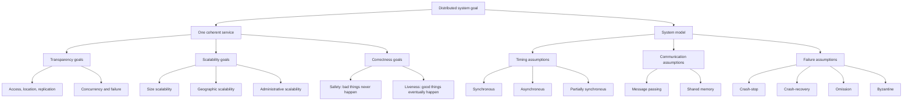

# Foundations and System Models

A distributed system is a collection of autonomous computers that appears to its users or applications as one coherent system. That promise sounds simple, but it hides a hard fact: communication is delayed, clocks disagree, components fail independently, and no single machine has complete knowledge. Van Steen and Tanenbaum emphasize design goals such as transparency, openness, and scalability; Kleppmann emphasizes reliability, maintainability, operability, and the data-system trade-offs that appear in production; Lynch emphasizes precise models, specifications, executions, and proofs [1], [2], [3].

The goal of this page is to establish the vocabulary used by the rest of the distributed-systems notes. The same system can be viewed as middleware hiding location, as a data platform trading consistency against availability, or as a collection of I/O automata whose traces satisfy a formal specification. Keeping all three views in mind prevents a common mistake: treating real systems as if they were either only engineering artifacts or only mathematical objects.

## Definitions

A **distributed system** consists of multiple computational elements that communicate over a network and coordinate to provide a service. The elements may be processes, virtual machines, containers, storage nodes, mobile devices, or hardware controllers. What makes the subject distinct is not merely that there are many machines; it is that correctness and performance depend on communication, failure handling, and coordination across independently executing components.

**Transparency** is the attempt to hide aspects of distribution. Access transparency hides differences in local and remote access. Location transparency hides where a resource resides. Migration and relocation transparency hide movement. Replication transparency hides multiple copies. Concurrency transparency hides simultaneous use. Failure transparency hides faults and recovery. Van Steen and Tanenbaum are careful to note that full transparency can be harmful when it hides latency, partial failure, or administrative boundaries [3].

A **system model** states what processes can do, how they communicate, and which failures may occur. In a **message-passing model**, processes exchange messages over channels. In a **shared-memory model**, processes operate on registers or objects. Shared memory is common in algorithm theory and multicore programming; message passing is the natural model for networked systems. Many practical services emulate one model on top of the other, such as a distributed key-value store offering register-like operations over messages.

A **synchronous model** assumes known bounds on message delay, process step time, and clock drift. An **asynchronous model** assumes no fixed upper bound on delay or relative speed. A **partially synchronous model** lies between them: bounds may exist only after some unknown stabilization time, or the bounds may be unknown to the protocol. This distinction drives impossibility results and protocol design. For example, timeout-based leader election is meaningful in a partially synchronous deployment but cannot prove failure in a purely asynchronous model.

A **failure model** describes how components may deviate from correct behavior. A crash-stop process halts forever. A crash-recovery process halts and later restarts, usually with some durable state. An omission failure loses sends or receives. A timing failure violates a bound. A Byzantine failure allows arbitrary behavior, including lying, equivocation, replay, and collusion. Real deployments often combine crash faults, network partitions, slow disks, kernel pauses, operator mistakes, and malicious traffic.

An **execution** is an interleaving of process steps and communication events. A **safety property** says that something bad never happens; examples include "at most one leader is chosen" and "a committed transaction is not rolled back." A **liveness property** says that something good eventually happens; examples include "some request completes" and "a leader is eventually elected." The engineering version is: safety protects correctness under stress, while liveness protects usability.

Lynch's **I/O automata** model represents distributed components as state machines with input, output, and internal actions [2]. An automaton has states, start states, actions, transitions, and tasks or fairness assumptions. Systems are built by composing automata through shared actions. The payoff is modular reasoning: prove a process, channel, failure detector, or replicated object correct against a specification, then compose it with other pieces.

## Key results

The first key result is conceptual: partial failure is the defining difference between distributed and local computing. A local function call usually succeeds, throws, or crashes in the same failure domain as its caller. A remote call can complete, time out, be duplicated, be processed after the caller gives up, or leave the caller unable to tell whether the callee failed or the network delayed the reply. This is why distributed APIs must expose retries, idempotence, deadlines, and consistency expectations rather than pretending remote calls are ordinary procedure calls [3].

The second result is the **FLP impossibility theorem**: in a purely asynchronous message-passing system, no deterministic consensus protocol can guarantee agreement, validity, and termination if even one process may crash [4]. FLP does not say consensus is useless. It says that a protocol cannot have all of those guarantees under that model. Practical protocols avoid the impossibility by using randomness, failure detectors, leases, clocks, partial synchrony, operator intervention, or by weakening availability during partitions.

The third result is the **CAP theorem**, often stated as: in the presence of a network partition, a replicated service must choose between consistency and availability [5]. The precise version matters. Consistency usually means linearizability; availability means every request to a non-failing node eventually receives a response; partition tolerance means messages can be lost between groups. CAP is not a three-way menu in normal operation. It is a statement about what can be promised when the network splits.

The fourth result is that models are not merely academic. A model determines what a proof or design can claim. In a synchronous model, a timeout can be interpreted as evidence of failure. In an asynchronous model, the same timeout only means "no reply yet." In a crash-stop model, majority quorum systems can mask failed replicas. In a Byzantine model, the same quorum sizes are insufficient unless signatures or larger replica sets are added. Kleppmann's production examples repeatedly show that hidden model assumptions become outages when they meet real networks, clocks, and storage devices [1].

Proof sketch for why FLP is relevant: consensus needs processes to decide one value. In an asynchronous system, a delayed message from a slow but correct process is indistinguishable from a message that will never arrive because the process crashed. An adversarial scheduler can keep the system in states where either decision is still possible by delaying just the messages that would force a decision. If the protocol eventually decides anyway, there is an execution in which a delayed message reveals that the decision could violate agreement or validity. The formal FLP proof uses bivalence and critical events; the practical lesson is that termination needs timing, randomness, or additional assumptions [4].

## Visual



| Model assumption | What it gives | What it hides or risks |
| --- | --- | --- |
| Synchronous timing | Timeouts can support detection and round-based algorithms | Real networks rarely have permanent tight bounds |
| Asynchronous timing | Conservative foundation for impossibility and safety proofs | Cannot guarantee deterministic consensus termination with one crash |
| Partial synchrony | Matches many deployed consensus systems after stabilization | Requires careful election timeouts and operational tuning |
| Crash-stop failures | Simpler quorum and leader protocols | Ignores restarts, disk corruption, and equivocation |
| Byzantine failures | Handles arbitrary or malicious behavior | Higher cost and stronger cryptographic assumptions |

## Worked example 1: Classify a service outage by model

Problem: A three-node metadata service uses a leader and two followers. Clients report timeouts. Logs show that node `A` is alive but paused for 80 seconds during garbage collection, node `B` can communicate with clients but not with `C`, and node `C` accepts requests from an internal batch job. Classify what the system model can and cannot conclude.

Method:

1. Start with timing. If the protocol assumes a synchronous bound of 5 seconds, then `A` violated the bound. In a partially synchronous model, the pause may be treated as a temporary period before stabilization returns. In an asynchronous model, the pause is indistinguishable from a slow process.

2. Classify communication. The `B` to `C` path is partitioned or dropping messages. Because clients can reach `B` and an internal job can reach `C`, this is not a total network outage. It is an asymmetric reachability problem.

3. Classify process failures. `A` has not crash-stopped because it resumes. It is closer to a timing failure or pause. If it loses volatile state and restarts, it becomes crash-recovery. Nothing in the description proves Byzantine behavior.

4. Identify safety risk. If `B` and `C` can both believe they are leaders, the service risks split brain. Majority quorum rules should prevent this if both leaders must obtain overlapping majorities before accepting writes.

5. Identify liveness risk. If each node waits for a different unreachable peer, requests may not complete even though no process has permanently crashed.

Checked answer: the right model is message passing with partial synchrony, crash-recovery or pause failures, and a network partition. The service should preserve safety by requiring majority quorums, but it may sacrifice availability until a majority can communicate.

## Worked example 2: Reason about CAP for a partitioned register

Problem: A replicated register has one copy in region East and one copy in region West. During a partition, East receives `write(x=1)` and West receives `read(x)`. Can the system guarantee linearizability and availability?

Method:

1. Define linearizability. Each operation must appear to take effect at one instant between invocation and response, and real-time order must be respected.

2. Define availability. The read sent to a non-failing West replica must eventually return; the write sent to a non-failing East replica must eventually return.

3. Consider returning from the East write. If East acknowledges `write(x=1)` during the partition, then any later read in real time must return `1`.

4. Consider the West read. West cannot receive East's write message during the partition. It can return the old value, say `0`, or block.

5. If West returns `0` after East has acknowledged the write, linearizability is violated. If West blocks until it hears from East, availability is violated.

Checked answer: under partition, this two-replica register cannot guarantee both linearizability and availability. A CP design blocks or rejects some operations; an AP design answers locally and reconciles later.

## Code

```python
from enum import Enum

class Timing(Enum):
    SYNCHRONOUS = "known bounds"
    ASYNCHRONOUS = "no timing bounds"
    PARTIAL = "eventual or unknown bounds"

class Failure(Enum):
    CRASH_STOP = "halts forever"
    CRASH_RECOVERY = "halts and restarts"
    OMISSION = "drops sends or receives"
    BYZANTINE = "arbitrary behavior"

def can_timeout_prove_failure(timing: Timing) -> bool:
    return timing == Timing.SYNCHRONOUS

def quorum_size(n: int, failure: Failure) -> int:
    if failure in {Failure.CRASH_STOP, Failure.CRASH_RECOVERY}:
        return n // 2 + 1
    if failure == Failure.BYZANTINE:
        return (2 * n) // 3 + 1
    raise ValueError("omission failures need a channel-specific model")

for model in Timing:
    print(model.name, "timeout proves failure:", can_timeout_prove_failure(model))

for n in [3, 5, 7]:
    print("n =", n, "crash quorum =", quorum_size(n, Failure.CRASH_STOP),
          "byzantine quorum =", quorum_size(n, Failure.BYZANTINE))
```

## Common pitfalls

- Treating "distributed" as a synonym for "runs on many machines" instead of focusing on coordination under delay and partial failure.
- Assuming a timeout proves a process is dead. It proves that a local timer expired under local assumptions.
- Quoting CAP as if every system always chooses exactly two of three letters. CAP applies to the behavior promised during partitions.
- Ignoring the difference between safety and liveness. A system can be safe while unavailable, or live while returning inconsistent answers.
- Designing with crash-stop assumptions while deploying on systems that restart with corrupted or stale local state.
- Treating Byzantine faults as only security faults. Bugs, disk corruption, and misconfiguration can also produce arbitrary behavior.
- Hiding all distribution behind an RPC interface and then being surprised by retries, duplicate effects, and partial completion.
- Assuming leader election is consensus without checking the exact agreement, validity, and termination requirements.
- Using a formal impossibility result outside its model, or ignoring it because the production system "usually works."
- Forgetting that geographic and administrative scalability are different from adding more nodes in one cluster.
- Treating majority as magic. Quorums help only when membership, storage durability, and message authenticity match the assumed model.
- Preserving transparency at the cost of diagnosability. Operators need to see partitions, lag, and partial failures.

## Connections

- [Time, Clocks, and Event Ordering](/cs/distributed-systems/time-clocks-and-event-ordering)
- [Replication and Consistency](/cs/distributed-systems/replication-and-consistency)
- [Consensus: Paxos and Raft](/cs/distributed-systems/consensus-paxos-and-raft)
- [Fault Tolerance and Failure Detection](/cs/distributed-systems/fault-tolerance-and-failure-detection)
- [Distributed Storage and CAP](/cs/distributed-systems/distributed-storage-and-cap)
- [Computer Networks](/cs/computer-networks/intro)
- [Operating Systems](/cs/operating-systems/intro)
- [Databases](/cs/databases/intro)
- [Cryptography](/cs/cryptography/intro)

## References

[1] M. Kleppmann, *Designing Data-Intensive Applications*. Sebastopol, CA: O'Reilly, 2017.  
[2] N. A. Lynch, *Distributed Algorithms*. San Francisco, CA: Morgan Kaufmann, 1996.  
[3] M. van Steen and A. S. Tanenbaum, *Distributed Systems*, 3rd ed., 2017.  
[4] M. J. Fischer, N. A. Lynch, and M. S. Paterson, "Impossibility of distributed consensus with one faulty process," *Journal of the ACM*, vol. 32, no. 2, pp. 374-382, 1985.  
[5] S. Gilbert and N. Lynch, "Brewer's conjecture and the feasibility of consistent, available, partition-tolerant web services," *SIGACT News*, vol. 33, no. 2, pp. 51-59, 2002.
