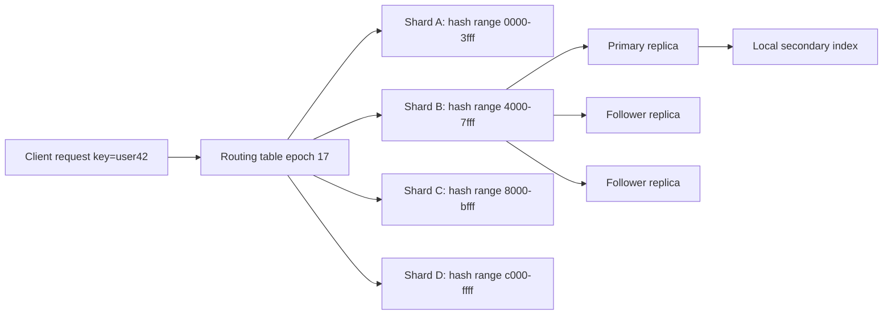

# Partitioning and Sharding

Partitioning, often called sharding in application architecture, splits data across nodes so a system can exceed the capacity of one machine. It is the scaling companion to replication: replication makes copies of the same data, while partitioning assigns different data to different places. Kleppmann emphasizes partitioning strategies, secondary indexes, rebalancing, and request routing; van Steen and Tanenbaum connect partitioning to naming, DHTs, and decentralized organization; Lynch's algorithmic lens helps explain why routing, membership, and load balance are distributed coordination problems [1], [2], [3].

The hard part is not computing `hash(key) mod n`. The hard part is preserving availability, latency, locality, and correctness while nodes are added, nodes fail, workloads skew, and queries need data from more than one partition.

## Definitions

A **partition** is a subset of data assigned to a node or group of replicas. A **shard** is a practical partition unit, often with its own primary replica and followers. A **tablet**, **range**, or **bucket** is a smaller partition-management unit that can be moved independently.

**Key-range partitioning** assigns contiguous key ranges to partitions. It supports efficient range scans and ordered access, but can create hot spots when writes target nearby keys, such as timestamps or sequential IDs. **Hash partitioning** hashes keys and assigns hash ranges or buckets to partitions. It spreads load more evenly but destroys natural key order. **Composite partitioning** combines both, for example hash by tenant and range by time inside each tenant.

**Consistent hashing** maps both nodes and keys onto a ring. A key belongs to the first node clockwise from its hash. When a node joins or leaves, only neighboring key ranges move. Virtual nodes improve balance by giving each physical node many positions on the ring [4].

**Skew** occurs when some partitions receive much more load or data than others. A **hot spot** is a key, range, tenant, or partition that gets disproportionate traffic. Hot spots may come from celebrity users, flash sales, time-series writes, small numbers of large tenants, or secondary-index fanout.

**Rebalancing** moves partitions to restore load balance, capacity, or fault-domain placement. Rebalancing can be manual, automatic, online, or offline. Online rebalancing must copy data while writes continue, track changes during copy, switch routing, and clean up old replicas without losing acknowledged updates.

A **secondary index** maps non-primary-key attributes to records. A **local secondary index** is stored with each partition and answers queries by checking all partitions unless the partition key is known. A **global secondary index** is itself partitioned by the indexed value, allowing targeted lookup but making writes update multiple partitioned structures.

**Request routing** maps a key or query to the correct partition. Routing may be client-side, proxy-based, coordinator-based, or gossip-based. A routing table must have a version or epoch so stale clients can be corrected safely.

A **split point** divides an overloaded or oversized range into two ranges. A **merge** combines small adjacent ranges to reduce overhead. Range-partitioned databases commonly split automatically when a tablet exceeds a size or traffic threshold. The split policy must account for both data size and request rate: a 1 GB shard serving a million requests per second is more urgent than a 100 GB cold shard. Some systems add **load-based splitting**, where a hot range is split even if it is not large.

A **scatter key** deliberately spreads writes that would otherwise cluster. For time-series workloads, a key might begin with a hash bucket and then include time, such as `(bucket, day, timestamp)`. The trade-off is read fanout: querying one logical time range must read multiple buckets and merge results. A **directory service** stores placement metadata for shards, tablets, or ranges. If the directory is strongly consistent, routing updates are simpler; if it is cached and eventually propagated, stale-route handling becomes part of the write path.

## Key results

The first key result is that the partition key determines scalability more than the number of nodes. A poor key can funnel all writes to one partition even if the cluster has hundreds of machines. A good key distributes load, preserves important locality, supports common queries, and limits cross-partition transactions.

The second result is the movement advantage of consistent hashing. With modulo hashing, changing from $n$ to $n+1$ buckets remaps many keys. With consistent hashing, adding one node ideally moves about $1/(n+1)$ of the key space to the new node, plus virtual-node smoothing [4]. This is why Dynamo-style systems and many caches use ring-like partitioning.

The third result is that secondary indexes change the partitioning problem. If data is partitioned by `user_id`, a query by `email` or `status` either fans out to every partition or uses a separate index partitioned by that attribute. Local indexes optimize writes and partition-local queries; global indexes optimize selective reads but create distributed write paths and consistency choices.

The fourth result is that resharding without downtime requires a handoff protocol. A common approach is: create target shard; copy a snapshot; stream or dual-write changes; mark source range as moving; update routing metadata through consensus; reject or forward stale writes; validate; then retire the source copy. Each step must handle retries and crashes.

Algorithmic proof sketch for consistent hashing movement: place keys uniformly on a unit ring and nodes uniformly as boundaries. A key moves after adding a new node only if the new node falls between the key and its previous successor. The expected fraction of the ring owned by the new node is $1/(n+1)$ by symmetry, so that is the expected moved fraction.

The fifth result is that cross-partition operations are coordination operations. A query that touches one shard can be routed, executed, and retried locally. A query that touches many shards needs fanout, partial failure handling, result merging, and often a timeout policy. A transaction that writes multiple shards needs distributed concurrency control or a saga. This is why partition-key design and transaction design should be done together, not as separate database and application decisions.

The sixth result is that rebalancing changes failure risk. While a shard is moving, there may be source replicas, target replicas, backfill streams, and forwarding rules all active at once. If the system acknowledges writes before both sides agree on ownership, it can lose or duplicate updates. If it freezes the shard for the whole copy, availability suffers. Correct online movement normally uses epochs: every owner decision is tagged with a monotonically increasing configuration version, and stale writers are rejected or redirected.

Finally, partitioning interacts with observability. A cluster-wide average latency can hide one overloaded shard. Useful dashboards show per-shard request rate, storage bytes, compaction debt, queue depth, replica lag, split/merge activity, and top keys or tenants. Without that visibility, teams often add nodes to a cluster even though the real problem is one hot partition.

## Visual



| Strategy | Strength | Weakness | Good fit |
| --- | --- | --- | --- |
| Key range | range scans, locality | hot sequential ranges | ordered data, time windows with bucketing |
| Hash partitioning | even spread | range queries scatter | key-value lookups |
| Consistent hashing | limited movement on membership change | imperfect balance without virtual nodes | caches, Dynamo-style stores |
| Directory/tablet map | precise placement control | metadata service dependency | databases with range splits |
| Composite key | balances and preserves some locality | key design complexity | multi-tenant workloads |

## Worked example 1: Compare modulo hashing and consistent hashing movement

Problem: A cache has 100 million keys and 10 nodes. You add one node. Estimate how many keys move under naive modulo hashing and under ideal consistent hashing.

Method:

1. Under modulo hashing, assignment is:

$$
node = hash(key) \bmod 10.
$$

After adding a node:

$$
node = hash(key) \bmod 11.
$$

2. For most hash values, the remainder modulo 10 differs from the remainder modulo 11. A rough estimate is that about $1 - 1/11$ or more of the keys may move in practice; the exact fraction depends on the hash range, but it is very large.

3. Approximate moved keys:

$$
100,000,000 \times 0.9 \approx 90,000,000.
$$

4. Under ideal consistent hashing, the new node owns about:

$$
\frac{1}{10+1}=\frac{1}{11}\approx 0.0909
$$

of the ring.

5. Moved keys:

$$
100,000,000 \times 0.0909 \approx 9,090,909.
$$

Checked answer: modulo hashing may move on the order of 90 million keys, while ideal consistent hashing moves about 9.1 million. That reduction is why membership changes are much less disruptive with consistent hashing.

## Worked example 2: Design a partition key for time-series events

Problem: An analytics service stores events with fields `(tenant_id, timestamp, event_id)`. Most queries read one tenant for a time range. Writes are heavy and arrive in timestamp order. Choose a partitioning strategy.

Method:

1. Partitioning by raw timestamp is bad because all current writes go to the newest range, creating a hot spot.

2. Partitioning by `event_id` hash spreads writes but makes tenant time-range queries scatter across many shards.

3. Partitioning by `tenant_id` preserves tenant locality, but a very large tenant can become hot.

4. Use a composite key such as:

$$
(tenant\_hash\_bucket, tenant\_id, day, timestamp, event\_id).
$$

5. For ordinary tenants, one bucket per tenant per day may be enough. For very large tenants, allocate multiple hash buckets:

$$
bucket = hash(event\_id) \bmod k_{tenant}.
$$

6. Queries for a tenant and day read the known bucket set for that tenant and merge ordered results.

Checked answer: composite partitioning balances write load while preserving bounded fanout for the dominant query. The design needs tenant-size metadata and a plan for changing `k_tenant` without losing routing correctness.

## Code

```python
import bisect
import hashlib

class ConsistentHash:
    def __init__(self, replicas=32):
        self.replicas = replicas
        self.ring = []
        self.nodes = {}

    def _hash(self, value: str) -> int:
        return int(hashlib.sha256(value.encode()).hexdigest(), 16)

    def add_node(self, node: str) -> None:
        for i in range(self.replicas):
            point = self._hash(f"{node}:{i}")
            bisect.insort(self.ring, point)
            self.nodes[point] = node

    def owner(self, key: str) -> str:
        if not self.ring:
            raise RuntimeError("empty ring")
        point = self._hash(key)
        idx = bisect.bisect_left(self.ring, point) % len(self.ring)
        return self.nodes[self.ring[idx]]

ring = ConsistentHash()
for node in ["n1", "n2", "n3"]:
    ring.add_node(node)

for key in ["user:1", "user:2", "order:9"]:
    print(key, "->", ring.owner(key))
```

## Common pitfalls

- Choosing a partition key from the data model without checking the workload.
- Hashing timestamps or sequential IDs too late, after they already create hot write ranges.
- Assuming even data distribution implies even request distribution.
- Ignoring large tenants or celebrity keys that dominate traffic.
- Using global secondary indexes without planning write consistency and backfill.
- Letting clients cache routing tables forever without epochs or stale-route correction.
- Rebalancing during peak traffic without throttling, prioritization, or rollback.
- Moving data without capturing writes that occur during the copy.
- Splitting shards by size only, while the real problem is request rate.
- Over-sharding so each query fans out to many partitions and spends time on coordination.
- Under-sharding so future growth requires disruptive migrations.
- Treating partitioning as a replacement for replication; they solve different problems.

## Connections

- [Replication and Consistency](/cs/distributed-systems/replication-and-consistency)
- [Distributed Storage and CAP](/cs/distributed-systems/distributed-storage-and-cap)
- [Transactions and Isolation Levels](/cs/distributed-systems/transactions-and-isolation-levels)
- [Stream Processing and Event-Driven Systems](/cs/distributed-systems/stream-processing-and-event-driven-systems)
- [Fault Tolerance and Failure Detection](/cs/distributed-systems/fault-tolerance-and-failure-detection)
- [Computer Networks](/cs/computer-networks/intro)
- [Operating Systems](/cs/operating-systems/intro)
- [Databases](/cs/databases/intro)
- [Cryptography](/cs/cryptography/intro)

## References

[1] M. Kleppmann, *Designing Data-Intensive Applications*. Sebastopol, CA: O'Reilly, 2017.  
[2] N. A. Lynch, *Distributed Algorithms*. San Francisco, CA: Morgan Kaufmann, 1996.  
[3] M. van Steen and A. S. Tanenbaum, *Distributed Systems*, 3rd ed., 2017.  
[4] D. Karger et al., "Consistent hashing and random trees: distributed caching protocols for relieving hot spots on the World Wide Web," in *STOC*, 1997.  
[5] G. DeCandia et al., "Dynamo: Amazon's highly available key-value store," in *SOSP*, 2007.  
[6] A. Lakshman and P. Malik, "Cassandra: a decentralized structured storage system," *ACM SIGOPS Operating Systems Review*, vol. 44, no. 2, pp. 35-40, 2010.  
[7] F. Chang et al., "Bigtable: a distributed storage system for structured data," in *OSDI*, 2006.
