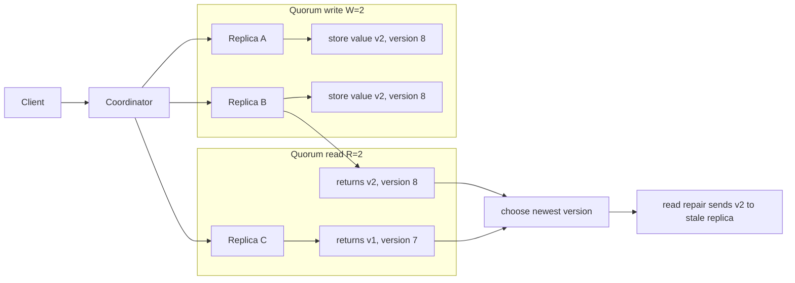

# Replication and Consistency

Replication keeps multiple copies of data or computation so the system can survive failures, reduce latency, and scale reads. It also creates the central question of distributed data systems: when different replicas see different updates at different times, what behavior may clients observe? Kleppmann focuses on production patterns such as leader-follower replication, quorum reads and writes, read repair, and conflict resolution; Lynch supplies formal atomic object and ordering ideas; van Steen and Tanenbaum classify data-centric and client-centric consistency models [1], [2], [3].

This page synthesizes replication as both an engineering mechanism and a semantic contract. The mechanism says how writes move between replicas. The contract says what a read means. Confusing the two leads to systems that are fast but surprising, or formally strong but operationally unaffordable.

## Definitions

**Replication** is the maintenance of multiple copies of an object, log, partition, or service state. **Primary-backup** replication sends writes to a primary replica, which orders updates and forwards them to backups. **Leader-follower** replication is the database version of this pattern. **Multi-leader** replication allows writes at multiple leaders and must handle conflicts. **Leaderless** replication lets clients send reads and writes to multiple replicas directly, often using quorums.

**Chain replication** arranges replicas in an ordered chain. Writes enter at the head and flow to the tail; reads are served from the tail. This separates update propagation from read visibility and can make strong consistency easier to reason about if the chain membership is stable.

A **quorum** is a subset of replicas large enough to intersect with other quorums. In a system with $N$ replicas, write quorum $W$, and read quorum $R$, the classic condition for reading the latest successful write is:

$$
R + W > N.
$$

This condition is not enough by itself. The system also needs versioning, failure handling, membership rules, and a definition of "successful write."

**Linearizability** is a strong consistency model in which each operation appears to occur atomically at some instant between its invocation and response, respecting real-time order [4]. **Sequential consistency** requires operations to appear in some single sequential order that respects each process's program order, but not necessarily real-time order. **Causal consistency** preserves the happens-before relation while allowing concurrent updates to appear in different orders. **Eventual consistency** says that if no new updates occur, replicas that can communicate eventually converge.

**Session guarantees** describe client-centric expectations: read-your-writes, monotonic reads, monotonic writes, and writes-follow-reads. They are weaker than linearizability but match many user expectations. For example, after updating a profile photo, a user expects to see the new photo even if other users may temporarily see the old one.

A **CRDT**, or conflict-free replicated data type, is a data type designed so independently replicated updates converge without coordination [7]. A **state-based CRDT** ships states that merge by a join operation in a semilattice. An **operation-based CRDT** ships operations that must be delivered with appropriate reliability and causal constraints. Common examples include grow-only counters, PN-counters, last-writer-wins registers, multi-value registers, observed-remove sets, and maps built from smaller CRDTs.

**Anti-entropy** is background repair between replicas. Gossip exchanges state or summaries with peers. **Merkle trees** compare hashes of key ranges so replicas can identify divergent ranges efficiently. **Read repair** repairs stale replicas during reads. **Hinted handoff** temporarily stores writes for an unavailable replica and forwards them when it returns [6].

A **version vector** records, for each replica or actor, how much of that actor's history a value includes. It is the storage-system cousin of a vector clock. Version vectors let a leaderless store distinguish "newer than," "older than," and "concurrent with" instead of forcing every pair of writes into a single timestamp order. This matters for shopping carts, collaborative documents, contact lists, and other data where concurrent user intent can be merged. A **multi-value register** keeps concurrent values until a client or merge function resolves them. A **last-writer-wins register** collapses concurrency by timestamp or tie-breaker; it is simple, but it can silently discard valid writes.

Replication also has a durability dimension. **Synchronous replication** waits for one or more replicas before acknowledging a write, reducing data loss but increasing latency and reducing availability when replicas are slow. **Asynchronous replication** acknowledges locally and ships changes later, improving latency but allowing data loss on failover. **Semi-synchronous** designs wait for a subset, commonly one follower or a quorum, and accept a bounded risk profile. Kleppmann's treatment is especially useful here because it ties the user-visible consistency guarantee to concrete log-shipping behavior rather than to vague terms such as "replicated database" [1].

## Key results

The first key result is that replication has separate concerns: placement, ordering, propagation, conflict detection, and repair. A leader gives one obvious write order but can be unavailable. Leaderless quorum systems improve write availability but shift conflict resolution to versions and clients. Multi-leader systems reduce wide-area latency but make concurrent writes normal rather than rare.

The second result is that consistency models form a spectrum, not a single knob. Linearizability is easy to explain to application developers but expensive under high latency or partitions. Causal consistency captures user-visible dependencies and supports lower coordination. Eventual consistency gives availability and low latency but needs application-specific convergence semantics.

The third result is the quorum intersection argument. If every successful write reaches at least $W$ replicas and every successful read consults at least $R$ replicas, and $R+W\gt N$, then any read quorum intersects the write quorum in at least one replica. With monotonically increasing versions, the read can choose the newest value among responses. However, sloppy quorums, hinted handoff, concurrent writes, read timeouts, and membership changes complicate the textbook argument [1].

Proof sketch for quorum intersection: assume a write set $S_W$ with $\vert S_W\vert =W$ and a read set $S_R$ with $\vert S_R\vert =R$ in a universe of $N$ replicas. If they were disjoint, then $\vert S_W \cup S_R\vert =W+R$. But $W+R\gt N$, impossible because the universe has only $N$ replicas. Therefore the sets intersect.

The fourth result is that CRDT convergence needs algebraic discipline. For state-based CRDTs, merge must be associative, commutative, and idempotent. Associativity allows grouping in any way; commutativity allows any order; idempotence allows duplicate messages. These properties match unreliable, repeated anti-entropy exchange.

The fifth result is that session guarantees can be implemented without making the whole system linearizable. Read-your-writes can route a user's later reads to a replica that has seen the user's previous writes, or attach a version token requiring replicas to catch up before answering. Monotonic reads can keep a client from moving backward by rejecting responses older than its last observed version. Monotonic writes can serialize one client's writes through a chosen leader or dependency token. Writes-follow-reads can attach causal dependencies to later writes. These techniques cost metadata and sometimes latency, but they target the expectations users actually notice.

The sixth result is that repair mechanisms affect semantics. Read repair may make a popular key converge quickly while a cold key stays stale for a long time. Hinted handoff improves write availability but can create surprising durability assumptions because the hint holder is not the intended replica. Merkle-tree anti-entropy is efficient for large keyspaces, but it repairs only after scheduled comparison. A system that advertises eventual consistency should say what drives the "eventually": read traffic, periodic repair, streaming replication, or operator-triggered rebuild.

## Visual



| Consistency model | Preserves real-time order? | Preserves causal order? | Allows divergent replicas temporarily? | Common fit |
| --- | --- | --- | --- | --- |
| Linearizability | Yes | Yes | Not visibly | locks, metadata, account balances |
| Sequential consistency | No | Per-process order | Sometimes | shared-memory reasoning |
| Causal consistency | Not fully | Yes | Yes for concurrent updates | collaboration, social feeds |
| Eventual consistency | No | Not necessarily | Yes | caches, shopping carts with merge logic |
| Session guarantees | For one session only | Session-dependent | Yes | user-facing replicated apps |

## Worked example 1: Check a quorum read-write configuration

Problem: A leaderless store has $N=5$ replicas. It uses $W=3$ for writes and $R=2$ for reads. A write of value `v2` succeeds on replicas `A`, `B`, and `C`. A later read contacts replicas `D` and `E`. Does the quorum formula guarantee seeing `v2`?

Method:

1. Check the formula:

$$
R+W=2+3=5.
$$

2. Compare with $N=5$. The strict quorum condition is $R+W\gt N$, but here $5\gt 5$ is false.

3. Construct the counterexample. The write set is:

$$
S_W=\{A,B,C\}.
$$

4. The read set is:

$$
S_R=\{D,E\}.
$$

5. These sets are disjoint:

$$
S_W \cap S_R = \emptyset.
$$

6. Therefore the read can return only old values if `D` and `E` have not yet received anti-entropy updates.

Checked answer: $W=3$, $R=2$, $N=5$ does not guarantee quorum intersection. To guarantee intersection, use $R=3,W=3$ or $R=2,W=4$, subject to latency and availability trade-offs.

## Worked example 2: Merge a PN-counter CRDT

Problem: Replicas `A` and `B` store a PN-counter. Each replica keeps two grow-only vectors: increments `P` and decrements `N`. The value is $\sum P - \sum N$. Starting from all zeros, `A` increments by 3, `B` increments by 2 and decrements by 1, then the replicas merge. Compute the value.

Method:

1. Initial state:

$$
P_A=P_B=[0,0], \quad N_A=N_B=[0,0].
$$

2. `A` increments by 3 in component `A`:

$$
P_A=[3,0], \quad N_A=[0,0].
$$

3. `B` increments by 2 and decrements by 1 in component `B`:

$$
P_B=[0,2], \quad N_B=[0,1].
$$

4. Merge by componentwise maximum:

$$
P=\max([3,0],[0,2])=[3,2],
$$

$$
N=\max([0,0],[0,1])=[0,1].
$$

5. Compute value:

$$
\sum P-\sum N=(3+2)-(0+1)=4.
$$

Checked answer: the merged PN-counter value is `4`. Duplicate merges do not change the result because componentwise maximum is idempotent.

## Code

```python
from dataclasses import dataclass

@dataclass
class PNCounter:
    replica: int
    p: list[int]
    n: list[int]

    def inc(self, amount: int = 1) -> None:
        self.p[self.replica] += amount

    def dec(self, amount: int = 1) -> None:
        self.n[self.replica] += amount

    def merge(self, other: "PNCounter") -> None:
        self.p = [max(a, b) for a, b in zip(self.p, other.p)]
        self.n = [max(a, b) for a, b in zip(self.n, other.n)]

    def value(self) -> int:
        return sum(self.p) - sum(self.n)

a = PNCounter(0, [0, 0], [0, 0])
b = PNCounter(1, [0, 0], [0, 0])

a.inc(3)
b.inc(2)
b.dec(1)

a.merge(b)
b.merge(a)

print(a.p, a.n, a.value())
print(b.p, b.n, b.value())
```

## Common pitfalls

- Saying "eventually consistent" without defining conflict resolution and convergence.
- Assuming $R+W\gt N$ alone gives linearizability. It also needs versioning, read rules, and failure semantics.
- Ignoring sloppy quorums, where acknowledgments may come from temporary substitutes rather than the nominal replica set.
- Treating last-writer-wins as safe when clocks can skew or concurrent updates matter.
- Forgetting session guarantees. Users notice when their own writes disappear.
- Using multi-leader replication for low latency but not designing merge behavior for concurrent updates.
- Treating read repair as immediate consistency. It repairs only replicas touched by reads.
- Assuming anti-entropy has no cost. Merkle trees, gossip intervals, and repair traffic affect latency and bandwidth.
- Choosing linearizability for all data even when only a subset needs it.
- Using CRDTs without checking the algebraic merge properties.
- Confusing causal consistency with total order. Concurrent operations may still appear in different orders.
- Forgetting that deletion is hard in replicated sets because remove operations must distinguish observed adds from future adds.

## Connections

- [Foundations and System Models](/cs/distributed-systems/foundations-and-system-models)
- [Time, Clocks, and Event Ordering](/cs/distributed-systems/time-clocks-and-event-ordering)
- [Consensus: Paxos and Raft](/cs/distributed-systems/consensus-paxos-and-raft)
- [Partitioning and Sharding](/cs/distributed-systems/partitioning-and-sharding)
- [Distributed Storage and CAP](/cs/distributed-systems/distributed-storage-and-cap)
- [Computer Networks](/cs/computer-networks/intro)
- [Operating Systems](/cs/operating-systems/intro)
- [Databases](/cs/databases/intro)
- [Cryptography](/cs/cryptography/intro)

## References

[1] M. Kleppmann, *Designing Data-Intensive Applications*. Sebastopol, CA: O'Reilly, 2017.  
[2] N. A. Lynch, *Distributed Algorithms*. San Francisco, CA: Morgan Kaufmann, 1996.  
[3] M. van Steen and A. S. Tanenbaum, *Distributed Systems*, 3rd ed., 2017.  
[4] M. P. Herlihy and J. M. Wing, "Linearizability: a correctness condition for concurrent objects," *ACM Transactions on Programming Languages and Systems*, vol. 12, no. 3, pp. 463-492, 1990.  
[5] W. Vogels, "Eventually consistent," *Communications of the ACM*, vol. 52, no. 1, pp. 40-44, 2009.  
[6] G. DeCandia et al., "Dynamo: Amazon's highly available key-value store," in *SOSP*, 2007.  
[7] M. Shapiro, N. Preguica, C. Baquero, and M. Zawirski, "Conflict-free replicated data types," in *SSS*, 2011.
