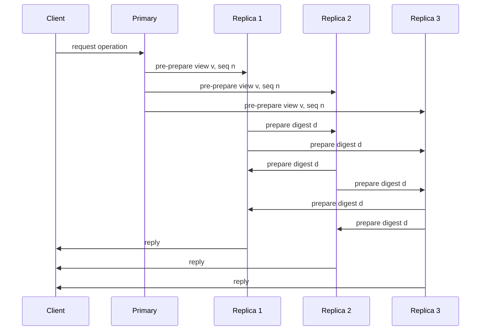

# Security and Byzantine Fault Tolerance

Security changes the distributed-systems model from "components may fail" to "components and networks may actively deceive." Byzantine fault tolerance, authenticated data structures, secure channels, threshold cryptography, and blockchain consensus all exist because crash-fault assumptions are not enough when participants are malicious or compromised. Van Steen and Tanenbaum provide the broad security framing; Lynch supplies Byzantine agreement foundations; Kleppmann explains why most data systems assume non-Byzantine faults unless explicitly designed otherwise [1], [2], [3].

This page is partly supplementary because the supplied textbooks predate or only lightly cover several modern blockchain and threshold-cryptography systems. The core ideas remain classical: define the adversary, authenticate messages, preserve quorum intersection under equivocation, and choose protocols whose cost matches the threat model.

## Definitions

A **threat model** states what the adversary can do. In distributed systems, adversaries may observe traffic, delay or drop messages, corrupt nodes, forge identities, replay old messages, issue conflicting statements to different peers, or attack routing infrastructure. A **network adversary** controls communication behavior; a **node adversary** controls some participants; a **client adversary** sends malicious workloads or malformed requests.

A **Byzantine fault** is arbitrary faulty behavior. A Byzantine process can lie, send different messages to different peers, collude, stay silent, or follow the protocol except at the worst moment. Byzantine behavior includes malicious attacks but also severe bugs and data corruption.

An **eclipse attack** isolates a node by surrounding it with adversary-controlled peers. A **Sybil attack** creates many fake identities to gain influence. A **BGP hijack** misroutes internet traffic by abusing inter-domain routing. These attacks show that the network and membership layer are part of the security model.

A **secure channel** provides authentication, integrity, and often confidentiality, usually through protocols such as TLS. Authentication tells a node who sent a message; integrity detects tampering; confidentiality hides content. Secure channels do not by themselves solve Byzantine consensus because authenticated nodes can still equivocate.

**PBFT** tolerates $f$ Byzantine replicas with $3f+1$ total replicas in a partially synchronous model, using pre-prepare, prepare, and commit phases [4]. **HotStuff** streamlines BFT replication by chaining quorum certificates [5]. **Tendermint** is a BFT-style proof-of-stake consensus used in blockchain settings. **Algorand** uses cryptographic sortition and Byzantine agreement for scalable decentralized consensus [9].

**Proof of Work** selects block producers by computational effort, as in Bitcoin [7]. **Proof of Stake** selects or weights validators by economic stake and usually adds slashing or accountability rules. BFT-based blockchain protocols use voting quorums and finality under a bounded Byzantine fraction.

An **authenticated data structure** lets a server prove properties of data. A **Merkle tree** hashes leaves and internal nodes so a membership proof contains sibling hashes along a path [6]. **Accumulators** provide compact membership proofs, often with stronger cryptographic assumptions.

**Secret sharing** splits a secret into shares so a threshold can reconstruct it but fewer shares reveal nothing. Shamir secret sharing uses polynomial interpolation [10]. **Threshold cryptography** distributes signing or decryption so no single node holds the whole key. A **trusted execution environment** (TEE) runs code in an isolated hardware-protected enclave, useful but dependent on hardware trust and side-channel assumptions.

A **quorum certificate** is a compact proof that enough validators voted for a statement, usually a set of signatures or an aggregate signature over the same message. A **slashing condition** is a rule in proof-of-stake systems that penalizes validators for provable misbehavior, such as signing conflicting blocks. A **view change** or **leader change** replaces a suspected faulty leader while carrying enough evidence to preserve safety. These mechanisms show a recurring pattern: BFT systems rely not only on messages, but on portable evidence about prior messages.

Security also includes **availability attacks**. A protocol may be safe under Byzantine faults but still easy to halt if attackers can flood signature verification, fill mempools, saturate peer connections, or exploit expensive error paths. Practical systems therefore combine protocol-level BFT with rate limits, admission control, peer scoring, batching, hardware isolation, and operational incident response.

## Key results

The first key result is the Byzantine quorum threshold. In classic unauthenticated oral-message Byzantine agreement, $n \gt  3f$ is necessary and sufficient under synchronous assumptions. PBFT also uses $3f+1$ replicas so quorums of size $2f+1$ intersect in at least $f+1$ replicas, guaranteeing at least one correct replica in the intersection [4].

Intersection calculation: with $n=3f+1$ and quorum size $2f+1$, two quorums intersect in at least:

$$
(2f+1)+(2f+1)-(3f+1)=f+1.
$$

Since at most $f$ replicas are Byzantine, the intersection contains at least one correct replica. That correct replica will not sign conflicting protocol statements for the same view and sequence number.

The second result is that authentication changes cost but not all thresholds. Digital signatures prevent forgery and can make equivocation detectable, but protocols must still collect enough votes to overcome faulty signers. Quorum certificates, aggregate signatures, and threshold signatures reduce message size and verification overhead.

The third result is that public blockchain consensus adds open membership and incentives. PBFT assumes a known validator set. Proof of Work makes Sybil resistance external by tying influence to energy expenditure. Proof of Stake ties influence to locked economic value and punishment rules. These systems solve a broader membership problem, but they introduce economics, governance, and network-level attack surfaces.

The fourth result is that Merkle proofs turn large replicated data into small verifiable claims. If a client trusts the root hash, it can verify that a value belongs to a dataset by recomputing hashes along one path. This is central to blockchains, transparency logs, package registries, and anti-entropy repair.

The fifth result is that TEEs and threshold cryptography are complements, not replacements for protocols. A TEE can reduce trust in a host process but not eliminate side channels, rollback attacks, or bad input. Threshold keys reduce single-key compromise but still require distributed key generation, share refresh, and quorum policy.

The sixth result is that accountability changes recovery. In crash-fault systems, a bad node can often rejoin after restart and log catch-up. In Byzantine systems, a node that signs conflicting statements may need to be removed, slashed, or quarantined. This requires evidence retention: signed messages, view numbers, sequence numbers, and checkpoint certificates must be stored long enough to prove misbehavior.

The seventh result is that cryptography must bind context. A signature over "commit" is unsafe if it does not include the protocol name, chain or cluster identifier, view or term, sequence number, digest, and configuration. Without domain separation and context binding, signatures can be replayed across protocols or epochs. This is the security analogue of stale routing metadata in sharded storage: the message may be authentic but no longer meaningful in the current configuration.

The eighth result is that open-membership systems pay for Sybil resistance somewhere. Proof of Work pays with energy and specialized hardware. Proof of Stake pays with capital lockup, validator-set management, and economic assumptions. Permissioned BFT pays with admission control and governance. There is no free membership layer; the correct choice depends on whether the system is an internal service, consortium network, or public adversarial environment.

## Visual



| Threat or fault | Crash-fault protocol handles it? | Byzantine/security mechanism |
| --- | --- | --- |
| node stops responding | Yes | replication and failover |
| node sends conflicting votes | No | signed votes, BFT quorum rules |
| fake identities join | No | PKI, admission control, PoW, PoS |
| network eavesdropping | No | encryption and traffic controls |
| message tampering | Usually no | MACs, signatures, TLS |
| stale data proof | No | Merkle proofs, signed checkpoints |
| key compromise | No | rotation, threshold keys, HSMs or TEEs |

## Worked example 1: Size a PBFT replica group

Problem: You need to tolerate $f=2$ Byzantine replicas in a PBFT-style service. How many total replicas are needed, what is the quorum size, and why do two quorums intersect in a correct replica?

Method:

1. PBFT uses:

$$
n = 3f + 1.
$$

2. Substitute $f=2$:

$$
n = 3(2)+1 = 7.
$$

3. PBFT quorum size is:

$$
2f+1 = 2(2)+1 = 5.
$$

4. Minimum intersection of two quorums in a universe of 7 replicas:

$$
5 + 5 - 7 = 3.
$$

5. At most 2 replicas are Byzantine. Therefore an intersection of 3 contains at least:

$$
3 - 2 = 1
$$

correct replica.

Checked answer: use 7 replicas and quorums of 5. Any two quorums intersect in at least 3 replicas, including at least one correct replica.

## Worked example 2: Verify a Merkle membership proof

Problem: A Merkle tree has four leaves with hashes `hA`, `hB`, `hC`, `hD`. Internal nodes are `hAB = H(hA || hB)` and `hCD = H(hC || hD)`, root is `H(hAB || hCD)`. A server claims leaf `C` is present and provides proof `[hD, hAB]` with directions `[right, left]`. Show verification.

Method:

1. Start from the claimed leaf hash:

$$
x = hC.
$$

2. First sibling is `hD` on the right, so compute:

$$
x = H(hC || hD) = hCD.
$$

3. Second sibling is `hAB` on the left, so compute:

$$
x = H(hAB || hCD).
$$

4. Compare this computed value with the trusted root.

5. If equal, the proof is valid for leaf `C` at that tree position. If not, the server lied or used different data.

Checked answer: the proof verifies exactly when `H(hAB || H(hC || hD))` equals the trusted root. The proof size grows with tree height, $O(\log n)$.

## Code

```python
import hashlib

def h(data: bytes) -> bytes:
    return hashlib.sha256(data).digest()

def parent(left: bytes, right: bytes) -> bytes:
    return h(left + right)

def verify_merkle_leaf(leaf: bytes, proof: list[tuple[str, bytes]], root: bytes) -> bool:
    cur = h(leaf)
    for side, sibling in proof:
        if side == "right":
            cur = parent(cur, sibling)
        elif side == "left":
            cur = parent(sibling, cur)
        else:
            raise ValueError("side must be left or right")
    return cur == root

leaves = [h(name.encode()) for name in ["A", "B", "C", "D"]]
h_ab = parent(leaves[0], leaves[1])
h_cd = parent(leaves[2], leaves[3])
root = parent(h_ab, h_cd)

proof_for_c = [("right", leaves[3]), ("left", h_ab)]
print(verify_merkle_leaf(b"C", proof_for_c, root))
```

## Common pitfalls

- Using Paxos or Raft when the threat model includes malicious or compromised replicas.
- Saying "Byzantine" without defining membership, authentication, and adversary power.
- Forgetting that secure channels do not stop an authenticated node from lying.
- Letting Sybil identities vote in a protocol that assumes one identity per participant.
- Ignoring eclipse and routing attacks while focusing only on application-level cryptography.
- Choosing BFT replication without budgeting for message complexity and cryptographic verification.
- Trusting a Merkle proof without a trusted root or signed checkpoint.
- Treating Proof of Work or Proof of Stake as only a consensus algorithm, ignoring incentive and governance assumptions.
- Assuming TEEs remove the need for auditing, rollback protection, or side-channel analysis.
- Failing to rotate keys or recover from partial key compromise.
- Mixing crash-fault and Byzantine quorums in the same design.
- Forgetting denial-of-service resistance; correct cryptography can still be overwhelmed.

## Connections

- [Foundations and System Models](/cs/distributed-systems/foundations-and-system-models)
- [Consensus: Paxos and Raft](/cs/distributed-systems/consensus-paxos-and-raft)
- [Fault Tolerance and Failure Detection](/cs/distributed-systems/fault-tolerance-and-failure-detection)
- [Distributed Storage and CAP](/cs/distributed-systems/distributed-storage-and-cap)
- [Replication and Consistency](/cs/distributed-systems/replication-and-consistency)
- [Computer Networks](/cs/computer-networks/intro)
- [Operating Systems](/cs/operating-systems/intro)
- [Databases](/cs/databases/intro)
- [Cryptography](/cs/cryptography/intro)

## References

[1] M. Kleppmann, *Designing Data-Intensive Applications*. Sebastopol, CA: O'Reilly, 2017.  
[2] N. A. Lynch, *Distributed Algorithms*. San Francisco, CA: Morgan Kaufmann, 1996.  
[3] M. van Steen and A. S. Tanenbaum, *Distributed Systems*, 3rd ed., 2017.  
[4] M. Castro and B. Liskov, "Practical Byzantine fault tolerance," in *OSDI*, 1999.  
[5] M. Yin et al., "HotStuff: BFT consensus with linearity and responsiveness," in *PODC*, 2019.  
[6] R. C. Merkle, "A digital signature based on a conventional encryption function," in *CRYPTO*, 1987.  
[7] S. Nakamoto, "Bitcoin: a peer-to-peer electronic cash system," 2008.  
[8] J. Kwon, "Tendermint: consensus without mining," 2014.  
[9] Y. Gilad et al., "Algorand: scaling Byzantine agreements for cryptocurrencies," in *SOSP*, 2017.  
[10] A. Shamir, "How to share a secret," *Communications of the ACM*, vol. 22, no. 11, pp. 612-613, 1979.
