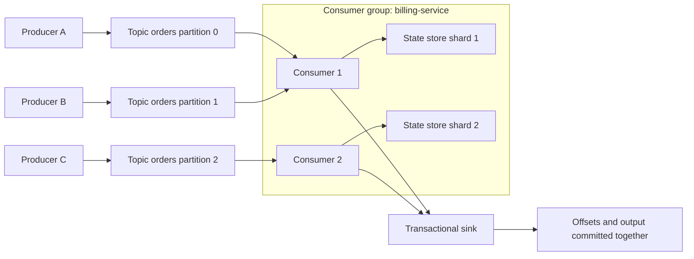

# Stream Processing and Event-Driven Systems


*Figure: Apache Kafka is the canonical distributed log used for partitioned topics, consumer groups, and exactly-once stream processing. Image: [Wikimedia Commons](https://commons.wikimedia.org/wiki/File:Apache_Kafka_logo.svg), Apache Software Foundation, Apache 2.0.*

Stream processing treats data as a continuing sequence of events rather than as a static table. It is the distributed-systems home of logs, pub/sub, consumer groups, offsets, windows, watermarks, stateful operators, event sourcing, and exactly-once claims. Kleppmann's DDIA gives this topic its strongest source coverage, especially logs, event sourcing, derived data, and stream joins; van Steen and Tanenbaum provide communication and publish-subscribe context; Lynch's models help clarify ordering, snapshots, and failure recovery [1], [2], [3].

The engineering challenge is to make an always-moving computation recoverable and understandable. A batch job can restart from input files. A stream processor must know which events were consumed, which outputs were produced, what state was checkpointed, and how late events should affect prior results.

## Definitions

A **stream** is an ordered or partially ordered sequence of records. An **event** records something that happened, usually with an event-time timestamp and a processing-time arrival. A **topic** is a named stream in a broker such as Kafka, Pulsar, or Kinesis. A **partition** is an ordered sub-log of a topic. Ordering is usually guaranteed only within a partition, not across the whole topic.

A **producer** appends events. A **consumer** reads events. A **consumer group** shares partitions among consumers so each partition is processed by one group member at a time. An **offset** is a position in a partition log. Committing offsets records progress, but offset commits alone do not guarantee output exactly once.

**At-most-once** processing may lose events but avoids duplicates. **At-least-once** processing retries until events are processed but may duplicate effects. **Exactly-once semantics** in practical systems usually means that state updates and output commits are atomic with input progress inside a defined system boundary. Kafka transactions and Flink checkpoints are examples; external side effects still require idempotence or transactions [5], [6].

A **window** groups events by time. Tumbling windows are fixed and non-overlapping; sliding windows overlap; session windows group activity separated by gaps. A **watermark** is a processor's estimate that no events earlier than time $t$ should still arrive, though late events may be handled by allowed lateness rules.

A **stream-table join** joins events with changing reference state. A **stream-stream join** joins two event streams within a time interval. Both require state retention and time handling. A **stateful operator** keeps local or partitioned state, often backed by RocksDB or another embedded store.

**Checkpointing** records operator state and input positions so computation can resume after failure. **Savepoints** are externally triggered checkpoints used for upgrades, migrations, and controlled restarts. **Event sourcing** stores the event log as the source of truth and derives views from replay. **CQRS**, or command query responsibility segregation, separates write commands from read models.

A **dead-letter queue** stores records that cannot be processed after validation or retry. It is a safety valve, not a correctness strategy: operators must inspect, repair, or deliberately discard those records. A **poison pill** is an event that repeatedly crashes or blocks a consumer. A **schema registry** stores event schemas and compatibility rules so producers and consumers can evolve independently. These operational pieces matter because stream systems are long-lived; they must handle bad data and rolling upgrades without stopping the whole pipeline.

A **backpressure** mechanism slows producers or upstream operators when downstream stages cannot keep up. Without backpressure, queues grow until latency, memory, or retention limits fail. With too much backpressure, an online request path can become coupled to an analytical sink. Many systems therefore separate ingestion durability from processing speed: the broker absorbs bursts, consumers expose lag, and autoscaling or load shedding handles sustained overload.

## Key results

The first key result is that a durable log decouples producers from consumers. Producers append once, and many consumers maintain independent offsets. This supports replay, backfill, multiple derived views, and failure recovery. It also means retention policy becomes part of correctness: if the log expires before a consumer catches up, replay is impossible.

The second result is that ordering is scoped. Kafka-style systems give a total order per partition, not per topic. If all events for a key go to the same partition, per-key order is preserved. If a workflow needs order across keys, it needs a different partitioning strategy or an explicit coordination layer.

The third result is the checkpoint alignment idea. A stream processor can create a consistent snapshot of distributed operator state by injecting barriers into input streams. Operators snapshot state after receiving barriers on all inputs, then forward the barrier. This resembles Chandy-Lamport snapshots adapted to dataflow [4].

The fourth result is that exactly-once is a composition property. If input offsets, state changes, and output records are committed atomically, a recovered job can avoid duplicated logical results. If the sink is an email service, payment API, or plain HTTP endpoint without idempotency, duplicates can still escape the processing system.

The fifth result is that event time and processing time answer different questions. Event time supports correct historical windows despite delays. Processing time supports operational responsiveness. Watermarks are a policy bridge, not an oracle.

The sixth result is that stream joins are state-management problems. A stream-table join needs a versioned table or changelog so an event can be joined against the correct reference state. A stream-stream join needs to retain events from both sides for the join window, then evict them when watermarks prove they are no longer needed. If the retention is too short, valid late matches are missed. If it is too long, state grows without bound. This is why join definitions must include time bounds and lateness policies, not just key equality.

The seventh result is that event sourcing makes replay a feature and a liability. Replaying events can rebuild read models, audit behavior, and recover from derived-data bugs. But replay also reruns old assumptions. Event schemas, command meanings, privacy deletion requirements, and external side effects all complicate replay. Mature event-sourced systems distinguish immutable historical facts from derived projections and keep projection code versioned enough to interpret old events.

The eighth result is that partitioning controls parallelism. Adding consumers to a group increases throughput only up to the number of assigned partitions. A topic with three partitions cannot keep ten consumers busy in one group. Increasing partitions later may change key-to-partition mapping unless a stable custom partitioner is used, so partition count is both a scalability choice and an ordering contract.

## Visual



| Concept | Defined by | Main risk |
| --- | --- | --- |
| Offset | broker partition position | committing before output loses data |
| Event time | timestamp in event domain | late or incorrect timestamps |
| Processing time | worker clock | nondeterministic replay |
| Watermark | system estimate of completeness | dropping meaningful late data |
| Checkpoint | state plus input positions | inconsistent sink commits |
| Savepoint | operator-controlled checkpoint | incompatible state schema after upgrade |

## Worked example 1: Assign Kafka partitions and offsets

Problem: A topic has 3 partitions. Events are partitioned by `hash(user_id) mod 3`. A consumer group has two consumers, `C1` and `C2`. The coordinator assigns partitions 0 and 1 to `C1`, partition 2 to `C2`. Events arrive: `(u7,e1)`, `(u8,e2)`, `(u7,e3)`. Suppose `hash(u7) mod 3 = 1` and `hash(u8) mod 3 = 2`. Determine per-partition order and consumer processing.

Method:

1. Event `e1` for `u7` goes to partition 1.

2. Event `e2` for `u8` goes to partition 2.

3. Event `e3` for `u7` also goes to partition 1.

4. Partition 1 order is:

$$
offset\ 0: e1,\quad offset\ 1: e3.
$$

5. Partition 2 order is:

$$
offset\ 0: e2.
$$

6. `C1` processes partition 1, so it sees `e1` before `e3`. `C2` processes partition 2, so it sees `e2`. There is no defined global order between `e2` and the events in partition 1.

Checked answer: per-user order for `u7` is preserved because both events use the same key and partition. The topic as a whole has no single total order across partitions.

## Worked example 2: Compute a tumbling window with late data

Problem: A stream processor counts purchases in 10-minute tumbling event-time windows. Allowed lateness is 2 minutes. The watermark reaches `10:12`. Events for window `[10:00,10:10)` are: `10:01`, `10:04`, `10:09`, and a late event with event time `10:08` arriving when the watermark is `10:11`. Another event with event time `10:07` arrives when the watermark is `10:13`. Which events count?

Method:

1. Window end is `10:10`.

2. Allowed lateness is 2 minutes, so the cleanup threshold is:

$$
10:10 + 2\text{ minutes} = 10:12.
$$

3. The first three events are on time for `[10:00,10:10)`.

4. The late `10:08` event arrives when watermark is `10:11`, which is before or equal to the cleanup threshold. It is included, possibly updating a previously emitted result.

5. The later `10:07` event arrives when watermark is `10:13`, after cleanup threshold `10:12`.

6. Under this policy, the `10:07` event is dropped or sent to a late-data side output.

Checked answer: the final normal count is 4. The fifth event is beyond allowed lateness and requires a side-output, correction workflow, or discard policy.

## Code

```python
from collections import defaultdict

class OffsetTracker:
    def __init__(self):
        self.state = defaultdict(int)
        self.pending_offsets = {}
        self.committed_offsets = {}

    def process(self, partition: int, offset: int, key: str, amount: int) -> None:
        self.state[key] += amount
        self.pending_offsets[partition] = max(self.pending_offsets.get(partition, -1), offset)

    def commit_transaction(self) -> None:
        # In a real system this must atomically commit output records and offsets.
        for partition, offset in self.pending_offsets.items():
            self.committed_offsets[partition] = offset + 1
        self.pending_offsets.clear()

tracker = OffsetTracker()
tracker.process(1, 0, "u7", 5)
tracker.process(2, 0, "u8", 3)
tracker.process(1, 1, "u7", 2)
tracker.commit_transaction()

print(dict(tracker.state))
print(dict(tracker.committed_offsets))
```

## Common pitfalls

- Claiming exactly-once without specifying the source, state store, sink, and failure boundary.
- Committing offsets before output is durable, which can lose processed events after a crash.
- Producing output before recording state, which can duplicate effects after retry.
- Assuming topic order is global when it is only per partition.
- Repartitioning by the wrong key and breaking per-entity order.
- Treating processing-time windows as equivalent to event-time windows.
- Dropping late data without measuring how late real events arrive.
- Keeping unbounded state for joins or sessions without retention rules.
- Replaying old events into non-idempotent sinks.
- Changing event schemas without compatibility rules for old consumers.
- Letting consumer lag exceed log retention.
- Treating event sourcing as a free audit log while allowing destructive or ambiguous event definitions.

## Connections

- [Time, Clocks, and Event Ordering](/cs/distributed-systems/time-clocks-and-event-ordering)
- [Replication and Consistency](/cs/distributed-systems/replication-and-consistency)
- [Transactions and Isolation Levels](/cs/distributed-systems/transactions-and-isolation-levels)
- [Partitioning and Sharding](/cs/distributed-systems/partitioning-and-sharding)
- [Distributed Storage and CAP](/cs/distributed-systems/distributed-storage-and-cap)
- [Computer Networks](/cs/computer-networks/intro)
- [Operating Systems](/cs/operating-systems/intro)
- [Databases](/cs/databases/intro)
- [Cryptography](/cs/cryptography/intro)

## References

[1] M. Kleppmann, *Designing Data-Intensive Applications*. Sebastopol, CA: O'Reilly, 2017.  
[2] N. A. Lynch, *Distributed Algorithms*. San Francisco, CA: Morgan Kaufmann, 1996.  
[3] M. van Steen and A. S. Tanenbaum, *Distributed Systems*, 3rd ed., 2017.  
[4] K. M. Chandy and L. Lamport, "Distributed snapshots: determining global states of distributed systems," *ACM Transactions on Computer Systems*, vol. 3, no. 1, pp. 63-75, 1985.  
[5] J. Kreps, N. Narkhede, and J. Rao, "Kafka: a distributed messaging system for log processing," in *NetDB*, 2011.  
[6] S. Ewen et al., "Apache Flink: stream and batch processing in a single engine," *IEEE Data Engineering Bulletin*, vol. 38, no. 4, pp. 28-38, 2015.  
[7] T. Akidau et al., "The dataflow model: a practical approach to balancing correctness, latency, and cost in massive-scale, unbounded, out-of-order data processing," *PVLDB*, vol. 8, no. 12, pp. 1792-1803, 2015.  
[8] M. Armbrust et al., "Structured Streaming: a declarative API for real-time applications in Apache Spark," in *SIGMOD*, 2018.  
[9] M. Kleppmann and J. Kreps, "Kafka, Samza and the Unix philosophy of distributed data," *IEEE Data Engineering Bulletin*, vol. 38, no. 4, pp. 4-14, 2015.
