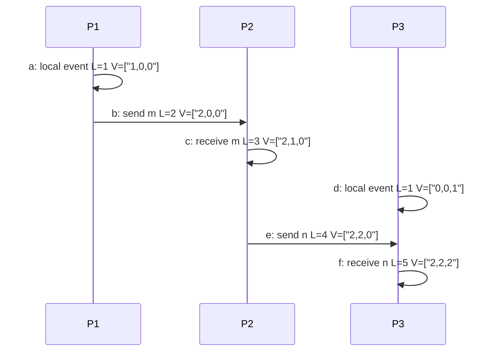

# Time, Clocks, and Event Ordering

Distributed systems need time for leases, logs, metrics, snapshots, transactions, cache expiry, debugging, and user-visible ordering. Yet clocks are not shared memory. Physical clocks drift, synchronization protocols have error bounds, network delay varies, and a process can pause while its clock keeps moving. Kleppmann warns that clock assumptions are a common source of production bugs; Lynch gives the formal tools for event order; van Steen and Tanenbaum connect physical and logical clocks to coordination algorithms [1], [2], [3].

The central distinction is between real time and causal time. Real time answers "what did the wall clock say?" Causal time answers "which events could have influenced which other events?" Lamport clocks, vector clocks, hybrid logical clocks, and snapshot algorithms are different ways of extracting useful order from systems that do not have a single global clock.

## Definitions

A **physical clock** is a hardware or operating-system clock intended to approximate real time. It has **offset**, the difference from a reference clock, and **drift**, the rate at which it gains or loses time. **Clock skew** is the difference between two clocks at a given instant. **NTP** synchronizes clocks over packet-switched networks and is good enough for many operational uses, but its accuracy depends on delay symmetry and network conditions. **PTP** can achieve tighter synchronization on controlled networks with hardware support.

Google Spanner's **TrueTime** API exposes time as an interval rather than a single instant: now is in $[earliest, latest]$ [9]. A transaction can wait out the uncertainty interval before committing, making external consistency possible when the uncertainty bound is respected. The important idea is not "clocks are perfect"; it is "the system exposes an uncertainty bound and designs around it."

The **happens-before** relation, written $a \to b$, is the smallest relation satisfying three rules: if events $a$ and $b$ occur in the same process and $a$ precedes $b$, then $a \to b$; if $a$ is the send of a message and $b$ is the receive of that message, then $a \to b$; and the relation is transitive [4]. If neither $a \to b$ nor $b \to a$, the events are **concurrent**.

A **Lamport clock** assigns a scalar timestamp to each event. Each process increments its counter before local events and sends; on receive, it sets its counter to one more than the maximum of the local counter and received timestamp. Lamport clocks preserve causality in one direction: if $a \to b$, then $L(a) \lt  L(b)$. The converse is false; $L(a) \lt  L(b)$ does not prove causality [4].

A **vector clock** stores one counter per process. Process $i$ increments component $i$ for its local event and merges by componentwise maximum on receive. For vector timestamps $V$ and $W$, $V \le W$ if every component is less than or equal, and $V \lt  W$ if $V \le W$ and $V \ne W$. Then $a \to b$ exactly when $V(a) \lt  V(b)$ under the standard model [5], [6].

A **hybrid logical clock** combines a physical time component with a logical counter so timestamps usually follow wall-clock order while still preserving causality when messages arrive from the future [8]. HLCs are useful in databases and replicated systems that want causally meaningful timestamps without maintaining full vector clocks.

A **distributed snapshot** records a consistent global state: a set of process states and channel states that could have occurred together in some execution. The Chandy-Lamport algorithm uses marker messages to record such a snapshot without stopping the computation, assuming reliable FIFO channels [7].

## Key results

Lamport's key result is that the happens-before relation gives a partial order of events without physical time [4]. This lets systems reason about causality: a response happens after a request; a replicated update delivered after another update may depend on it; a message receive cannot precede its send. Because the order is partial, concurrent events are expected, not exceptional.

The scalar-clock theorem is: if $a \to b$, then $L(a) \lt  L(b)$. Proof sketch: same-process order increments the clock; send-receive order sets the receiver above the sender's timestamp; transitivity preserves the inequality. However, scalar clocks cannot detect concurrency. Two unrelated events can receive timestamps $3$ and $7$ simply because their processes had different histories.

The vector-clock theorem is stronger: in the usual model, $a \to b$ if and only if $V(a) \lt  V(b)$. One direction follows because every causal step propagates or increments component counts. The other follows because a lower vector means all events represented by $a$'s vector are included in $b$'s causal history. This exactness costs space: $O(n)$ per timestamp for $n$ participants, plus membership complexity.

The snapshot result is that a system can capture a consistent cut while messages continue. Chandy-Lamport works because the first marker on an incoming channel defines the boundary: messages received before the marker are before the cut; messages received after the marker are after it; messages that arrive between recording local state and receiving the marker are channel-state messages [7]. This provides the basis for checkpointing, termination detection, and debugging.

Physical-clock results are more operational. NTP and PTP reduce skew but do not eliminate uncertainty. A timestamped write can be unsafe if the system assumes a clock is monotonic when it can step backward, or if it assumes bounded skew without enforcing it. Spanner's commit wait shows the correct pattern: if external consistency depends on physical time, the protocol must account for the uncertainty interval [9].

## Visual



| Mechanism | Timestamp shape | Captures causality exactly? | Typical use |
| --- | --- | --- | --- |
| Physical clock | wall-clock instant or interval | No | leases, logs, commit timestamps, monitoring |
| Lamport clock | scalar counter | One-way only | total-order tie-breaking, protocol sequencing |
| Vector clock | vector of counters | Yes, under fixed membership | conflict detection, causal replication |
| Hybrid logical clock | physical time plus counter | Preserves causality with compact metadata | databases, replicated logs, causally aware timestamps |
| Snapshot marker | recorded cut and channel state | Captures consistent global state | checkpoints, debugging, termination detection |

## Worked example 1: Trace Lamport clocks on three processes

Problem: Processes `P1`, `P2`, and `P3` start with Lamport clock `0`. `P1` performs local event `a`, sends message `m` to `P2`, `P3` performs local event `d`, `P2` receives `m`, then `P2` sends `n` to `P3`, and `P3` receives `n`. Assign Lamport timestamps.

Method:

1. `P1` event `a`: increment from `0` to `1`. So $L(a)=1$.

2. `P1` sends `m`: increment from `1` to `2`, attach timestamp `2`. So $L(send(m))=2$.

3. `P3` event `d`: increment from `0` to `1`. So $L(d)=1$.

4. `P2` receives `m` with timestamp `2`. Its local clock is `0`, so it sets clock to $\max(0,2)+1=3$. So $L(receive(m))=3$.

5. `P2` sends `n`: increment from `3` to `4`, attach timestamp `4`. So $L(send(n))=4$.

6. `P3` receives `n` with timestamp `4`. Its local clock is `1`, so it sets clock to $\max(1,4)+1=5$. So $L(receive(n))=5$.

Checked answer: the timestamps are $1,2,1,3,4,5$ in event order. The local event on `P3` has timestamp `1`, which is less than `P2`'s receive timestamp `3`, but that does not imply `d` caused the receive. Lamport clocks order causality safely, but they over-order concurrent events.

## Worked example 2: Detect concurrency with vector clocks

Problem: Three processes start with vector `[0,0,0]`. `P1` sends update `x` after one local increment. Independently, `P3` creates update `y`. Later `P2` receives `x` and creates update `z`. Determine whether `x`, `y`, and `z` are causally ordered or concurrent.

Method:

1. `P1` creates `x` by incrementing its own component:

$$
V(x)=[1,0,0].
$$

2. `P3` creates `y` independently:

$$
V(y)=[0,0,1].
$$

3. Compare `x` and `y`. Componentwise, `[1,0,0]` is not $\le [0,0,1]$ because `1 > 0` in component 1. Also `[0,0,1]` is not $\le [1,0,0]$ because `1 > 0` in component 3. Therefore they are concurrent.

4. `P2` receives `x`, merges `[1,0,0]` with `[0,0,0]`, then increments component 2:

$$
V(z)=[1,1,0].
$$

5. Compare `x` and `z`: `[1,0,0] < [1,1,0]`, so $x \to z$.

6. Compare `y` and `z`: `[0,0,1]` and `[1,1,0]` are incomparable, so `y` and `z` are concurrent.

Checked answer: `x` happens before `z`; `x` and `y` are concurrent; `y` and `z` are concurrent. A conflict resolver must not discard `y` merely because `z` has a later scalar or wall-clock timestamp.

## Code

```python
from dataclasses import dataclass

@dataclass
class VectorClock:
    pid: int
    values: list[int]

    def tick(self) -> list[int]:
        self.values[self.pid] += 1
        return self.values.copy()

    def send(self) -> list[int]:
        return self.tick()

    def receive(self, incoming: list[int]) -> list[int]:
        self.values = [max(a, b) for a, b in zip(self.values, incoming)]
        return self.tick()

def compare(a: list[int], b: list[int]) -> str:
    le = all(x <= y for x, y in zip(a, b))
    ge = all(x >= y for x, y in zip(a, b))
    if le and a != b:
        return "a happened before b"
    if ge and a != b:
        return "b happened before a"
    if a == b:
        return "same logical time"
    return "concurrent"

p1 = VectorClock(0, [0, 0, 0])
p2 = VectorClock(1, [0, 0, 0])
p3 = VectorClock(2, [0, 0, 0])

x = p1.send()
y = p3.tick()
z = p2.receive(x)

print("x", x, "y", y, "z", z)
print("x vs y:", compare(x, y))
print("x vs z:", compare(x, z))
print("y vs z:", compare(y, z))
```

## Common pitfalls

- Assuming synchronized clocks make distributed state easy. Even small uncertainty matters for leases and external consistency.
- Using wall-clock timestamps to resolve conflicts when causal metadata is required.
- Forgetting that Lamport timestamps do not prove causality in the reverse direction.
- Treating vector clocks as free. Their metadata grows with participants and needs membership rules.
- Ignoring clock steps backward after NTP correction. Use monotonic clocks for durations and deadlines.
- Using local time for globally ordered commits without an uncertainty bound or commit-wait rule.
- Confusing total order with causal order. A total order can be arbitrary and still preserve causality if constructed carefully.
- Assuming "concurrent" means simultaneous. It means no causal path is known between events.
- Running Chandy-Lamport on non-FIFO channels without adapting the algorithm.
- Treating snapshots as real-time freezes. They are consistent cuts, not necessarily states that existed at one wall-clock instant.
- Letting debug logs imply false order because machine clocks differ.
- Building leases without accounting for clock drift, process pauses, and renewal races.

## Connections

- [Foundations and System Models](/cs/distributed-systems/foundations-and-system-models)
- [Replication and Consistency](/cs/distributed-systems/replication-and-consistency)
- [Consensus: Paxos and Raft](/cs/distributed-systems/consensus-paxos-and-raft)
- [Transactions and Isolation Levels](/cs/distributed-systems/transactions-and-isolation-levels)
- [Stream Processing and Event-Driven Systems](/cs/distributed-systems/stream-processing-and-event-driven-systems)
- [Computer Networks](/cs/computer-networks/intro)
- [Operating Systems](/cs/operating-systems/intro)
- [Databases](/cs/databases/intro)
- [Cryptography](/cs/cryptography/intro)

## References

[1] M. Kleppmann, *Designing Data-Intensive Applications*. Sebastopol, CA: O'Reilly, 2017.  
[2] N. A. Lynch, *Distributed Algorithms*. San Francisco, CA: Morgan Kaufmann, 1996.  
[3] M. van Steen and A. S. Tanenbaum, *Distributed Systems*, 3rd ed., 2017.  
[4] L. Lamport, "Time, clocks, and the ordering of events in a distributed system," *Communications of the ACM*, vol. 21, no. 7, pp. 558-565, 1978.  
[5] C. J. Fidge, "Timestamps in message-passing systems that preserve the partial ordering," in *Proc. ACSC*, 1988.  
[6] F. Mattern, "Virtual time and global states of distributed systems," in *Parallel and Distributed Algorithms*, 1989.  
[7] K. M. Chandy and L. Lamport, "Distributed snapshots: determining global states of distributed systems," *ACM Transactions on Computer Systems*, vol. 3, no. 1, pp. 63-75, 1985.  
[8] S. Kulkarni, M. Demirbas, D. Madeppa, B. Avva, and M. Leone, "Logical physical clocks," in *Principles of Distributed Systems*, 2014.  
[9] J. C. Corbett et al., "Spanner: Google's globally-distributed database," in *OSDI*, 2012.
