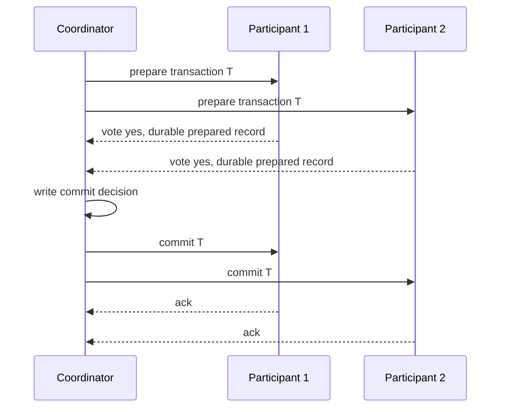

# Transactions and Isolation Levels

Transactions are the database-facing answer to a distributed-systems problem: many clients act concurrently, machines fail midway through work, and the application still wants the data to obey meaningful invariants. Kleppmann explains how isolation levels differ from their marketing names and why anomalies matter in real systems; Lynch connects commit to agreement under failures; van Steen and Tanenbaum place distributed commit and recovery inside fault tolerance [1], [2], [3].

This page treats transactions as a spectrum of guarantees. ACID serializable transactions are the clean model, but production systems often use weaker isolation, optimistic techniques, multi-version storage, sagas, or deterministic ordering for performance and availability. The core skill is to identify which invariant needs which guarantee.

## Definitions

A **transaction** is a group of operations treated as one unit. **Atomicity** means all effects commit or none do. **Consistency** means committed transactions preserve application invariants, assuming the transaction code is correct. **Isolation** means concurrent transactions do not interfere beyond the allowed isolation model. **Durability** means committed effects survive failures.

**BASE** is a looser design philosophy common in highly available systems: basically available, soft state, eventually consistent. BASE is not the negation of correctness. It means some invariants are enforced asynchronously or by compensation rather than by synchronous serializable transactions.

**Read uncommitted** allows dirty reads. **Read committed** prevents dirty reads but allows non-repeatable reads and phantoms. **Repeatable read** is vendor-dependent; in many MVCC systems it resembles snapshot isolation. **Snapshot isolation** gives each transaction a consistent snapshot and prevents write-write conflicts, but can allow write skew. **Serializable** isolation requires the result to be equivalent to some serial order of committed transactions.

Common anomalies include a **dirty read**, reading uncommitted data; **non-repeatable read**, reading the same row twice and seeing different committed values; **phantom**, rerunning a predicate query and seeing new matching rows; **lost update**, two transactions overwrite each other; and **write skew**, two transactions read overlapping data and write disjoint rows, violating a constraint.

**Two-phase locking** (2PL) uses locks and has a growing phase followed by a shrinking phase. Strict 2PL holds write locks until commit and yields conflict serializability plus recoverability. **Optimistic concurrency control** executes without locks, validates at commit, and aborts if conflicts are detected. **MVCC** stores multiple versions so readers can use old versions while writers create new versions. **Timestamp ordering** assigns transaction timestamps and orders conflicting operations accordingly.

**Two-phase commit** (2PC) atomically commits across participants using a coordinator. The coordinator asks participants to prepare; if all vote yes, it decides commit, otherwise abort. **Three-phase commit** adds a phase to avoid blocking under stronger timing assumptions, but it is not commonly used in modern unreliable networks. **Sagas** split a long workflow into local transactions with compensating actions. **Percolator**, **Spanner**, **Calvin**, and **Aurora** illustrate different industrial choices: timestamped MVCC, externally consistent distributed transactions, deterministic ordering, and log-structured cloud storage separation [7], [8], [9], [10].

A **transactional outbox** is an application pattern for connecting a database transaction to asynchronous messaging. The transaction updates business tables and inserts an outbox row in the same local commit. A relay later publishes the outbox event and marks it sent. This does not make the outside world transactional, but it prevents the common failure where a database commit succeeds and the corresponding event is lost. The receiving side should still be idempotent because the relay may publish the same event more than once.

A **materialized conflict** is a technique for making a predicate invariant visible as a write conflict. In the on-call example below, instead of letting two transactions update different doctor rows, the system can maintain one row for the shift summary and require any doctor-status change to update or lock that row. Snapshot isolation then detects a write-write conflict. This is not as general as serializability, but it is a practical way to protect selected invariants when the database's default isolation is weaker.

## Key results

The first key result is that isolation names are not enough. The SQL standard names levels by forbidden anomalies, but real systems implement them differently. Snapshot isolation feels strong because reads are stable, yet it is not serializable. Serializable snapshot isolation adds dependency tracking to abort dangerous structures; strict 2PL blocks rather than aborting at commit [1].

The second result is the serializability graph test. Build a precedence graph with one node per transaction and edges for conflicting operations ordered by time. If the graph is acyclic, the schedule is conflict-serializable. If it has a cycle, no equivalent serial order preserves those conflict orders.

The third result is 2PC's blocking behavior. Once a participant votes yes and enters the prepared state, it cannot unilaterally abort because the coordinator may have decided commit. If the coordinator crashes before the participant learns the decision, the participant must wait for recovery or a replicated transaction manager. Consensus can solve this by replicating the decision, but classic 2PC alone does not [2], [3].

The fourth result is that distributed transactions and consensus are related but not identical. Atomic commit chooses commit only if all participants vote yes; consensus chooses one proposed value despite faults. Atomic commit can be reduced to consensus in fault-tolerant designs, but commercial databases often use 2PC with durable logs and recovery because it is simpler when participants and coordinator are trusted and failures are crash-recovery.

Proof sketch for write skew under snapshot isolation: two transactions read the same snapshot and each sees that an invariant has enough slack. They update different rows, so no write-write conflict occurs. Both commit. The combined result violates the invariant. Because no single row was concurrently written by both transactions, ordinary snapshot isolation does not detect the problem.

Distributed transaction systems also differ in where they place ordering. Spanner uses TrueTime uncertainty and two-phase commit over Paxos-replicated participants to provide external consistency [8]. Calvin first orders transactions through a deterministic log and then executes them, reducing distributed locking during execution when read/write sets are known [9]. Percolator uses timestamped locks and notifications over Bigtable to support incremental indexing [7]. Aurora separates compute from a replicated storage service and pushes redo processing into the storage layer [10]. These designs are not interchangeable recipes; they show that the bottleneck can be clocks, locks, logs, storage replication, or application contention depending on workload.

The practical decision rule is to start from invariants. Account balance conservation, uniqueness, inventory limits, and access-control changes often need serializable or carefully materialized protection. Profile text, analytics counters, and notification workflows can often use weaker isolation plus idempotent repair. The same application may use strong transactions for a small core and asynchronous derived data for everything else.

## Visual



| Isolation level | Prevents dirty reads | Stable repeated reads | Prevents phantoms | Prevents write skew | Typical implementation |
| --- | --- | --- | --- | --- | --- |
| Read uncommitted | No | No | No | No | minimal locking |
| Read committed | Yes | No | No | No | short read locks or MVCC snapshots per statement |
| Repeatable read | Yes | Often | Vendor-dependent | Not always | locks or transaction snapshot |
| Snapshot isolation | Yes | Yes | Snapshot-stable | No | MVCC plus write-write conflict checks |
| Serializable | Yes | Yes | Yes | Yes | strict 2PL, SSI, deterministic execution |

## Worked example 1: Detect write skew under snapshot isolation

Problem: A hospital requires at least one doctor on call. Table `on_call(doctor, active)` has `Alice=true` and `Bob=true`. Transaction `T1` checks that Bob is active, then sets Alice inactive. Transaction `T2` checks that Alice is active, then sets Bob inactive. Both run under snapshot isolation from the same snapshot. Can both commit?

Method:

1. Initial invariant:

$$
active(Alice) + active(Bob) \ge 1.
$$

Initially:

$$
1 + 1 = 2.
$$

2. `T1` reads Bob as active, so it believes Alice may go off call. It writes:

$$
active(Alice)=0.
$$

3. `T2` reads Alice as active from the same starting snapshot, so it believes Bob may go off call. It writes:

$$
active(Bob)=0.
$$

4. Snapshot isolation checks write-write conflicts. `T1` writes Alice; `T2` writes Bob. These are different rows, so no write-write conflict is detected.

5. Both commit. Final state:

$$
active(Alice)+active(Bob)=0+0=0.
$$

Checked answer: both can commit under snapshot isolation, violating the invariant. Fixes include serializable isolation, predicate locks, materializing the invariant in one row, or explicit locking of the set of on-call doctors.

## Worked example 2: Analyze a 2PC blocking failure

Problem: A coordinator `C` runs 2PC with participants `P1` and `P2`. Both participants vote yes and write durable prepared records. Before sending the final decision, `C` crashes. What can `P1` safely do?

Method:

1. `P1` voted yes, so it promised it can commit if instructed. It has a prepared record and must keep locks or prepared versions.

2. `P1` cannot safely abort on its own. If `C` wrote commit before crashing, or told `P2` to commit, unilateral abort would violate atomicity.

3. `P1` cannot safely commit on its own. If `C` crashed before deciding and recovery later chooses abort because some participant was uncertain, unilateral commit could also violate atomicity.

4. `P1` may contact `P2`. If `P2` knows a final decision, `P1` can follow it. If every reachable participant is also prepared and uncertain, no one knows the decision.

5. Therefore `P1` must block until the coordinator recovers or a replicated transaction manager reveals the decision.

Checked answer: classic 2PC is blocking after yes votes. This is the main reason large distributed systems often avoid cross-partition 2PC on hot paths or combine it with consensus-backed coordinators.

## Code

```python
class Participant:
    def __init__(self, name, can_commit=True):
        self.name = name
        self.can_commit = can_commit
        self.state = "init"

    def prepare(self):
        if self.can_commit:
            self.state = "prepared"
            return "yes"
        self.state = "aborted"
        return "no"

    def finish(self, decision):
        if decision == "commit" and self.state == "prepared":
            self.state = "committed"
        else:
            self.state = "aborted"

def two_phase_commit(participants):
    votes = [p.prepare() for p in participants]
    decision = "commit" if all(v == "yes" for v in votes) else "abort"
    for p in participants:
        p.finish(decision)
    return decision

parts = [Participant("inventory"), Participant("payment")]
print(two_phase_commit(parts))
print({p.name: p.state for p in parts})
```

## Common pitfalls

- Assuming "repeatable read" means the same thing in every database product.
- Treating snapshot isolation as serializable because each transaction sees a consistent snapshot.
- Protecting row-level conflicts while ignoring predicate invariants.
- Forgetting that long transactions hold locks or old versions and can hurt vacuum, compaction, or memory.
- Using distributed transactions across unreliable services without designing coordinator recovery.
- Treating sagas as atomic transactions. They expose intermediate states and depend on compensation.
- Relying on timestamps without a clear clock or serialization model.
- Letting 2PC participants perform irreversible side effects before the final decision.
- Ignoring idempotency in retrying commit or abort messages.
- Choosing OCC under high contention without accounting for abort storms.
- Choosing 2PL under long user interactions and then suffering deadlocks or poor latency.
- Assuming BASE means no correctness requirements.

## Connections

- [Replication and Consistency](/cs/distributed-systems/replication-and-consistency)
- [Consensus: Paxos and Raft](/cs/distributed-systems/consensus-paxos-and-raft)
- [Fault Tolerance and Failure Detection](/cs/distributed-systems/fault-tolerance-and-failure-detection)
- [Distributed Storage and CAP](/cs/distributed-systems/distributed-storage-and-cap)
- [Stream Processing and Event-Driven Systems](/cs/distributed-systems/stream-processing-and-event-driven-systems)
- [Computer Networks](/cs/computer-networks/intro)
- [Operating Systems](/cs/operating-systems/intro)
- [Databases](/cs/databases/intro)
- [Cryptography](/cs/cryptography/intro)

## References

[1] M. Kleppmann, *Designing Data-Intensive Applications*. Sebastopol, CA: O'Reilly, 2017.  
[2] N. A. Lynch, *Distributed Algorithms*. San Francisco, CA: Morgan Kaufmann, 1996.  
[3] M. van Steen and A. S. Tanenbaum, *Distributed Systems*, 3rd ed., 2017.  
[4] H. Berenson et al., "A critique of ANSI SQL isolation levels," in *SIGMOD*, 1995.  
[5] P. A. Bernstein, V. Hadzilacos, and N. Goodman, *Concurrency Control and Recovery in Database Systems*. Addison-Wesley, 1987.  
[6] J. Gray and A. Reuter, *Transaction Processing: Concepts and Techniques*. Morgan Kaufmann, 1992.  
[7] D. Peng and F. Dabek, "Large-scale incremental processing using distributed transactions and notifications," in *OSDI*, 2010.  
[8] J. C. Corbett et al., "Spanner: Google's globally-distributed database," in *OSDI*, 2012.  
[9] A. Thomson et al., "Calvin: fast distributed transactions for partitioned database systems," in *SIGMOD*, 2012.  
[10] A. Verbitski et al., "Amazon Aurora: design considerations for high throughput cloud-native relational databases," in *SIGMOD*, 2017.
