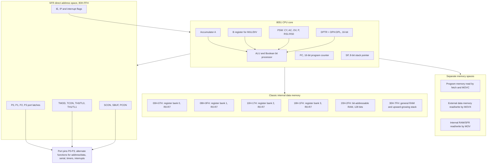

# 8051 Architecture, Memory, and Ports

The book turns from the 8085 microprocessor to the 8051 microcontroller because the design problem changes. With the 8085, a system designer must add memory, ports, and peripheral chips around the CPU. With the 8051, many of those resources already exist inside the chip: internal RAM, program memory in many variants, four 8-bit ports, timers, a serial port, interrupt control, and special function registers.


*Figure: The 8051 diagram connects assembly details to the microcontroller's peripheral blocks. Image: [Wikimedia Commons](https://commons.wikimedia.org/wiki/File:Intel_8051_arch.svg), Appaloosa, CC BY-SA 3.0.*

The 8051 is still small enough to understand at the register level. It is also different enough from the 8085 to teach microcontroller thinking: software configures hardware by writing SFRs, port pins may serve alternate functions, internal data memory has multiple regions, and bit-addressable storage makes single-bit control efficient.

## Definitions

The **8051** is the original member of Intel's MCS-51 microcontroller family. The book's 8051 chapters cover the core CPU, internal memory, ports, timers, serial port, interrupts, and system connections. Later chapters discuss derivatives such as 89C51 devices.

The **accumulator `A`** is the main arithmetic and logic register. The **`B` register** is used by multiply and divide instructions and can also be used as a general register when those instructions are not active.

The **program status word `PSW`** contains flags and register-bank select bits. Important bits include carry `CY`, auxiliary carry `AC`, overflow `OV`, parity `P`, and `RS1:RS0` for selecting register banks.

The **data pointer `DPTR`** is a 16-bit register used for external memory access and table lookup. It consists of `DPH` and `DPL`.

The **program counter `PC`** is 16 bits and addresses program memory. The **stack pointer `SP`** is 8 bits in the classic 8051 and points into internal RAM.

**Special function registers (SFRs)** are control and data registers mapped in the upper direct internal address region, from `80H` to `FFH`. Examples include `P0`, `P1`, `P2`, `P3`, `TMOD`, `TCON`, `SCON`, `SBUF`, `IE`, and `IP`.

**Internal RAM** in the classic 8051 includes register banks, bit-addressable memory, general-purpose RAM, and the stack area. The lower 128 bytes are directly and indirectly accessible; SFRs occupy the direct address region above `7FH`.

**Ports `P0` to `P3`** are 8-bit parallel I/O ports. Many pins have alternate functions. For example, `P3` pins serve serial, interrupt, timer, and external memory control roles.

## Key results

The first key result is that the 8051 has distinct memory spaces. Program memory, internal data memory, external data memory, and SFRs are not all accessed by the same instructions. `MOV` handles internal RAM and SFRs; `MOVX` handles external data memory; `MOVC` reads constants from program memory.

The second key result is that register banks are a speed feature. The addresses `00H` to `1FH` hold four banks of `R0` through `R7`. The active bank is selected by `PSW.RS1:RS0`. Interrupt routines can switch banks instead of pushing many registers, but this must be planned globally.

The third key result is that internal RAM addresses `20H` through `2FH` are bit-addressable. Each bit has its own bit address, making instructions such as `SETB`, `CLR`, `JB`, and `JNB` useful for flags and I/O-style control.

The fourth key result is that SFRs are the control surface of the microcontroller. Writing `TMOD` changes timer modes; writing `SCON` changes serial behavior; setting bits in `IE` enables interrupts. This is the microcontroller equivalent of wiring external control logic in an 8085 system.

The fifth key result is that ports are not all identical. Port 0 is open-drain style in many classic 8051 designs and needs external pull-ups for general I/O. Ports 0 and 2 also become multiplexed address/data and high-address buses when external memory is used.

The sixth key result is that stack placement matters. On reset, the classic 8051 stack pointer is commonly initialized to `07H`, so the first push goes to `08H`, which overlaps register bank 1 if that bank is used. Many programs explicitly move `SP` to a safer general RAM area.

A seventh key result is that direct and indirect addressing do not mean the same thing in the upper half of the data-address range. Direct addresses `80H` through `FFH` select SFRs. Indirect addresses through `@R0` or `@R1` do not select those same SFRs; on devices with expanded internal RAM they may reach extra RAM, while on simpler parts the behavior may be unavailable or device-specific. This is why portable 8051 code treats SFR names and ordinary variables differently instead of assuming one flat RAM space.

An eighth key result is that alternate pin functions are part of the architecture, not optional decoration. Port 3 pins are also serial pins, external interrupt pins, timer inputs, and external memory control pins. A board that connects a switch to `P3.2` is also connecting to `INT0`; a board that uses `P3.0` and `P3.1` for LEDs may lose the hardware serial port. Good 8051 design starts with a pin-function table before software assigns port bits.

## Visual



This 8051 diagram shows the CPU registers, internal RAM map, SFR control surface, separate memory spaces, and port alternate functions in one view. The four register banks, bit-addressable RAM, general RAM/stack region, and direct-only SFR range are labeled with their standard address ranges. The memory-space branch explains why `MOV`, `MOVC`, and `MOVX` are not interchangeable, while the port branch shows how peripheral functions share physical pins.

| Resource | Classic 8051 role | Programming note |
|---|---|---|
| `A` | Main ALU register | Used implicitly by many instructions |
| `B` | Multiply/divide partner | Preserve it if used as a variable |
| `DPTR` | 16-bit data pointer | Needed for `MOVX` and `MOVC` |
| `PSW` | Flags and register bank select | Bank switching changes what `R0` means |
| `P0` | Port 0 or AD0-AD7 | Needs pull-ups for many I/O uses |
| `P2` | Port 2 or A8-A15 | Used for external memory high address |
| `P3` | Port 3 with alternate functions | Serial, interrupts, timers, read/write controls |

## Worked example 1: Placing the stack safely

Problem: An 8051 program uses register bank 0, bit-addressable flags at `20H` to `2FH`, and general variables starting at `30H`. Choose a safer initial stack pointer and explain the first push address.

Method:

1. The stack pointer contains the address of the last used stack byte.

2. On a push, the 8051 increments `SP` first and then stores the byte.

3. If `SP = 2FH`, the first pushed byte goes to:

$$
2F\text{H} + 1 = 30\text{H}
$$

4. But the problem says variables start at `30H`, so `SP = 2FH` would collide with variables.

5. If variables use `30H` through `4FH`, choose `SP = 4FH`.

6. The first pushed byte then goes to:

$$
4F\text{H} + 1 = 50\text{H}
$$

Answer: initialize `SP` to `4FH` if RAM `50H` and above is available for stack. The first push will use `50H`.

Check: The choice must be revisited if many nested calls or interrupts occur, because the stack grows upward in internal RAM.

## Worked example 2: Selecting a register bank

Problem: Configure the 8051 to use register bank 2. What should bits `RS1` and `RS0` in `PSW` be, and which internal RAM addresses become `R0` and `R7`?

Method:

1. Register bank selection uses `PSW.RS1:RS0`.

2. The bank encoding is:

| Bank | `RS1` | `RS0` | Address range |
|---|---:|---:|---|
| 0 | 0 | 0 | `00H`-`07H` |
| 1 | 0 | 1 | `08H`-`0FH` |
| 2 | 1 | 0 | `10H`-`17H` |
| 3 | 1 | 1 | `18H`-`1FH` |

3. For bank 2, set `RS1 = 1` and clear `RS0 = 0`.

4. Bank 2 begins at address `10H`, so:

$$
R0 = 10\text{H}
$$

5. `R7` is seven bytes after `R0`:

$$
10\text{H} + 7 = 17\text{H}
$$

Answer: set `RS1:RS0 = 10`. `R0` maps to internal RAM `10H`, and `R7` maps to `17H`.

Check: If an interrupt routine changes `PSW` and does not restore it, the main program may suddenly refer to a different physical register bank.

## Code

```asm
; 8051: initialize stack, configure P1 as output by writing values,
; and toggle P1.0 using bit-addressable port instructions.

        ORG 0000H
        MOV SP,#4FH       ; stack starts above variables
        MOV P1,#00H       ; drive all P1 pins low

MAIN:   SETB P1.0         ; set LED pin
        ACALL DELAY
        CLR P1.0          ; clear LED pin
        ACALL DELAY
        SJMP MAIN

DELAY:  MOV R7,#200
D1:     MOV R6,#250
D2:     DJNZ R6,D2
        DJNZ R7,D1
        RET
```

## Common pitfalls

- Treating SFR addresses as ordinary RAM. The direct address range above `7FH` names SFRs, while indirect access above `7FH` is different on expanded variants.
- Forgetting to initialize `SP` before nested calls or interrupts.
- Using Port 0 as a normal output without pull-ups in a classic 8051-style circuit.
- Switching register banks in an ISR without restoring `PSW`.
- Confusing `MOV`, `MOVX`, and `MOVC`. They access different memory spaces.
- Assuming every SFR is bit-addressable. Only selected SFRs at bit-addressable addresses support direct bit operations.
- Overlapping bit flags, variables, and stack space in the small internal RAM.

## Connections

- [8051 instruction set and programming](/cs/embedded/8051-instruction-set-programming)
- [8051 timers, serial port, and interrupts](/cs/embedded/8051-timers-serial-interrupts)
- [8051 external-world interfacing](/cs/embedded/8051-external-world-interfacing)
- [Microcontroller derivatives, AVR, and PIC](/cs/embedded/microcontroller-derivatives-avr-pic)
