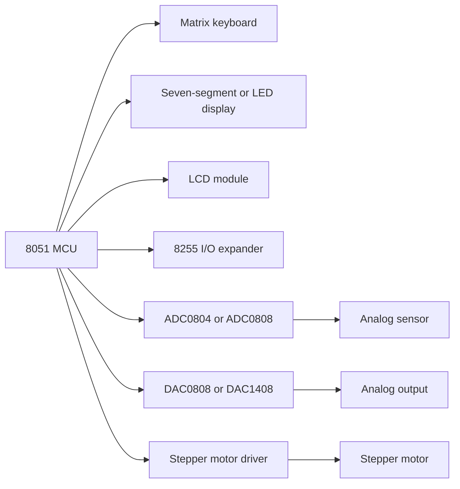

# 8051 External-World Interfacing

The source chapter titled "Interfacing to External World" collects the practical circuits that make an 8051 system interact with users and physical signals: external RAM and ROM, I/O expansion with 8255, keyboards, LED displays, LCD modules, DACs, ADCs, stepper motors, and typical MCS-51 based systems. This is where register-level programming meets electrical timing and signal conditioning.

An 8051 pin can set a logic level, but most real devices need more: debouncing, current drivers, address decoding, handshaking, conversion time, scaling, or protection. The right software pattern depends on the device's interface. A keyboard is scanned, a display is refreshed, an ADC is started and polled, a DAC is fed with a sample code, and a stepper motor receives a sequence of coil patterns.

## Definitions

**External program memory** stores code outside the 8051. Classic 8051 systems use `PSEN` to read external code memory, while ports 0 and 2 provide address and data signals.

**External data memory** is accessed with `MOVX` instructions. It can hold variables, buffers, or memory-mapped peripheral registers.

**I/O expansion** adds more input and output lines using devices such as the 8255. This is useful when four 8051 ports are not enough or when ports are consumed by external memory buses.

A **matrix keyboard** arranges keys at row-column intersections. The controller drives rows or columns and reads the opposite side to identify a pressed key.

**Debouncing** removes false transitions caused by mechanical switch bounce. It can be done by hardware filtering or by software timing and repeated sampling.

An **LED display interface** may use direct segment driving, multiplexing, current-limiting resistors, and transistor drivers. A seven-segment display maps digits to segment patterns.

An **LCD module interface** often uses data lines plus control signals such as register select, read/write, and enable. Timing requirements are usually met by delays or by polling a busy flag.

A **DAC** converts a digital code to an analog output. Examples in 8051 texts often use DAC0808 or DAC1408-style current-output converters.

An **ADC** converts an analog input to a digital code. ADC0804 and ADC0808/0809 families are common teaching devices with start, end-of-conversion, and output-enable style control.

A **stepper motor** moves in discrete steps by energizing windings in a controlled sequence.

## Key results

The first key result is that external memory changes port availability. In a classic external-memory 8051 system, Port 0 carries multiplexed low address/data and Port 2 carries high address. These pins cannot simultaneously be treated as ordinary GPIO without additional design constraints.

The second key result is that keyboard software must separate scanning from debouncing. A scan identifies candidate row and column. Debouncing confirms that the state is stable long enough to count as a real press.

The third key result is that display multiplexing trades pins for time. Instead of driving every digit continuously with its own segment lines, a controller rapidly enables one digit at a time while sharing segment data. The refresh rate must be high enough to avoid visible flicker.

The fourth key result is that ADC and DAC interface code must respect analog timing. A DAC may require settling time after a new code. An ADC requires acquisition and conversion time before its result is valid. Reading too early gives unstable or old data.

The fifth key result is that motors and relays need drivers. A microcontroller pin cannot directly supply the current or voltage transients required by inductive loads. Driver transistors, arrays, optocouplers, flyback diodes, or motor-driver ICs are part of the interface.

The sixth key result is that memory and I/O maps should be documented like software APIs. The address of each device register, direction of each port bit, active level of each control signal, and timing rule should be recorded before code is written.

A seventh key result is that analog interfaces require calibration thinking. An 8-bit ADC code is not a temperature, voltage, or pressure by itself; it is a count relative to a reference voltage and input scaling circuit. Likewise, a DAC code is not automatically an output voltage unless the reference current, resistor network, and output amplifier are known. Software should keep conversion formulas beside the hardware assumptions so that changing a reference or sensor does not silently invalidate readings.

An eighth key result is that interface timing should be designed for worst case, not typical case. LCD busy times, ADC conversion times, EEPROM write times, and motor settling times vary with supply voltage, temperature, and device grade. A lab example may work with a short delay, but a robust design either polls a real ready flag or delays longer than the specified worst-case time.

## Visual



| Device | Typical signals | Software pattern | Hardware caution |
|---|---|---|---|
| Matrix keyboard | Rows, columns | Drive one row, read columns, debounce | Pull-ups or pull-downs required |
| Seven-segment LED | Segment lines, digit enables | Lookup table and multiplex refresh | Current limiting and drivers |
| LCD module | Data, RS, RW, E | Command/data writes with delay or busy polling | Respect enable pulse timing |
| ADC0804 | Start, EOC, OE, data bus | Start conversion, wait EOC, read data | Analog reference and conversion time |
| DAC0808 | Data bus, reference, output current | Write sample code, wait settling | Requires analog output stage |
| Stepper motor | Coil drive phases | Output phase sequence with delay | Use driver and flyback protection |

## Worked example 1: Scanning a 4 by 4 matrix keyboard

Problem: Design the basic scan method for a 4 by 4 keyboard connected with rows on `P1.0`-`P1.3` and columns on `P1.4`-`P1.7`. Assume columns read high when no key is pressed and low when the driven row contains the pressed key.

Method:

1. Configure the row pins as outputs and column pins as inputs with pull-ups.

2. Drive all rows high initially.

3. For row 0, drive `P1.0` low and keep the other rows high.

4. Read the high nibble `P1.4`-`P1.7`. If all column bits are high, no key in row 0 is pressed.

5. If column 2 reads low while row 0 is low, the candidate key is row 0, column 2.

6. Restore row 0 high and repeat the same process for rows 1, 2, and 3.

7. When a candidate key is detected, wait a debounce interval and read again. Accept the key only if the same row-column pair remains active.

Answer: the key identity is the first stable row-column pair found by driving one row low at a time and reading the columns.

Check: If more than one key is pressed, ghosting can occur unless diodes or a more careful scanning policy is used.

## Worked example 2: Reading an ADC0804-style converter

Problem: An ADC is connected to an 8051 through an 8-bit data port and control lines `START`, `EOC`, and `OE`. Describe the conversion sequence and the point at which the data byte is valid.

Method:

1. Place the ADC in an idle state with output disabled if required.

2. Pulse `START` according to the ADC timing requirement. This begins conversion.

3. Wait while `EOC` indicates conversion is in progress. Depending on the ADC wiring, this may mean polling until `EOC` goes low or high; the data sheet determines the active level.

4. After conversion complete, assert output enable `OE`.

5. Read the 8-bit data bus into the microcontroller.

6. Deassert `OE` if the data bus is shared with other devices.

Answer: the data byte is valid only after end-of-conversion is signaled and output enable is active.

Check: A fixed delay can replace polling only if the delay is longer than the worst-case conversion time over voltage, temperature, and clock tolerance.

## Code

```c
/* 8051 C-style matrix keyboard scan.
   P1 lower nibble drives rows, upper nibble reads columns.
   Returns 0xFF if no key is detected. */

unsigned char key_scan_once(void) {
    unsigned char row;
    unsigned char cols;

    for (row = 0; row < 4; row++) {
        P1 = (P1 & 0xF0) | 0x0F;      /* all rows high */
        P1 &= ~(1u << row);           /* one row low */
        cols = (P1 >> 4) & 0x0F;

        if (cols != 0x0F) {
            if ((cols & 0x01) == 0) return row * 4 + 0;
            if ((cols & 0x02) == 0) return row * 4 + 1;
            if ((cols & 0x04) == 0) return row * 4 + 2;
            if ((cols & 0x08) == 0) return row * 4 + 3;
        }
    }
    return 0xFF;
}
```

## Common pitfalls

- Driving an inductive load directly from an 8051 pin. Use a driver and protection components.
- Forgetting that Port 0 may need pull-ups and may be unavailable as GPIO in external-memory designs.
- Reading a mechanical switch once and treating the result as final. Debounce is required for reliable user input.
- Multiplexing displays too slowly, causing flicker, or too quickly without enough segment current.
- Reading an ADC before conversion completes.
- Writing a DAC code and sampling the analog output before settling time has elapsed.
- Not documenting active-high versus active-low control lines; this causes inverted software logic.

## Connections

- [8051 architecture, memory, and ports](/cs/embedded/8051-architecture-memory-ports)
- [8255 programmable peripheral interface](/cs/embedded/8255-programmable-peripheral-interface)
- [Serial EEPROM and DS1307 RTC interfacing](/cs/embedded/serial-eeprom-rtc-ds1307)
- [Serial buses and embedded protocols](/cs/embedded/serial-buses-embedded-protocols)
