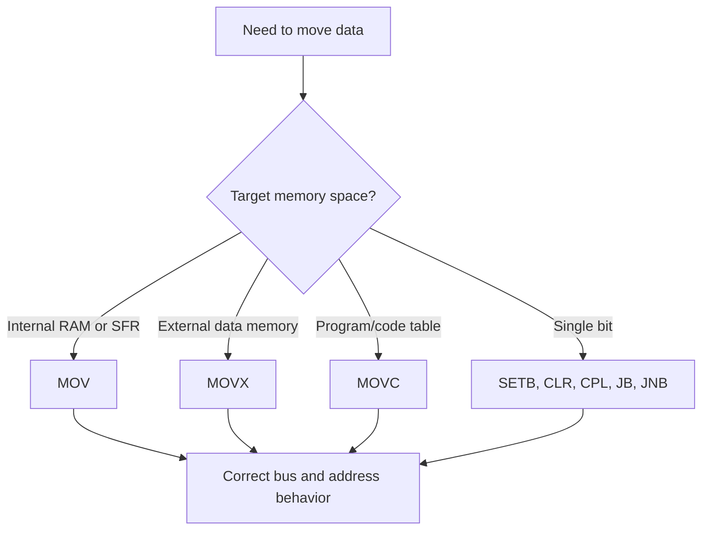

# 8051 Instruction Set and Programming

The 8051 programming chapter follows the hardware chapter because the instruction set reflects the chip's memory organization. Unlike the 8085, the 8051 has explicit support for bit operations, separate program and data spaces, special function registers, register banks, and external memory access. A correct 8051 program is therefore not just a sequence of mnemonics; it is a sequence of accesses to the correct memory space.

The programmer's goal is to choose the shortest clear instruction that matches the target: internal RAM, SFR, program-memory table, external RAM, single bit, or port pin. When that choice is right, 8051 assembly is compact and expressive.

## Definitions

The **8051 instruction set** includes data transfer, arithmetic, logical, Boolean bit, branch, call/return, and machine-control instructions.

**Immediate addressing** places a constant in the instruction, as in `MOV A,#55H`.

**Direct addressing** names an internal RAM location or SFR directly, as in `MOV 30H,A` or `MOV P1,A`.

**Register addressing** uses `R0` through `R7` in the active bank, as in `MOV A,R3`.

**Register indirect addressing** uses `@R0` or `@R1` for internal RAM and `@DPTR` or `@Ri` with `MOVX` for external data memory.

**Indexed addressing** is used for program-memory lookup with `MOVC A,@A+DPTR` or `MOVC A,@A+PC`.

**Bit addressing** operates on individual bit addresses or bit-addressable SFR bits, as in `SETB P1.0`, `CLR C`, `JB flag,label`, and `JNB P3.2,label`.

`MOV` accesses internal data memory and SFRs. `MOVX` accesses external data memory. `MOVC` reads code memory. This three-way distinction is one of the most important 8051 programming rules.

The **carry flag `C`** is both an arithmetic flag and a Boolean accumulator for bit instructions. Many bit operations move values through `C`.

## Key results

The first key result is that the 8051 is strong at bit manipulation. A single instruction can set, clear, complement, test, or branch on a bit. This makes port control, status flags, and interrupt flags efficient.

The second key result is that `DJNZ` combines decrement and branch. It is the standard counted-loop instruction:

```asm
DJNZ R7,LOOP
```

It decrements `R7` and jumps if the result is not zero. This avoids a separate compare in many loops.

The third key result is that multiplication and division use `A` and `B`. `MUL AB` produces a 16-bit product with the low byte in `A` and high byte in `B`. `DIV AB` divides `A` by `B`, leaving quotient in `A` and remainder in `B`.

The fourth key result is that code-memory tables are read by `MOVC`, not by ordinary `MOV`. If `DPTR` points to a table and `A` holds an index, then `MOVC A,@A+DPTR` loads the table byte into `A`.

The fifth key result is that external memory access is explicit. `MOVX A,@DPTR` reads external data memory at the 16-bit address in `DPTR`; `MOVX @DPTR,A` writes it. This causes external bus activity on ports 0 and 2 in classic external-memory systems.

The sixth key result is that branches have range limits. `SJMP` and many conditional branches are relative and compact, but they only reach nearby labels. `LJMP` and `LCALL` use full 16-bit program addresses.

The seventh key result is that 8051 Boolean instructions are not merely conveniences; they are a separate programming style. The carry flag can hold a bit value, combine it with another bit, and write it back. For example, a program can move `P3.2` into `C`, AND it with a software enable flag, and branch or drive an output bit. This is much more direct than reading a full byte, masking it, shifting it, and writing it back. The price is that carry becomes shared state, so arithmetic code and bit-control code must not accidentally overwrite each other's condition.

The eighth key result is that calls and interrupts interact with the stack just as on larger machines. `ACALL` and `LCALL` push a return address, and `RET` pops it. Interrupt entry also saves a return address, while the ISR must save any ordinary registers it changes. Because classic internal RAM is small, stack depth should be estimated. A program with nested calls, serial interrupts, and timer interrupts can consume more stack than a simple foreground loop.

The ninth key result is that instruction choice communicates intent. `CLR P1.0` says "clear this bit." `ANL P1,#0FEH` may produce the same external level, but it performs a read-modify-write operation on the whole port latch. On quasi-bidirectional 8051 ports, read-modify-write behavior is significant. Prefer bit instructions for independent control bits and byte instructions when the whole port value is deliberately managed.

The tenth key result is that external lookup tables and internal variables should be kept conceptually separate. A display font stored after a `DB` directive in program memory is not modified at run time and is fetched with `MOVC`. A changing counter in internal RAM is modified with `MOV`. A buffer in external RAM is moved with `MOVX`. Writing comments that name the memory space beside each symbol prevents a common class of bugs where the right address is accessed with the wrong instruction family.

## Visual



| Instruction | Meaning | Result location | Notes |
|---|---|---|---|
| `MOV A,#data` | Load immediate constant | `A` | `#` marks immediate data |
| `MOV direct,A` | Store to internal RAM or SFR | direct address | Can write ports and SFRs |
| `MOVX A,@DPTR` | Read external data memory | `A` | Uses external bus |
| `MOVC A,@A+DPTR` | Read program-memory table | `A` | Index in `A` |
| `DJNZ r,label` | Decrement and jump if nonzero | register | Good for loops |
| `CJNE a,b,label` | Compare and jump if not equal | flags and PC | Also affects carry |
| `MUL AB` | Unsigned multiply | `B:A` | Product is 16 bits |
| `DIV AB` | Unsigned divide | `A` quotient, `B` remainder | Overflow if divide by zero |

## Worked example 1: Table lookup for seven-segment display

Problem: A digit from 0 to 9 is in `A`. Use a program-memory lookup table to replace it with a seven-segment code.

Method:

1. Store the table in code memory because the display patterns are constants.

2. Put the table base address in `DPTR`.

3. Keep the digit index in `A`. For digit 0, the offset is 0; for digit 9, the offset is 9.

4. Use indexed code-memory access:

```asm
MOVC A,@A+DPTR
```

5. After the instruction, `A` contains the byte from `table_base + old A`.

Answer:

```asm
        MOV DPTR,#SEG_TAB
        ; A already contains digit 0..9
        MOVC A,@A+DPTR
        MOV P1,A

SEG_TAB:
        DB 3FH,06H,5BH,4FH,66H
        DB 6DH,7DH,07H,7FH,6FH
```

Check: The table has exactly ten entries. If `A` is greater than 9, `MOVC` will read beyond the intended table, so the caller must validate the digit.

## Worked example 2: Adding two 16-bit values

Problem: Add the 16-bit number in `31H:30H` to the 16-bit number in `33H:32H`. Store the result in `35H:34H`, low byte first. Use 8051 assembly.

Method:

1. Add low bytes first and store the low result. This sets the carry if the low-byte sum exceeds `FFH`.

2. Add high bytes with carry using `ADDC`.

3. Store the high result.

4. The final carry, if needed, remains in `C`.

Answer:

```asm
        MOV A,30H       ; low byte of first number
        ADD A,32H       ; add low byte of second number
        MOV 34H,A       ; store low result

        MOV A,31H       ; high byte of first number
        ADDC A,33H      ; add high byte plus carry
        MOV 35H,A       ; store high result
```

Check: If `ADDC` were replaced by `ADD`, a carry from the low byte would be lost. Multi-byte arithmetic must propagate carry upward.

## Code

```asm
; 8051: copy 16 bytes from external RAM 2000H to internal RAM 30H.
; Uses DPTR for external address and R0 for internal address.

        MOV DPTR,#2000H
        MOV R0,#30H
        MOV R7,#10H

COPY:   MOVX A,@DPTR     ; read external data memory
        MOV @R0,A         ; write internal RAM
        INC DPTR
        INC R0
        DJNZ R7,COPY

        SJMP $
```

## Common pitfalls

- Omitting `#` for immediate data. `MOV A,#30H` loads value `30H`; `MOV A,30H` loads from internal address `30H`.
- Using `MOV` when external data memory requires `MOVX`.
- Using `MOV` when program-memory lookup requires `MOVC`.
- Destroying the table index in `A` before `MOVC A,@A+DPTR`.
- Forgetting that `R0` and `R1` indirect addressing depends on the active register bank.
- Assuming `SJMP` can reach any label. Use long jumps or reorganize code when the target is out of range.
- Ignoring the `B` register after `MUL AB` or `DIV AB`; it holds part of the result.

## Connections

- [8051 architecture, memory, and ports](/cs/embedded/8051-architecture-memory-ports)
- [8051 timers, serial port, and interrupts](/cs/embedded/8051-timers-serial-interrupts)
- [8051 external-world interfacing](/cs/embedded/8051-external-world-interfacing)
- [Serial buses and embedded protocols](/cs/embedded/serial-buses-embedded-protocols)
