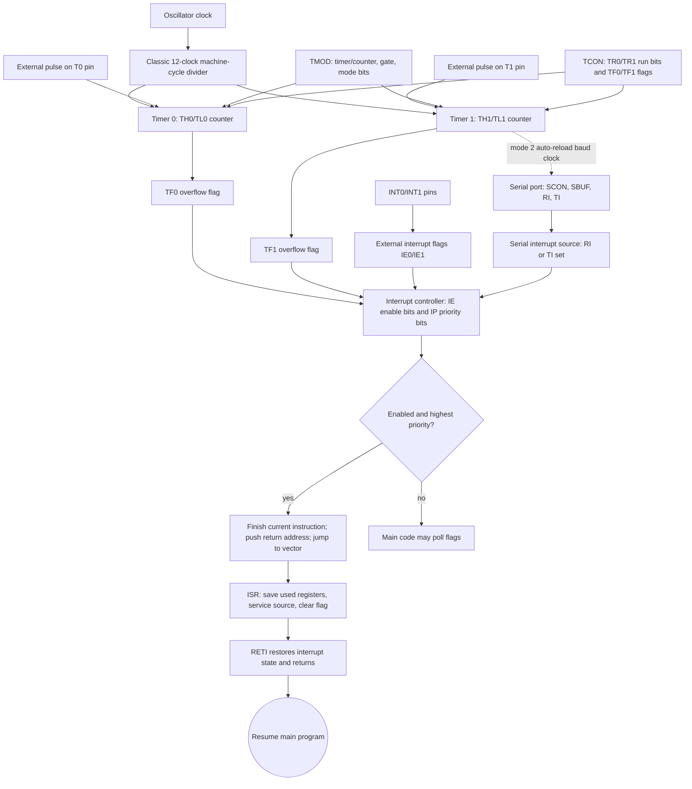

# 8051 Timers, Serial Port, and Interrupts

Timers, serial communication, and interrupts are where the 8051 becomes a practical embedded controller instead of only a small CPU with ports. The source has separate chapters on counter/timer programming, serial communication, and interrupt programming because these features interact but must be learned carefully: timers produce delays and baud rates, the serial port signals transmit and receive completion, and interrupts let the system respond without polling every flag continuously.

The central habit is to configure the correct SFR bits, clear or test the correct flags, and understand which hardware event sets each flag. Once that is in place, an 8051 program can blink LEDs, count external pulses, generate a baud clock, receive characters, and service external events predictably.

## Definitions

The classic 8051 has **Timer 0** and **Timer 1**. Each can operate as a timer driven by the machine cycle clock or as a counter driven by external input pins. Later derivatives often add more timers or programmable counter arrays.

`TMOD` is the **timer mode register**. It selects timer/counter operation, gate control, and mode for Timer 0 and Timer 1.

`TCON` is the **timer control register**. It contains run bits such as `TR0` and `TR1`, overflow flags such as `TF0` and `TF1`, and external interrupt control flags.

Timer modes include:

- **Mode 0**: 13-bit timer mode.
- **Mode 1**: 16-bit timer mode.
- **Mode 2**: 8-bit auto-reload mode.
- **Mode 3**: split Timer 0 mode in the original 8051.

The **serial port** uses `SBUF` as the transmit/receive data buffer and `SCON` as the serial control register. The flags `TI` and `RI` indicate transmit complete and receive complete.

A **baud rate** is the number of signaling events per second. In common 8051 serial mode 1, Timer 1 in mode 2 often generates the baud rate.

An **interrupt** is a hardware or internal event that temporarily redirects execution to an interrupt service routine. The 8051 has interrupt vectors for external interrupts, timer overflows, and serial events.

`IE` is the **interrupt enable register**, and `IP` is the **interrupt priority register**.

## Key results

The first key result is that timer overflow occurs after the timer counts from its loaded value up to its maximum and rolls over. In 16-bit mode, overflow happens after:

$$
65536 - \text{initial value}
$$

timer increments. Therefore a desired delay can be produced by loading:

$$
\text{initial value} = 65536 - \text{required counts}
$$

The second key result is that the timer increment rate depends on oscillator frequency and classic 8051 machine-cycle timing. In the original 12-clock core, one timer increment in timer mode occurs every 12 oscillator periods. With an 11.0592 MHz crystal:

$$
\frac{11.0592\ \text{MHz}}{12} = 921.6\ \text{kHz}
$$

The third key result is that mode 2 auto-reload is useful for periodic events and baud generation. The timer overflows from `FFH` to `00H`, reloads automatically from `THx`, and continues without software reloading `TLx` every time.

The fourth key result is that serial flags are software-cleared. After the serial hardware sets `TI` or `RI`, the program must clear the flag after handling the transmit or receive event.

The fifth key result is that interrupt service routines must be short and must preserve any registers they modify unless the program has a strict bank convention. The ISR should handle the event, clear or acknowledge the flag as required, and return with `RETI`.

The sixth key result is that interrupt priority matters only when simultaneous or nested interrupt conditions occur. Without careful design, a high-frequency timer interrupt can starve lower-priority work.

The seventh key result is that polling and interrupt service are both valid, but they answer different scheduling problems. Polling a timer flag inside the main loop is easy and deterministic when the loop is short. Enabling a timer interrupt is better when the main loop may block or when events must be serviced with bounded latency. The cost of interrupts is context saving, shared-data discipline, and the need to keep service routines short.

The eighth key result is that reload timing affects accuracy. In 16-bit mode, if software reloads `THx` and `TLx` only after detecting overflow, the time spent inside the service code adds error unless compensated. Auto-reload mode avoids part of this for 8-bit periodic events, while careful 16-bit code reloads promptly and accounts for instruction overhead when precise timing is required.

The ninth key result is that serial transmit and receive share the same interrupt source in the original 8051. The serial ISR must test both `RI` and `TI`. A transmit completion can occur while a receive byte is waiting, and a receive event can occur while the program is feeding the next transmit byte. A correct ISR handles both flags before returning or has a deliberate policy for prioritizing one side.

## Visual



This 8051 timer/serial/interrupt diagram shows the clock source, timer counters, mode/control SFRs, overflow flags, UART flags, interrupt enables, priorities, vectors, and ISR return path. Timer 1's dotted baud-rate edge explains the common serial-mode dependency, while the interrupt-controller branch makes polling versus interrupt service explicit. The diagram also shows the required software responsibilities inside an ISR: preserve state, service the source, clear the relevant flag, and return with `RETI`.

| Feature | Main SFRs | Main flags/bits | Typical use |
|---|---|---|---|
| Timer 0 | `TMOD`, `TCON`, `TH0`, `TL0` | `TR0`, `TF0` | Delays, event counting, periodic interrupts |
| Timer 1 | `TMOD`, `TCON`, `TH1`, `TL1` | `TR1`, `TF1` | Delays, baud-rate generation |
| Serial port | `SCON`, `SBUF`, `PCON` | `RI`, `TI`, `SM0`, `SM1` | UART-style communication |
| Interrupts | `IE`, `IP`, vectors | `EA`, `EX0`, `ET0`, `ES` | Asynchronous event handling |
| External interrupts | `TCON`, pins `INT0`, `INT1` | `IE0`, `IE1`, `IT0`, `IT1` | Buttons, sensors, external requests |

## Worked example 1: Timer 0 initial value for a 1 ms delay

Problem: On a classic 12-clock 8051 using a 12 MHz oscillator, find the Timer 0 mode 1 initial value for an approximate 1 ms delay.

Method:

1. Timer increments once per machine cycle in timer mode.

2. Machine-cycle frequency is:

$$
\frac{12\ \text{MHz}}{12} = 1\ \text{MHz}
$$

3. One timer count is therefore:

$$
1 / 1\ \text{MHz} = 1\ \text{us}
$$

4. A 1 ms delay needs:

$$
1000\ \text{us} / 1\ \text{us} = 1000
$$

counts.

5. In 16-bit mode, overflow occurs at 65536 counts, so load:

$$
65536 - 1000 = 64536
$$

6. Convert 64536 to hexadecimal:

$$
64536 = FC18\text{H}
$$

Answer: load `TH0 = FCH` and `TL0 = 18H`, start Timer 0, and wait for `TF0`.

Check: `10000H - FC18H = 03E8H = 1000`, confirming the count.

## Worked example 2: Timer 1 reload for 9600 baud

Problem: In a common 8051 serial mode 1 setup with an 11.0592 MHz crystal, Timer 1 mode 2, and `SMOD = 0`, find the usual reload value for 9600 baud.

Method:

1. Classic 8051 timer increment frequency:

$$
11.0592\ \text{MHz} / 12 = 921600\ \text{Hz}
$$

2. In serial mode 1 with `SMOD = 0`, baud rate is commonly:

$$
\text{baud} = \frac{\text{Timer1 overflow rate}}{32}
$$

3. Required Timer 1 overflow rate:

$$
9600 \cdot 32 = 307200\ \text{Hz}
$$

4. Timer counts per overflow:

$$
921600 / 307200 = 3
$$

5. In 8-bit auto-reload mode, counts per overflow are:

$$
256 - TH1
$$

6. Therefore:

$$
256 - TH1 = 3
$$

7. Solve:

$$
TH1 = 253 = FD\text{H}
$$

Answer: load `TH1 = FDH` for 9600 baud under these standard assumptions.

Check: `256 - FDH = 03H`; `921600 / 3 / 32 = 9600`.

## Code

```c
/* 8051 C: initialize serial mode 1 at 9600 baud with 11.0592 MHz crystal.
   Syntax follows common 8051 C compilers with SFR names available. */

void uart_init(void) {
    TMOD &= 0x0F;      /* keep Timer 0 settings */
    TMOD |= 0x20;      /* Timer 1 mode 2, 8-bit auto-reload */
    TH1 = 0xFD;        /* 9600 baud for 11.0592 MHz, SMOD = 0 */
    TL1 = 0xFD;
    SCON = 0x50;       /* serial mode 1, receiver enabled */
    TR1 = 1;           /* start Timer 1 */
}

void uart_putc(unsigned char ch) {
    SBUF = ch;
    while (TI == 0) {
        ;              /* wait for transmit complete */
    }
    TI = 0;            /* software clears transmit flag */
}
```

## Common pitfalls

- Loading only `TL0` in 16-bit mode and forgetting `TH0`.
- Forgetting to clear `TF0`, `TF1`, `RI`, or `TI` after servicing the event.
- Reusing Timer 1 for a delay while it is already generating the serial baud rate.
- Calculating timer counts from oscillator frequency without dividing by 12 for a classic 8051 core.
- Writing long interrupt service routines that block other time-sensitive events.
- Ending an ISR with `RET` instead of `RETI`.
- Enabling individual interrupts but forgetting the global enable bit `EA`.

## Connections

- [8051 architecture, memory, and ports](/cs/embedded/8051-architecture-memory-ports)
- [8051 instruction set and programming](/cs/embedded/8051-instruction-set-programming)
- [Serial buses and embedded protocols](/cs/embedded/serial-buses-embedded-protocols)
- [Microcontroller derivatives, AVR, and PIC](/cs/embedded/microcontroller-derivatives-avr-pic)
