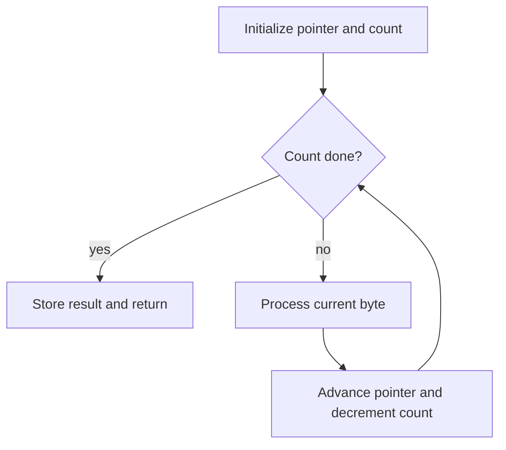

# 8085 Assembly Programming Patterns

The programming chapters in the source move from isolated instructions to complete assembly language programs. That shift is important: real 8085 work is about arranging instructions into loops, counters, conversions, subroutines, stack usage, and I/O sequences that are easy to trace and test. The same ideas later reappear in 8051 assembly, but with different registers and memory spaces.

This page focuses on reusable patterns rather than a large catalog of opcodes. If a student can design a counted loop, build a delay loop, pass a parameter to a subroutine, save registers on the stack, and convert between binary and display codes, then many textbook examples become variations of a few reliable methods.

## Definitions

An **assembly language program** is a symbolic program written with mnemonics, labels, constants, and directives. An assembler translates it into machine code.

A **label** names an instruction or data location. Branch and call instructions use labels so the assembler can compute the final address.

A **loop counter** is a register or memory byte decremented or incremented until a terminating condition is reached. In the 8085, `DCR r` followed by `JNZ label` is a common counted-loop pattern.

A **delay loop** is a software loop intentionally consuming processor time. It is simple but wastes CPU cycles and depends on the clock frequency and instruction timing.

A **subroutine** is a reusable block entered by `CALL` and exited by `RET`. The 8085 stores the return address on the stack automatically during `CALL`, then restores it during `RET`.

The **stack** is a last-in, first-out region of RAM addressed by `SP`. The 8085 stack grows downward: `PUSH` decrements `SP` and stores data; `POP` reads data and increments `SP`.

**Parameter passing** is the method used to give data to a subroutine. The book's stack and subroutine chapter covers passing through registers, memory locations, pointers, and the stack.

**Code conversion** changes representation without changing the underlying meaning. Typical examples include BCD-to-binary, binary-to-BCD, BCD-to-seven-segment, binary-to-ASCII, and ASCII-to-binary.

## Key results

The first key result is that every loop needs four pieces: initialization, body, update, and termination test. Omitting any one of those pieces either skips work or creates an endless loop.

The second key result is that software delay is determined by instruction timing. If a loop body takes $T$ clock states and runs $N$ times on a processor with clock frequency $f$, the approximate delay is:

$$
\text{delay} = \frac{N \cdot T}{f}
$$

Nested loops multiply the counts. A loop with outer count $M$ and inner count $N$ runs the inner body about $M \cdot N$ times, plus overhead for reloading and decrementing the outer counter.

The third key result is that subroutines create a calling convention even on a small processor. The programmer must decide which registers hold inputs, which registers hold outputs, and which registers the subroutine is allowed to destroy. If this convention is not written down, programs become fragile.

The fourth key result is that the stack must be initialized before `PUSH`, `POP`, `CALL`, or interrupt handling is used. A common mistake is writing subroutines before assigning `SP` to a valid RAM region.

The fifth key result is that code conversion programs are table-friendly. For seven-segment display conversion, a lookup table is often clearer and faster than deriving segment bits each time. The input digit indexes a table containing the display pattern.

The sixth key result is that recursion is theoretically possible with a stack but rarely appropriate on small 8085 systems. Re-entrant and recursive subroutines require careful saving of state and enough stack space for nested calls.

The seventh key result is that a good assembly listing is also documentation. Labels such as `NEXT`, `SKIP`, and `DONE` are better than raw addresses, but larger programs need labels that describe intent: `SCAN_KEY`, `ADD_BYTE`, `DISPLAY_DIGIT`, or `WAIT_READY`. Small comments should record register roles at subroutine boundaries, because a future edit that reuses `B` or `HL` can silently break a caller.

The eighth key result is that conversion programs should state their input range. A BCD-to-seven-segment routine that assumes digits `0` through `9` is not correct for an arbitrary byte. A binary-to-ASCII routine may work for one nibble, one byte, or a multi-digit decimal conversion depending on its algorithm. Defining the input range prevents a table lookup or subtraction loop from reading outside intended data.

The ninth key result is that debugging assembly is easiest when memory locations are chosen deliberately. Reserve separate regions for inputs, outputs, temporary data, lookup tables, stack, and code. When a program stores its result at `2500H`, the test setup should make sure that address is writable RAM and not a ROM, port, or stack area.

## Visual



| Pattern | 8085 idiom | What to check |
|---|---|---|
| Counted loop | `MVI C,n` then `DCR C` / `JNZ` | Counter is not overwritten inside loop |
| Pointer loop | `LXI H,addr` then `INX H` | `HL` points to the intended memory byte |
| Delay loop | Nested `DCR` / `JNZ` | Clock frequency and loop timing are known |
| Subroutine | `CALL label` and `RET` | Stack pointer initialized |
| Register save | `PUSH B`, `PUSH D`, `PUSH H` | Pops occur in reverse order |
| Table lookup | Add index to base address | Index is within table range |

## Worked example 1: Building a counted sum loop

Problem: Sum ten unsigned bytes starting at `2400H`. Store the low byte of the sum at `2500H` and the carry count at `2501H`. Use 8085 registers.

Method:

1. A pointer is needed for the input block. Use `HL = 2400H`.

2. A counter is needed for ten bytes. Use `C = 0AH`.

3. The low-byte sum naturally lives in the accumulator. Initialize `A = 00H`.

4. A carry counter is needed because adding ten bytes can exceed `FFH`. Use `B = 00H`.

5. For each byte, add memory to `A`:

```asm
ADD M
```

6. If carry is clear, skip the carry increment. If carry is set, increment `B`.

7. Advance `HL`, decrement `C`, and loop while `C` is not zero.

Answer:

```asm
        LXI H,2400H
        MVI C,0AH
        MVI B,00H
        MVI A,00H
LOOP:   ADD M
        JNC NO_CARRY
        INR B
NO_CARRY:
        INX H
        DCR C
        JNZ LOOP
        STA 2500H
        MOV A,B
        STA 2501H
        HLT
```

Check: `DCR C` does not change the carry flag, so the carry from `ADD M` must be tested before `DCR C`. The program does that.

## Worked example 2: Estimating a nested software delay

Problem: A simple nested delay has an outer count of `04H` and an inner count of `C8H` decimal 200. Suppose the inner loop body is approximated as 14 clock states per iteration and ignore setup overhead. Estimate the delay on a 3 MHz 8085.

Method:

1. Convert the outer count:

$$
04\text{H} = 4
$$

2. Convert the inner count:

$$
C8\text{H} = 200
$$

3. Total inner iterations:

$$
4 \cdot 200 = 800
$$

4. Total clock states:

$$
800 \cdot 14 = 11200
$$

5. Clock period at 3 MHz:

$$
\frac{1}{3,000,000} = 0.333\ \mu s
$$

6. Delay:

$$
11200 \cdot 0.333\ \mu s \approx 3730\ \mu s
$$

Answer: the approximate delay is 3.73 ms, excluding setup and outer-loop overhead.

Check: The estimate is intentionally low because setup, reloading the inner count, and outer-loop branch time were ignored. A precise textbook timing calculation would include each instruction's T-states.

## Code

```asm
; 8085: subroutine converts one hexadecimal nibble in A to ASCII.
; Input: lower nibble of A is 0..15.
; Output: A = ASCII '0'..'9' or 'A'..'F'.
; Destroys: flags only.

HEX_ASCII:
        ANI 0FH        ; keep only low nibble
        CPI 0AH        ; is it 10 or more?
        JC DIGIT
        ADI 37H        ; 0AH -> 41H ('A')
        RET
DIGIT:  ADI 30H        ; 00H -> 30H ('0')
        RET

; Example caller:
        LXI SP,27FFH
        MVI A,0CH
        CALL HEX_ASCII
        STA 2600H
        HLT
```

## Common pitfalls

- Placing the stack in memory used by variables or program code. Stack collisions are difficult to debug.
- Forgetting that `CALL` and interrupts use the stack even if the program never explicitly uses `PUSH`.
- Popping registers in the wrong order. A last-in, first-out stack requires reverse-order restoration.
- Testing a flag after an instruction that has already overwritten it. In loops, branch immediately after the instruction whose flag result matters.
- Writing delay loops without recording the clock frequency. The same loop delay changes when the crystal changes.
- Letting lookup-table indexes exceed the table length. A bad index silently reads unrelated memory.
- Assuming a subroutine preserves registers. Decide and document a convention for every subroutine.

## Connections

- [8085 instruction set and addressing](/cs/embedded/8085-instruction-set-addressing)
- [8085 I/O, memory, and DMA interfacing](/cs/embedded/8085-io-memory-dma-interfacing)
- [8051 instruction set and programming](/cs/embedded/8051-instruction-set-programming)
- [8051 timers, serial port, and interrupts](/cs/embedded/8051-timers-serial-interrupts)
