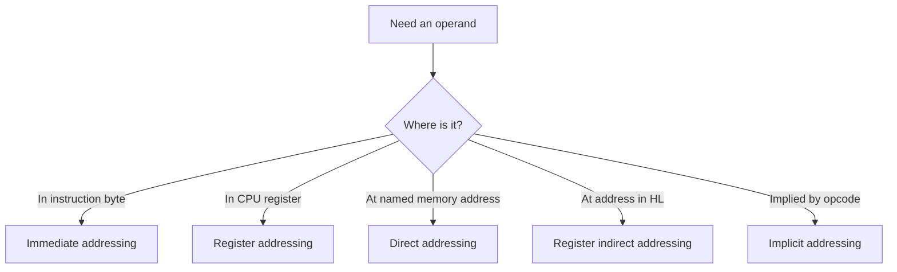

# 8085 Instruction Set and Addressing

The 8085 instruction set is small enough to learn systematically but rich enough to show the essential patterns of assembly programming: data movement, arithmetic, logic, branches, stack operations, I/O operations, and machine control. The book places this topic after the 8085 architecture because each instruction is easier to understand once registers, flags, memory cycles, and the program counter are already familiar.

Instruction study should not be reduced to opcode memorization. A useful mental model asks four questions for every instruction: where are the operands, where is the result stored, which flags change, and how many bytes must be fetched? Those questions explain both program behavior and bus timing.

## Definitions

An **instruction** is a binary command executed by the CPU. In assembly language it is written as a mnemonic such as `MOV`, `MVI`, `ADD`, `JMP`, or `CALL`.

An **opcode** is the machine-code byte that identifies the operation. Some instructions are one byte long; others include immediate data or addresses in following bytes.

An **operand** is the data value or location used by an instruction. It may be a register, immediate byte, register pair, direct address, memory location pointed to by `HL`, or I/O port address.

The 8085 instruction groups are:

- **Data transfer**: move or load data without changing its value.
- **Arithmetic**: add, subtract, increment, decrement, compare, and adjust.
- **Logical**: AND, OR, XOR, complement, compare, rotate, and flag operations.
- **Branch**: jump, call, return, and restart.
- **Stack, I/O, and machine control**: push, pop, input, output, enable/disable interrupts, halt, and no operation.

The common 8085 **addressing modes** are:

- **Immediate addressing**: data is part of the instruction, as in `MVI A,3AH`.
- **Register addressing**: operand is in a register, as in `ADD B`.
- **Direct addressing**: instruction contains the memory address, as in `LDA 2050H`.
- **Register indirect addressing**: a register pair points to memory, as in `MOV A,M` where `M` means `[HL]`.
- **Implicit addressing**: operand is implied, as in `CMA`, which complements the accumulator.

The **condition flags** record result properties. `Z` is set for zero result, `S` reflects bit 7, `P` is set for even parity, `CY` records carry or borrow, and `AC` records carry from bit 3 to bit 4 for BCD support.

## Key results

The first key result is that `MOV` copies; it does not erase the source. For example, `MOV A,B` changes `A` but leaves `B` unchanged. This is fundamental when tracing register values.

The second key result is that arithmetic and logical instructions usually affect flags, while simple data transfers usually do not. This matters for conditional branches. A `JZ` after `ADD B` tests the sum; a `JZ` after `MOV C,A` still tests whatever previous instruction last changed `Z`.

The third key result is that `CMP r` performs an internal subtraction without storing the result:

$$
A - r
$$

The flags are set as if the subtraction happened. If `A = r`, then `Z = 1`. If `A < r`, the carry flag is set to represent borrow. This makes `CMP` the standard instruction for decisions.

The fourth key result is that the `HL` pair is the main memory pointer. The symbol `M` does not name a physical register; it names the memory byte at the address contained in `HL`. Thus `MOV A,M` reads memory, and `MOV M,A` writes memory.

The fifth key result is that multi-byte data is stored little-endian in 8085 instruction operands: the low byte appears first, then the high byte. For `LXI H,2050H`, the machine bytes after the opcode are `50H` then `20H`.

The sixth key result is that BCD arithmetic needs decimal adjustment. After adding two packed BCD values with `ADD` or `ADC`, the `DAA` instruction corrects the accumulator into valid BCD form using the auxiliary carry and carry flags.

The seventh key result is that instruction length changes program-counter movement. A one-byte instruction such as `MOV A,B` advances `PC` by one during normal flow. A two-byte instruction such as `MVI A,data` advances past the opcode and immediate data. A three-byte instruction such as `JMP addr` or `LDA addr` contains a 16-bit address after the opcode. Branch targets must account for these byte lengths when reading machine-code listings or hand-assembling small examples.

The eighth key result is that signed interpretation is a software convention on the 8085. The sign flag copies bit 7 of the result, but the CPU does not know whether the programmer intended unsigned data, two's-complement signed data, BCD, ASCII, or a bit mask. Conditional jumps based on carry are often used for unsigned comparisons, while sign and overflow reasoning for signed arithmetic must be designed explicitly.

## Visual

| Instruction group | Examples | Typical operands | Flags affected? | Typical use |
|---|---|---|---|---|
| Data transfer | `MOV`, `MVI`, `LXI`, `LDA`, `STA` | Registers, memory, immediate data | Usually no | Copy values and set pointers |
| Arithmetic | `ADD`, `ADC`, `SUB`, `SBB`, `INR`, `DCR` | Accumulator with register or memory | Usually yes | Numeric calculation and loop counters |
| Logical | `ANA`, `ORA`, `XRA`, `CMA`, `RLC` | Accumulator and register or memory | Usually yes, except some rotates differ | Masking, bit tests, shifts by rotation |
| Branch | `JMP`, `JZ`, `JC`, `CALL`, `RET` | 16-bit target address | Usually no | Loops, decisions, subroutines |
| Stack/I/O/control | `PUSH`, `POP`, `IN`, `OUT`, `EI`, `DI`, `HLT` | Register pairs, ports, implied | Varies | System control and peripheral access |



## Worked example 1: Flag result after addition

Problem: The accumulator contains `F2H`, register `B` contains `34H`, and the instruction `ADD B` executes. Find the accumulator result and the carry flag.

Method:

1. Write the operation:

$$
A \leftarrow A + B
$$

2. Substitute the values:

$$
F2\text{H} + 34\text{H}
$$

3. Add the low nibbles:

$$
2 + 4 = 6
$$

4. Add the high nibbles:

$$
F + 3 = 12\text{H}
$$

5. The full mathematical sum is:

$$
126\text{H}
$$

6. The accumulator is only 8 bits, so it keeps the low byte:

$$
A = 26\text{H}
$$

7. The ninth bit is carried out, so:

$$
CY = 1
$$

Answer: `A = 26H`, `CY = 1`.

Check: In decimal, `F2H = 242` and `34H = 52`; sum is `294`. Since `294 - 256 = 38`, the stored result is `38 decimal = 26H`, with carry set.

## Worked example 2: Choosing an addressing mode

Problem: Write the smallest natural instruction sequence for each task: load `A` with constant `55H`, load `A` from memory location `2050H`, and load `A` from the memory location currently pointed to by `HL`.

Method:

1. Constant data included in the instruction uses immediate addressing:

```asm
MVI A,55H
```

2. A fixed memory address written in the instruction uses direct addressing:

```asm
LDA 2050H
```

3. A memory location whose address is already in `HL` uses register indirect addressing:

```asm
MOV A,M
```

4. Check side effects. `MVI A,55H` changes only `A`; `LDA 2050H` changes `A` and consumes three instruction bytes; `MOV A,M` changes `A` but requires `HL` to have been prepared earlier.

Answer: use `MVI A,55H`, `LDA 2050H`, and `MOV A,M`, respectively.

Check: If the third task used `LDA`, it would need a literal address. Since the problem says the address is already in `HL`, `MOV A,M` is the intended 8085 idiom.

## Code

```asm
; 8085: count nonzero bytes in a 16-byte block.
; Input block starts at 2100H.
; Output count is stored at 2200H.

        LXI H,2100H    ; HL points to current byte
        MVI C,10H      ; 16 bytes to test
        MVI B,00H      ; B will count nonzero bytes

NEXT:   MOV A,M        ; A <- current byte
        CPI 00H        ; compare A with zero
        JZ SKIP        ; if zero, do not count
        INR B          ; nonzero count++

SKIP:   INX H          ; move to next byte
        DCR C          ; one fewer byte remains
        JNZ NEXT       ; loop until C = 0

        MOV A,B
        STA 2200H
        HLT
```

## Common pitfalls

- Reading `M` as a register. In 8085 assembly, `M` means memory addressed by `HL`.
- Assuming every instruction changes flags. Data transfer instructions generally leave flags unchanged.
- Forgetting little-endian order for 16-bit immediate addresses in machine code.
- Using `ADD` when a previous carry must be included. Multi-byte addition requires `ADC` for the higher bytes.
- Using `JZ` or `JC` without checking which instruction last changed `Z` or `CY`.
- Treating `CMP` as destructive. It changes flags but not the accumulator.
- Forgetting that `INR` and `DCR` do not affect the carry flag, even though they affect several other flags.

## Connections

- [8085 architecture, buses, and timing](/cs/embedded/intel-8085-architecture-buses-timing)
- [8085 assembly programming patterns](/cs/embedded/8085-assembly-programming-patterns)
- [8085 I/O, memory, and DMA interfacing](/cs/embedded/8085-io-memory-dma-interfacing)
- [8051 instruction set and programming](/cs/embedded/8051-instruction-set-programming)
