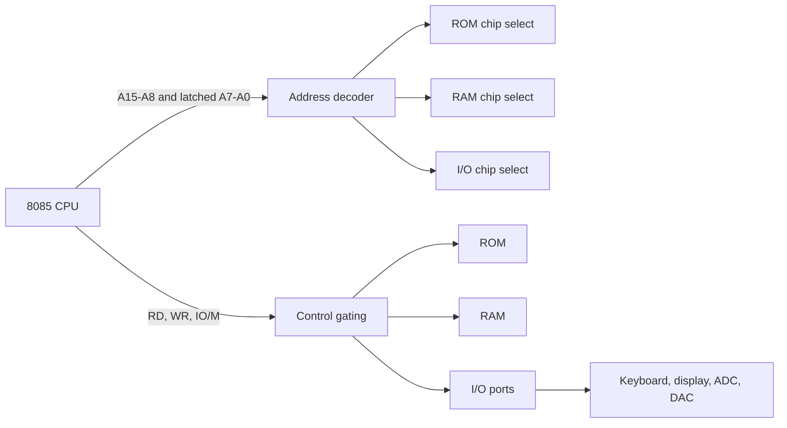

# 8085 I/O, Memory, and DMA Interfacing

The 8085 becomes useful only when it is connected to memory and real-world devices. The source chapter on I/O and memory interfacing follows the programming chapters because the same instructions now have electrical meaning: `LDA` reads a selected memory chip, `STA` writes one byte to a decoded address, `IN` samples a port, and `OUT` drives a port. The programmer's model and the hardware map must agree.

This page ties together programmed I/O, interrupt-driven I/O, direct memory access, I/O-mapped addressing, memory-mapped addressing, and memory decoding. These ideas are not unique to the 8085, but the 8085 exposes them cleanly through `IO/M`, `RD`, `WR`, `IN`, `OUT`, `HOLD`, and `HLDA`.

## Definitions

**Programmed I/O** is data transfer under direct CPU control. The program repeatedly checks a device status bit or assumes the device is ready, then executes input or output instructions.

**Interrupt-driven I/O** lets a device request service asynchronously. The CPU runs the main program until the device interrupts; an interrupt service routine then transfers data or updates status.

**Direct memory access (DMA)** allows a controller to transfer data between an I/O device and memory without the CPU moving every byte. The CPU temporarily gives up the bus using the 8085 `HOLD` and `HLDA` handshake.

**I/O-mapped I/O** uses the 8085 `IN` and `OUT` instructions and an 8-bit port address. The `IO/M` status indicates an I/O cycle. Up to 256 input/output port addresses are available.

**Memory-mapped I/O** assigns device registers to ordinary memory addresses. The CPU accesses devices with memory instructions such as `LDA`, `STA`, `MOV M,A`, and `MOV A,M`.

An **I/O port** is a hardware register or latch visible to the CPU. An input port places external signals on the data bus during an I/O read. An output port stores data written by the CPU and drives external signals.

**Chip selection** is the process of enabling one memory or I/O device for a bus cycle. It usually combines address decoding and control signals so that no two devices drive the data bus simultaneously.

**Address decoding** converts address-line patterns into device-select signals. Full decoding uses all relevant high-order address bits; partial decoding uses fewer bits and creates mirrored addresses.

## Key results

The first key result is that programmed I/O is simple but can waste CPU time. A polling loop is easy to write, but the processor may spend many cycles waiting for a status bit. It is suitable when the device is always ready, the transfer is short, or the system has no better work to do.

The second key result is that interrupt-driven I/O improves CPU utilization but requires careful shared-state design. An interrupt may occur between two main-program instructions, so variables shared with the service routine must be updated in a safe order.

The third key result is that DMA improves bulk transfer speed by removing the CPU from the byte-by-byte data path. In the 8085 bus handshake, an external DMA controller asserts `HOLD`; the 8085 completes the current bus cycle, floats the bus, and asserts `HLDA`. After the DMA transfer, `HOLD` is removed and the CPU resumes bus ownership.

The fourth key result is that I/O-mapped and memory-mapped I/O differ in address space, instruction choice, and decoding. I/O-mapped ports do not consume memory addresses and use compact `IN`/`OUT` instructions. Memory-mapped devices can use the full memory instruction set and 16-bit addresses, but they reduce the memory address range available for RAM and ROM.

The fifth key result is that memory interfacing requires size alignment. A memory chip with $k$ address pins contains $2^k$ addressable locations. If an 8 KiB RAM has 13 address inputs, it consumes an address block of `2000H` bytes. The decoder must select it for exactly the intended high-address range.

The sixth key result is that address decoding must avoid bus contention. During a read cycle, only one enabled device may drive the data bus. During a write cycle, only the selected device should store the byte.

## Visual



| Transfer method | CPU involvement | Typical hardware | Best use | Main risk |
|---|---|---|---|---|
| Programmed I/O | CPU moves every byte | Status port and data port | Simple slow devices | Wasted polling time |
| Interrupt-driven I/O | CPU moves bytes only when requested | Interrupt line, vector/service routine | Sporadic events | Shared data races |
| DMA | Controller moves bytes | DMA controller, bus request/grant | Large blocks | Bus ownership and memory conflicts |
| Memory-mapped I/O | CPU uses memory instructions | Address decoder and device registers | Rich addressing and bit operations | Consumes memory address space |
| I/O-mapped I/O | CPU uses `IN` and `OUT` | 8-bit port decoder | Classic 8085 peripherals | Limited port address range |

## Worked example 1: Selecting an 8 KiB RAM block

Problem: Interface an 8 KiB RAM chip to an 8085 so that it occupies addresses `4000H` through `5FFFH`. Determine which address lines go to the RAM and which high address pattern selects the chip.

Method:

1. Compute the RAM size in bytes:

$$
8\ \text{KiB} = 8 \cdot 1024 = 8192 = 2000\text{H}
$$

2. An 8 KiB chip needs 13 internal address lines because:

$$
2^{13} = 8192
$$

3. Connect processor address lines `A0` through `A12` to the RAM address inputs. On the 8085, `A0` through `A7` must come from the external latch because those bits are multiplexed.

4. The selected range is `4000H` to `5FFFH`. In binary, the high three bits of these addresses are:

```text
4000H = 0100 0000 0000 0000
5FFFH = 0101 1111 1111 1111
```

5. Because `A0` through `A12` vary inside the chip, the decoder must examine `A15`, `A14`, and `A13`.

6. For the whole range `4000H` to `5FFFH`, the high pattern is:

```text
A15 A14 A13 = 0 1 0
```

Answer: connect `A0`-`A12` to the RAM address pins and assert the RAM chip select when `A15 A14 A13 = 010` during memory cycles.

Check: The next 8 KiB block, `6000H` to `7FFFH`, has high pattern `011`, so it will not select this RAM if all three high bits are decoded.

## Worked example 2: Choosing I/O-mapped versus memory-mapped access

Problem: A design needs one 8-bit output latch for LEDs. Compare the 8085 code if the latch is mapped as I/O port `20H` versus memory location `8000H`.

Method:

1. For I/O-mapped I/O, use the `OUT` instruction. The port address is an immediate byte:

```asm
MVI A,55H
OUT 20H
```

2. For memory-mapped I/O, use a memory write instruction. A direct store uses a 16-bit address:

```asm
MVI A,55H
STA 8000H
```

3. Compare instruction meaning. `OUT 20H` creates an I/O write cycle with `IO/M` indicating I/O. `STA 8000H` creates a memory write cycle with `IO/M` indicating memory.

4. Compare address use. The I/O-mapped latch consumes one port address from 256 possible ports. The memory-mapped latch consumes memory address `8000H` and should be excluded from RAM or ROM.

Answer: use `OUT 20H` for I/O-mapped hardware and `STA 8000H` for memory-mapped hardware. The hardware decoder must match the chosen method.

Check: If the program uses `OUT 20H` but the decoder expects memory address `8000H`, the latch will never be selected.

## Code

```asm
; 8085: poll an input port until bit 0 becomes 1, then output a pattern.
; Input status port: 10H
; Output data port: 20H

WAIT_READY:
        IN 10H         ; read status
        ANI 01H        ; isolate bit 0
        JZ WAIT_READY  ; wait while not ready

        MVI A,0AAH     ; 10101010 pattern
        OUT 20H        ; write LEDs or output latch
        HLT
```

## Common pitfalls

- Decoding an I/O port but using memory instructions in software, or decoding memory but using `IN` and `OUT`.
- Allowing two devices to drive the data bus during the same read cycle. This can damage hardware or produce invalid data.
- Forgetting that the low 8085 address bits must be latched before memory or I/O decoding uses them.
- Assuming polling is always slow or interrupts are always better. For a single ready device, polling may be the simplest correct design.
- Forgetting to save registers inside interrupt service routines that modify registers used by the main program.
- Placing memory-mapped I/O inside an address range also used by RAM.
- Ignoring DMA bus ownership. The CPU and DMA controller must not drive address and control buses at the same time.

## Connections

- [8085 architecture, buses, and timing](/cs/embedded/intel-8085-architecture-buses-timing)
- [8085 assembly programming patterns](/cs/embedded/8085-assembly-programming-patterns)
- [8255 programmable peripheral interface](/cs/embedded/8255-programmable-peripheral-interface)
- [8051 external-world interfacing](/cs/embedded/8051-external-world-interfacing)

