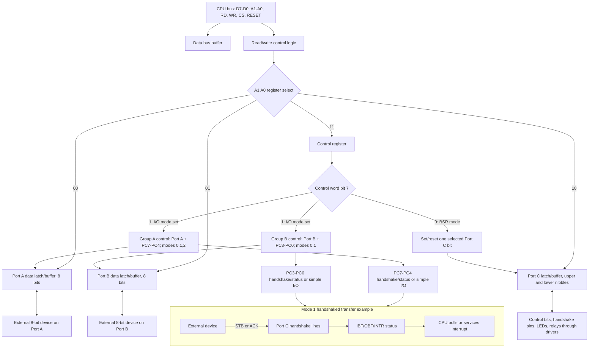

# 8255 Programmable Peripheral Interface

The 8255 programmable peripheral interface is the bridge between a processor bus and parallel real-world signals. The source treats it after 8051 interrupt programming because it is a classic example of a peripheral whose behavior is selected by a control word rather than by rewiring hardware. In an 8085 system it is commonly connected as an I/O-mapped or memory-mapped device; in an 8051 expansion system it can add more parallel ports.


*Figure: Arduino boards make microcontroller I/O and prototyping tangible. Image: [Wikimedia Commons](https://commons.wikimedia.org/wiki/File:Arduino_Uno_-_R3.jpg), SparkFun Electronics, CC BY 2.0.*

The key learning value of the 8255 is configurability. The same chip can provide simple input and output ports, handshaked input, handshaked output, bidirectional transfer, or single-bit set/reset on Port C. Correct use depends on decoding its internal addresses, writing the right control word, and matching the external device's timing expectations.

## Definitions

The **8255A** is a programmable peripheral interface with three 8-bit ports: Port A, Port B, and Port C. Port C can also be split into upper and lower nibbles for control and handshake lines.

The **data bus buffer** connects the 8255 to the processor data bus. The CPU writes control words and output bytes through this buffer and reads input bytes through it.

The **read/write control logic** uses signals such as chip select, read, write, reset, and address inputs to determine which internal register is accessed.

The internal register selection is usually:

| `A1` | `A0` | Selected register |
|---:|---:|---|
| 0 | 0 | Port A |
| 0 | 1 | Port B |
| 1 | 0 | Port C |
| 1 | 1 | Control register |

**Group A** includes Port A and the upper half of Port C. **Group B** includes Port B and the lower half of Port C. The mode control word configures both groups.

**Mode 0** is simple input/output. Outputs are latched; inputs are not handshaked.

**Mode 1** is strobed input/output with handshaking. Selected Port C bits become status and control lines such as strobe, acknowledge, input buffer full, or output buffer full.

**Mode 2** is bidirectional bus operation for Port A, using Port C bits for handshaking.

**Bit set/reset (BSR) mode** changes a single Port C bit without changing the I/O mode configuration.

## Key results

The first key result is that the most significant bit of the control word selects the control-word type. If bit 7 is `1`, the word is an I/O mode control word. If bit 7 is `0`, the word is a BSR command for Port C.

The second key result is that Port C has two roles. In Mode 0 it can be an ordinary 8-bit I/O port or two 4-bit ports. In Mode 1 and Mode 2, some Port C pins are no longer general I/O because they become handshake/status lines. A common design error is to connect LEDs or switches to Port C bits that the selected mode needs for handshaking.

The third key result is that the 8255 does not automatically know whether a connected peripheral is ready. In Mode 0, software must coordinate timing by polling or fixed delays. In Mode 1 and Mode 2, hardware handshake lines make the transfer more reliable.

The fourth key result is that address decoding and internal selection are different tasks. External decoding selects the 8255 chip; `A1` and `A0` select one of its internal ports or the control register. The CPU address used for Port A, Port B, Port C, and control therefore differs only in the low internal select bits if the board is arranged that way.

The fifth key result is that BSR mode is useful for control pins such as chip-selects, strobes, relay bits, or LCD control lines. It changes one Port C bit without rewriting the full Port C output value.

The sixth key result is that the control word should be written during initialization before ordinary port access. Reset places ports in a known input state on typical 8255-style behavior, but useful operation begins only after mode configuration.

The seventh key result is that handshaking changes both software and wiring. In Mode 1 input, for example, the external device does not merely place a byte on Port A; it also asserts a strobe, the 8255 records that data is available, and software or an interrupt routine reads the port. In Mode 1 output, the peripheral acknowledges that it accepted data. These signals are the reason Mode 1 is more reliable than fixed delays for devices with variable response time.

The eighth key result is that the 8255 is not a power driver. Its ports are logic interfaces. LEDs need current-limiting resistors and sometimes drivers; relays and motors need transistor or driver IC stages; long cables need buffering and protection. The control word decides logic direction, not electrical load capacity.

## Visual



This 8255 diagram separates the CPU bus interface, internal register selection, control-word decoding, group controls, port latches, and handshake roles. The `A1 A0` branch shows how Port A, Port B, Port C, and the control register are selected, while bit 7 of the control word separates I/O mode from bit set/reset mode. The Mode 1 subgraph makes clear that Port C bits may become handshake/status lines rather than ordinary GPIO pins.

| Mode | Port behavior | Port C role | Typical application |
|---|---|---|---|
| Mode 0 | Simple input or output | General I/O | LEDs, switches, static control lines |
| Mode 1 input | Strobed input | Status and strobe lines | Keyboard, ADC data-ready transfer |
| Mode 1 output | Strobed output | Acknowledge and buffer status | Printer or display module transfer |
| Mode 2 | Bidirectional Port A | Handshake for both directions | Shared data bus peripheral |
| BSR | One Port C bit set/reset | Single selected bit | LCD enable, relay control, chip select |

## Worked example 1: Building an 8255 mode control word

Problem: Configure an 8255 for Mode 0 with Port A as output, Port B as input, Port C upper as output, and Port C lower as input. Find the I/O mode control word.

Method:

1. In an I/O mode control word, bit 7 must be `1`.

2. Group A mode bits are `D6 D5`. Mode 0 is `00`.

3. Port A direction bit `D4` is `0` for output and `1` for input. Port A is output, so `D4 = 0`.

4. Port C upper direction bit `D3` is `0` for output. Port C upper is output, so `D3 = 0`.

5. Group B mode bit `D2` is `0` for Mode 0.

6. Port B direction bit `D1` is `1` for input.

7. Port C lower direction bit `D0` is `1` for input.

8. Assemble the bits:

```text
D7 D6 D5 D4 D3 D2 D1 D0
 1  0  0  0  0  0  1  1
```

9. Convert to hexadecimal:

$$
1000\ 0011_2 = 83\text{H}
$$

Answer: write control word `83H` to the 8255 control register.

Check: If `D7` were `0`, the same lower bits would be interpreted as a BSR command, not as a mode setup.

## Worked example 2: Using BSR to set one Port C bit

Problem: After the 8255 is configured, set Port C bit 3 using BSR mode without disturbing other Port C bits. Find the BSR control word.

Method:

1. In BSR mode, bit 7 must be `0`.

2. Bits `D3 D2 D1` select the Port C bit number. For bit 3:

```text
D3 D2 D1 = 0 1 1
```

3. Bit `D0` selects set or reset. To set the bit, `D0 = 1`.

4. Bits `D6 D5 D4` are don't-care in the basic BSR format and are usually written as zero.

5. Assemble:

```text
D7 D6 D5 D4 D3 D2 D1 D0
 0  0  0  0  0  1  1  1
```

6. Convert to hexadecimal:

$$
0000\ 0111_2 = 07\text{H}
$$

Answer: write `07H` to the control register to set `PC3`.

Check: To reset `PC3`, the bit-select field stays the same but `D0 = 0`, giving `06H`.

## Code

```asm
; 8085 with I/O-mapped 8255:
; Port A = base 80H, Port B = 81H, Port C = 82H, Control = 83H.
; Configure PA output, PB input, PC upper output, PC lower input.
; Then copy switches from PB to LEDs on PA.

CTRL    EQU 83H
PORTA   EQU 80H
PORTB   EQU 81H

        MVI A,83H       ; mode control word from worked example
        OUT CTRL

MAIN:   IN PORTB        ; read switches
        OUT PORTA       ; show on LEDs
        JMP MAIN
```

## Common pitfalls

- Writing a BSR control word when an I/O mode control word was intended, usually because bit 7 was left as zero.
- Using Port C pins as general outputs after selecting a handshaking mode that needs those pins.
- Forgetting that Port A, Port B, Port C, and the control register are four separate internal addresses.
- Reinitializing the full mode control word just to change one Port C bit. Use BSR when only one control bit must change.
- Leaving external inputs floating. A programmed input port still needs valid logic levels from switches, pull-ups, pull-downs, or drivers.
- Assuming Mode 0 includes handshaking. Mode 0 is simple I/O; ready/busy coordination must be handled separately.
- Decoding only the 8255 chip select and not the internal address lines, causing writes to reach the wrong register.

## Connections

- [8085 I/O, memory, and DMA interfacing](/cs/embedded/8085-io-memory-dma-interfacing)
- [8051 external-world interfacing](/cs/embedded/8051-external-world-interfacing)
- [8051 timers, serial port, and interrupts](/cs/embedded/8051-timers-serial-interrupts)
- [Serial buses and embedded protocols](/cs/embedded/serial-buses-embedded-protocols)
