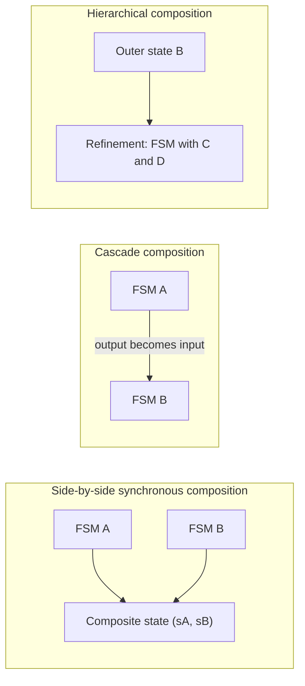

# Composition of State Machines

Real embedded systems are too large to model as one flat state machine. A useful model is assembled from smaller machines: one for a traffic light, one for a pedestrian button, one for a door latch, one for an interrupt controller, and so on. Composition gives rules for how these machines react together and how their ports or variables communicate.

Lee and Seshia emphasize that the hard part is not the drawing style. The hard part is semantics. Two diagrams that look almost identical can mean different things depending on whether reactions are synchronous, asynchronous, interleaved, scheduled, cascaded, or hierarchical. Those choices affect determinism, missed events, deadlock possibilities, and whether a composed model can be analyzed modularly.

## Definitions

**Side-by-side composition** combines machines without direct port communication. The composite actor exposes the union of their input and output ports.

**Synchronous composition** means the component machines react together in the same logical reaction. Conceptually, the reaction is simultaneous and instantaneous. If two deterministic machines are synchronously composed side by side, determinism is preserved.

**Asynchronous composition** means component machines react independently. One common semantics is interleaving: one component reacts at a time, chosen nondeterministically or by a scheduler.

**Shared variables** are variables accessed by more than one machine. They create subtle semantics questions: if two machines react at the same logical time, which write happens first, and which value does a read see?

**Cascade composition** connects an output of one machine to an input of another. In synchronous cascade composition, the upstream machine's output is visible to the downstream machine in the same logical reaction.

**Feedback** occurs when interconnections create directed cycles. Feedback requires a rule for resolving simultaneous dependencies; later models of computation, especially synchronous-reactive semantics, address this systematically.

**Hierarchical state machines** allow a state to contain a refinement that is another state machine. Being in the outer state means being in one of the inner states. History transitions remember which inner state was active when the outer state was last exited.

## Key results

Synchronous side-by-side composition of finite-state machines forms another FSM. If machine $A$ has state set $S_A$ and machine $B$ has state set $S_B$, then the composite state set is the Cartesian product:

$$
S_C = S_A \times S_B.
$$

If $A$ and $B$ are deterministic and have disjoint ports and variables, the synchronous composition is deterministic. This is a compositional property: the property holds for the composition because it holds for the components.

Asynchronous interleaving composition can introduce nondeterminism even when the components are deterministic. The nondeterministic choice is which component reacts. Inputs can be missed if an event destined for one component appears during a reaction where another component is selected.

Shared variables undermine simple modular reasoning. In an interleaving semantics, variable updates can be treated as atomic if exactly one component reacts at a time. In a synchronous semantics, simultaneous reads and writes need a more precise rule.

Cascade composition gives a logical dependency order without elapsed time. If $A$ feeds $B$, then in a synchronous reaction $A$'s output can affect $B$ immediately. This is useful but can become circular in feedback networks.

Hierarchical state machines reduce diagram size but do not remove semantic obligations. A depth-first reaction rule, for example, says the deepest active refinement reacts first, then its container, and so on. Other Statecharts variants choose different rules.

Composition is where small modeling choices become large behavioral differences. With synchronous side-by-side composition, two components observe the same logical instant. With asynchronous interleaving, one component may react while the other does not. With scheduled asynchronous composition, the environment or scheduler has a visible role in choosing which component moves. These are not equivalent interpretations of the same drawing; they are different models.

The Cartesian-product state space is the price of modularity. If each component is understandable on its own, their product may still be too large to draw or inspect manually. This is why composition and verification are tightly connected. A designer uses composition to write the model, then uses reachability, abstraction, or refinement to reason about the composite without flattening everything by hand.

Communication through ports is usually preferable to communication through shared variables when the semantics can support it. Ports make dependencies explicit in the diagram, while shared variables hide communication in expressions inside guards and actions. Hidden communication is harder to schedule, harder to review, and harder to verify. When shared variables are unavoidable, the model should say whether reads and writes are atomic, ordered, prioritized, or simultaneous.

Hierarchy should not be treated as just a drawing convenience. Entering a refined state may initialize the inner machine, resume it from history, or choose a default substate depending on the semantics. Exiting an outer state may abort the inner reaction or allow it to finish first. These choices affect outputs and state updates. A clear hierarchy semantics lets a designer reason locally about a submachine while still knowing how it interacts with its container.

Feedback composition is the point where this chapter hands off to models of computation. If $A$'s output feeds $B$ and $B$'s output feeds $A$, then an instantaneous synchronous reaction needs a causality rule. Some models reject ambiguous feedback, some insert delays, and some search for fixed points. The correct choice depends on what the diagram is intended to mean physically or logically.

For documentation, each composite model should state its composition semantics near the diagram. A reader should not have to infer whether reactions are synchronous, whether events can be missed, whether shared variables are atomic, or whether history states resume. Those details are part of the model, not implementation trivia.

## Visual



| Composition style | Reaction rule | Main benefit | Main risk |
|---|---|---|---|
| Synchronous side-by-side | Components react together | Determinism can be preserved | Shared variables need precise semantics |
| Asynchronous interleaving | One component reacts at a time | Models independent progress | Missed inputs and nondeterminism |
| Cascade | Upstream output feeds downstream input | Clear data dependency | Feedback creates causality questions |
| Hierarchical | State contains a submachine | Compact control structure | Variant semantics differ subtly |

## Worked example 1: Product state space and reachability

Problem: Machine $A$ has states $\{a_0,a_1\}$ and toggles on every synchronous reaction. Machine $B$ has states $\{b_0,b_1,b_2\}$ and advances one step modulo $3$ on every synchronous reaction. The initial state is $(a_0,b_0)$. Find the product-state size and the first six composite states.

Method:

1. The product state set is

$$
S_C=S_A\times S_B.
$$

2. Its size is

$$
|S_C|=|S_A||S_B|=2\cdot 3=6.
$$

3. Enumerate reactions. At each step, $A$ toggles and $B$ advances:

$$
(a_0,b_0)
\to (a_1,b_1)
\to (a_0,b_2)
\to (a_1,b_0)
\to (a_0,b_1)
\to (a_1,b_2)
\to (a_0,b_0).
$$

4. Check: after six reactions, the machine returns to the initial state because the period is $\mathrm{lcm}(2,3)=6$.

Answer: The product has $6$ states, and all $6$ are reachable in this example.

## Worked example 2: Asynchronous interleaving creates nondeterminism

Problem: Two deterministic machines are composed asynchronously with interleaving semantics. $A$ toggles output $a$ between absent and present on its own reactions. $B$ toggles output $b$ between absent and present on its own reactions. Initially both outputs would be absent if their machines react. List the possible first composite outputs.

Method:

1. In interleaving semantics, the composite reaction chooses either $A$ or $B$ to react.

2. Case 1: $A$ reacts first. $A$ toggles and produces $a=\mathrm{present}$. $B$ does not react, so $b$ is absent in the composite reaction.

$$
(a,b)=(\mathrm{present},\mathrm{absent}).
$$

3. Case 2: $B$ reacts first. $B$ toggles and produces $b=\mathrm{present}$. $A$ does not react, so $a$ is absent.

$$
(a,b)=(\mathrm{absent},\mathrm{present}).
$$

4. Since both cases are allowed and the model does not specify which component reacts, the composite has two possible outputs for the same initial condition.

Answer: The possible first outputs are $(present, absent)$ and $(absent, present)$. Deterministic components have produced a nondeterministic composition.

## Code

```python
from itertools import product

def synchronous_product_trace(steps=7):
    a_states = ["a0", "a1"]
    b_states = ["b0", "b1", "b2"]
    ai, bi = 0, 0
    trace = []
    for _ in range(steps):
        trace.append((a_states[ai], b_states[bi]))
        ai = (ai + 1) % len(a_states)
        bi = (bi + 1) % len(b_states)
    return trace

all_states = list(product(["a0", "a1"], ["b0", "b1", "b2"]))
print("product size:", len(all_states))
print("trace:", synchronous_product_trace())
```

## Common pitfalls

- Assuming "parallel" has a single meaning. Synchronous, asynchronous, interleaved, time-triggered, and threaded models are different.
- Forgetting that a product state space grows multiplicatively.
- Using shared variables without specifying read/write ordering and atomicity.
- Treating a cascade feedback cycle as if one component obviously reacts first. In a zero-time logical model, feedback needs explicit semantics.
- Drawing hierarchical states without deciding whether inner or outer transitions have priority.

## Connections

- [discrete dynamics](/cs/embedded/discrete-dynamics)
- [concurrent models of computation](/cs/embedded/concurrent-models-of-computation)
- [process synchronization](/cs/operating-systems/process-synchronization)
- [finite automata and DFAs](/cs/theory/finite-automata-and-dfas)
- [multitasking and threads](/cs/embedded/multitasking-and-threads)
