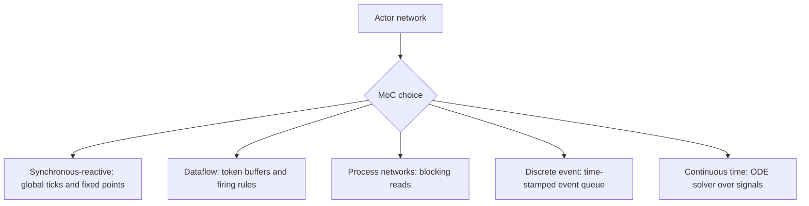

# Concurrent Models of Computation

A model of computation gives the rules for how actors execute and communicate. This is more than an implementation detail. In embedded systems, a drawing with boxes and wires can mean many different things: simultaneous reactions at logical clock ticks, asynchronous token flow through buffers, rendezvous between processes, time-stamped events, or continuous-time signal equations solved by a numerical integrator.

Lee and Seshia use this topic to organize concurrency at a level above raw threads and interrupts. The same actor may be a state machine, a program, or a hardware block, but the surrounding model of computation determines when it runs, what it sees at its input ports, how it produces outputs, and whether the whole network is deterministic.

## Definitions

An **actor** is a component with ports and execution actions. The actor's internal definition may be an FSM, a C program, a hardware module, or another composite model.

A **model of computation** (MoC) defines three things: what counts as a component, how concurrent execution is coordinated, and how communication occurs.

A **signal** is the communication object carried between actors. In dataflow models, a signal is a sequence of tokens. In synchronous-reactive models, a signal is a sequence of present/absent values at global ticks. In discrete-event models, a signal is a set or sequence of time-stamped events.

A **fixed point** of a function $F:X\to X$ is an element $x$ such that

$$
F(x)=x.
$$

Feedback actor networks can often be interpreted as fixed-point equations because wires require that an actor's output and the connected input have the same value.

A **synchronous-reactive** model executes in global logical ticks. At every tick, all actors conceptually react simultaneously and instantaneously. Feedback is accepted only when the tick has a unique well-defined signal valuation.

A **dataflow** model executes actors when required input tokens are available. Actors consume tokens, produce tokens, and communicate through buffers.

A **synchronous dataflow** (SDF) model is a dataflow model where every actor consumes and produces a fixed number of tokens on every firing. A **dynamic dataflow** model allows firing rules and production/consumption rates to depend on data.

A **process network** runs each actor as a process. In Kahn process networks, reads block when data is absent and writes do not block, which can preserve determinacy under suitable conditions.

## Key results

Every actor network can be viewed abstractly as a feedback system. If all actors are determinate functions on signals, then the network semantics can be expressed as equations over those signals. A solution to the equations is a fixed point.

Synchronous-reactive feedback is well-formed only when the fixed point is unique and can be found constructively. A feedback wire from output to input means the two values are equal at the same tick. If choosing present makes the output absent and choosing absent makes the output present, there is no fixed point. If both present and absent work, there is more than one fixed point.

Dataflow trades tight synchrony for buffered communication. If actor $A$ produces faster than actor $B$ consumes, a buffer can grow without bound unless the graph is scheduled carefully. SDF makes bounded scheduling analyzable by using balance equations. If actor $A$ fires $q_A$ times and actor $B$ fires $q_B$ times over a repeated schedule, then a connection must satisfy a production/consumption equation such as

$$
p_A q_A = c_B q_B.
$$

Delay or initial tokens are often needed in feedback loops. A dataflow cycle with no initial tokens may deadlock because every actor waits for tokens that no actor can produce.

Timed MoCs add explicit physical or logical time. Time-triggered models use global ticks but allow logical execution time; discrete-event models use time stamps and an event queue; continuous-time models use actor interconnections interpreted by a numerical solver.

The practical reason for separating MoCs is that each one offers different guarantees. Synchronous-reactive models make simultaneity explicit and can preserve determinism, but they require solving the same-tick causality problem. SDF restricts actors enough to make static scheduling and buffer analysis possible, but the restriction rules out many data-dependent behaviors. Dynamic dataflow recovers expressiveness, but boundedness and deadlock questions become undecidable in general. Process networks support natural streaming programs, but unbounded FIFOs can quietly become a resource problem.

These tradeoffs matter when moving from a model to an implementation. A dataflow model may compile to threads, but the correctness argument should come from the dataflow semantics, not from accidental properties of a thread scheduler. A synchronous model may run on an ordinary processor, but the generated code must behave as if actors reacted simultaneously at a tick. A continuous-time model may be simulated on a digital computer, but the solver is part of the semantics seen by the execution.

Heterogeneous models are common in CPS. A controller may use synchronous logic for modes, dataflow for signal processing, continuous time for the plant, and discrete events for a communication network. The difficult question is not whether each model is useful by itself, but how time and communication pass across boundaries. If a sampled sensor converts a continuous signal into tokens, the sampling model is the bridge. If a controller output becomes a zero-order-held actuator command, that hold behavior is the bridge.

A good MoC choice reduces the number of behaviors the designer must consider. Raw threads expose many scheduler interleavings. SDF exposes token schedules constrained by balance equations. SR exposes logical ticks and fixed points. The best model is not necessarily the most expressive one; it is the one expressive enough for the problem while retaining useful guarantees.

## Visual



| MoC | Communication | Execution trigger | Strength | Main hazard |
|---|---|---|---|---|
| Synchronous-reactive | Present/absent values at ticks | Global logical tick | Determinate composition when constructive | Ill-formed feedback |
| SDF | Fixed-rate token streams | Firing rule satisfied | Static schedules and bounded-buffer reasoning | Low expressiveness |
| Dynamic dataflow | Data-dependent token streams | Data-dependent firing rules | Conditional routing and flexibility | Deadlock/boundedness undecidable in general |
| Process network | FIFO streams | Process program and blocking read | Determinate concurrency under restrictions | Buffer growth |
| Discrete event | Time-stamped events | Earliest event in queue | Natural simulation of event timing | Simultaneous-event semantics |

## Worked example 1: SDF balance equation

Problem: Actor $A$ produces $3$ tokens per firing. Actor $B$ consumes $2$ tokens per firing. They are connected by one FIFO channel. Find the smallest positive repeated schedule counts $q_A$ and $q_B$ that return the buffer to its initial size.

Method:

1. Production over one schedule iteration is

$$
3q_A.
$$

2. Consumption over one schedule iteration is

$$
2q_B.
$$

3. A periodic bounded schedule must balance production and consumption:

$$
3q_A = 2q_B.
$$

4. Find the smallest positive integer solution. Since $3$ and $2$ are relatively prime, choose

$$
q_A=2,\qquad q_B=3.
$$

5. Check:

$$
3(2)=6,\qquad 2(3)=6.
$$

Answer: The repetition vector is $(q_A,q_B)=(2,3)$. A valid repeated schedule must fire $A$ twice and $B$ three times, in an order that never underflows the buffer.

## Worked example 2: SR fixed-point feedback

Problem: A synchronous-reactive actor has one input $x$ and one output $y$, connected by feedback so $x=y$. In state $s_0$, its firing rule is $y=\neg x$, where present is represented by true and absent by false. Decide whether the feedback model has a fixed point at this tick.

Method:

1. Feedback requires

$$
x=y.
$$

2. Actor behavior requires

$$
y=\neg x.
$$

3. Substitute $y=x$ into the actor behavior:

$$
x=\neg x.
$$

4. Test both Boolean values:

   - If $x=false$, then $\neg x=true$, so $x=\neg x$ is false.
   - If $x=true$, then $\neg x=false$, so $x=\neg x$ is false.

5. No value satisfies the equations.

Answer: The model has no fixed point in this state, so the synchronous feedback is ill formed.

## Code

```python
from collections import deque

def sdf_schedule(produce_a=3, consume_b=2, q_a=2, q_b=3):
    """Try a simple A,A,B,B,B schedule and track a FIFO size."""
    fifo = 0
    actions = ["A"] * q_a + ["B"] * q_b
    history = []
    for action in actions:
        if action == "A":
            fifo += produce_a
        else:
            if fifo < consume_b:
                raise RuntimeError("buffer underflow")
            fifo -= consume_b
        history.append((action, fifo))
    return history

for action, size in sdf_schedule():
    print(action, "fifo_size=", size)
```

## Common pitfalls

- Believing a box-and-wire diagram has one obvious meaning. The MoC supplies the meaning.
- Ignoring fixed-point issues in zero-time feedback. SR feedback must have a unique constructive valuation at each tick.
- Using dynamic dataflow because it is expressive, then assuming SDF-style bounded-buffer guarantees still hold.
- Forgetting initial tokens in dataflow feedback loops. Without them, every actor in the loop may wait forever.
- Treating model time and physical time as interchangeable. SR ticks may be ordered without specifying elapsed physical time.

## Connections

- [composition of state machines](/cs/embedded/composition-of-state-machines)
- [process synchronization](/cs/operating-systems/process-synchronization)
- [Turing machines and Church-Turing thesis](/cs/theory/turing-machines-and-the-church-turing-thesis)
- [continuous dynamics](/cs/embedded/continuous-dynamics)
- [multitasking and threads](/cs/embedded/multitasking-and-threads)
