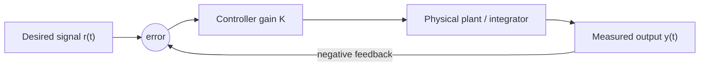

# Continuous Dynamics

Continuous dynamics is the part of embedded-systems modeling where variables evolve over real time rather than only at discrete program steps. In the cyber-physical view, a controller is not merely a program that transforms inputs into outputs. It is a participant in a feedback loop with a plant whose position, velocity, current, pressure, temperature, or concentration is changing continuously while the processor is computing.

Lee and Seshia use this topic to connect classical engineering models, especially ordinary differential equations, with actor models used in tools such as Simulink and LabVIEW. The key lesson is not that every physical process is perfectly smooth. It is that smooth models are often the right first abstraction, and that their assumptions must be made explicit before they are composed with software, sensors, actuators, and schedulers.

## Definitions

A **continuous-time signal** is a function whose domain is time, commonly $x : \mathbb{R} \to \mathbb{R}$ or $x : \mathbb{R}_{\ge 0} \to \mathbb{R}$. A scalar signal might represent angular velocity; a vector-valued signal might represent three-dimensional position.

A **continuous-time system** maps input signals to output signals. If $X$ and $Y$ are sets of signals, then a system can be written as

$$
S : X \to Y.
$$

An **actor** is a component with input ports and output ports. In continuous dynamics, the values at those ports are whole signals. Actor notation is useful because a differential-equation model can be composed from smaller blocks such as gains, adders, and integrators.

An **integrator** with input $x$, output $y$, and initial value $y(0)$ is described by

$$
y(t) = y(0) + \int_0^t x(\tau)\,d\tau.
$$

A system is **causal** if its output up to time $t$ depends only on the input up to time $t$. It is **strictly causal** if its output at time $t$ depends only on input before $t$. Strict causality is important in feedback loops because an instantaneous algebraic dependence around a directed cycle can make the model ill-defined.

A system is **linear** when it satisfies superposition:

$$
S(a x_1 + b x_2) = aS(x_1) + bS(x_2).
$$

A system is **time invariant** when delaying the input delays the output by the same amount. A system that is both linear and time invariant is called **LTI**. A system is **bounded-input bounded-output stable** if every bounded input produces a bounded output.

## Key results

Newton's laws lead naturally to differential equations. For a rotating body, torque is related to angular acceleration:

$$
T_y(t) = I_{yy}\dot{\omega}(t),
$$

where $I_{yy}$ is the moment of inertia and $\omega$ is angular velocity. Solving for $\omega$ gives the integral form

$$
\omega(t) = \omega(0) + \frac{1}{I_{yy}}\int_0^t T_y(\tau)\,d\tau.
$$

This formula is already an actor composition: scale the torque by $1/I_{yy}$, then integrate.

An integrator without feedback is not BIBO stable. If the input is the unit step $u(t)$, then

$$
\omega(t) = \omega(0) + \frac{1}{I_{yy}}\int_0^t 1\,d\tau
= \omega(0) + \frac{t}{I_{yy}},
$$

which grows without bound even though $u(t)$ is bounded.

Feedback can stabilize an otherwise unstable plant. With proportional control

$$
T_y(t) = K(r(t) - \omega(t)),
$$

and reference $r(t)=0$, the closed-loop equation becomes

$$
\omega(t) = \omega(0) - \frac{K}{I_{yy}}\int_0^t \omega(\tau)\,d\tau.
$$

Differentiating both sides yields

$$
\dot{\omega}(t) = -\frac{K}{I_{yy}}\omega(t),
$$

whose solution is

$$
\omega(t) = \omega(0)e^{-Kt/I_{yy}}.
$$

Thus positive gain $K$ makes the angular velocity decay toward zero; negative gain makes it diverge.

The important engineering move is to keep track of what the continuous model promises and what it omits. A smooth ODE model may omit quantization, communication jitter, actuator saturation, sensor noise, numerical solver error, and computational delay. Those omissions may be acceptable in a first model, but they must not disappear from the design argument. For example, a proportional controller that is stable in continuous time may become oscillatory if it is sampled too slowly, and a gain $K$ that looks attractive in the equation may demand actuator torques that the physical hardware cannot deliver.

Actor models help because they expose composition boundaries. A plant actor can be connected to a sensor actor, a controller actor, and an actuator actor. Each actor can have a different mathematical character: an integrator is stateful and strictly causal, a gain is memoryless and causal, a sensor may be affine with noise and sampling, and a controller may be implemented by discrete software. The whole closed-loop behavior emerges from the interconnection, not from any one component alone.

When possible, engineers prefer LTI approximations because they support a mature analysis toolkit: impulse responses, convolution, frequency response, poles, transfer functions, and Laplace transforms. Lee and Seshia do not turn this chapter into a full control course; instead, they use the LTI idea to show why simplifying assumptions can be valuable. A model that is slightly less physically detailed but linear, time invariant, and stable may be much more useful for early design than a highly detailed model that nobody can analyze.

The model should also record units. A gain that converts radians per second of error into newton-meters of torque has physical dimensions, and unit mistakes can survive code review if every quantity is stored as a plain number.

## Visual



| Property | Meaning | Why it matters in CPS |
|---|---|---|
| Causal | Output uses only present/past input | A real controller cannot depend on future measurements |
| Strictly causal | Output at $t$ uses input before $t$ | Helps make feedback cycles well-defined |
| Linear | Superposition holds | Enables algebraic and transform-based reasoning |
| Time invariant | Delay in input gives delay in output | Same model applies regardless of start time |
| BIBO stable | Bounded input gives bounded output | Prevents physically dangerous unbounded response |

## Worked example 1: Torque step without feedback

Problem: A simplified rotor has $I_{yy}=2\,\mathrm{kg\,m^2}$ and initial angular velocity $\omega(0)=0$. At $t=0$, a constant torque $T_y(t)=4u(t)$ is applied. Find $\omega(t)$ for $t \ge 0$ and decide whether the system is BIBO stable.

Method:

1. Start from the integral equation:

$$
\omega(t) = \omega(0) + \frac{1}{I_{yy}}\int_0^t T_y(\tau)\,d\tau.
$$

2. Substitute the values:

$$
\omega(t) = 0 + \frac{1}{2}\int_0^t 4\,d\tau.
$$

3. Evaluate the integral:

$$
\int_0^t 4\,d\tau = 4t.
$$

4. Compute the output:

$$
\omega(t) = \frac{1}{2}(4t)=2t.
$$

5. Check boundedness. The input is bounded because $\vert T_y(t)\vert  \le 4$ for all $t \ge 0$. The output is not bounded because $\omega(t)=2t$ grows without limit.

Answer: $\omega(t)=2t$ for $t \ge 0$. The open-loop integrator model is not BIBO stable.

## Worked example 2: Proportional stabilization

Problem: Use proportional feedback on the same rotor with $I_{yy}=2$, $K=6$, reference $r(t)=0$, and initial angular velocity $\omega(0)=10$. Find the response and the time at which the magnitude first drops below $1$.

Method:

1. The closed-loop differential equation is

$$
\dot{\omega}(t) = -\frac{K}{I_{yy}}\omega(t).
$$

2. Substitute $K=6$ and $I_{yy}=2$:

$$
\dot{\omega}(t) = -3\omega(t).
$$

3. Solve the first-order ODE:

$$
\omega(t)=\omega(0)e^{-3t}=10e^{-3t}.
$$

4. Find when $\vert \omega(t)\vert \lt 1$:

$$
10e^{-3t} < 1.
$$

5. Divide by $10$:

$$
e^{-3t}<0.1.
$$

6. Take natural logs:

$$
-3t < \ln(0.1)=-\ln(10).
$$

7. Divide by $-3$, reversing the inequality:

$$
t > \frac{\ln(10)}{3}\approx 0.7675.
$$

Answer: $\omega(t)=10e^{-3t}$, and the angular velocity magnitude falls below $1$ after about $0.768$ seconds. The positive feedback gain has stabilized the integrator.

## Code

```python
import math

def simulate_rotor(Iyy=2.0, K=6.0, omega0=10.0, dt=0.01, steps=120):
    """Forward-Euler simulation of dω/dt = -(K/Iyy)ω."""
    omega = omega0
    values = []
    for k in range(steps + 1):
        t = k * dt
        exact = omega0 * math.exp(-(K / Iyy) * t)
        values.append((t, omega, exact))
        omega += dt * (-(K / Iyy) * omega)
    return values

for t, numerical, exact in simulate_rotor()[::20]:
    print(f"t={t:4.2f}  euler={numerical:8.4f}  exact={exact:8.4f}")
```

## Common pitfalls

- Treating a model as the physical system itself. The equations are abstractions; friction, saturation, sensor delay, and actuator limits may matter in the real system.
- Forgetting initial conditions. An integrator with a nonzero initial value may fail linearity even when its rate equation looks linear.
- Calling every feedback loop stable. The sign and magnitude of the gain matter, and a controller can destabilize a plant.
- Ignoring strict causality in feedback. Algebraic cycles require special semantics or must be redesigned with delay, integration, or another strictly causal element.
- Sampling a continuous controller without checking timing. A continuous-time stability argument does not automatically prove that a sampled software implementation is stable.

## Connections

- [first-order ODEs](/math/engineering-math/first-order-odes)
- [Laplace transform](/math/engineering-math/laplace-transform)
- [signals and systems](/physics/signals-systems/)
- [continuous-time simulation](/physics/simulation/)
- [sensors and actuators](/cs/embedded/sensors-and-actuators)
- [scheduling and real time](/cs/embedded/scheduling-and-real-time)
