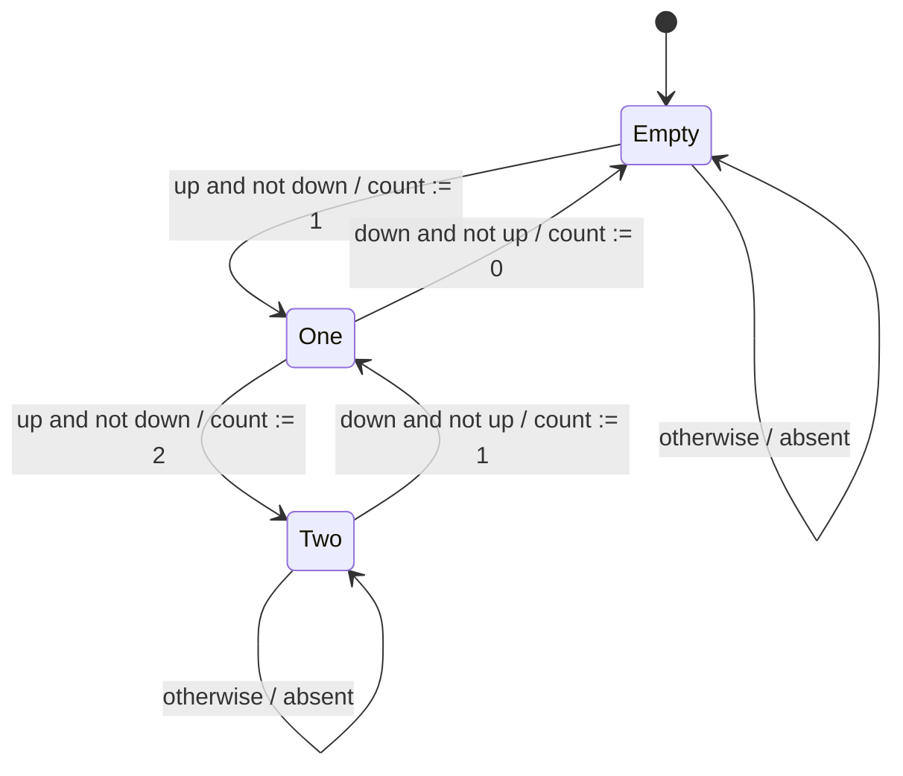

# Discrete Dynamics

Discrete dynamics describes systems whose behavior advances through reactions rather than through smooth motion. A reaction may be triggered by an input event, a clock tick, an interrupt, or the decision of a surrounding model of computation. In embedded systems, discrete models capture controller modes, protocol states, counters, task states, and many parts of software behavior.


*Figure: Arduino boards make microcontroller I/O and prototyping tangible. Image: [Wikimedia Commons](https://commons.wikimedia.org/wiki/File:Arduino_Uno_-_R3.jpg), SparkFun Electronics, CC BY 2.0.*

Lee and Seshia use finite-state machines and extended state machines as the core notation for this topic. These models make informal requirements precise: they say what state is remembered, what inputs are accepted, what outputs are produced, and how the next state is chosen. That precision is what later enables composition, temporal logic, refinement, reachability analysis, and model checking.

## Definitions

A **reaction** is one step of a discrete system. During a reaction, the system observes a valuation of its input ports, produces a valuation of its output ports, and possibly changes state.

An input port has a type $V_p$. At a reaction, the port value is either absent or a member of $V_p$. A **pure signal** has no payload; its meaningful values are just present and absent.

The **state** of a system is the information about the past that can affect present and future behavior. A counter's integer count is state; a thermostat's heating/cooling mode is state.

A **finite-state machine** is a state machine whose set of states is finite. A deterministic FSM can be described by a tuple

$$
(\mathrm{States}, \mathrm{Inputs}, \mathrm{Outputs}, \mathrm{update}, \mathrm{initialState}),
$$

where

$$
\mathrm{update}: \mathrm{States} \times \mathrm{Inputs}
\to \mathrm{States} \times \mathrm{Outputs}.
$$

A **guard** is a Boolean expression on a transition. If it evaluates to true, the transition is enabled. An **action** assigns output values. A **set action** in an extended state machine updates a variable after the guard is evaluated and after output actions are produced.

An **extended state machine** uses variables in addition to control states. If an extended machine has $n$ control states and $m$ variables, each with $p$ possible values, then the explicit state space can be as large as $np^m$.

A **nondeterministic** state machine has more than one possible reaction for some state/input pair, or more than one initial state. It specifies a family of allowed behaviors rather than one function from inputs to outputs.

## Key results

FSM diagrams have mathematical semantics. A graphical transition labeled

$$
\text{guard} / \text{output action}
$$

contributes a case to the update function. If no explicit transition is enabled, the machine stays in the same state and produces absent outputs, unless a default transition is specified.

Determinacy and receptiveness are different properties. A state machine is **deterministic** if at most one transition is enabled for every state/input pair. It is **receptive** if at least one reaction is defined for every state/input pair. A deterministic and receptive FSM has exactly one possible reaction for every state/input pair.

Mealy and Moore machines differ in output timing. A **Mealy machine** produces outputs on transitions, so an output can depend on the current input. A **Moore machine** produces outputs from states, so the output at a reaction depends only on the current state at the start of that reaction. Moore behavior is typically more delayed but often easier to reason about.

Nondeterminism is useful for modeling underspecified environments and specifications. If the exact time of a pedestrian arrival is irrelevant, a nondeterministic environment model can say "a pedestrian may arrive" without assigning probabilities. This is not the same as a stochastic model.

A **behavior** assigns a signal sequence to every port. The set of all behaviors is the machine's **language**. An **observable trace** records input/output valuations over reactions; an **execution trace** also records the state trajectory.

The environment controls when a state machine reacts unless a surrounding model of computation says otherwise. This point is easy to miss because many diagrams look like ordinary flowcharts. A flowchart usually describes a program counter moving from statement to statement. An FSM describes reactions to events or valuations chosen by its environment. The same FSM can therefore be embedded in a time-triggered system, an event-triggered system, a synchronous-reactive composition, or a hybrid system with guards over continuous inputs. The diagram alone does not fully determine timing.

Default behavior is part of the model, not an afterthought. If a transition is absent from a diagram, the semantics in these notes assumes the machine remains in the current state and produces absent outputs, unless a more specific default transition or priority rule is provided. This convention makes the model receptive, meaning it always has a reaction for every input valuation. Receptiveness is useful for formal analysis because a model checker does not have to guess what happens when an unexpected input arrives.

Extended state machines should be used with discipline. They make large diagrams readable, but the variables do not come for free. A single unbounded integer variable can turn an FSM into an infinite-state system, removing many finite-state verification guarantees. A bounded integer variable may still multiply the state space by dozens, hundreds, or millions. The modeling advantage is real, but so is the analysis cost.

## Visual



| Model feature | Basic FSM | Extended state machine | Why the distinction matters |
|---|---|---|---|
| State storage | Control state only | Control state plus variables | Variables compact large diagrams |
| State space | Explicit finite set | May be finite or infinite | Analysis may become harder |
| Transition guard | Inputs and current state | Inputs, state, and variables | More expressive but easier to misuse |
| Output action | Produces port valuation | Can reference variables | Need pre-update values |
| Set action | Not present | Updates variables after output | Ordering affects correctness |

## Worked example 1: Garage counter transition trace

Problem: A garage has capacity $M=2$. The FSM starts in state $0$. The input sequence over four reactions is:

1. $up$ present, $down$ absent
2. $up$ present, $down$ absent
3. $up$ present, $down$ absent
4. $up$ absent, $down$ present

Find the output count sequence and states.

Method:

1. Initial state:

$$
s_0=0.
$$

2. Reaction 0: guard $up \wedge \neg down$ is true, and $s_0 \lt  M$. Move to state $1$ and output $count=1$.

$$
s_1=1,\quad y_0=1.
$$

3. Reaction 1: the same guard is true and $s_1 \lt  M$. Move to state $2$ and output $count=2$.

$$
s_2=2,\quad y_1=2.
$$

4. Reaction 2: $up$ is present, but the garage is already at capacity. No increment transition is allowed. The machine remains in state $2$ and produces no output.

$$
s_3=2,\quad y_2=\mathrm{absent}.
$$

5. Reaction 3: guard $down \wedge \neg up$ is true and $s_3\gt 0$. Move to state $1$ and output $count=1$.

$$
s_4=1,\quad y_3=1.
$$

Answer: The state sequence is $0,1,2,2,1$. The output sequence is $(1,2,\mathrm{absent},1)$. The third arrival is ignored by the capacity guard.

## Worked example 2: Extended-state space size

Problem: A traffic-light controller has four control modes: `red`, `green`, `yellow`, and `pending`. It has one integer variable `count`, which can take values from $0$ through $60$. First compute the raw state-space size. Then suppose that in `yellow`, only count values $0$ through $5$ are reachable, while in the other three modes all $61$ values are reachable. Compute the reachable-state count.

Method:

1. Raw control states:

$$
n=4.
$$

2. Variable values:

$$
p=61.
$$

3. Raw state-space size:

$$
|S| = np = 4\cdot 61 = 244.
$$

4. Reachable count values in non-yellow modes:

$$
3 \cdot 61 = 183.
$$

5. Reachable count values in yellow:

$$
6.
$$

6. Total reachable states:

$$
183 + 6 = 189.
$$

Answer: The raw extended state space has $244$ states, but the reachable part has $189$ states. Reachability can be much smaller than the syntactic state space.

## Code

```python
def garage_counter(inputs, capacity=2):
    state = 0
    trace = []
    for up, down in inputs:
        if up and not down and state < capacity:
            state += 1
            output = state
        elif down and not up and state > 0:
            state -= 1
            output = state
        else:
            output = None
        trace.append({"state_after": state, "count": output})
    return trace

sequence = [(True, False), (True, False), (True, False), (False, True)]
for step, row in enumerate(garage_counter(sequence)):
    print(step, row)
```

## Common pitfalls

- Omitting behavior for "impossible" inputs. Formal models should define what happens even when an arrival occurs at a full garage or a departure occurs at an empty one.
- Confusing nondeterminism with probability. A nondeterministic transition is allowed, not randomly selected with an implied distribution.
- Forgetting that variables are part of the state. A one-bubble extended machine can still have a huge or infinite state space.
- Updating variables before producing outputs when the model semantics says outputs use old values.
- Treating a Moore-machine output as if it were a same-reaction Mealy output.

## Connections

- [finite automata and DFAs](/cs/theory/finite-automata-and-dfas)
- [composition of state machines](/cs/embedded/composition-of-state-machines)
- [hybrid systems](/cs/embedded/hybrid-systems)
- [invariants and temporal logic](/cs/embedded/invariants-and-temporal-logic)
- [reachability and model checking](/cs/embedded/reachability-and-model-checking)
