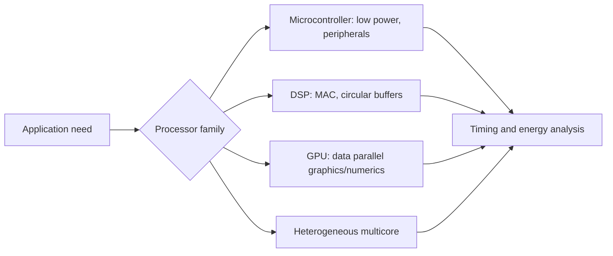

# Embedded Processors Architecture

Embedded processors are chosen under constraints that are different from desktop computing. Performance still matters, but so do timing predictability, energy, cost, memory size, peripheral support, arithmetic format, and how well the processor matches the application. A small microcontroller, a DSP, a GPU, a PLC, and a heterogeneous multicore system are all plausible embedded processors, but they expose very different design tradeoffs.

Lee and Seshia emphasize the distinction between an instruction set architecture and a processor realization. The ISA defines what instructions mean. A chip implements that ISA with pipelines, caches, buses, memories, peripherals, and parallel hardware. Two chips may run the same machine code but have very different timing, which is central in cyber-physical systems.

## Definitions

An **instruction set architecture** (ISA) defines the instructions, registers, data sizes, and programmer-visible behavior of a processor family. A **processor realization** is a particular chip or core implementing an ISA.

A **microcontroller** is a small computer on one integrated circuit, typically including a CPU, memory, timers, interrupt hardware, and I/O peripherals.

A **DSP processor** is specialized for signal-processing workloads such as filtering, modulation, audio, image processing, and control. It often includes multiply-accumulate instructions, circular-buffer addressing, and Harvard-style memory access.

A **GPU** is a processor specialized for highly parallel graphics and numeric workloads. It can be useful in compute-intensive embedded applications but may be unsuitable for strict energy budgets.

**Concurrency** is the logical presence of multiple activities. **Parallelism** is simultaneous execution on distinct hardware resources. A concurrent program can run on one processor; a sequential instruction stream can be executed using parallel hardware.

**Pipelining** overlaps stages of multiple instructions. A classic pipeline might fetch, decode, execute, access memory, and write back. Hazards occur when overlap would change the sequential meaning.

**Instruction-level parallelism** (ILP) executes independent operations in parallel. CISC, subword parallelism, superscalar execution, and VLIW are different approaches.

**Fixed-point arithmetic** represents fractional values using integers with an implied binary point. It is common when floating-point hardware is absent or too costly.

## Key results

ISA compatibility does not imply timing compatibility. A control task that works on one realization of an ISA may miss deadlines on another because pipelines, memory hierarchy, cache behavior, and interrupt latency differ.

DSP workloads often have regular high-rate arithmetic. For an FIR filter with $N$ taps, each output typically requires $N$ multiplications and $N-1$ additions. If samples arrive at rate $R$, the arithmetic demand is approximately

$$
R(2N-1)
$$

operations per second, excluding memory movement and loop overhead.

Pipelines improve throughput but complicate timing. A data hazard occurs when an instruction reads a value that a previous instruction has not yet written. Hardware may insert stalls, use forwarding, or execute out of order. Those mechanisms can make timing less predictable.

VLIW can trade compiler/programmer complexity for timing repeatability. A VLIW instruction explicitly specifies multiple operations in one cycle. The compiler must ensure independence, but the hardware avoids some dynamic scheduling unpredictability.

Heterogeneous multicore architectures can isolate real-time functions. For example, one core may run radio or control tasks while another runs user-interface software. Shared caches and buses can reintroduce interference, so isolation is architectural, not automatic.

Fixed-point arithmetic requires scaling discipline. If two numbers with formats $n.m$ and $p.q$ are multiplied, the full result has format $(n+p).(m+q)$. Shifts and saturation must preserve the intended scale.

Processor choice is therefore a modeling decision as well as a purchasing decision. A simple microcontroller may have limited throughput but a tractable timing story. A high-performance superscalar processor may easily meet average load but make worst-case latency difficult to bound. A DSP may execute the control kernel efficiently but require specialized memory layout and library routines. A heterogeneous multicore system may isolate safety-critical work, unless shared memory, caches, or buses reintroduce interference.

The software toolchain is part of the architecture. An ISA with mature compilers, debuggers, static analyzers, real-time operating-system support, and verified libraries may be a better engineering choice than a faster but poorly supported processor. Conversely, some applications need assembly or intrinsics to access special instructions, circular buffers, saturating arithmetic, or SIMD operations. In those cases, portability and analyzability should be considered explicitly.

Timing predictability often conflicts with peak performance. Branch prediction, speculative execution, caches, and dynamic scheduling are excellent for average throughput, but they make execution time depend on history. Embedded designers must decide whether the application needs a fast average case, a tight worst-case bound, low energy, low cost, or some carefully justified compromise.

Parallelism must be matched to the structure of the workload. A control loop with strong data dependencies may not benefit much from a GPU or wide SIMD unit. A video filter or radar pipeline may benefit enormously because the same operation is applied to many samples or pixels. A communication protocol stack may be dominated by branching, buffering, and I/O interrupts rather than arithmetic. The architecture should be evaluated against the actual task graph, not against a generic benchmark.

Interrupt latency is another architectural concern. A processor with long non-interruptible instructions, disabled interrupts inside repeated instructions, or complex cache miss behavior may have a large worst-case interrupt response even if its average instruction throughput is high. For CPS, the question "how fast can it compute?" is often less important than "what is the longest time before the critical handler begins and completes?"

Energy is tied to architecture as well. A faster processor may finish and sleep, saving energy, or it may burn more power than a simpler controller running continuously. Hardware accelerators can reduce energy for repeated kernels, but only if data movement does not dominate. This is why embedded processor selection is usually a system-level trade study.

Debug visibility is another practical architectural factor. Trace units, cycle counters, performance counters, watchpoints, and deterministic replay can make the difference between a diagnosable timing problem and a field failure that cannot be reproduced. For educational designs this may feel secondary, but for deployed CPS it is part of the assurance story.

## Visual



| Architecture feature | Helps with | Timing consequence |
|---|---|---|
| Simple microcontroller | Control, GPIO, low energy | Often more predictable |
| Deep pipeline | Throughput | Hazards and stalls affect WCET |
| Cache | Average memory speed | Misses make latency variable |
| DSP MAC | Filters and control loops | Fast regular arithmetic |
| Superscalar/out-of-order | General performance | Harder timing analysis |
| VLIW | Parallel operations | More predictable if scheduled statically |
| Multicore | Workload partitioning | Shared resources can interfere |

## Worked example 1: FIR operation rate

Problem: A 32-tap FIR filter processes samples at $1$ MHz. Each output requires $32$ multiplications and $31$ additions. Compute the arithmetic operation rate.

Method:

1. Operations per output:

$$
32+31=63.
$$

2. Outputs per second:

$$
R=1{,}000{,}000.
$$

3. Operations per second:

$$
63R=63{,}000{,}000.
$$

4. Interpret the result. A processor must sustain at least $63$ million arithmetic operations per second, and this ignores memory accesses, loop control, and I/O.

Answer: The filter requires $63$ million arithmetic operations per second before overhead. This explains why DSP processors include multiply-accumulate and circular-buffer support.

## Worked example 2: Fixed-point multiplication scale

Problem: Represent values in signed Q1.15 format, meaning one sign/integer bit and $15$ fractional bits. The real value $0.5$ is represented by integer $0.5\cdot 2^{15}=16384$. Multiply $0.5$ by $0.5$ and recover the Q1.15 result.

Method:

1. Integer encodings:

$$
a=b=16384.
$$

2. Full integer product:

$$
ab=16384^2=268{,}435{,}456.
$$

3. The product has twice as many fractional bits, Q2.30. To return to Q1.15, shift right by $15$:

$$
\frac{268{,}435{,}456}{2^{15}}=8192.
$$

4. Interpret $8192$ as Q1.15:

$$
\frac{8192}{2^{15}}=0.25.
$$

Answer: The fixed-point product is integer $8192$, representing $0.25$. Without the scaling shift, the integer product would not be in the original format.

## Code

```python
def q15(value):
    return int(round(value * (1 << 15)))

def from_q15(raw):
    return raw / float(1 << 15)

def q15_mul(a_raw, b_raw):
    product = a_raw * b_raw
    return product >> 15

a = q15(0.5)
b = q15(0.5)
result = q15_mul(a, b)
print(a, b, result, from_q15(result))
```

## Common pitfalls

- Selecting a processor by clock rate alone. Memory hierarchy, peripherals, arithmetic support, and timing predictability may dominate.
- Assuming same ISA means same real-time behavior. The ISA usually says little about timing.
- Ignoring memory bandwidth in DSP calculations. Arithmetic units are useless if data cannot be fed fast enough.
- Using floating point in C on a processor without floating-point hardware and then missing timing constraints.
- Trusting out-of-order or superscalar execution in hard real-time code without a timing-analysis strategy.
- Assuming multicore automatically isolates tasks. Shared cache, memory, and bus resources can couple timing.

## Connections

- [microprocessor and microcomputer basics](/cs/embedded/microprocessor-microcomputer-basics)
- [Intel 8085 architecture, buses, and timing](/cs/embedded/intel-8085-architecture-buses-timing)
- [8051 architecture, memory, and ports](/cs/embedded/8051-architecture-memory-ports)
- [memory architectures](/cs/embedded/memory-architectures)
- [quantitative analysis](/cs/embedded/quantitative-analysis)
