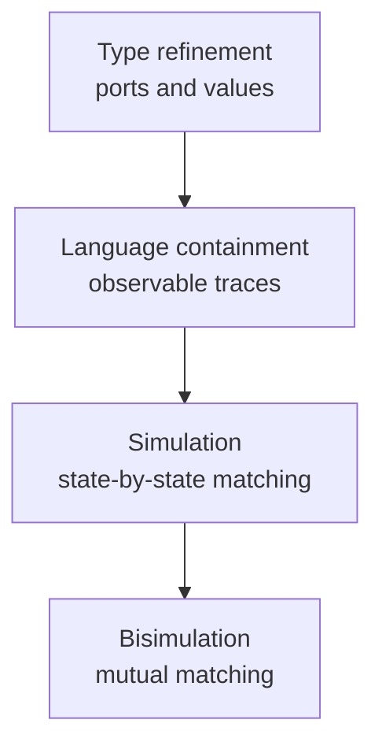

# Equivalence and Refinement

Equivalence and refinement answer a practical engineering question: when can one model safely replace another? In embedded-system design, an abstract model may be a specification, a detailed model may be an implementation, and an optimized model may be a later redesign. We need precise ways to say whether the new model preserves the behaviors that matter.

Lee and Seshia present a ladder of increasingly strong comparisons: type refinement, language containment, simulation, and bisimulation. Each level cares about more information. Type refinement checks ports and data types. Language containment checks observable input/output behaviors. Simulation checks step-by-step state correspondence. Bisimulation checks mutual step-by-step indistinguishability, especially important for nondeterministic machines.

## Definitions

A **specification model** describes allowed behavior. It may be more abstract and more nondeterministic than an implementation.

A **refinement** is a model with behavior that is more detailed or more constrained than an abstraction. If $B$ refines $A$, then $A$ is an abstraction of $B$.

**Type refinement** checks whether one actor can be substituted for another without port/type mismatch. If $B$ replaces $A$, then $B$ must accept all inputs the environment might send to $A$, and $B$ must produce outputs acceptable where $A$'s outputs were expected.

Two machines are **type equivalent** when their input/output ports and corresponding types are the same.

The **language** $L(M)$ of a state machine $M$ is the set of all its behaviors, where a behavior assigns a signal sequence to every port.

**Language equivalence** means

$$
L(A)=L(B).
$$

**Language containment** means

$$
L(A)\subseteq L(B).
$$

If $L(A)\subseteq L(B)$, then $A$ is a language refinement of $B$ because $A$ allows no behavior outside the specification $B$.

A **simulation relation** connects states of two machines so that one machine can match every move of the other. If $M_1$ simulates $M_2$, then every step of $M_2$ can be matched by $M_1$ while preserving the relation.

**Bisimulation** is mutual simulation in a stronger game where either machine may move first at each round.

## Key results

Type refinement is necessary but weak. It prevents plugging an actor into an incompatible environment, but it says nothing about the sequence of outputs or internal states.

Language containment is stronger and supports many temporal properties over inputs and outputs. If every behavior of an implementation is allowed by a specification, then any LTL property over observable ports that holds for the specification also holds for the implementation.

Language equivalence may still be too weak for nondeterministic machines. Two nondeterministic machines can have the same set of complete traces but differ in the choices available after a particular prefix. In an interacting environment, that difference can be observable.

Simulation handles online matching. The simulating machine must match each move without knowing future inputs or future nondeterministic choices. Simulation is transitive: if $M_1$ simulates $M_2$ and $M_2$ simulates $M_3$, then $M_1$ simulates $M_3$.

Bisimulation is the strongest equivalence in this set. It ensures that either machine can match the other's moves at each step. For deterministic machines, language equivalence and simulation relationships often collapse, but for nondeterministic machines they remain distinct.

Useful abstractions are commonly sound but not complete. A sound abstraction proves properties of the detailed refinement. A complete abstraction would reflect every property of the refinement, but such an abstraction is usually not much simpler.

The direction of refinement is the common source of mistakes. A specification usually permits a set of acceptable behaviors. An implementation should choose from within that set, not add behaviors outside it. Therefore the implementation language is contained in the specification language. This feels backwards if one thinks of a "more detailed" implementation as larger, but behaviorally it is often smaller because design choices have resolved nondeterminism.

Nondeterminism is the reason simulation matters. Suppose a specification says a device may respond with either `ok` or `retry`, and later behavior depends on that choice. A candidate implementation cannot merely have the same complete set of possible transcripts if it makes early choices that prevent it from matching the specification under future inputs. Simulation forces the match to be maintained online after every prefix. That is closer to how a real environment interacts with a device.

State names themselves are not the point of simulation relations. A relation may pair one abstract state with many concrete states, or many abstract states with one concrete state, depending on what information is hidden. The relation records the proof obligation: whenever the concrete system moves, the abstract system can move in a way that preserves the externally relevant behavior and lands in related states.

Refinement is also a communication tool between design stages. A requirements model may say that a traffic controller cycles safely. A design model may add timers and pedestrian requests. An implementation model may add variables, interrupts, and driver acknowledgements. Each step should be justified by a refinement argument appropriate to the level of detail. A type argument may be enough for replacing one sensor driver with another compatible driver; a simulation or language-containment argument is needed when behavior changes.

Equivalence should be used sparingly. Engineers often do not need a new model to be exactly equivalent to an old one; they need it to preserve required properties while improving cost, timing, energy, or functionality. Refinement captures that asymmetry better than equivalence. Bisimulation is valuable when two components are meant to be indistinguishable in all environments, but many implementation steps intentionally remove choices that the specification left open.

The proof obligation should match the risk. For a private helper function, tests and type checks may be enough. For a safety-critical mode controller, a language-containment or simulation argument may be justified. For a reusable protocol component that interacts with arbitrary environments, bisimulation or a similarly strong equivalence may be worth the cost.

## Visual



| Relation | Compares | Good for | Too weak for |
|---|---|---|---|
| Type refinement | Ports and value sets | Interface compatibility | Behavioral correctness |
| Language containment | Input/output behaviors | Trace/spec conformance | Some nondeterministic interaction |
| Simulation | State trajectories plus outputs | Stepwise implementation checking | Full mutual substitutability |
| Bisimulation | Mutual simulations | Observational equivalence | Intentional implementation refinement |

## Worked example 1: Type refinement check

Problem: Specification actor $A$ has one input `cmd` of type $\{stop,start\}$ and one output `speed` of type $\{0,1,2\}$. Implementation actor $B$ has input `cmd` of type $\{stop,start,pause\}$ and output `speed` of type $\{0,1\}$. Can $B$ type-refine $A$?

Method:

1. For replacing $A$ with $B$, every input accepted by $A$ must be accepted by $B$:

$$
\{stop,start\}\subseteq \{stop,start,pause\}.
$$

   This holds.

2. Every output produced by $B$ must be acceptable where $A$'s output was expected:

$$
\{0,1\}\subseteq \{0,1,2\}.
$$

   This holds.

3. The port names match: both have input `cmd` and output `speed`.

4. Since input contravariance and output covariance both hold, the interface is safe.

Answer: Yes. $B$ is a type refinement of $A$. The extra accepted input does not hurt, and the narrower output range is acceptable to an environment prepared for $A$.

## Worked example 2: Language containment for a traffic light

Problem: Specification $S$ permits any finite or infinite sequence of light outputs that cycles in the order green, yellow, red, green, and so on, with possible stuttering between changes. Implementation $I$ produces exactly green for 60 ticks, yellow for 5 ticks, red for 55 ticks, then repeats. Does $I$ language-refine $S$ with respect to light outputs?

Method:

1. Identify what $S$ forbids: direct green-to-red, yellow-to-green, or red-to-yellow transitions.

2. Identify the sequence produced by $I$:

$$
G^{60}Y^5R^{55}G^{60}Y^5R^{55}\cdots
$$

3. Check adjacent phase changes:

   - $G\to Y$ is allowed.
   - $Y\to R$ is allowed.
   - $R\to G$ is allowed.

4. Stuttering within the same light color is allowed by the specification.

5. Therefore every behavior of $I$ is in $S$'s language:

$$
L(I)\subseteq L(S).
$$

Answer: Yes. The timed implementation is a language refinement of the abstract ordering specification for the observable light outputs.

## Code

```python
def allowed_cycle(sequence):
    order = {"G": "Y", "Y": "R", "R": "G"}
    previous = sequence[0]
    for current in sequence[1:]:
        if current == previous:
            continue
        if order[previous] != current:
            return False
        previous = current
    return True

impl = "G" * 60 + "Y" * 5 + "R" * 55 + "G" * 10
bad = "GGGRR"
print(allowed_cycle(impl))
print(allowed_cycle(bad))
```

## Common pitfalls

- Confusing "more detailed" with "refinement." A detailed model that admits forbidden behavior is not a valid refinement.
- Checking only port names and ignoring type variance. Replacement has direction.
- Assuming language equivalence guarantees identical nondeterministic interaction.
- Referring to internal states in an LTL formula and then using only language containment over external ports.
- Forgetting that simulation relations are not necessarily unique.
- Using bisimulation when ordinary refinement is intended; implementations often deliberately remove nondeterminism.

## Connections

- [discrete dynamics](/cs/embedded/discrete-dynamics)
- [invariants and temporal logic](/cs/embedded/invariants-and-temporal-logic)
- [reachability and model checking](/cs/embedded/reachability-and-model-checking)
- [finite automata and DFAs](/cs/theory/finite-automata-and-dfas)
- [composition of state machines](/cs/embedded/composition-of-state-machines)
