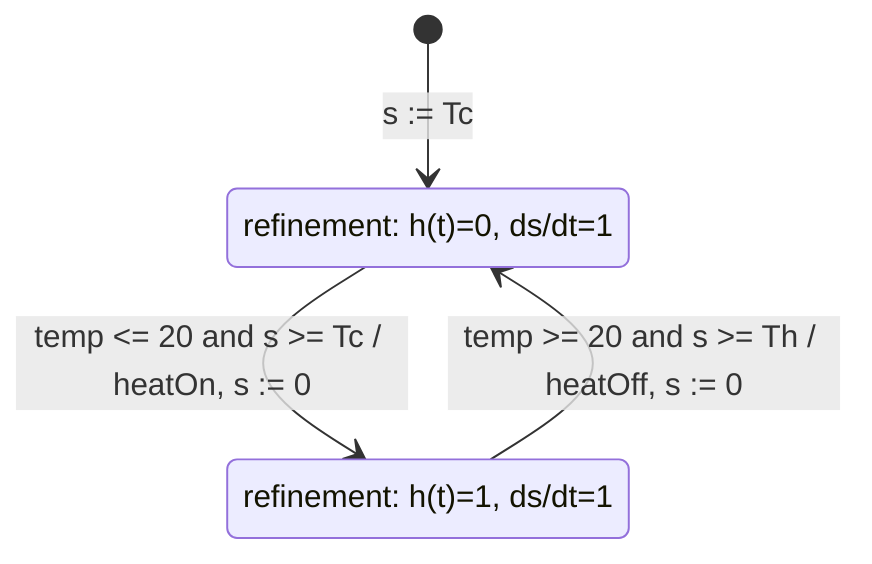

# Hybrid Systems

Hybrid systems combine discrete mode changes with continuous-time dynamics. They are a natural modeling language for cyber-physical systems because physical plants often evolve continuously while embedded software changes their operating mode abruptly. A thermostat switches between heating and cooling; a vehicle switches between left, straight, right, and stop; a bouncing ball follows differential equations between impacts but changes velocity discontinuously at impact.

The main idea is hierarchy. The outer state machine chooses a mode. Each mode is refined by a time-based system, often an ODE or a clock. Transitions between modes are controlled by guards that may mention continuous variables, and transition actions may reset or modify continuous state.

## Definitions

A **hybrid system** is a modal model in which a discrete state machine controls a collection of continuous-time refinements. The control states are commonly called **modes** to avoid confusion with continuous state variables.

A **mode refinement** is the time-based behavior active while the machine is in a particular mode. For example, a thermostat's `heating` mode might define output $h(t)=1$, while its `cooling` mode defines $h(t)=0$. A richer refinement may define ODEs for velocity, temperature, or position.

A **guard** is a predicate that determines when a mode transition may occur. In hybrid systems, guards may depend on continuous inputs and continuous state, such as $\theta(t) \le 20$ or $y(t)=0 \wedge \dot{y}(t)\lt 0$.

A **set action** assigns new values to state variables when a transition is taken. Set actions represent resets, impacts, initialization, and mode-dependent reconfiguration.

A **timed automaton** is a hybrid system whose continuous dynamics are clocks. A clock $s$ has derivative

$$
\dot{s}(t)=a
$$

within a mode, usually with $a=1$, and transitions reset it with assignments such as $s:=0$.

A **Zeno behavior** is an execution with infinitely many discrete transitions in a finite amount of time. Such behavior can occur in idealized hybrid models, for example a bouncing ball with decreasing bounce intervals, even though the physical system eventually stops bouncing.

## Key results

Hybrid models bridge two analysis styles. Discrete-mode logic can be inspected with FSM reasoning, while each refinement can be inspected with time-based analysis. The model is valuable because it keeps both views visible.

Timed automata make time explicit. An extended state machine that "reacts once per second" hides a timing assumption in the environment. A timed automaton instead stores elapsed time in a clock and uses guards such as $s \ge 5$.

Guards and set actions define event timing and reset behavior. If a bouncing ball has height $y(t)$ and velocity $v(t)=\dot{y}(t)$, the free-flight mode is

$$
\dot{y}(t)=v(t),\qquad \dot{v}(t)=-g.
$$

An impact guard can be written

$$
y(t)=0 \wedge v(t)<0,
$$

and the reset action can be

$$
v := -a v
$$

for restitution coefficient $0\lt a\lt 1$.

Supervisory control separates strategic mode choice from low-level control. In the automatic guided vehicle example, the supervisory controller switches among `left`, `right`, `straight`, and `stop`; the low-level controller defines continuous movement in each mode.

Hybrid-system semantics must also say when transitions are taken. One common interpretation is urgent transition semantics: as soon as a guard becomes true, the mode switch occurs. Another interpretation allows time to continue while a guard is true until some scheduler or environment triggers a reaction. The difference can change behavior dramatically. A thermostat that switches immediately at a threshold is different from one sampled every second, and both differ from one whose control task can be delayed by higher-priority work.

Numerical simulation adds another layer. A continuous solver advances time in steps, but guards may become true between solver steps. High-quality hybrid simulation therefore uses event detection to locate threshold crossings more accurately. Without event detection, a bouncing-ball model might pass below the floor before the impact reset is applied, or a controller might notice a safety threshold too late in simulated time.

Hybrid models also make clear where discrete and continuous reasoning meet. A mode invariant such as "the heater output is on only in heating mode" is a state-machine property. A bound such as "temperature never falls below 18 degrees" depends on continuous dynamics, input assumptions, and switching logic. The model is useful precisely because both obligations are visible in one artifact.

The same physical system may admit several hybrid abstractions. A thermostat can be modeled with hysteresis thresholds, with a single threshold and minimum dwell times, or with a detailed thermal plant plus sampled software. A vehicle can be modeled kinematically for path planning or dynamically for stability. The right abstraction is the one that preserves the property being studied while keeping the state space and equations manageable.

Hybrid modeling is also a design communication tool. Control engineers, software engineers, and verification engineers can point to the same modes, guards, and resets while discussing different concerns. That shared structure reduces the chance that a software mode switch, a physical threshold, and a verification assumption refer to subtly different events.

## Visual



| Hybrid-system part | Thermostat example | Bouncing-ball example | AGV example |
|---|---|---|---|
| Modes | heating, cooling | free | stop, left, right, straight |
| Continuous state | elapsed clock $s$ | height $y$, velocity $v$ | position, heading |
| Guard | temperature and minimum time | ground contact | track error thresholds |
| Set action | reset clock | reverse/dampen velocity | initialize or change mode state |
| Output | heater command | position, bump event | vehicle position |

## Worked example 1: Timed thermostat execution

Problem: A thermostat uses one threshold, $20^\circ$C, with minimum cooling time $T_c=3$ minutes and minimum heating time $T_h=2$ minutes. The clock $s$ is reset to $0$ on every mode transition. It starts in `cooling` with $s=3$. The temperature reaches $20^\circ$C after $1$ minute, then while heating reaches $20^\circ$C again after another $1.5$ minutes. Determine mode transitions.

Method:

1. Initial mode is `cooling`; $s=3$ means the minimum cooling condition is already satisfied.

$$
s \ge T_c \quad \text{because}\quad 3\ge 3.
$$

2. At $t=1$, temperature reaches the threshold from above:

$$
\theta(t)\le 20.
$$

3. The cooling-to-heating guard is true because both conditions hold:

$$
\theta(t)\le 20 \wedge s\ge T_c.
$$

4. Take transition to `heating`, output `heatOn`, and reset

$$
s:=0.
$$

5. The temperature reaches the threshold again after $1.5$ minutes of heating, but the heating-to-cooling guard requires $s\ge T_h$.

$$
1.5 < 2.
$$

6. The transition is not allowed yet. The earliest possible transition is after $2$ minutes in heating, provided the temperature condition is satisfied then.

Answer: The thermostat switches to `heating` at $t=1$ minute. It cannot switch back at $t=2.5$ minutes because the minimum heating time has not elapsed; the earliest switch back is at $t=3$ minutes.

## Worked example 2: Bouncing ball reset

Problem: A ball is dropped from height $y(0)=5$ meters with $v(0)=0$, gravity $g=9.8$, and restitution $a=0.8$. Find the impact time and the velocity immediately after impact.

Method:

1. In free flight:

$$
y(t)=5-\frac{1}{2}gt^2=5-4.9t^2.
$$

2. Impact occurs when $y(t)=0$:

$$
5-4.9t^2=0.
$$

3. Solve:

$$
t^2=\frac{5}{4.9}\approx 1.0204,\qquad t\approx 1.0102.
$$

4. Velocity before impact:

$$
v(t)=\dot{y}(t)=-gt=-9.8(1.0102)\approx -9.90.
$$

5. Apply reset action:

$$
v^+ := -a v^- = -0.8(-9.90)=7.92.
$$

Answer: The ball hits the ground at about $1.01$ seconds. Its velocity immediately before impact is about $-9.90$ m/s, and immediately after impact is about $7.92$ m/s upward.

## Code

```python
def bouncing_ball(height=5.0, restitution=0.8, dt=0.001, g=9.8, bounces=3):
    y, v, t = height, 0.0, 0.0
    impacts = []
    while len(impacts) < bounces:
        v_next = v - g * dt
        y_next = y + v_next * dt
        t += dt
        if y_next <= 0.0 and v_next < 0.0:
            impacts.append((t, v_next, -restitution * v_next))
            y_next = 0.0
            v_next = -restitution * v_next
        y, v = y_next, v_next
    return impacts

for t, before, after in bouncing_ball():
    print(f"impact at {t:.3f}s: v-={before:.3f}, v+={after:.3f}")
```

## Common pitfalls

- Using a discrete FSM when event timing is central. If the model assumes "one reaction per second," write that assumption explicitly or use a timed automaton.
- Confusing modes with the full hybrid state. The full state includes both the current mode and continuous state variables.
- Forgetting reset actions. Mode switches often require reinitializing clocks, velocities, integrators, or controller state.
- Treating guards as sampled conditions when the intended model is continuous. A solver may need to detect threshold crossings between sample points.
- Ignoring Zeno behavior. Infinite transitions in finite time often signal that the idealized model needs a stopping rule or a different physical abstraction.

## Connections

- [continuous dynamics](/cs/embedded/continuous-dynamics)
- [discrete dynamics](/cs/embedded/discrete-dynamics)
- [continuous-time simulation](/physics/simulation/)
- [first-order ODEs](/math/engineering-math/first-order-odes)
- [scheduling and real time](/cs/embedded/scheduling-and-real-time)
