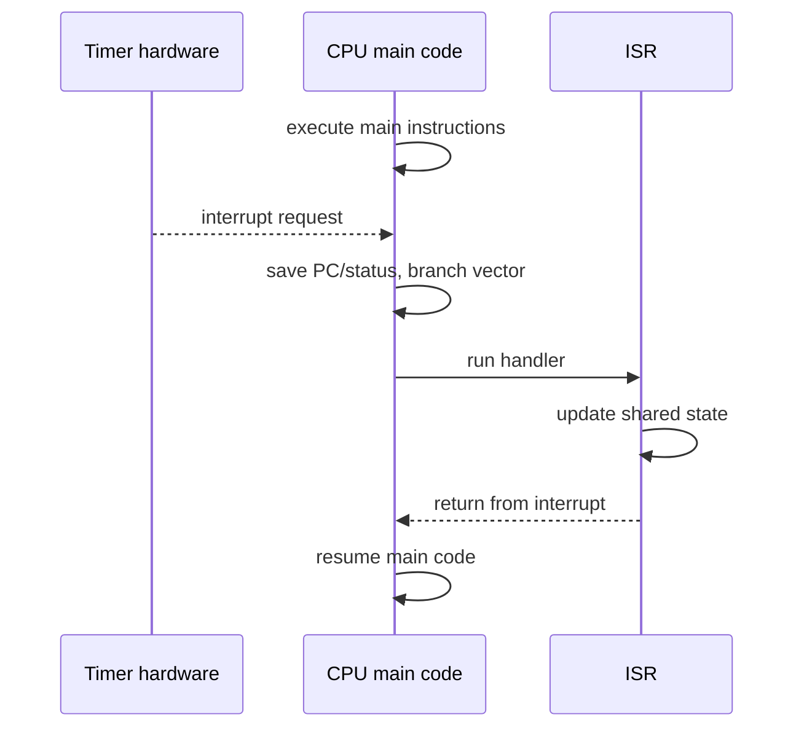

# Input and Output Interfacing

Input and output are where sequential software meets a concurrent physical world. A microcontroller can execute one instruction stream, but switches bounce, serial bytes arrive, timers expire, motors turn, sensors sample, and interrupt lines change independently. I/O design is therefore partly electrical, partly architectural, and partly semantic: what does software assume about when external events become visible?

Lee and Seshia use I/O to expose a central CPS tension. Software is written as ordered statements, but the environment is not ordered by the program. Polling, interrupts, GPIO, PWM, serial interfaces, buses, memory-mapped registers, and device drivers are all mechanisms for reconciling that mismatch.


*Figure: I2C bus with one master and several slave devices. Image: [Wikimedia Commons](https://commons.wikimedia.org/wiki/File:I2C.svg), Cburnett, CC BY-SA 3.0.*

## Definitions

**General-purpose input/output** (GPIO) pins can be configured by software as digital inputs or outputs. They expose logical values as voltage levels, subject to electrical limits.

**Pulse-width modulation** (PWM) controls average power by switching a signal on and off at a fixed frequency with a chosen duty cycle. If the plant is slow relative to the PWM frequency, it responds approximately to the average.

The **duty cycle** is the fraction of one period for which the signal is high:

$$
D=\frac{T_{\mathrm{on}}}{T_{\mathrm{period}}}.
$$

For a high voltage $V_{DD}$, the average voltage of an ideal PWM waveform is

$$
V_{\mathrm{avg}}=D V_{DD}.
$$

**Memory-mapped I/O** exposes device registers at processor addresses. Reading or writing an address may operate a peripheral rather than ordinary memory.

An **interrupt** pauses the current execution and branches to an interrupt service routine (ISR). A hardware interrupt is triggered by external hardware; a software interrupt is triggered by an instruction or register write; an exception is triggered by a detected internal fault.

An operation is **atomic** if it cannot be interrupted or observed halfway through. Atomicity is hardware- and compiler-dependent.

An **interrupt controller** prioritizes interrupt requests and maps them to interrupt vectors or ISR addresses.

A **device driver** is software that manages a peripheral, often combining register access, interrupts, buffering, and synchronization.

## Key results

PWM is appropriate when the physical plant averages fast switching. Heating elements, motors, and LEDs can often be controlled this way because their thermal, electrical, or mechanical response is slower than the switching period.

GPIO electrical limits are correctness constraints. Ohm's law gives

$$
I=\frac{V}{R}.
$$

If a GPIO pin drives a load with too little resistance, the current may exceed the pin or package limit. Open-collector/open-drain and tristate outputs support shared lines, but the logic must match the circuit.

Polling is simple but can waste CPU time and miss timing opportunities. A loop that waits for a serial transmit buffer to become empty may be acceptable in a small program, but in a multitasking real-time system it blocks useful work.

Interrupts reduce polling but introduce concurrency. An ISR may run between two instructions of the main program. If the ISR and main code share data, then every shared access must be reasoned about at the machine level or protected with a concurrency discipline.

The C keyword `volatile` prevents some compiler optimizations for variables that change outside the ordinary instruction stream, such as variables written by ISRs. It does not make operations atomic and does not by itself solve race conditions.

Modeling interrupt behavior as a state machine can reveal flaws. A nested or repeated interrupt can occur if the ISR takes longer than the interrupt period or if interrupt priorities allow reentry.

I/O software should be designed around ownership of data. When a serial receive ISR writes bytes into a buffer and the main loop reads them, both pieces of code must agree on who owns each byte and when ownership transfers. A common design uses a ring buffer with head and tail indices, but even that simple structure needs atomic updates or carefully chosen index widths. The same issue appears in DMA descriptors, sensor sample buffers, and network packet queues.

Level-triggered and edge-triggered interrupts have different failure modes. A level-triggered interrupt can keep requesting service until the device is acknowledged, which helps avoid missed events but can trap the processor if the condition is not cleared. An edge-triggered interrupt records a transition, which can be efficient but may miss another transition if the device or controller is not configured to latch it. The choice should match the peripheral and the event semantics.

Device drivers are therefore concurrency components. They hide register-level details from application code, but they must still obey timing, atomicity, buffering, and error-handling requirements. A good driver defines what happens on overflow, timeout, malformed input, bus error, and device reset. Without those behaviors, the application may appear simple while the system remains underspecified.

Serial and parallel interfaces also differ in how they expose timing risk. Parallel interfaces move multiple bits at once, but the receiver must see those bits as one coherent value, which becomes harder as wires get longer or speeds increase. Serial interfaces use fewer wires and can run very fast, but they require framing, clock recovery or baud-rate agreement, buffering, and error detection. The software-visible interface may be a byte stream, while the physical interface is a timed waveform.

Buses add arbitration. If multiple devices share a bus, a transaction may wait for another device or for a bus controller. That waiting time can matter in real-time paths. A sensor read that is logically simple may have a variable completion time if it shares a bus with a display, flash device, or network controller. I/O analysis therefore has to include not only the peripheral but also the interconnect and competing traffic.

For safety-related I/O, fail-safe electrical defaults are as important as software behavior. Pull-up or pull-down resistors, open-drain wiring, watchdog outputs, and reset states determine what actuators do while the processor boots, crashes, or reprograms pins.

I/O documentation should therefore include reset behavior and startup sequencing. A pin that is safe as an output after initialization may float during boot. A peripheral register may retain state across warm reset. A driver that assumes a clean power-on state may fail after watchdog recovery.

## Visual



| I/O method | Good for | Weakness | Typical protection |
|---|---|---|---|
| Polling | Simple status checks | Busy waiting, missed timing | Bounded loops, timeouts |
| Interrupts | External events and timers | Shared-state races | Short ISRs, atomic sections |
| DMA | High-throughput transfers | Buffer ownership complexity | Descriptors and memory barriers |
| Memory-mapped registers | Fast peripheral control | Requires exact device semantics | `volatile`, masks, register docs |
| PWM | Power control | Ripple, switching loss | Proper frequency and driver |

## Worked example 1: PWM average voltage

Problem: A PWM output switches between $0$ V and $3.3$ V at a duty cycle of $35\%$. Find the ideal average voltage seen by a slow plant.

Method:

1. Convert duty cycle to a fraction:

$$
D=35\%=0.35.
$$

2. Use the ideal average formula:

$$
V_{\mathrm{avg}}=D V_{DD}.
$$

3. Substitute:

$$
V_{\mathrm{avg}}=0.35(3.3)=1.155\text{ V}.
$$

4. Interpret the result. The plant does not actually see a constant $1.155$ V instantaneously; it sees fast switching whose average effect may approximate that value.

Answer: The ideal average is $1.155$ V, assuming the load and driver behave linearly over the PWM period.

## Worked example 2: GPIO current limit

Problem: A GPIO output at $3.3$ V drives an LED and resistor path. The GPIO pin must not source more than $8$ mA. Ignoring LED voltage for a conservative first check, find the minimum resistor.

Method:

1. Use Ohm's law:

$$
I=\frac{V}{R}.
$$

2. Solve for resistance:

$$
R=\frac{V}{I}.
$$

3. Substitute $V=3.3$ V and $I=8$ mA:

$$
R=\frac{3.3}{0.008}=412.5\ \Omega.
$$

4. Choose the next standard resistor value above the minimum, such as $470\ \Omega$.

5. Check current:

$$
I=\frac{3.3}{470}\approx 0.00702\text{ A}=7.02\text{ mA}.
$$

Answer: Use at least $412.5\ \Omega$ under this conservative model; $470\ \Omega$ keeps the current below $8$ mA.

## Code

```python
class TimerISR:
    def __init__(self, count):
        self.timer_count = count

    def systick(self):
        if self.timer_count != 0:
            self.timer_count -= 1

def run_delay(milliseconds):
    timer = TimerISR(milliseconds)
    ticks = 0
    while timer.timer_count != 0:
        timer.systick()  # hardware would trigger this once per ms
        ticks += 1
    return ticks

print("ticks elapsed:", run_delay(2000))
```

## Common pitfalls

- Treating `volatile` as a lock. It controls compiler assumptions, not atomicity or mutual exclusion.
- Writing multi-byte shared variables on an 8-bit microcontroller without checking whether the write is interruptible.
- Making ISRs long or blocking. A slow ISR can cause missed events or nested interrupt problems.
- Connecting GPIO directly to loads without checking current, voltage, and package constraints.
- Assuming a memory-mapped register behaves like RAM. Reads and writes may have side effects.
- Polling forever without a timeout or system-level scheduling argument.

## Connections

- [sensors and actuators](/cs/embedded/sensors-and-actuators)
- [8255 programmable peripheral interface](/cs/embedded/8255-programmable-peripheral-interface)
- [8051 timers, serial, and interrupts](/cs/embedded/8051-timers-serial-interrupts)
- [8085 I/O, memory, and DMA interfacing](/cs/embedded/8085-io-memory-dma-interfacing)
- [process synchronization](/cs/operating-systems/process-synchronization)
