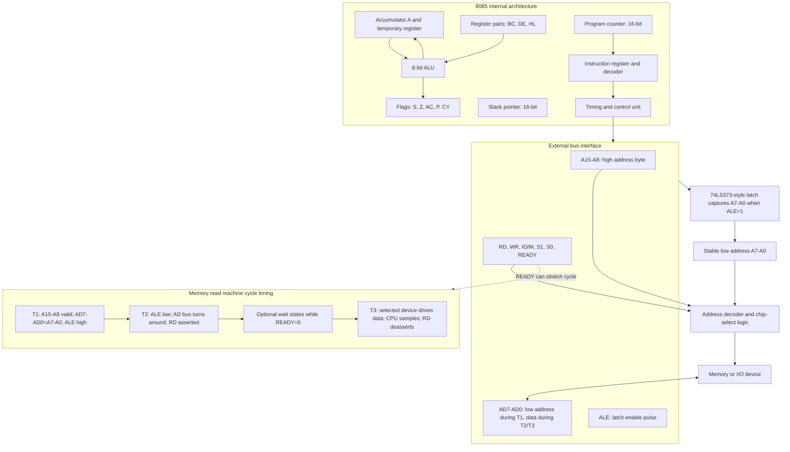

# 8085 Architecture, Buses, and Timing

The 8085 is the book's central microprocessor example. It is a good teaching CPU because the external bus is visible, the instruction set is compact, and the timing signals directly show how a processor talks to memory and I/O. Learning the 8085 is less about memorizing pins and more about understanding how one instruction becomes a sequence of bus cycles.

The architecture page sits between the simple microprocessor model and the instruction-set pages. It names the blocks that execute instructions, but it also explains why extra hardware is needed around the chip: the lower address bus is multiplexed with the data bus, memory and I/O chips need selection signals, and slow devices may require wait states.

## Definitions

The **8085** is an 8-bit microprocessor with a 16-bit address bus. It can address 64 KiB of memory and has a separate I/O address space of 256 ports when I/O-mapped instructions are used.

The **accumulator `A`** is the primary arithmetic and logic register. Most ALU results are placed in `A`.

The **flag register** records selected properties of ALU results. The main flags are sign `S`, zero `Z`, auxiliary carry `AC`, parity `P`, and carry `CY`.

The **register pairs** `BC`, `DE`, and `HL` combine two 8-bit registers to hold 16-bit addresses or data. The `HL` pair is especially important because `M` in many instructions means the memory location whose address is in `HL`.

The **program counter `PC`** is a 16-bit register containing the address of the next instruction byte to fetch. The **stack pointer `SP`** is a 16-bit register pointing into RAM used for return addresses, saved registers, and temporary storage.

The **multiplexed bus `AD7`-`AD0`** carries the low-order address byte during the early part of a bus cycle and carries data during the data-transfer part. The high address lines `A15`-`A8` remain address lines.

The **address latch enable `ALE`** signal tells an external latch when `AD7`-`AD0` contain the low address byte. After latching, the same pins can safely become the data bus.

The **control signals** `RD` and `WR` request a read or write operation. The status signal `IO/M` distinguishes memory operations from I/O operations. Signals such as `S1` and `S0` further identify the machine cycle type.

A **machine cycle** is one bus operation. An **instruction cycle** is the complete time required to execute one instruction and may include several machine cycles.

## Key results

The first key result is the need to demultiplex the 8085 low address/data bus. During the first clock state of a bus cycle, `AD7`-`AD0` contain `A7`-`A0`. After `ALE` falls, these lines are reused for data. If external memory connected directly to `AD7`-`AD0` as address inputs, the selected address would disappear during the data phase. Therefore a latch, commonly a 74LS373 or equivalent, stores the low address while `ALE` is active.

The second key result is that 8085 memory selection normally combines address decoding with control signals. A RAM chip should respond only when its address range is selected and the processor is performing a memory read or memory write. In symbolic form:

$$
\text{RAM\_read} = \text{chip\_select} \cdot \overline{\text{RD}} \cdot \overline{\text{IO/M}}
$$

The third key result is that instruction timing is hierarchical. An opcode fetch cycle is required for every instruction. If the instruction has immediate operands, more memory-read cycles follow. If it writes to memory, a memory-write cycle is included. If it accesses I/O with `IN` or `OUT`, I/O read or I/O write cycles are used.

The fourth key result concerns wait states. A fast CPU can be slowed for a slow memory or peripheral by inserting wait states. The processor samples `READY`; if `READY` is low at the relevant time, it waits before completing the transfer. This is not a software delay loop. It is a hardware mechanism that stretches a bus cycle.

The fifth key result is that resets and interrupts are control-flow events with hardware causes. Reset initializes the program counter, and interrupts cause the CPU to suspend normal instruction flow after a suitable boundary, save the return address, and branch to a service routine or interrupt vector depending on the interrupt type.

## Visual



This 8085 diagram combines the CPU core, external bus pins, demultiplexing latch, decoder, and read-cycle timing. It labels the accumulator, flags, register pairs, PC, SP, ALU, instruction decoder, and timing unit, then shows how `AD7`-`AD0` switch roles from low address to data. The timing subgraph explains why `ALE`, `RD`, `IO/M`, and `READY` are architectural facts for board design rather than incidental pin names.

| 8085 signal or group | Main purpose | Common mistake |
|---|---|---|
| `A15`-`A8` | High address byte | Treating them as data lines |
| `AD7`-`AD0` | Low address first, then data | Forgetting the external latch |
| `ALE` | Enables low-address latch | Using it as a memory read signal |
| `RD` | Active-low read control | Ignoring `IO/M` when decoding |
| `WR` | Active-low write control | Enabling multiple devices at once |
| `IO/M` | Selects I/O versus memory cycle | Assuming all I/O is memory-mapped |
| `READY` | Adds wait states for slow devices | Replacing it with a software loop |

## Worked example 1: Demultiplexing an address

Problem: During a memory read, the 8085 must read the byte at address `3A7CH`. Describe what appears on the address and data pins during the bus cycle and what an external latch must hold.

Method:

1. Split the 16-bit address into high and low bytes:

$$
3A7C\text{H} = 3A\text{H} : 7C\text{H}
$$

2. The high byte `3AH` appears on dedicated address pins `A15`-`A8`.

3. The low byte `7CH` appears on multiplexed pins `AD7`-`AD0` while `ALE` is active.

4. The latch stores `7CH` when enabled by `ALE`. After that, the latch output continues to drive memory address inputs `A7`-`A0`.

5. The pins `AD7`-`AD0` then stop being address lines and become the data bus. During the data part of the read cycle, the selected memory device drives the requested byte onto these same pins.

Answer: `A15`-`A8` carry `3AH`; the latch captures `7CH`; later `AD7`-`AD0` carry the data byte read from address `3A7CH`.

Check: If the latch were missing, the memory chip would see its low address change when data appeared. That would make a stable read impossible.

## Worked example 2: Counting bus cycles for an instruction

Problem: Determine the basic bus activity for the 8085 instruction `LDA 2050H`, which loads the accumulator from memory address `2050H`.

Method:

1. `LDA addr16` is a three-byte instruction: one opcode byte plus a 16-bit address stored low byte first.

2. The processor first performs an opcode fetch from the address in `PC`. That fetch obtains the opcode for `LDA`.

3. The processor then performs a memory read for the low address byte. For `2050H`, the low byte is `50H`.

4. It performs another memory read for the high address byte. The high byte is `20H`.

5. Now the CPU has the full operand address `2050H`.

6. It performs a final memory read at `2050H` and transfers that data byte into the accumulator.

Answer: `LDA 2050H` requires one opcode fetch, two memory reads for the address bytes, and one memory read for the actual operand.

Check: The instruction contains three bytes, but it requires four bus read operations because one of the bytes names an additional memory location that must also be read.

## Code

```asm
; 8085: demonstrate memory read, register pair use, and memory write.
; Copies a byte from 2050H to 3050H through the accumulator.

        LXI H,2050H    ; HL points to source
        MOV A,M        ; memory read: A <- [HL]
        LXI H,3050H    ; HL points to destination
        MOV M,A        ; memory write: [HL] <- A
        HLT
```

## Common pitfalls

- Connecting memory address input `A0`-`A7` directly to `AD0`-`AD7` without a latch. This fails because those pins later carry data.
- Decoding only low address bits. Partial decoding can make the same device appear at many addresses, which may be acceptable in a small trainer but dangerous in a real map.
- Forgetting active-low notation. Signals such as `RD` and `WR` are asserted low; a drawn bar or slash changes the logic.
- Treating `READY` wait states as instruction-level delays. Wait states stretch bus transfers and are not visible as separate program instructions.
- Assuming every instruction takes the same time. Instruction length and bus activity vary widely.
- Confusing memory-mapped I/O with I/O-mapped I/O. The 8085 supports special `IN` and `OUT` instructions for I/O ports, but memory-mapped devices use ordinary memory read/write cycles.

## Connections

- [Microprocessor and microcomputer basics](/cs/embedded/microprocessor-microcomputer-basics)
- [8085 instruction set and addressing](/cs/embedded/8085-instruction-set-addressing)
- [8085 I/O, memory, and DMA interfacing](/cs/embedded/8085-io-memory-dma-interfacing)
- [8255 programmable peripheral interface](/cs/embedded/8255-programmable-peripheral-interface)
