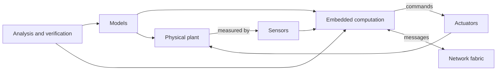

# Cyber-Physical Systems Supplement

This section supplements the hardware-and-assembly-oriented embedded notes with the cyber-physical systems perspective from Lee and Seshia. The existing notes in this folder focus on microprocessors, microcontrollers, buses, peripheral chips, assembly programming, and concrete interfacing. This supplement focuses on models: continuous dynamics, discrete state machines, hybrid systems, concurrency semantics, timing, verification, quantitative analysis, and security.

The shift in emphasis matters because embedded software is not only software running on small computers. In a cyber-physical system, computation is coupled to physical processes through sensors, actuators, networks, and feedback. Correctness can depend on real time, state evolution, environmental assumptions, and whether the chosen abstraction is sound enough to justify the design.

## Definitions

A **cyber-physical system** (CPS) integrates computation with physical processes. Embedded computers and networks monitor and control a physical plant, often in a feedback loop where physical evolution affects computation and computation affects physical evolution.

The **physical plant** is the part of the system not realized as digital computation: mechanical motion, electrical circuits, thermal processes, chemical dynamics, human operators, vehicles, or environments.

The **cyber part** includes processors, software, networks, sensors, actuators, operating systems, memory systems, and communication protocols.

A **model** is an abstraction used to understand or specify system behavior. Models can be continuous-time equations, state machines, actor networks, hybrid systems, task graphs, temporal-logic properties, or security threat models.

**Design** is the structured creation of an implementation or architecture. **Analysis** is the process of proving, estimating, checking, or otherwise understanding whether a model or implementation satisfies its requirements.

The new pages in this supplement are:

1. [Continuous Dynamics](/cs/embedded/continuous-dynamics)
2. [Discrete Dynamics](/cs/embedded/discrete-dynamics)
3. [Hybrid Systems](/cs/embedded/hybrid-systems)
4. [Composition of State Machines](/cs/embedded/composition-of-state-machines)
5. [Concurrent Models of Computation](/cs/embedded/concurrent-models-of-computation)
6. [Sensors and Actuators](/cs/embedded/sensors-and-actuators)
7. [Embedded Processors Architecture](/cs/embedded/embedded-processors-architecture)
8. [Memory Architectures](/cs/embedded/memory-architectures)
9. [Input and Output Interfacing](/cs/embedded/input-output-interfacing)
10. [Multitasking and Threads](/cs/embedded/multitasking-and-threads)
11. [Scheduling and Real Time](/cs/embedded/scheduling-and-real-time)
12. [Invariants and Temporal Logic](/cs/embedded/invariants-and-temporal-logic)
13. [Equivalence and Refinement](/cs/embedded/equivalence-and-refinement)
14. [Reachability and Model Checking](/cs/embedded/reachability-and-model-checking)
15. [Quantitative Analysis](/cs/embedded/quantitative-analysis)
16. [Security and Privacy](/cs/embedded/security-and-privacy)

## Key results

The main CPS design loop is modeling, design, and analysis. Modeling clarifies what the system should do and what assumptions are being made. Design selects hardware, software, networks, sensors, and control structure. Analysis checks why the system should meet requirements or where it can fail. In practice, these activities iterate.

Continuous dynamics model the plant and low-level physical behavior. A simple mechanical or electrical model may be written as an ODE, but in an embedded system the ODE is not isolated: software samples it, estimates state, computes control actions, and applies actuation subject to delay and quantization.

Discrete dynamics model mode logic. Finite-state machines specify protocol states, controller modes, reset behavior, and event-triggered decisions. Extended state machines compactly represent large state spaces using variables.

Hybrid systems combine those two worlds. A mode may contain continuous dynamics, while guards over continuous variables trigger discrete transitions and reset actions. This is the natural model for thermostats, vehicles, bouncing balls, motor controllers, and supervisory control.

Concurrency needs semantics. State-machine composition, synchronous-reactive models, dataflow models, process networks, threads, interrupts, and time-triggered systems all provide different answers to "what happens at the same time?" The model chosen determines whether determinism, bounded buffers, and timing guarantees are available.

Analysis is not optional. Temporal logic states requirements precisely. Refinement and equivalence compare designs. Reachability and model checking search state spaces. Quantitative analysis bounds time, memory, energy, or other measurable resources. Security and privacy analysis adds adversarial environments and information-flow concerns.

The Godse-derived hardware notes and the Lee-Seshia CPS notes should be read together. Concrete microcontrollers, buses, and peripherals implement the abstract actors and state machines. Conversely, the abstract models explain why timing, interrupt behavior, quantization, and resource bounds matter for those concrete devices.

A useful reading path is to start with the modeling pages, then move down to platform realization, then return to analysis. For example, a feedback-controller design begins with continuous dynamics and sensors, becomes a hybrid or state-machine controller, is implemented using I/O, processors, memory, and scheduling, and is then checked with temporal logic, reachability, quantitative timing analysis, and security review. The pages are ordered to support that loop rather than to isolate topics.

## Visual



| Layer | Representative pages | Core question |
|---|---|---|
| Physical modeling | Continuous dynamics, sensors and actuators | What does the physical process do over time? |
| Discrete modeling | Discrete dynamics, composition, hybrid systems | What state is remembered and how do modes change? |
| Concurrency | Concurrent MoCs, multitasking, I/O | What does "at the same time" mean? |
| Platform | processors, memory, scheduling | Can the implementation meet timing and resource constraints? |
| Verification | temporal logic, refinement, reachability | Does the model satisfy the requirement? |
| Assurance | quantitative analysis, security | What bounds and threat assumptions are defensible? |

## Worked example 1: Classifying a quadrotor subsystem

Problem: A quadrotor has an inertial measurement unit, four motor controllers driven by PWM, a low-level stabilization loop, a wireless link, and a supervisory mode machine with states `takeoff`, `hover`, `land`, and `fault`. Classify each part using the CPS concepts in this supplement.

Method:

1. The airframe motion is physical plant dynamics. It belongs with continuous dynamics because position, velocity, orientation, and angular velocity evolve over time.

2. The inertial measurement unit is a sensor. Its model must include sampling rate, bias, noise, quantization, and possibly drift.

3. The motor controllers and PWM drivers are actuators. Their model connects digital commands to motor torque and thrust, subject to saturation and update timing.

4. The low-level stabilization loop is feedback control. It reads sensor estimates, computes error, and commands actuators.

5. The supervisory mode machine is discrete dynamics. Its transitions might depend on altitude, battery state, operator commands, or fault events.

6. Combining mode logic with continuous flight dynamics produces a hybrid system.

7. The wireless link and processor tasks introduce concurrency and scheduling concerns. A delayed control packet or missed task deadline can become a physical failure.

Answer: The quadrotor is not captured by one model. It needs continuous plant models, sensor/actuator models, FSM mode logic, hybrid composition, scheduling analysis, and verification of safety properties.

## Worked example 2: Turning an English requirement into analysis tasks

Problem: Requirement: "If an obstacle is detected, the robot must stop before collision and must not resume motion until the obstacle is gone." Break this into model and analysis obligations.

Method:

1. Identify the physical quantity: distance to obstacle $d(t)$ and robot velocity $v(t)$.

2. Identify the sensor model: obstacle detection has sampling period, range, false negatives, false positives, and processing delay.

3. Identify the actuator model: braking command changes velocity subject to maximum deceleration and actuator latency.

4. Identify discrete modes:

$$
\{moving, braking, stopped\}.
$$

5. Write a safety invariant for no collision:

$$
G(d>0).
$$

6. Write a mode invariant for the second clause: while obstacle present, the controller is not in `moving`.

$$
G(obstacle \Rightarrow \neg moving).
$$

7. Write a quantitative timing/braking obligation. If detection occurs at distance $d_0$, speed is $v_0$, total delay is $\Delta$, and braking deceleration is $a$, require

$$
v_0\Delta + \frac{v_0^2}{2a} < d_0.
$$

8. Verify the mode logic with reachability/model checking and verify the timing inequality with quantitative analysis and physical assumptions.

Answer: The English requirement decomposes into sensor assumptions, actuator assumptions, hybrid mode logic, temporal-logic safety properties, and a quantitative stopping-distance bound.

## Code

```python
def stopping_distance(speed, delay, decel):
    """Distance traveled before stopping after detection."""
    reaction = speed * delay
    braking = speed * speed / (2.0 * decel)
    return reaction + braking

def safe_to_stop(speed, delay, decel, obstacle_distance, margin=0.0):
    return stopping_distance(speed, delay, decel) + margin < obstacle_distance

case = {
    "speed": 2.0,
    "delay": 0.15,
    "decel": 3.0,
    "obstacle_distance": 1.2,
    "margin": 0.1,
}
print(stopping_distance(case["speed"], case["delay"], case["decel"]))
print(safe_to_stop(**case))
```

## Common pitfalls

- Treating CPS as ordinary software plus sensors. Physical time, concurrency, and feedback change what correctness means.
- Modeling the plant and controller separately but never analyzing their closed-loop interaction.
- Ignoring the environment model. Verification without environmental assumptions can be either too weak or unrealistically pessimistic.
- Using informal English requirements where temporal precision is needed.
- Assuming the hardware implementation preserves the model's timing semantics automatically.
- Duplicating hardware-oriented pages instead of linking them. The CPS supplement should complement, not replace, the existing microprocessor and microcontroller material.

## Connections

- [microprocessor and microcomputer basics](/cs/embedded/microprocessor-microcomputer-basics)
- [8051 architecture, memory, and ports](/cs/embedded/8051-architecture-memory-ports)
- [serial buses and embedded protocols](/cs/embedded/serial-buses-embedded-protocols)
- [continuous dynamics](/cs/embedded/continuous-dynamics)
- [hybrid systems](/cs/embedded/hybrid-systems)
- [CPU scheduling](/cs/operating-systems/cpu-scheduling)
- [process synchronization](/cs/operating-systems/process-synchronization)
- [signals and systems](/physics/signals-systems/)
- [continuous-time simulation](/physics/simulation/)
- [first-order ODEs](/math/engineering-math/first-order-odes)
- [Laplace transform](/math/engineering-math/laplace-transform)
