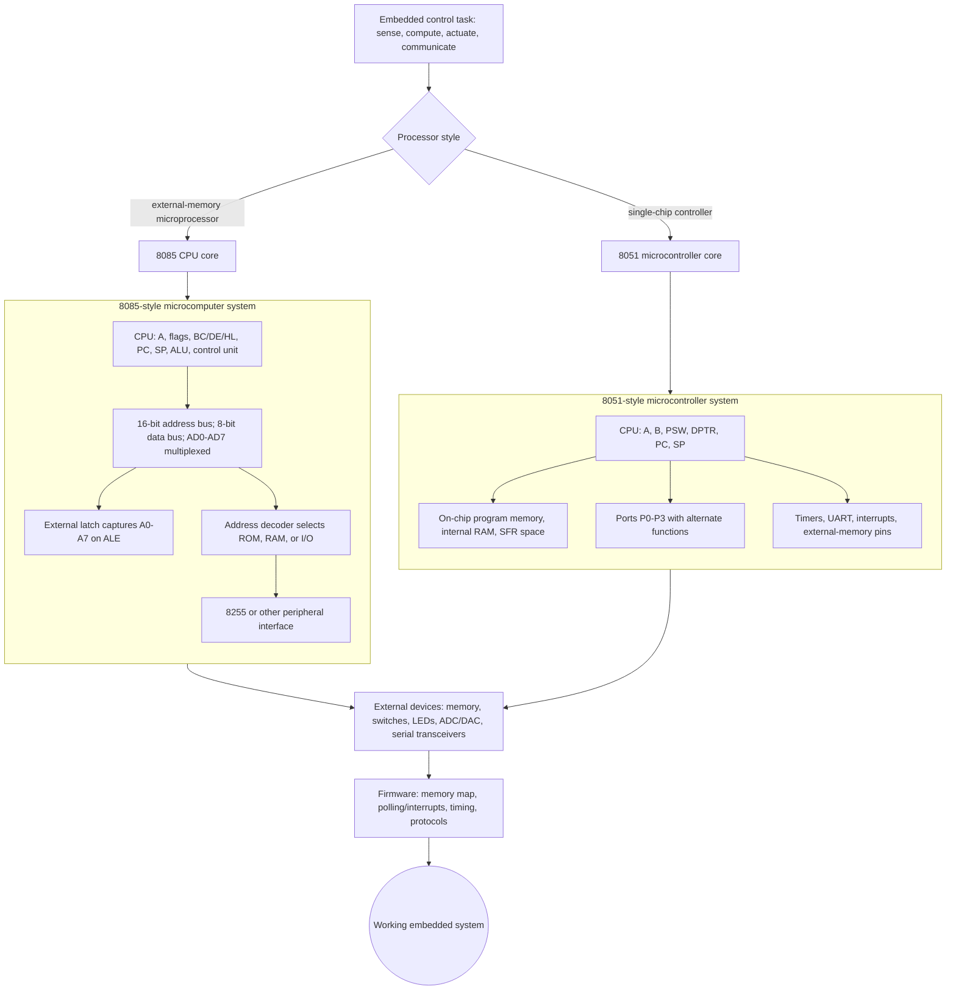

# Microprocessors and Microcontroller Systems

These notes follow the scanned textbook *Microprocessors & Microcontroller Systems* by D.A. Godse and A.P. Godse. The PDF is image-based in this workspace, so the usable source signals are its metadata and visually inspected table of contents. That contents shows a course centered on the 8085 microprocessor and the MCS-51/8051 microcontroller, then extended through 8255 interfacing, external devices, serial buses, serial EEPROM/DS1307, 89C51 derivatives, AVR AT90S2313, and PIC16CXX.

The subject is about building a working digital system from a processor, memory, I/O circuits, and software. The 8085 chapters teach external bus thinking: address decoding, machine cycles, memory maps, I/O-mapped ports, DMA, and assembly programs. The 8051 chapters shift to microcontroller thinking: on-chip RAM, SFRs, ports, timers, serial communication, interrupts, and device interfacing. The later chapters show that once the vocabulary is clear, new controller families can be compared by memory organization, peripheral set, interrupt model, power modes, and programming style.

## Definitions

A **microprocessor** is a CPU on an integrated circuit. In this course the main microprocessor is the Intel 8085, an 8-bit CPU with a 16-bit address bus. It requires external memory and I/O hardware to form a complete system.

A **microcomputer system** is a complete computer built around a microprocessor. It includes program memory, data memory, address decoding, buses, I/O interfaces, clock/reset circuitry, and software.

A **microcontroller** integrates a CPU with memory and peripherals on one chip. The main microcontroller family in the source is the MCS-51/8051 family, with later chapters surveying 89C51 derivatives, AVR AT90S2313, and PIC16CXX.

An **embedded system** is a computer built into a product or instrument to control a specific task. It may use a microprocessor, a microcontroller, or a more complex system-on-chip, but the design questions are similar: timing, input/output, state, reliability, and resource limits.

An **interface** is the hardware and software boundary between the processor and another device. It may be a memory bus, an I/O port, a keyboard matrix, an ADC, a DAC, a serial bus, or a protocol such as Modbus.

The generated detail pages are:

| Sidebar | Page | Source coverage |
|---:|---|---|
| 2 | [Microprocessor and microcomputer basics](/cs/embedded/microprocessor-microcomputer-basics) | Chapter 1 foundations |
| 3 | [8085 architecture, buses, and timing](/cs/embedded/intel-8085-architecture-buses-timing) | Chapter 2 architecture and cycles |
| 4 | [8085 instruction set and addressing](/cs/embedded/8085-instruction-set-addressing) | Chapter 3 instruction set |
| 5 | [8085 assembly programming patterns](/cs/embedded/8085-assembly-programming-patterns) | Chapters 4 and 5 programming, stacks, subroutines |
| 6 | [8085 I/O, memory, and DMA interfacing](/cs/embedded/8085-io-memory-dma-interfacing) | Chapter 6 I/O and memory interface |
| 7 | [8051 architecture, memory, and ports](/cs/embedded/8051-architecture-memory-ports) | Chapter 7 8051 hardware |
| 8 | [8051 instruction set and programming](/cs/embedded/8051-instruction-set-programming) | Chapter 8 8051 instructions |
| 9 | [8051 timers, serial port, and interrupts](/cs/embedded/8051-timers-serial-interrupts) | Chapters 9, 10, and 11 |
| 10 | [8255 programmable peripheral interface](/cs/embedded/8255-programmable-peripheral-interface) | Chapter 12 8255 |
| 11 | [8051 external-world interfacing](/cs/embedded/8051-external-world-interfacing) | Chapter 13 devices and converters |
| 12 | [Serial buses and embedded protocols](/cs/embedded/serial-buses-embedded-protocols) | Chapter 14 buses and protocols |
| 13 | [Serial EEPROM and DS1307 RTC interfacing](/cs/embedded/serial-eeprom-rtc-ds1307) | Chapter 15 EEPROM and RTC |
| 14 | [Microcontroller derivatives, AVR, and PIC](/cs/embedded/microcontroller-derivatives-avr-pic) | Chapters 16, 17, and 18 |

## Key results

The first key result is that processor architecture and system architecture are different. The 8085 CPU has registers, an ALU, flags, a program counter, and bus-control logic; the surrounding system must still supply memory, latches, decoders, I/O ports, and devices. The 8051 integrates more of this system, so the designer configures internal SFRs instead of wiring every function externally.

The second key result is that memory maps are contracts. In an 8085 system, a program address such as `2050H` is meaningful only if the hardware decoder selects the intended RAM, ROM, or device. In an 8051 system, the instruction itself selects among internal RAM, SFRs, external data memory, and program memory. Confusing memory spaces is one of the most common embedded mistakes.

The third key result is that timing is a first-class design variable. The 8085 exposes timing through machine cycles and signals such as `ALE`, `RD`, `WR`, and `READY`. The 8051 exposes timing through timer registers, serial baud-rate generation, interrupt flags, and peripheral conversion times. Software delays, bus waits, timer reloads, and communication framing all depend on clock assumptions.

The fourth key result is that interfaces should be designed from both sides. Software must know the address, active level, status flag, and data format. Hardware must know the bus cycle, electrical levels, current requirements, pull-ups, and timing limits. A keyboard, ADC, DAC, display, EEPROM, RTC, or RS-485 transceiver is not "just connected" because a wire exists.

The fifth key result is that assembly language is a precision tool. It reveals flags, pointer registers, stack growth, and instruction timing. Even when embedded C is used later, the same mental model remains necessary for interrupt routines, bit manipulation, memory-mapped registers, and startup code.

The sixth key result is that microcontroller families share patterns but not details. 8051, AVR, and PIC devices all have program memory, data storage, ports, timers, interrupts, and watchdog concepts, but their instruction sets, register files, memory banking, vector rules, and peripheral registers differ. Transfer the questions, not the exact code.

## Visual



This overview diagram contrasts the two architectural styles used throughout the embedded notes. The 8085 path exposes external bus design, low-address latching, decoding, and peripheral chips, while the 8051 path shows how RAM, SFRs, ports, timers, serial hardware, and interrupts move on chip. The final firmware path makes the I/O contract explicit: software must match the memory map, timing signals, interrupts, and protocol behavior of the chosen hardware.

| Study layer | Main question | Representative source topics |
|---|---|---|
| CPU core | How does the processor execute instructions? | 8085 registers, ALU, flags, instruction cycle |
| Bus system | How does the CPU reach memory and I/O? | Address/data bus, control signals, decoding, wait states |
| Assembly programming | How is a task expressed in instructions? | Loops, counters, code conversion, stack, subroutines |
| Microcontroller core | What is already on the chip? | 8051 RAM, ROM, ports, SFRs, timers, serial port |
| Peripheral interface | How does software control hardware? | 8255, keyboard, display, ADC, DAC, stepper motor |
| Communication | How do devices exchange messages? | RS-232, RS-485, I2C, Modbus, DS1307, EEPROM |
| Derivatives | What changes across families? | 89C51RD, AT90S2313, PIC16CXX |

## Worked example 1: Classifying a small controller design

Problem: A laboratory trainer uses an 8085 CPU, a separate EPROM, a separate RAM chip, a 74LS373 latch for `AD7`-`AD0`, an address decoder, and an 8255 for switches and LEDs. Is this best described as a microprocessor system or a microcontroller system?

Method:

1. Identify the CPU. The CPU is an 8085, which is a microprocessor.

2. Check whether memory is integrated with the CPU. The design uses separate EPROM and RAM chips, so memory is external.

3. Check whether I/O ports are integrated with the CPU. The design uses an external 8255, so I/O is external.

4. Check whether bus support logic is needed. The design needs a latch for the multiplexed low address/data bus and a decoder for chip selection.

5. Compare with the definition. A microcontroller would integrate CPU, memory, and many I/O peripherals on one chip. This design builds the complete computer from multiple chips around the CPU.

Answer: it is a microprocessor-based microcomputer system, not a single-chip microcontroller system.

Check: The presence of an 8255 does not make it a microcontroller. It confirms that I/O is being added externally to a microprocessor system.

## Worked example 2: Choosing the right topic path for a data logger

Problem: A student wants to build an 8051-based data logger that reads an analog temperature sensor once per second, stores readings in serial EEPROM, and timestamps each reading with a DS1307. Which note pages should be studied first, and why?

Method:

1. The CPU is 8051-based, so start with the page on 8051 architecture, memory, and ports. This explains SFRs, internal RAM, and port behavior.

2. The program will use 8051 instructions or embedded C that manipulates SFRs, so study the 8051 instruction and programming page next.

3. Sampling once per second requires timing. Study the timer, serial, and interrupt page to understand timer reloads and periodic service.

4. The temperature sensor is analog, so an ADC is needed. Study the external-world interfacing page for ADC conversion sequence and control lines.

5. Serial EEPROM and DS1307 are serial devices; study the serial buses page for I2C transaction structure.

6. Finally study the serial EEPROM and DS1307 page for BCD time conversion, page writes, and write-cycle polling.

Answer: the recommended path is 8051 architecture -> 8051 programming -> timers/interrupts -> external interfacing -> serial buses -> EEPROM/DS1307.

Check: Beginning with Modbus or PIC derivatives would not help the immediate logger design; those topics are useful later for communication networks or family comparison.

## Code

```c
/* High-level embedded C skeleton for the data-logger example.
   Device-specific I2C, ADC, and timer functions are abstracted. */

void logger_tick(void) {
    unsigned int sample;
    unsigned char hour;
    unsigned char minute;
    unsigned char second;

    sample = adc_read_temperature();
    ds1307_read_time(&hour, &minute, &second);

    eeprom_write_byte(log_address++, hour);
    eeprom_write_byte(log_address++, minute);
    eeprom_write_byte(log_address++, second);
    eeprom_write_byte(log_address++, (unsigned char)(sample >> 8));
    eeprom_write_byte(log_address++, (unsigned char)(sample & 0xFF));
}

int main(void) {
    timer_init_1s();
    i2c_init();
    adc_init();

    while (1) {
        if (one_second_elapsed()) {
            logger_tick();
        }
    }
}
```

## Common pitfalls

- Reading the whole subject as a list of chips instead of a chain of design problems: CPU, memory, I/O, timing, peripherals, protocols, and reliability.
- Mixing 8085 and 8051 instruction rules. The names, memory spaces, registers, and flags are different.
- Assuming the source's 8051 examples automatically apply to AVR or PIC devices. The concepts transfer; register names and code do not.
- Treating the table of contents as permission to skip foundations. Later interfaces depend on address decoding, buses, flags, timers, and interrupts.
- Ignoring electrical details because the software seems simple. Serial links, ADCs, displays, and motors all require correct hardware assumptions.
- Forgetting that these notes are organized from architecture toward application. Jumping directly to protocols is harder without the earlier bus and register model.

## Connections

- [Microprocessor and microcomputer basics](/cs/embedded/microprocessor-microcomputer-basics)
- [8085 architecture, buses, and timing](/cs/embedded/intel-8085-architecture-buses-timing)
- [8051 architecture, memory, and ports](/cs/embedded/8051-architecture-memory-ports)
- [Serial buses and embedded protocols](/cs/embedded/serial-buses-embedded-protocols)
- [Microcontroller derivatives, AVR, and PIC](/cs/embedded/microcontroller-derivatives-avr-pic)

