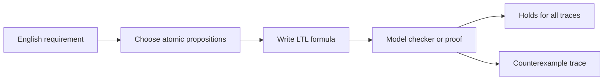

# Invariants and Temporal Logic

Embedded-system requirements are often temporal. It is not enough to say "the reset state is reachable" or "the light can be red." We need statements such as "the pedestrian signal is never green while cars have green," "every request eventually receives a response," or "after reset is asserted, the controller enters the reset state on the next tick and stays there until reset is deasserted."

Temporal logic is a precise notation for such requirements. Lee and Seshia introduce invariants first, then linear temporal logic (LTL), because invariants are the most common and simplest time-spanning properties. Formal specifications matter because English requirements leave timing ambiguities that are unacceptable in safety-critical CPS design.

## Definitions

An **invariant** is a property that remains true at all times during operation. If $p$ is a proposition over the current state and ports, then the invariant "always $p$" is written in LTL as

$$
G p.
$$

An **atomic proposition** is a Boolean statement about the current reaction, such as "input $x$ is present," "output $y$ is absent," or "the FSM is in state `ErrorReset`."

A **propositional formula** combines atomic propositions with logical connectives such as conjunction $\wedge$, disjunction $\vee$, negation $\neg$, and implication $\Rightarrow$.

An **execution trace** is a sequence of reactions, often including state:

$$
q_0,q_1,q_2,\ldots
$$

An **LTL formula** is interpreted over a single infinite trace. By convention, a formula holds for an FSM if it holds for all possible traces of that FSM.

The main LTL temporal operators are:

- $G\phi$: globally, $\phi$ holds at every suffix of the trace.
- $F\phi$: eventually, $\phi$ holds at some suffix.
- $X\phi$: next, $\phi$ holds starting at the next reaction.
- $\phi_1 U \phi_2$: $\phi_1$ holds until $\phi_2$ holds.

A **counterexample** is a trace showing that a formula does not hold.

## Key results

Safety properties say that nothing bad happens. Invariants are usually safety properties because a finite bad prefix can demonstrate violation.

Liveness properties say that something good eventually happens. A formula such as

$$
G(p \Rightarrow Fq)
$$

states a request-response property: whenever $p$ occurs, $q$ eventually occurs. A finite prefix usually cannot prove violation unless a bound is specified.

Parentheses matter. The formula

$$
G(p \Rightarrow Fq)
$$

means every occurrence of $p$ must be followed eventually by $q$. The formula

$$
(Gp) \Rightarrow (Fq)
$$

means if $p$ holds forever, then $q$ eventually holds. These are very different.

The next operator encodes immediate reaction in a clocked state machine. If reset must cause `ErrorReset` on the next tick, write a formula with $X$ rather than only $F$.

The until operator captures "remain in this condition until that condition." If $p$ is reset asserted and $q$ is the reset state, then a formula can require $q$ to hold until $\neg p$.

LTL is linear-time: it speaks about one trace at a time. CTL and related branching-time logics can quantify over possible futures directly. For CPS with continuous time, other logics such as real-time temporal logics or signal temporal logic may be more appropriate.

The act of choosing atomic propositions is part of the specification work. A formula cannot be more precise than the predicates it uses. If the model has only a proposition `obstacle`, then a property can say what happens when an obstacle is detected, but it cannot say whether the detector has sufficient range. If the model has only a proposition `deadlineMiss`, then temporal logic can forbid deadline misses, but quantitative analysis must justify whether the proposition is ever true in the implementation.

Environmental assumptions should be written as formally as guarantees. A controller may satisfy "every request is eventually acknowledged" only if the communication link eventually delivers messages or the environment does not hold reset forever. In verification, these assumptions can be modeled as constraints on input traces or as an environment FSM composed with the system. Without them, a model checker may find counterexamples that are physically irrelevant or, worse, miss a real assumption that should have been reviewed.

LTL formulas are also useful during debugging because counterexamples are executable stories. A counterexample trace says exactly which inputs, states, and outputs violate the formula. This makes formal specification less abstract than it first appears: the formula defines the requirement, and the counterexample provides a test case or design review artifact.

Invariants can be local or system-level. A local invariant might say that a variable remains within an array bound whenever a function returns. A system-level invariant might say that two conflicting actuators are never commanded at the same time. Local invariants are often proved by program analysis; system invariants often require composing several FSMs or tasks with an environment model. Both forms are useful, but they live at different modeling levels.

Bounded liveness deserves special care in CPS. "The interrupt is eventually serviced" is weak if the physical system needs service within $100$ microseconds. Plain LTL can express a bounded number of next steps with repeated $X$ operators, but it does not directly measure physical time unless the model's steps correspond to time. Real-time temporal logics or quantitative scheduling analysis are often needed to turn eventual response into deadline response.

The best specifications are readable twice: once by humans and once by tools. A formula should be accompanied by a short English statement and by definitions of each proposition. Otherwise, a technically correct formula can still encode the wrong requirement.

Temporal formulas should also be kept close to the model version they specify. If a state is renamed, an output is delayed by one tick, or an environment assumption changes, the formula may need to change as well. Specification drift is a real engineering risk, especially when models and code evolve separately.

## Visual



| Pattern | LTL form | Meaning |
|---|---|---|
| Invariant | $G p$ | $p$ is true at every reaction |
| Eventually | $F p$ | $p$ occurs at least once |
| Infinitely often | $G F p$ | From every point, $p$ occurs again |
| Steady state | $F G p$ | Eventually $p$ remains true forever |
| Request-response | $G(p \Rightarrow F q)$ | Every request is eventually answered |
| Immediate response | $G(p \Rightarrow X q)$ | Every request is answered next step |
| Until | $p U q$ | $p$ holds until $q$ occurs |

## Worked example 1: Traffic-light safety invariant

Problem: Let $carG$ mean the car traffic light is green. Let $pedG$ mean the pedestrian crossing signal is green. Formalize "cars and pedestrians are never both given right of way" and evaluate the trace below:

$$
(carG,pedG) = (false,false),(true,false),(true,true),(false,true),\ldots
$$

Method:

1. The unsafe condition is

$$
carG \wedge pedG.
$$

2. The safety requirement is that this never occurs:

$$
G\neg(carG \wedge pedG).
$$

3. Inspect each reaction in the trace.

4. Reaction 0:

$$
false\wedge false=false.
$$

5. Reaction 1:

$$
true\wedge false=false.
$$

6. Reaction 2:

$$
true\wedge true=true.
$$

7. The negated unsafe condition is false at reaction 2, so the global formula fails.

Answer: The formula is $G\neg(carG\wedge pedG)$. The given trace is a counterexample because both signals are green at reaction 2.

## Worked example 2: Reset response with next and until

Problem: Let $r$ mean reset is asserted and $e$ mean the FSM is in `ErrorReset`. Formalize: "Whenever reset is asserted, the machine is in ErrorReset on the next tick and remains there until reset is deasserted."

Method:

1. Immediate next-tick response:

$$
G(r \Rightarrow X e).
$$

2. Remaining in reset while reset stays asserted needs an until-style condition. Starting at the next tick, $e$ should hold until $\neg r$.

3. One compact formula is

$$
G(r \Rightarrow X(e\ U\ \neg r)).
$$

4. Interpret carefully: if reset is asserted now, then at the next tick the suffix must satisfy $e U \neg r$.

5. If reset is never deasserted, ordinary strong until requires $\neg r$ eventually. If that is not intended, use a weak-until variant or express the property as

$$
G(r \Rightarrow X(e\ U\ \neg r)) \vee G r
$$

   with more careful scoping, depending on the exact requirement language.

Answer: A typical strong form is $G(r \Rightarrow X(e\ U\ \neg r))$, but the engineer must decide whether reset is required to eventually deassert.

## Code

```python
def check_global_not_both(trace):
    """Check G not(carG and pedG) on a finite prefix."""
    for i, (car_g, ped_g) in enumerate(trace):
        if car_g and ped_g:
            return False, i
    return True, None

trace = [(False, False), (True, False), (True, True), (False, True)]
ok, index = check_global_not_both(trace)
print("ok:", ok, "counterexample index:", index)
```

## Common pitfalls

- Writing "eventually" when the requirement means "next tick" or "within a bounded time."
- Forgetting that an LTL formula is evaluated over traces, not just isolated states.
- Misplacing parentheses around $G$, $F$, and implication.
- Assuming a finite simulation run proves a liveness property. Liveness needs reasoning about infinite continuations or bounded variants.
- Using propositions that are not well-defined in the model.
- Ignoring environmental assumptions. A response property may require assumptions about inputs or fairness.

## Connections

- [discrete dynamics](/cs/embedded/discrete-dynamics)
- [reachability and model checking](/cs/embedded/reachability-and-model-checking)
- [equivalence and refinement](/cs/embedded/equivalence-and-refinement)
- [finite automata and DFAs](/cs/theory/finite-automata-and-dfas)
- [composition of state machines](/cs/embedded/composition-of-state-machines)
