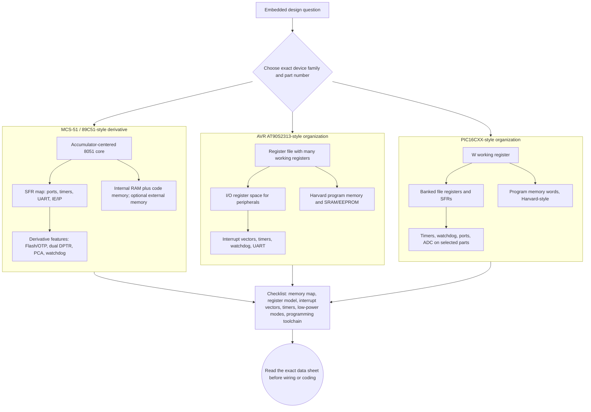

# Microcontroller Derivatives, AVR, and PIC

The later source chapters broaden the subject beyond the original 8051. They discuss conceptual derivatives of microcontrollers, an 89C51-family derivative such as the 89C51RD, AVR microcontrollers with the AT90S2313 as the example, and PIC microcontrollers in the PIC16CXX family. The point is not that these devices are identical; it is that the same embedded questions repeat with different answers: where is program memory, where are registers, how are interrupts controlled, what timers exist, and how is nonvolatile memory handled?

This page is a comparative map. It keeps the 8051 as the reference point, then highlights derivative features, AVR organization, and PIC organization. The goal is to help a reader transfer the mental model from earlier pages without assuming that instruction sets, register files, memory maps, or interrupt rules are interchangeable.

## Definitions

A **microcontroller derivative** is a device based on an established core but with added or modified features. In the MCS-51 world, derivatives may add Flash or OTP program memory, more RAM, dual data pointers, enhanced UART behavior, power-saving modes, watchdog timers, programmable counter arrays, or supervisory functions.

**OTP** means one-time programmable memory. It can be programmed after manufacture but not erased and rewritten like Flash in ordinary use.

The **89C51** family is a Flash or EPROM-style MCS-51 derivative family. The source contents mention 89C51 microcontroller features and 89C51RD-style enhancements such as stop-clock mode, enhanced UART, automatic address recognition, dual DPTR, programmable counter array, and supervisory control.

**AVR** is an 8-bit RISC microcontroller family. The source example is AT90S2313, which includes a register file, I/O memory, timers, interrupts, EEPROM access registers, and watchdog support.

**PIC16CXX** is a family of Microchip 8-bit microcontrollers. The source chapter introduces PIC features, Harvard architecture, program memory, data memory, watchdog timer, pin diagrams such as PIC16C61 and PIC16C71, and core/peripheral features.

**Harvard architecture** separates program memory and data memory. Many microcontrollers, including classic 8051, AVR, and PIC designs, use Harvard or modified Harvard organization.

A **watchdog timer** resets or interrupts the system if software fails to service it in time. It is a supervisory feature for fault recovery.

## Key results

The first key result is that family names do not define exact peripheral sets. "8051-compatible" may still mean different timer counts, memory sizes, UART options, and SFR additions. "PIC16CXX" and "AVR" similarly cover multiple devices. Always read the exact device data sheet after learning the family pattern.

The second key result is that derivative features often remove common bottlenecks. A dual DPTR speeds block moves, enhanced UART features reduce address-filtering overhead, and on-chip Flash simplifies development compared with external EPROM or OTP-only parts.

The third key result is that AVR's register-rich design changes programming style. Instead of an accumulator-centered model, AVR has many working registers and efficient register-to-register operations. I/O registers are mapped into an I/O space that can be accessed by special instructions.

The fourth key result is that PIC16 devices use a different execution and memory model. They have a working register often called `W`, file registers, banked data memory, and instruction words in program memory. Code that looks natural on 8051 or AVR is not mechanically portable to PIC assembly.

The fifth key result is that watchdogs and power modes are system design features, not afterthoughts. Idle, power-down, stop-clock, or sleep modes affect clocks and peripherals. Watchdog servicing must be placed so that it proves the main control loop is healthy rather than merely proving one timer interrupt is still running.

The sixth key result is that interrupt handling must be relearned for each family. Vector addresses, priority rules, flag clearing, context saving, and return instructions differ. A transferable concept is "save state, identify source, clear or acknowledge source, do short work, restore state"; the exact mechanism is family-specific.

The seventh key result is that development workflow changes with memory technology. OTP parts encourage simulation and careful verification before programming because mistakes are permanent for that chip. Flash derivatives support faster edit-program-test cycles. Devices with EEPROM allow field settings or calibration data to survive reset, but EEPROM should not be used as scratch RAM because of write time and endurance limits.

The eighth key result is that compiler support does not erase architectural differences. A C compiler can hide many assembly details, but the header files still expose device-specific registers, interrupt names, memory qualifiers, and bit definitions. Portable application logic is possible; low-level initialization and ISR code remain tied to the exact device family.

## Visual

| Feature area | 8051/MCS-51 reference | 89C51-style derivative | AVR AT90S2313-style view | PIC16CXX-style view |
|---|---|---|---|---|
| CPU style | Accumulator plus registers and SFRs | Same core with added features | RISC with many working registers | W register plus file registers |
| Program memory | On-chip or external code memory | Flash/OTP options, larger variants | On-chip program memory | On-chip program memory words |
| Data memory | Internal RAM, SFRs, optional external RAM | More RAM/SFR features in variants | Register file, SRAM, I/O memory | Banked file registers |
| Pointers | DPTR, sometimes one pointer | Dual DPTR in some derivatives | Pointer registers such as X/Y/Z in many AVRs | Indirect file access mechanisms |
| Timers | Timer 0 and Timer 1 baseline | Extra counters/PCA in variants | Timer/counter registers | Timer modules and watchdog |
| Low power | Idle and power-down | Stop-clock and supervision in some parts | Sleep modes | Sleep and watchdog wake/reset |



This derivative-comparison diagram shows that 8051 derivatives, AVR devices, and PIC16 devices answer the same architectural questions with different register models and memory maps. The MCS-51 branch labels SFR-centered extensions, the AVR branch labels its larger working-register file and I/O register space, and the PIC branch labels the W register plus banked file-register model. The final checklist explains why concepts transfer across families but low-level code and wiring must follow the exact part data sheet.

## Worked example 1: Choosing between idle and power-down thinking

Problem: A battery system must wake quickly every 10 ms to sample a digital input and must keep its timer running. Should the firmware use a mode that stops most clocks including the timer, or a lighter idle mode that leaves timer hardware active?

Method:

1. The system needs a periodic wakeup every 10 ms.

2. If the selected power mode stops the timer clock, the timer cannot generate the wakeup unless another wake source is available.

3. A lighter idle mode often stops CPU execution while allowing selected peripherals or interrupts to continue.

4. The timer overflow interrupt can wake the CPU from idle, run the sample code, and return to idle.

5. A deeper power-down mode may save more energy but requires an external interrupt, watchdog, or RTC-style wake source.

Answer: use an idle-style mode if the on-chip timer must remain the 10 ms wake source. Use a deeper stop or power-down mode only if another wake source is explicitly provided.

Check: The correct answer is device-specific. On any 89C51, AVR, or PIC derivative, confirm which clocks run in the chosen sleep mode.

## Worked example 2: Avoiding a watchdog design mistake

Problem: A firmware design services the watchdog inside a timer interrupt that fires every 1 ms. The main loop can hang forever, but interrupts continue. Is the watchdog protecting the application?

Method:

1. The purpose of the watchdog is to detect software failure.

2. If the watchdog is cleared in a timer ISR, it proves only that the timer interrupt still runs.

3. The main loop may be stuck while the ISR continues to clear the watchdog.

4. Therefore the watchdog will not reset the system even though the application has failed.

5. A better design sets health flags in the main tasks and clears the watchdog only after the scheduler or main loop observes that required tasks have progressed.

Answer: no, the watchdog is not protecting the full application. It should be serviced only when the main control path has demonstrated health.

Check: If interrupts stop too, the watchdog may still reset the system. The flaw is that one class of failure, a hung main loop with active interrupts, is hidden.

## Code

```c
/* Portable-style watchdog policy skeleton.
   Hardware-specific watchdog_clear() is intentionally isolated. */

volatile unsigned char task_sample_ok;
volatile unsigned char task_comm_ok;

void main_loop_iteration(void) {
    task_sample_ok = 0;
    task_comm_ok = 0;

    sample_inputs();
    task_sample_ok = 1;

    service_communication();
    task_comm_ok = 1;

    if (task_sample_ok && task_comm_ok) {
        watchdog_clear();     /* clear only after required work succeeds */
    }
}
```

## Common pitfalls

- Assuming an 8051 derivative has exactly the same SFRs and reset values as the original 8051.
- Treating AVR, PIC, and 8051 assembly as syntactic variants. Their register and memory models are fundamentally different.
- Clearing a watchdog from an interrupt without checking main-program progress.
- Entering a low-power mode without confirming which wake sources remain active.
- Forgetting bank selection in PIC-style data memory before accessing file registers.
- Assuming on-chip nonvolatile memory has unlimited write endurance.
- Porting delay loops between families without recalculating instruction timing and clock division.

## Connections

- [8051 architecture, memory, and ports](/cs/embedded/8051-architecture-memory-ports)
- [8051 timers, serial port, and interrupts](/cs/embedded/8051-timers-serial-interrupts)
- [Serial EEPROM and DS1307 RTC interfacing](/cs/embedded/serial-eeprom-rtc-ds1307)
- [Serial buses and embedded protocols](/cs/embedded/serial-buses-embedded-protocols)
