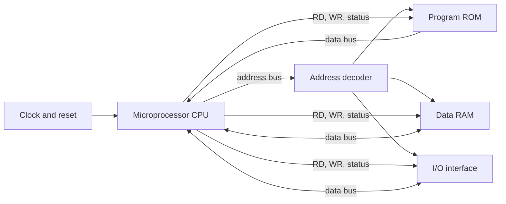

# Microprocessor and Microcomputer Basics

A microprocessor is a programmable digital processing unit: it fetches instructions from memory, interprets them, performs arithmetic or logic, and controls data movement through buses. The source text begins with this foundation before moving into the 8085, because every later topic - timing, interrupts, memory interfacing, I/O ports, and microcontrollers - is easier when the processor is seen as a small set of cooperating blocks rather than as a black box.

A microcomputer is the useful system built around the microprocessor. It includes memory, input/output circuits, clocks, reset circuitry, bus drivers, and the program that coordinates them. The important distinction is that a microprocessor such as the 8085 is mainly a CPU chip, while a microcontroller such as the 8051 also places RAM, ROM, timers, ports, and serial hardware on the same chip. The whole subject is about learning where each function lives and how software makes the hardware move in the required order.


*Figure: Intel C8085AH microprocessor. Image: [Wikimedia Commons](https://commons.wikimedia.org/wiki/File:Intel_C8085AH.jpg), Thomas Nguyen, CC BY-SA 4.0.*

## Definitions

A **microprocessor** is an integrated circuit that contains the arithmetic logic unit, control unit, internal registers, and bus interface needed to execute instructions. It does not, by itself, include a complete user system. The classic 8085 is an 8-bit microprocessor: its main data operations are 8 bits wide, while its address bus is 16 bits wide.

A **microcomputer system** is a complete small computer built from a microprocessor plus external memory and I/O. In the 8085 chapters this usually means the 8085, ROM or EPROM for program storage, RAM for variables and stack, latches for demultiplexing the low address/data bus, decoders for chip selection, and peripheral devices such as the 8255 programmable peripheral interface.

A **bus** is a shared set of signal lines. The three usual bus groups are:

- **Address bus**: carries the memory or I/O location selected by the processor.
- **Data bus**: carries instruction bytes, operands, and results.
- **Control bus**: carries read, write, status, interrupt, reset, clock, and bus-arbitration signals.

A **register** is fast storage inside the CPU. In the simple model used before studying the 8085, the register array supplies operands to the arithmetic logic unit and stores temporary results. In the 8085, the programmer-visible registers include the accumulator `A`, general registers `B`, `C`, `D`, `E`, `H`, `L`, the flag register, the stack pointer, and the program counter.

An **accumulator** is a register closely tied to the ALU. On accumulator-oriented machines, many arithmetic and logical instructions implicitly use the accumulator as one operand and destination. For example, 8085 `ADD B` means `A <- A + B`.

A **decoder** activates exactly one output line for a selected binary input pattern. A memory decoder converts high-order address bits into chip-select signals. An instruction decoder converts an opcode into internal control actions.

The **fetch-decode-execute cycle** is the repeated sequence by which a CPU runs a program. Fetch reads the next opcode from memory, decode identifies the required operation, and execute performs register transfers, ALU work, memory access, or control transfer.

## Key results

The first key result is that address width determines maximum directly addressable locations. If a processor has $n$ address lines and each address names one byte, the address space is:

$$
\text{addressable bytes} = 2^n
$$

For the 8085, $n = 16$, so the processor can address $2^{16} = 65536$ byte locations, usually written as 64 KiB. This is why 8085 memory maps are commonly drawn from `0000H` through `FFFFH`.

The second key result is that data width and address width solve different problems. An 8-bit data bus does not limit the system to 256 bytes of memory; it means the CPU normally transfers one byte per bus transaction. A 16-bit address bus is what selects among 65536 byte positions. Larger values are handled by multiple instructions, multiple bytes, or register pairs.

The third key result is that a microprocessor is synchronous at the instruction level. A clock divides actions into states. A machine cycle is one bus operation such as opcode fetch, memory read, memory write, I/O read, or I/O write. An instruction cycle contains one or more machine cycles. This vocabulary is needed later when timing diagrams show `ALE`, `RD`, `WR`, and the multiplexed 8085 address/data lines.

The fourth key result is that program order is normally controlled by the program counter. After fetching an instruction, the CPU increments the program counter to the next byte. Branch, call, return, interrupt, and reset operations change this ordinary sequence. That single idea connects simple loops, subroutines, interrupt service routines, and booting.

Finally, the stored-program idea is central: instructions and data are both binary values in memory. Whether a byte is interpreted as an opcode, an address, a literal constant, or a variable depends on the current control state of the CPU and the program counter.

## Visual



| Concept | 8085-style microprocessor system | 8051-style microcontroller system |
|---|---|---|
| CPU location | One CPU chip | CPU inside MCU chip |
| Program memory | Usually external ROM/EPROM in basic designs | On-chip ROM/Flash in many variants, optional external memory |
| Data memory | External RAM plus stack | Internal RAM plus optional external RAM |
| I/O | External peripheral chips or decoded ports | On-chip parallel ports and serial port |
| Timing study | External buses and control signals are visible | Many bus cycles are internal, peripheral timing matters |
| Typical learning focus | Address decoding, bus cycles, 8085 assembly | SFRs, ports, timers, serial communication, interrupts |

## Worked example 1: Address space from bus width

Problem: An 8085-based trainer has 16 address lines and byte-addressed memory. Determine the lowest address, highest address, and total byte capacity that can be selected without bank switching.

Method:

1. The number of unique binary patterns on 16 address lines is:

$$
2^{16} = 65536
$$

2. Because each address selects one byte, the capacity is 65536 bytes.

3. Convert to KiB:

$$
65536 / 1024 = 64
$$

4. The lowest all-zero address is:

$$
0000\text{H}
$$

5. The highest all-one address has four hexadecimal digits because 16 bits equal four nibbles:

$$
1111\ 1111\ 1111\ 1111_2 = \text{FFFFH}
$$

Answer: the address range is `0000H` through `FFFFH`, and the maximum directly addressable memory is 64 KiB.

Check: The count of addresses from `0000H` to `FFFFH` is not `FFFFH`; it is `FFFFH + 1 = 10000H = 65536`, because zero is included.

## Worked example 2: Tracing a simple accumulator operation

Problem: Suppose register `A` contains `25H` and register `B` contains `19H`. The next instruction is 8085 `ADD B`. Find the new accumulator value and the carry flag.

Method:

1. Interpret the instruction. `ADD B` adds `B` to the accumulator and stores the result in the accumulator:

$$
A \leftarrow A + B
$$

2. Substitute the values:

$$
25\text{H} + 19\text{H}
$$

3. Add in hexadecimal:

$$
\begin{aligned}
5 + 9 &= 14 = E\text{H} \\
2 + 1 &= 3
\end{aligned}
$$

4. The result is:

$$
3E\text{H}
$$

5. Check carry out of bit 7. The largest 8-bit value is `FFH`. Since `3EH` is less than or equal to `FFH`, no carry out occurs.

Answer: `A = 3EH`, and the carry flag `CY = 0`.

Check: In decimal, `25H = 37` and `19H = 25`. Their sum is `62`, which is `3EH`, confirming the hexadecimal result.

## Code

```asm
; 8085: add two bytes stored in memory and save result plus carry.
; Input: 2050H = first byte, 2051H = second byte
; Output: 2052H = low 8-bit sum, 2053H = carry byte (00H or 01H)

        LDA 2050H      ; A <- first byte
        MOV B,A        ; B <- first byte
        LDA 2051H      ; A <- second byte
        ADD B          ; A <- A + B, CY set if carry out
        STA 2052H      ; store low byte of sum
        MVI A,00H      ; assume no carry
        JNC STORE_CY   ; if CY = 0, keep A = 00H
        INR A          ; otherwise A = 01H
STORE_CY:
        STA 2053H
        HLT
```

## Common pitfalls

- Confusing data width with address space. An 8-bit CPU may still address much more than 256 bytes if it has more address lines.
- Forgetting that zero is an address. A range ending at `FFFFH` contains `10000H` locations, not `FFFFH` locations.
- Treating the accumulator as an ordinary memory location. It is an internal register with special instruction support.
- Ignoring control signals. A valid address on the bus is not enough; a memory chip also needs the correct read or write control and chip select.
- Thinking of microcontrollers as merely "small microprocessors." The decisive difference is integration of memory and peripherals on the same chip.
- Assuming every byte in memory is data. During fetch, a byte is an opcode; during an operand read, a byte may be data or an address part.

## Connections

- [8085 architecture, buses, and timing](/cs/embedded/intel-8085-architecture-buses-timing)
- [8085 instruction set and addressing](/cs/embedded/8085-instruction-set-addressing)
- [8051 architecture, memory, and ports](/cs/embedded/8051-architecture-memory-ports)
- [8255 programmable peripheral interface](/cs/embedded/8255-programmable-peripheral-interface)

