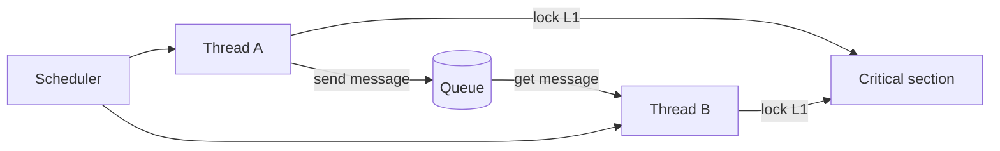

# Multitasking and Threads

Multitasking is the mid-level machinery that lets multiple imperative computations appear to run at the same time. It sits between hardware mechanisms such as interrupts and multicore processors, and higher-level models such as synchronous-reactive or dataflow models. In embedded systems, multitasking is attractive because devices must handle many activities at once: sampling, control, communication, display updates, logging, and fault handling.

The difficulty is that threads expose concurrency through shared memory and interleavings of sequential code. Lee and Seshia treat threads as powerful but hazardous. Race conditions, deadlock, memory-consistency surprises, and missed timing properties can lurk for years because the bad interleaving may be rare.

## Definitions

An **imperative program** expresses computation as a sequence of operations. C is an imperative language.

A **thread** is an imperative program running concurrently with other threads in a shared memory space. Threads can access the same global variables, heap objects, and device state.

A **process** is an imperative program with its own memory space. Processes communicate through operating-system mechanisms such as files, pipes, sockets, shared memory regions, or message passing.

A **scheduler** decides which thread or process runs when a processor is available. A scheduler may be invoked by a timer interrupt, blocking operation, system call, or task completion.

A **race condition** occurs when concurrent pieces of code access the same resource and the result depends on the order of access.

A **mutex** is a mutual-exclusion lock. Code protected by a mutex is a **critical section**.

A **deadlock** occurs when tasks are permanently blocked waiting for resources held by each other.

A **condition variable** lets one thread block until a condition on shared state may have changed. In Pthreads, condition variables are used together with mutexes.

A **semaphore** is a synchronization object whose value controls whether a task proceeds or blocks. Counting semaphores generalize the idea of a resource count.

## Key results

Threads are easy to create but hard to reason about. A thread may be suspended between atomic operations. At the C level, a statement is not necessarily atomic. At the machine level, even some instructions may not be atomic.

Mutexes prevent simultaneous access only when every access follows the same discipline. Protecting writes but not reads is insufficient because a reader can observe a data structure in a temporarily inconsistent state.

Deadlock requires a cycle of waiting. A classic pattern is: thread $A$ holds lock $L_1$ and waits for $L_2$, while thread $B$ holds $L_2$ and waits for $L_1$. Avoidance strategies include a single global lock, fixed lock ordering, timeout/backoff, or higher-level concurrency models.

Memory consistency is subtle. Sequential consistency means the result appears as if all thread operations were interleaved in one sequence that preserves each thread's order. Many compilers and processors do not provide that guarantee for unprotected shared variables.

Message passing reduces shared-memory hazards by transferring data through controlled queues. It can still deadlock, become nondeterminate, or exhaust memory if producers outrun consumers.

Processes improve isolation when supported by memory protection. Isolation prevents accidental direct access to another process's variables, but communication still requires careful design.

Thread APIs make concurrency look like a library feature, but the semantics involve the compiler, processor, memory system, operating system, and sometimes interrupt controller. For example, a compiler may keep a variable in a register unless synchronization tells it that another thread can change the value. A processor may reorder independent memory operations. A cache-coherent multicore may make writes visible to other cores later than a programmer expects. Correct locking primitives handle these details by including the required memory-ordering effects.

Embedded systems often use a mixture of concurrency styles. A bare-metal firmware loop may use interrupts for timing, a small RTOS may provide tasks and semaphores, and a communication stack may use message queues. Mixing styles is not wrong, but every boundary must be explicit. If an ISR posts a message to a thread, the queue implementation must be safe for ISR context. If a high-priority control task shares a lock with a low-priority logging task, the scheduler must address priority inversion.

The safest path is often to limit the patterns available to application code. Instead of arbitrary shared variables, use single-writer ownership, bounded queues, immutable messages, or generated code from a higher-level MoC. This does not eliminate concurrency, but it moves the hardest reasoning into a smaller reusable mechanism.

Thread priority does not by itself define correctness. A high-priority control task can still be delayed by a lower-priority task if they share a lock, by an ISR if interrupts run above the scheduler, or by a device driver if the driver disables interrupts too long. The multitasking design must therefore be reviewed with the scheduler and I/O architecture. Race freedom, deadlock freedom, and schedulability are connected properties.

Message passing is often easier to review because data movement is explicit. A producer creates a message, transfers ownership to a queue, and the consumer receives it. But message passing still needs bounds. If the producer's rate is higher than the consumer's rate, the queue grows, drops messages, or blocks the producer. Each of those behaviors is a design choice with consequences for timing and correctness.

Processes are useful when fault isolation matters. A process crash can be contained if the operating system protects memory and can restart the process or move the system to a safe mode. Small microcontrollers may lack such hardware support, which is one reason bare-metal embedded software relies so heavily on static structure and careful review.

A useful rule for embedded application code is to make concurrency visible in interfaces. A function that may block, acquire a lock, run in ISR context, or call back into user code should say so in its contract. Otherwise, callers can accidentally create deadlocks, priority inversions, or illegal ISR operations while using an apparently ordinary API.

## Visual



| Concurrency mechanism | Memory sharing | Main advantage | Main failure mode |
|---|---|---|---|
| Interrupts | Shared with main code | Low-level responsiveness | Atomicity bugs |
| Threads | Shared address space | Lightweight communication | Races and deadlock |
| Processes | Separate address spaces | Fault isolation | IPC overhead |
| Message passing | Shared only inside library/kernel | Structured communication | Buffer growth and blocking cycles |
| Higher-level MoC | Model-specific | Stronger semantics | Implementation complexity |

## Worked example 1: Race in a non-atomic increment

Problem: Two threads each execute `x = x + 1` once. The initial value is $x=0$. Assume the statement compiles into three atomic actions: read `x`, add one locally, write `x`. Show an interleaving where the final value is $1$ instead of $2$.

Method:

1. Initial state:

$$
x=0.
$$

2. Thread A reads:

$$
A_{\mathrm{local}}=0.
$$

3. Thread B reads before A writes:

$$
B_{\mathrm{local}}=0.
$$

4. Thread A adds and writes:

$$
A_{\mathrm{local}}=1,\quad x:=1.
$$

5. Thread B adds and writes:

$$
B_{\mathrm{local}}=1,\quad x:=1.
$$

6. The write from B overwrites the same value A wrote, not an incremented value based on A's result.

Answer: The final value can be $1$. The operation is not atomic, so one increment is lost.

## Worked example 2: Deadlock by lock ordering

Problem: Thread A locks $L_1$ then tries to lock $L_2$. Thread B locks $L_2$ then tries to lock $L_1$. Show the deadlock state and a simple lock-ordering fix.

Method:

1. A acquires $L_1$:

$$
owner(L_1)=A.
$$

2. B acquires $L_2$:

$$
owner(L_2)=B.
$$

3. A requests $L_2$. It blocks because $L_2$ is owned by B.

4. B requests $L_1$. It blocks because $L_1$ is owned by A.

5. Wait-for graph:

$$
A\to B,\qquad B\to A.
$$

6. The cycle means neither thread can proceed.

7. Fix: impose one global order, for example always acquire $L_1$ before $L_2$. Then B cannot hold $L_2$ while waiting for $L_1$.

Answer: The original code can deadlock. A fixed lock acquisition order removes this two-lock cycle.

## Code

```python
from collections import deque

class BoundedQueue:
    def __init__(self, capacity):
        self.capacity = capacity
        self.items = deque()

    def send(self, item):
        if len(self.items) >= self.capacity:
            return False
        self.items.append(item)
        return True

    def get(self):
        if not self.items:
            return None
        return self.items.popleft()

queue = BoundedQueue(capacity=2)
print(queue.send("sensor:10"))
print(queue.send("sensor:11"))
print(queue.send("sensor:12"))  # would block or fail in a real design
print(queue.get())
```

## Common pitfalls

- Protecting only some accesses to a shared resource. A mutex discipline must cover all reads and writes that depend on consistency.
- Calling unknown callbacks while holding a lock. The callback may acquire another lock and create deadlock.
- Assuming tests will reveal rare interleavings. Many concurrency bugs are schedule-dependent and may not appear during ordinary testing.
- Passing a pointer to a stack variable as a thread argument after the creating function returns.
- Using unbounded message queues in long-running embedded systems.
- Forgetting that memory consistency depends on compiler, hardware, and synchronization primitives.

## Connections

- [process synchronization](/cs/operating-systems/process-synchronization)
- [CPU scheduling](/cs/operating-systems/cpu-scheduling)
- [input and output interfacing](/cs/embedded/input-output-interfacing)
- [concurrent models of computation](/cs/embedded/concurrent-models-of-computation)
- [scheduling and real time](/cs/embedded/scheduling-and-real-time)
