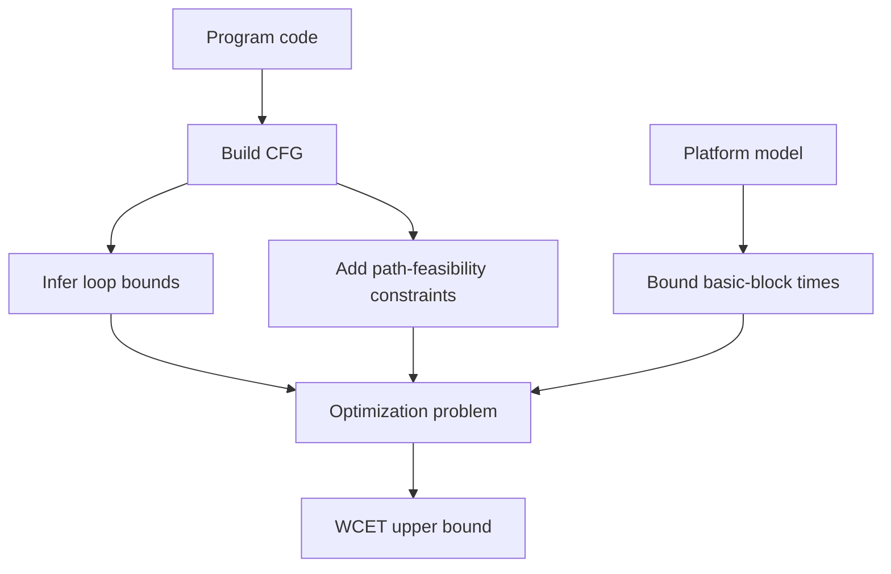

# Quantitative Analysis

Quantitative analysis asks whether a measurable property stays within required bounds. In embedded systems, those properties include execution time, memory use, energy, power, reaction time, physical position, temperature, and network delay. Timing is the representative case because a correct control value can be unsafe if it is produced too late.

Lee and Seshia focus on execution-time analysis, especially worst-case execution time (WCET). The key theme is that WCET is a property of both the program and the platform. Loops, branches, function calls, infeasible paths, caches, pipelines, interrupts, and memory hierarchy all affect the result.

## Definitions

A **quantitative property** is any measurable property of the system or its execution.

For a program $P$ running in environment $E$, a quantity $q$ can be viewed abstractly as

$$
q=f_P(x,w),
$$

where $x$ represents program inputs and $w$ represents environmental parameters such as cache state or network delay.

The **worst-case execution time** (WCET) is the largest execution time over all relevant inputs and platform states. The **best-case execution time** (BCET) is the smallest.

An **upper bound** on WCET is safe if it is greater than or equal to the true WCET. A bound is **tight** if it equals or closely approximates the true extreme; it is **loose** if it is overly pessimistic.

A **threshold property** asks whether a quantity always stays below or above a threshold:

$$
\forall x,w,\quad f_P(x,w)\le T.
$$

A **basic block** is a straight-line code region with one entry and one exit. A **control-flow graph** (CFG) has basic blocks as nodes and possible control transfers as edges.

A **loop bound** is an upper bound on how many times a loop can execute. A **ranking function** maps program states to a well-ordered set and decreases on each loop iteration, proving termination.

## Key results

Termination and loop bounds are prerequisites for WCET. Without a bound on loop iterations or recursion depth, the worst-case time may be unbounded. Determining such bounds is undecidable in general, but many embedded coding styles use simple bounded loops.

Path explosion is real. A loop body with a conditional executed $10{,}000$ times can have $2^{10000}$ branch-outcome paths. WCET methods therefore avoid enumerating every path.

Some paths are infeasible. A naive maximum over all CFG paths can be too pessimistic if it includes branch combinations that cannot occur for any input.

The implicit path enumeration technique uses variables to count how often basic blocks or edges execute, then maximizes a linear cost subject to flow constraints and loop/path constraints. If block $i$ has execution-time bound $w_i$ and executes $x_i$ times, the objective is

$$
\max \sum_i w_i x_i.
$$

Hardware matters. Cache misses, pipeline stalls, branch prediction, DRAM refresh, and bus contention can make instruction timing vary by orders of magnitude. Accurate WCET requires platform modeling or careful measurement.

Other quantitative analyses use similar ideas. Stack-size analysis examines call graphs and interrupt nesting. Heap analysis must handle dynamic allocation and fragmentation. Energy analysis often depends on instruction mix, data values, switching activity, and execution time.

Quantitative analysis differs from ordinary testing because it must reason about extremes. A test can show that one input completes in $80$ microseconds; it cannot by itself show that no input takes more than $100$ microseconds. Static analysis attempts to prove a bound by considering program structure and platform behavior. Measurement-based analysis attempts to guide tests toward expensive paths and use platform measurements. Many practical tools combine the two.

The environment parameter $w$ is often where hidden assumptions live. The same function may run quickly when cache lines are warm and slowly when they are cold. It may run quickly when interrupts are disabled and slowly when preempted by a high-priority ISR. It may use little energy for one data pattern and more for another because switching activity differs. A defensible bound must say which platform states and interferences are included.

There is also a useful distinction between proving a tight bound and proving a threshold. If the deadline is $1$ millisecond, an analysis that proves WCET $\le 0.7$ milliseconds is sufficient even if the true WCET is $0.45$ milliseconds. Tightness matters when resources are scarce or schedules are dense, but safety often requires only a conservative bound below the required threshold.

Quantitative models should state whether they are compositional. If one task has a WCET of $200$ microseconds and another has a WCET of $300$ microseconds, their combined worst case is not always just $500$ microseconds. Shared caches, bus contention, locks, preemption, and pipeline state can add interference. Conversely, two worst cases may be mutually exclusive because they require incompatible inputs. Good analysis records which quantities can be safely added and which require a joint model.

Loop-bound inference is a bridge between program semantics and arithmetic constraints. A simple `for` loop with a constant bound is straightforward. A `while` loop that shifts an unsigned integer right until zero requires reasoning about bit width. A loop that depends on sensor input or network input may require environmental assumptions, input validation, or a timeout. The more the bound depends on external behavior, the more it belongs in the system requirements rather than hidden inside code.

Energy and power analysis show why execution time is not the only resource. A program may run quickly but draw high peak current, or run slowly in a low-power mode and consume less total energy. Wireless transmission, flash writes, and sensor polling can dominate CPU cost. CPS design often requires trading time, energy, accuracy, and lifetime rather than optimizing one quantity in isolation.

Quantitative assumptions should be versioned with the platform. A compiler upgrade, cache configuration change, different flash wait-state setting, or new RTOS tick rate can invalidate a previous bound. For that reason, timing and memory analyses belong in the build and release evidence, not only in an early design notebook.

## Visual



| Factor | Why it affects WCET | Typical analysis response |
|---|---|---|
| Loop bounds | Repetition dominates time | Prove or annotate max iterations |
| Branch paths | Different blocks execute | CFG flow constraints |
| Infeasible paths | Naive max may be impossible | Logical constraints |
| Function calls | Stack and path expansion | Call graph analysis |
| Cache | Hits and misses differ widely | Abstract interpretation or cache constraints |
| Pipeline | Hazards and stalls | Microarchitectural model |
| Interrupts | Preemption adds latency | Include ISR interference |

## Worked example 1: Loop-bound WCET estimate

Problem: A loop executes at most $32$ iterations. Each iteration executes blocks with worst-case times: condition block $2$ cycles, body block $10$ cycles, update block $3$ cycles. The loop exit condition costs $2$ cycles one extra time. Estimate a simple WCET bound.

Method:

1. Condition block executes once per iteration plus one final exit check:

$$
32+1=33.
$$

2. Condition cost:

$$
33\cdot 2=66.
$$

3. Body cost:

$$
32\cdot 10=320.
$$

4. Update cost:

$$
32\cdot 3=96.
$$

5. Total bound:

$$
66+320+96=482.
$$

Answer: A simple WCET upper bound is $482$ cycles, assuming the block bounds already include hardware effects and no interrupts occur.

## Worked example 2: Cache conflict effect

Problem: A loop reads arrays `x` and `y`. On one input size, all needed values fit in one cache block after the first miss. On another size, every access alternates between two blocks mapping to the same direct-mapped cache set. Suppose a cache hit costs $1$ cycle, a miss costs $50$ cycles, and the loop performs $16$ loads. Compare memory-load costs if there is 1 miss versus 16 misses.

Method:

1. Case A: one miss and fifteen hits:

$$
1\cdot 50 + 15\cdot 1 = 65.
$$

2. Case B: sixteen misses:

$$
16\cdot 50=800.
$$

3. Difference:

$$
800-65=735.
$$

4. Ratio:

$$
\frac{800}{65}\approx 12.31.
$$

Answer: The conflict-heavy case costs $800$ cycles for loads, about $12.3$ times the $65$-cycle case. Small layout changes can have large timing effects.

## Code

```python
def loop_wcet(iterations, costs):
    condition = (iterations + 1) * costs["condition"]
    body = iterations * costs["body"]
    update = iterations * costs["update"]
    return condition + body + update

costs = {"condition": 2, "body": 10, "update": 3}
print(loop_wcet(32, costs))

def load_cost(loads, misses, hit_cost=1, miss_cost=50):
    return misses * miss_cost + (loads - misses) * hit_cost

print(load_cost(16, 1), load_cost(16, 16))
```

## Common pitfalls

- Using measured average time as a hard real-time guarantee.
- Ignoring infeasible paths in one direction and hardware variation in the other; both can dominate the bound quality.
- Writing unbounded loops or recursion in code that must have a WCET.
- Assuming cache improves all timing. Caches improve average time but can make worst-case analysis harder.
- Forgetting ISR interference when analyzing a task's execution time.
- Treating a loose WCET bound as useless. A loose safe bound may still prove a threshold property if it is below the deadline.

## Connections

- [scheduling and real time](/cs/embedded/scheduling-and-real-time)
- [memory architectures](/cs/embedded/memory-architectures)
- [embedded processors architecture](/cs/embedded/embedded-processors-architecture)
- [reachability and model checking](/cs/embedded/reachability-and-model-checking)
- [Turing machines and Church-Turing thesis](/cs/theory/turing-machines-and-the-church-turing-thesis)
