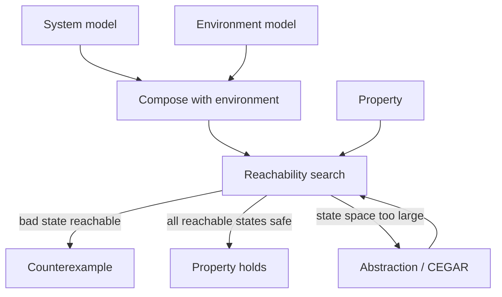

# Reachability and Model Checking

Model checking is algorithmic formal verification. Given a finite-state model and a formal property, it attempts to answer whether the model satisfies the property. In embedded systems, this is useful for checking mode logic, protocols, mutual exclusion, controller supervision, and abstractions of software or hardware.


*Figure: Arduino boards make microcontroller I/O and prototyping tangible. Image: [Wikimedia Commons](https://commons.wikimedia.org/wiki/File:Arduino_Uno_-_R3.jpg), SparkFun Electronics, CC BY 2.0.*

Lee and Seshia build model checking around reachability. If a bad state is unreachable, then a safety invariant holds. If an accepting cycle corresponding to the negation of a liveness property is reachable, then the model has a counterexample. The power of the method is exhaustive exploration; the challenge is state explosion.

## Definitions

An **open system** receives inputs from and may produce outputs to an environment. A **closed system** has no inputs. Verification usually closes the system by composing the design with an environment model.

The **reachable set** is the set of states that can occur from the initial state under the transition relation.

**Reachability analysis** computes or overapproximates this set.

A property of the form

$$
G p
$$

holds if proposition $p$ is true in every reachable state of the closed system.

**Explicit-state model checking** stores and explores individual states, often using depth-first search (DFS) or breadth-first search (BFS).

**Symbolic model checking** represents sets of states by logical formulas or specialized data structures such as binary decision diagrams, and manipulates sets rather than individual states.

The **state-explosion problem** is the exponential growth of composite state spaces. If $k$ components have $n_1,n_2,\ldots,n_k$ states, the product can have

$$
\prod_{i=1}^{k}n_i
$$

states.

An **abstraction** hides details to reduce state space. A sound abstraction may have more behaviors than the concrete system, so if the abstraction satisfies a universal safety property, the concrete system does too.

**CEGAR** stands for counterexample-guided abstraction refinement. It begins with a coarse abstraction, checks it, and refines it when a counterexample is spurious.

## Key results

To verify $G p$, compute all reachable states and check $p$ on each one. If any reachable state violates $p$, the path to that state is a counterexample. If no reachable state violates $p$, the invariant holds.

Explicit DFS is linear in the size of the explored state graph, but the graph may be enormous relative to the model description. This makes representation and reduction techniques central.

Symbolic search computes a fixed point over sets:

$$
R_0=\{s_0\},\qquad
R_{i+1}=R_i \cup \mathrm{post}(R_i),
$$

where $\mathrm{post}(R_i)$ is the set of one-step successors of states in $R_i$. When $R_{i+1}=R_i$, the reachable set has been found.

Abstraction can replace large data domains with predicates. If a proof only needs whether `old == new`, a Boolean predicate may replace two 32-bit variables, shrinking a potential $2^{64}$ value space to $2$ abstract values for that aspect.

Liveness model checking often converts the negation of an LTL property into an automaton and composes it with the system. If the product has a reachable accepting cycle, then a counterexample trace exists.

Nested DFS detects such cycles by first finding an accepting state reachable from the initial state, then searching from that accepting state back to itself.

Closed-system construction is a modeling step that deserves review. If the environment model is too permissive, verification may fail for unrealistic input sequences. If it is too restrictive, verification may pass by excluding real hazards. For example, a pedestrian model for a traffic light should allow button presses at inconvenient times if those are physically possible. A communication model should include message loss or delay if the real network can exhibit them.

Reachability also explains why simulation tests are not enough for safety-critical systems. Running a model on many sample inputs explores some paths, while reachability attempts to cover all paths in the finite abstraction. The price is computational cost, but the reward is a stronger statement: no reachable state violates the invariant, subject to the model assumptions.

Abstraction must preserve the property being checked. Hiding a timer variable may be fine for proving that green and pedestrian-walk are never simultaneous, but not fine for proving that yellow lasts at least five seconds. Hiding a data value may be fine for proving control-state reachability, but not for proving an arithmetic bound. The best abstraction is not the smallest one; it is the smallest one that is still sound for the property.

Counterexamples should be treated as design artifacts. A safety counterexample gives a finite path from the initial state to a bad state. That path can be translated into a test, a simulation scenario, or a requirements discussion. If the path depends on unrealistic environment behavior, the environment model should be refined and the assumption documented. If the path is realistic, it is a bug in the model or design.

For liveness properties, the counterexample often has a stem and a loop. The stem reaches a region of the state graph, and the loop repeats forever while avoiding the desired response. For example, a request-response property fails if there is a reachable cycle in which the request has occurred and the response never occurs. This shape explains why accepting-cycle detection is the core graph problem behind many LTL model checkers.

State explosion should be anticipated during modeling, not only after a tool runs out of memory. A model with five independent Boolean flags already has $2^5=32$ combinations before modes, counters, queues, and environment state are added. Bounded queues, timers, and data variables should use the smallest domains that preserve the property under study.

Model checking results should always be read with the model boundary in mind. A proof that the model satisfies $G p$ is not a proof that the deployed system satisfies $G p$ unless the model faithfully overapproximates the relevant implementation and environment behavior. This is why model checking pairs naturally with refinement: abstractions, environment assumptions, and generated code need traceable relationships.

## Visual



| Technique | Represents | Best for | Limitation |
|---|---|---|---|
| Explicit DFS/BFS | Individual states | Counterexample paths, software-like models | Memory blowup |
| Symbolic search | Sets of states | Hardware/control with regular structure | Formulas can still blow up |
| Abstraction | Simplified model | Large systems with irrelevant details | Spurious counterexamples |
| CEGAR | Iteratively refined abstraction | Automated proof search | May require many refinements |
| Nested DFS | Reachable accepting cycles | LTL liveness checking | Explicit-state cost |

## Worked example 1: Reachable safety check

Problem: A closed FSM has states $\{A,B,C,D\}$, initial state $A$, and transitions $A\to B$, $B\to C$, $C\to B$, and $A\to D$. Proposition $p$ is true in $A$, $B$, and $C$, but false in $D$. Does $G p$ hold?

Method:

1. Start reachable set:

$$
R_0=\{A\}.
$$

2. Add successors of $A$:

$$
R_1=\{A,B,D\}.
$$

3. Add successors of $B$ and $D$. $B$ reaches $C$; assume $D$ has no new successors:

$$
R_2=\{A,B,C,D\}.
$$

4. Add successors again. $C$ reaches $B$, already included, so fixed point is reached.

5. Check $p$ in every reachable state. $p(D)=false$ and $D\in R$.

Answer: $G p$ does not hold. The path $A\to D$ is a counterexample.

## Worked example 2: Product state explosion

Problem: A controller has $8$ states, a sensor abstraction has $5$ states, an actuator model has $4$ states, and an environment model has $6$ states. Compute the maximum composite state-space size under synchronous product composition.

Method:

1. Product size is the multiplication of component sizes:

$$
8\cdot 5\cdot 4\cdot 6.
$$

2. Multiply in stages:

$$
8\cdot 5=40,
$$

$$
4\cdot 6=24.
$$

3. Final product:

$$
40\cdot 24=960.
$$

4. Interpret. This is an upper bound; unreachable combinations may be fewer, but a model checker may need to reason about the product structure.

Answer: The composed model has up to $960$ states.

## Code

```python
def reachable(initial, transitions):
    seen = {initial}
    stack = [initial]
    while stack:
        state = stack.pop()
        for nxt in transitions.get(state, []):
            if nxt not in seen:
                seen.add(nxt)
                stack.append(nxt)
    return seen

transitions = {"A": ["B", "D"], "B": ["C"], "C": ["B"], "D": []}
bad = {"D"}
states = reachable("A", transitions)
print("reachable:", states)
print("safe:", states.isdisjoint(bad))
```

## Common pitfalls

- Verifying an open system without modeling its environment. Unconstrained inputs may create irrelevant counterexamples or hide assumptions.
- Confusing unreachable bad states with reachable failures. Safety depends on reachability, not mere existence in the diagram.
- Treating an abstraction proof backwards. If an overapproximation is safe, the concrete model is safe; if it is unsafe, the counterexample may be spurious.
- Forgetting that state variables multiply the state space.
- Checking only safety properties when the requirement is liveness or fairness.
- Assuming symbolic model checking always scales. Symbolic representations can also become exponential.

## Connections

- [invariants and temporal logic](/cs/embedded/invariants-and-temporal-logic)
- [equivalence and refinement](/cs/embedded/equivalence-and-refinement)
- [discrete dynamics](/cs/embedded/discrete-dynamics)
- [finite automata and DFAs](/cs/theory/finite-automata-and-dfas)
- [quantitative analysis](/cs/embedded/quantitative-analysis)
