# Scheduling and Real Time

Scheduling decides which task executes when. In general-purpose computing, scheduling is often about throughput, fairness, or responsiveness. In embedded systems, scheduling is often about correctness: a controller that computes the right output too late can be wrong. Real-time scheduling therefore connects software execution to physical time.


*Figure: Arduino boards make microcontroller I/O and prototyping tangible. Image: [Wikimedia Commons](https://commons.wikimedia.org/wiki/File:Arduino_Uno_-_R3.jpg), SparkFun Electronics, CC BY 2.0.*

Lee and Seshia present scheduling as a design and analysis problem over tasks, deadlines, periods, precedence constraints, mutual exclusion, and processor assignment. Rate-monotonic scheduling and earliest-deadline-first scheduling are the central uniprocessor examples, while priority inversion and multiprocessor anomalies show why timing remains difficult in realistic systems.

## Definitions

A **task** is a unit of schedulable computation. A task execution may have a release time $r_i$, start time, finish time $f_i$, execution time $e_i$, deadline $d_i$, and possibly a period $p_i$.

The **response time** of a task execution is the elapsed time from release to completion:

$$
f_i-r_i.
$$

The **execution time** is the amount of time the processor actually spends running the task. It does not include time blocked or preempted.

A **hard deadline** is a correctness constraint. Missing it is a system failure. A **soft deadline** is a performance goal where lateness is undesirable but not necessarily catastrophic.

A **feasible schedule** meets all required deadlines.

A **preemptive scheduler** may stop one task and run another before the first completes. A **non-preemptive scheduler** lets a chosen task run until it blocks or finishes.

**Rate-monotonic** (RM) scheduling is a fixed-priority policy for periodic tasks where shorter period means higher priority.

**Earliest deadline first** (EDF) is a dynamic-priority policy where the ready task with the earliest absolute deadline runs first.

**Priority inversion** occurs when a high-priority task is blocked while a lower-priority task indirectly prevents progress.

## Key results

For independent periodic tasks on one preemptive processor, RM is optimal among fixed-priority schedulers under its classic assumptions. If any fixed-priority assignment can schedule the task set, the rate-monotonic assignment can.

RM has a utilization sufficient condition:

$$
U=\sum_{i=1}^{n}\frac{e_i}{p_i}
\le n(2^{1/n}-1).
$$

As $n$ grows, this bound approaches $\ln 2\approx 0.693$. This is sufficient, not necessary; some task sets above the bound are still schedulable.

EDF is optimal with respect to feasibility for independent preemptive uniprocessor tasks with deadlines and arrivals. For periodic tasks with deadlines equal to periods, EDF can schedule any task set with total utilization at most $1$, assuming ideal overhead-free scheduling.

Precedence constraints change the problem. For finite task sets with precedences, latest-deadline-first construction can be used to build an optimal schedule backwards. EDF can be modified by adjusting deadlines to account for successor deadlines.

Mutual exclusion complicates priority scheduling. Priority inheritance temporarily raises the priority of a lock holder to the priority of the highest-priority task blocked on that lock. Priority ceiling protocols constrain lock acquisition to avoid certain deadlocks and bound blocking.

Multiprocessor scheduling is harder than uniprocessor scheduling. Even small changes, such as reducing one task's execution time, can increase overall makespan under some policies because the relative order of resource contention changes.

A scheduling analysis is only as strong as its task model. The classic RM and EDF results assume things such as known execution times, independent tasks, negligible context-switch overhead, and a single processor. Real systems add release jitter, blocking on locks, interrupt interference, cache warm-up, communication delays, and data-dependent execution. The theorem is still useful, but the engineer must either satisfy the assumptions or account for the deviations.

Release times and deadlines should come from the physical problem, not merely from convenient software periods. A control loop period may be chosen from plant dynamics and stability margins. A braking computation deadline may come from stopping distance. A sensor fusion task may need to finish before the controller reads the next estimate. If deadlines are arbitrary, a feasible schedule may still fail to support the physical requirement.

Scheduling also interacts with verification. A mode-machine model may prove that a fault handler is eventually requested, but scheduling analysis must show that the handler runs soon enough. A mutual-exclusion proof may show that shared state is protected, while priority-inversion analysis must show that the protection does not block a critical task too long. CPS correctness typically needs both logical and timing arguments.

The distinction between periodic, sporadic, and aperiodic work is especially important in embedded systems. Periodic tasks, such as control loops, fit cleanly into RM and EDF analysis. Sporadic tasks, such as fault events with a known minimum inter-arrival time, can often be analyzed if the minimum spacing is respected. Aperiodic tasks, such as arbitrary user commands, are harder because they may arrive in bursts. Practical systems often protect hard real-time tasks by assigning budgets or servers to less predictable work, ensuring that logging, communication, or diagnostics cannot consume unlimited processor time.

Blocking time must be included in response-time reasoning. A high-priority task may have a short execution time but still miss a deadline if it waits for a lock, a bus transaction, a DMA completion, or a lower-level driver. Similarly, a task released on time may start late because interrupts or higher-priority tasks occupy the processor. A schedule diagram is therefore not only a list of computation blocks; it is a record of release times, preemptions, blocking intervals, and completion times. For a hard real-time claim, all of those intervals need defensible bounds.

A final scheduling design should identify the clock or timer that releases each periodic task, the priority or deadline assigned to each task, the maximum time spent with interrupts disabled, and the policy for overload. Overload policy matters because no scheduler can meet all deadlines if the requested work exceeds available processor time. A real system should define which work is dropped, degraded, deferred, or escalated to a fault mode.

It should also identify measurement hooks and acceptance tests. Without traces of releases, starts, preemptions, completions, and deadline misses, validating the scheduling assumptions on hardware becomes guesswork during integration and field debugging. Those traces are strong evidence.

## Visual

```mermaid
gantt
  title RM schedule example
  dateFormat X
  axisFormat %s
  section Task T1 period 4
  T1 job 1 :0, 1
  T1 job 2 :4, 5
  T1 job 3 :8, 9
  section Task T2 period 6
  T2 part 1 :1, 4
  T2 part 2 :6, 8
  T2 part 3 :9, 10
```



| Scheduler | Priority type | Classic strength | Limitation |
|---|---|---|---|
| Fully static | Design-time order and time | Very predictable | Requires known execution times |
| Static order | Design-time order, run-time timing | Simple generated code | Blocks can delay later tasks |
| RM | Fixed priority | Optimal among fixed-priority periodic schedules | Utilization bound below 100% |
| EDF | Dynamic priority | Optimal for many uniprocessor task models | More run-time scheduling work |
| Priority inheritance | Lock-aware fixed priority | Bounds priority inversion | Does not remove all locking complexity |

## Worked example 1: RM utilization bound

Problem: Three periodic tasks have $(e_1,p_1)=(1,4)$, $(e_2,p_2)=(1,5)$, and $(e_3,p_3)=(2,20)$. Check the RM sufficient utilization bound.

Method:

1. Compute utilization:

$$
U=\frac{1}{4}+\frac{1}{5}+\frac{2}{20}.
$$

2. Convert:

$$
U=0.25+0.20+0.10=0.55.
$$

3. RM bound for $n=3$:

$$
3(2^{1/3}-1).
$$

4. Evaluate:

$$
2^{1/3}\approx 1.2599,
$$

   so

$$
3(1.2599-1)=0.7797.
$$

5. Compare:

$$
0.55 \le 0.7797.
$$

Answer: The sufficient RM utilization test passes. Under the classic assumptions, RM will meet all deadlines for this task set.

## Worked example 2: EDF schedule for two jobs

Problem: At time $0$, two independent jobs are ready on one preemptive processor. $J_1$ has execution time $2$ and deadline $5$. $J_2$ has execution time $1$ and deadline $3$. Construct the EDF schedule and check deadlines.

Method:

1. Compare deadlines:

$$
d_2=3 < d_1=5.
$$

2. EDF runs $J_2$ first from time $0$ to time $1$.

$$
f_2=1.
$$

3. Check $J_2$:

$$
f_2=1\le d_2=3.
$$

4. Run $J_1$ next from time $1$ to time $3$.

$$
f_1=3.
$$

5. Check $J_1$:

$$
f_1=3\le d_1=5.
$$

Answer: EDF schedule is $J_2$ then $J_1$. Both jobs meet their deadlines.

## Code

```python
def edf_schedule(jobs):
    """Non-preemptive EDF for a fixed ready set: (name, execution, deadline)."""
    time = 0
    result = []
    for name, execution, deadline in sorted(jobs, key=lambda item: item[2]):
        start = time
        finish = start + execution
        result.append((name, start, finish, deadline, finish <= deadline))
        time = finish
    return result

jobs = [("J1", 2, 5), ("J2", 1, 3)]
for row in edf_schedule(jobs):
    print(row)
```

## Common pitfalls

- Treating average execution time as sufficient for hard real-time scheduling. Deadlines depend on worst-case behavior.
- Misusing the RM utilization bound as necessary. Failing the bound does not prove the task set is unschedulable.
- Ignoring scheduler overhead, context-switch time, cache effects, and interrupt latency.
- Letting high-priority tasks block on locks without priority-inversion mitigation.
- Assuming multiprocessor scheduling behaves monotonically. Local improvements can worsen the global schedule.
- Treating soft and hard deadlines as the same engineering requirement.

## Connections

- [CPU scheduling](/cs/operating-systems/cpu-scheduling)
- [process synchronization](/cs/operating-systems/process-synchronization)
- [multitasking and threads](/cs/embedded/multitasking-and-threads)
- [quantitative analysis](/cs/embedded/quantitative-analysis)
- [input and output interfacing](/cs/embedded/input-output-interfacing)
