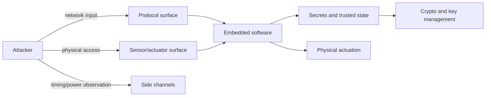

# Security and Privacy

Security and privacy are central design concerns for networked embedded and cyber-physical systems. Unlike ordinary correctness requirements, they assume an adversarial environment. A failure may not come from a random bug or overloaded CPU; it may come from an attacker who chooses inputs, observes timing, tampers with sensors, injects messages, or reverse engineers the device.


*Figure: Arduino boards make microcontroller I/O and prototyping tangible. Image: [Wikimedia Commons](https://commons.wikimedia.org/wiki/File:Arduino_Uno_-_R3.jpg), SparkFun Electronics, CC BY 2.0.*

Lee and Seshia introduce the foundations: threat models, cryptographic primitives, protocol security, software security, information flow, sensor/actuator security, and side channels. The key engineering discipline is to state what attacker capabilities are assumed and what properties must hold under that model.

## Definitions

A **threat model** states the attacker's capabilities and goals. It may include network access, physical access, ability to read messages, ability to inject messages, ability to measure timing or power, or ability to modify sensors.

**Confidentiality** means secret information is not revealed to unauthorized parties. **Integrity** means data or behavior is not modified improperly. **Authenticity** means an entity or message origin is what it claims to be. **Availability** means the system continues to provide adequate service.

**Symmetric-key cryptography** uses one shared secret key for encryption and decryption.

**Public-key cryptography** uses a public key and a private key. Anyone can encrypt to the public key, but only the holder of the private key can decrypt.

Kerckhoff's principle says a cryptographic system should remain secure even if everything except the key is public.

A **block cipher** maps fixed-size plaintext blocks to ciphertext blocks under a key. AES is a widely used modern block cipher. DES and 3DES are historically important but constrained by key size and legacy use.

A **secure hash function** maps data to a fixed-size digest and should resist preimage, second-preimage, and collision attacks.

A **digital signature** provides integrity and authenticity using public-key techniques.

**Information flow** studies how information moves from secret or untrusted sources to public or trusted sinks. **Non-interference** is a family of properties requiring that high-security data not affect low-security observations, or that low-integrity data not affect high-integrity state.

A **side channel** is an unintended communication path such as timing, power, electromagnetic emissions, memory access pattern, sound, or fault behavior.

## Key results

Security is never absolute. A system is secure only relative to a threat model and a set of properties. A device secure against a remote network attacker may be insecure against a person with physical access and lab equipment.

One-time pads are perfectly secret only when the key is random, as long as the message, kept secret, and never reused. If two ciphertexts reuse the same pad,

$$
C_1=M_1\oplus K,\qquad C_2=M_2\oplus K,
$$

then

$$
C_1\oplus C_2=M_1\oplus M_2,
$$

which leaks information.

Public-key cryptography solves key distribution problems but is computationally expensive for embedded devices. Many systems use public-key cryptography to exchange a symmetric session key, then use symmetric cryptography for bulk data.

Cryptographic implementation details matter. Random-number generation, key storage, constant-time code, memory layout, and hardware acceleration can determine whether a theoretically sound primitive is secure in a real embedded device.

Software memory safety is a security property. Buffer overflow can corrupt secrets, control data, or return addresses. In embedded systems, attacker-controlled sensor streams or network packets can be inputs to such vulnerabilities.

Information-flow analysis can detect illegal leaks. Taint analysis tracks labels from secret or untrusted sources through computations to public or trusted sinks. Static taint analysis may produce false alarms; dynamic taint analysis adds runtime overhead.

Side-channel attacks are especially relevant in CPS because attackers may observe physical effects. Timing differences in modular exponentiation, cache behavior during AES, or power traces during cryptographic operations can reveal key information.

Security properties often cut across the same boundaries used elsewhere in CPS design. A sensor model that is adequate for control may be inadequate for security if it ignores spoofing, electromagnetic interference, or physical replacement. A timing model that is adequate for scheduling may be inadequate for privacy if timing reveals a secret decision. A memory model that is adequate for functionality may be inadequate if it ignores how keys remain in RAM after use.

Protocol security is not just cryptography. A message may be encrypted and still replayed, reordered, delayed, or attributed to the wrong device if the protocol omits freshness, sequence numbers, authentication, or key-management rules. Embedded deployments add commissioning and update problems: each device needs the right identity, keys, trust anchors, and revocation path before it joins the system.

Availability has a physical dimension in CPS. A denial-of-service attack on a website is inconvenient; a denial-of-service attack on a medical device, vehicle controller, or power controller may be unsafe. Secure designs therefore need fail-safe modes, degraded-operation modes, rate limits, watchdogs, and recovery procedures that are compatible with the physical plant.

Updates are a recurring embedded security problem. A networked device may need firmware updates for years, but the update mechanism itself is a privileged attack surface. Secure update designs authenticate the update source, check integrity before installation, protect against rollback to vulnerable versions, and recover safely if power fails during the update. These requirements connect cryptography, flash memory behavior, bootloaders, and system safety.

Privacy is broader than encrypting communication. A smart meter, wearable, vehicle, or medical device may reveal sensitive facts through when it communicates, how often it samples, what identifiers it uses, or which services it contacts. Data minimization, aggregation, local processing, and explicit retention limits can be as important as encryption. For CPS, the physical context often gives sensor data meaning that is not obvious from the raw bytes.

Security review should be iterative like modeling and design. As the architecture changes, the threat model changes. Adding wireless diagnostics, a bootloader, a cloud dashboard, or a new sensor creates new interfaces and new assumptions. A static one-time checklist is rarely enough.

The strongest security designs use defense in depth. A cryptographic check may fail closed, a memory-safe parser may reject malformed input, a watchdog may recover from abnormal control flow, and a physical interlock may prevent unsafe actuation even if software is compromised. No single layer should be assumed perfect.

## Visual



| Goal | Typical mechanism | Embedded complication |
|---|---|---|
| Confidentiality | Encryption, access control | Key storage and side channels |
| Integrity | MACs, signatures, memory safety | Untrusted sensor/network inputs |
| Authenticity | Certificates, signatures, challenge-response | Device provisioning and scale |
| Availability | Rate limiting, redundancy, fail-safe modes | Physical safety under denial of service |
| Privacy | Information-flow control, minimization | Sensor data reveals context |

## Worked example 1: One-time pad reuse

Problem: Alice encrypts two 8-bit messages with the same one-time pad. $M_1=10110000$, $M_2=00110110$, and key $K=11110000$. Compute $C_1$, $C_2$, and show what an eavesdropper learns from $C_1\oplus C_2$.

Method:

1. Encrypt the first message:

$$
C_1=M_1\oplus K.
$$

   Bitwise:

$$
10110000\oplus 11110000=01000000.
$$

2. Encrypt the second message:

$$
C_2=M_2\oplus K.
$$

   Bitwise:

$$
00110110\oplus 11110000=11000110.
$$

3. Eavesdropper computes:

$$
C_1\oplus C_2=01000000\oplus 11000110=10000110.
$$

4. Compare with messages:

$$
M_1\oplus M_2=10110000\oplus 00110110=10000110.
$$

Answer: Reusing the pad reveals $M_1\oplus M_2=10000110$. If one message becomes known, the other and the key can be recovered.

## Worked example 2: Buffer overflow boundary check

Problem: A sensor packet handler has a buffer of $16$ bytes. An attacker sends $20$ bytes. Show why unchecked copying overflows, and compute how many bytes write beyond the buffer.

Method:

1. Buffer capacity:

$$
B=16.
$$

2. Attacker-controlled input length:

$$
L=20.
$$

3. If the program copies all bytes without checking, bytes with indices $0$ through $15$ fill the buffer.

4. Bytes with indices $16$ through $19$ write beyond the buffer.

5. Count out-of-bounds writes:

$$
L-B=20-16=4.
$$

6. Those four bytes may overwrite adjacent variables, saved registers, or a return address, depending on layout.

Answer: The unchecked copy writes $4$ bytes out of bounds. The fix is to enforce a length check or use an API that copies at most the buffer capacity and reports truncation/error.

## Code

```python
def xor_bits(a, b):
    return "".join("1" if x != y else "0" for x, y in zip(a, b))

m1 = "10110000"
m2 = "00110110"
k = "11110000"
c1 = xor_bits(m1, k)
c2 = xor_bits(m2, k)
print("c1:", c1)
print("c2:", c2)
print("c1 xor c2:", xor_bits(c1, c2))
print("m1 xor m2:", xor_bits(m1, m2))

def safe_copy(packet, capacity=16):
    if len(packet) > capacity:
        raise ValueError("packet too large")
    return bytearray(packet)
```

## Common pitfalls

- Claiming a system is "secure" without a threat model and named properties.
- Implementing cryptographic primitives directly instead of using reviewed libraries or hardware modules.
- Reusing nonces, initialization vectors, or one-time pads.
- Encrypting payload data while leaking identity, timing, packet size, or access pattern.
- Ignoring physical access in embedded threat models.
- Treating sensor values as trusted simply because they come from hardware.
- Writing data-dependent cryptographic code whose timing or power reveals secret bits.

## Connections

- [memory architectures](/cs/embedded/memory-architectures)
- [input and output interfacing](/cs/embedded/input-output-interfacing)
- [sensors and actuators](/cs/embedded/sensors-and-actuators)
- [invariants and temporal logic](/cs/embedded/invariants-and-temporal-logic)
- [reachability and model checking](/cs/embedded/reachability-and-model-checking)
