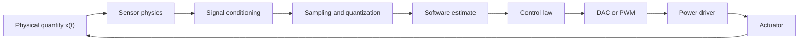

# Sensors and Actuators

Sensors and actuators are the boundary between the physical world and the computational model. A sensor converts a physical quantity into data. An actuator converts data or electrical signals into physical action. The cyber-physical perspective treats both as modeled components with range, bias, quantization, noise, sampling, delay, and saturation, not as perfect wires between reality and software.


*Figure: Arduino boards make microcontroller I/O and prototyping tangible. Image: [Wikimedia Commons](https://commons.wikimedia.org/wiki/File:Arduino_Uno_-_R3.jpg), SparkFun Electronics, CC BY 2.0.*

This topic is complementary to hardware-interfacing notes such as GPIO, ADCs, serial buses, and microcontroller ports. Lee and Seshia focus on the modeling question: what relationship is assumed between a physical variable and the number seen or commanded by software, and what can go wrong when that relationship is approximate?

## Definitions

A **sensor** measures a physical quantity. An analog sensor produces a continuous electrical signal such as voltage; a digital sensor includes conversion to a number.

An **actuator** changes a physical quantity. A digital actuator accepts digital commands, often through a DAC, PWM circuit, or driver stage.

An **affine sensor model** relates physical input $x(t)$ to reported value $f(x(t))$ by

$$
f(x)=ax+b,
$$

where $a$ is sensitivity and $b$ is bias. A linear model is the special case $b=0$.

The **range** of a sensor is the interval of physical values over which the model is valid. Outside the range, many devices saturate. A simple saturation model is

$$
f(x)=
\begin{cases}
L, & x<L,\\
x, & L\le x\le H,\\
H, & x>H.
\end{cases}
$$

**Quantization** maps a continuum of physical values to a finite set of digital codes. An $n$-bit converter has $2^n$ codes.

**Sampling** observes a time-varying physical signal at selected instants. Uniform sampling with interval $T$ produces

$$
s(n)=f(x(nT)).
$$

The **sampling rate** is $R=1/T$. **Aliasing** occurs when different continuous-time signals produce the same samples.

**Noise** is unwanted signal content. A common additive model is

$$
x_{\mathrm{measured}}(t)=x(t)+n(t).
$$

**Signal conditioning** uses filtering or other processing to improve sensor data or actuator commands before they are used.

## Key results

Precision, range, and bit width are linked. For an ideal $n$-bit sensor over range $[L,H]$, a common quantization step is

$$
p=\frac{H-L}{2^n}.
$$

The quantization error magnitude is usually bounded by a fraction of a step, depending on whether the quantizer truncates, rounds, or saturates.

Sampling must respect signal bandwidth. The Nyquist-Shannon rule of thumb says that if a signal contains only sinusoidal components below $R/2$, then samples at rate $R$ can uniquely represent it within that band. Components above $R/2$ can masquerade as lower-frequency components, so anti-aliasing filters are used before sampling.

One-bit sensing and actuation can still be useful. A comparator is a one-bit sensor. A bang-bang controller or PWM driver is a one-bit or switched actuator updated quickly enough that the physical plant averages the switching.

Sensor models must include physical context. Accelerometers measure proper acceleration, which includes gravity effects. Encoders measure rotation discretely. Microphones measure pressure variation over frequency ranges. Switches can bounce. These details are not peripheral; they determine the model seen by software.

Actuators need driver constraints. GPIO pins cannot usually power motors directly. A PWM output may command a transistor or H-bridge, while the motor's inductance and mechanical inertia smooth the switching.

Calibration connects the mathematical model to a particular device. A nominal data sheet may specify sensitivity and range, but manufacturing variation, temperature, aging, mounting, and nearby electronics can change the actual relationship. A calibration procedure estimates parameters such as gain and bias, after which software can compensate. For a simple affine model, if two known physical inputs produce two readings, those two points determine the slope and intercept used to convert future readings.

Sensor and actuator placement is also part of the model. A temperature sensor measures the temperature at its location, not "the room" in an abstract sense. An accelerometer mounted off-center on a rotating body sees effects that differ from one mounted at the center of mass. A motor encoder measures shaft rotation, which may differ from wheel motion if there is slip or backlash. Cyber-physical errors often come from treating the measured quantity as if it were the desired quantity.

Finally, timing belongs in the sensor/actuator model. A sensor sample is a statement about a past physical condition, after acquisition, conversion, communication, and software latency. An actuator command affects the plant after driver delay and plant response time. Closed-loop design must include those delays when they are not negligible.

Resolution and accuracy should not be confused. A 12-bit ADC may provide many distinct output codes, but if the analog front end is noisy, biased, or poorly calibrated, the extra codes do not imply truthful measurements. Similarly, a motor command may have fine PWM duty-cycle resolution while friction, backlash, dead zones, and supply variation dominate the actual movement. Precision in the digital representation is only one part of measurement or actuation quality.

The physical environment can change the sensor model over time. Temperature drift, vibration, aging, dust, humidity, electromagnetic interference, and mechanical wear can all alter behavior. Robust CPS design either compensates for these changes, detects them as faults, or chooses components and placement so they remain negligible over the required lifetime.

A sensor or actuator interface should therefore include diagnostics. Range checks, plausibility checks against other sensors, calibration status, stuck-at detection, timeout detection, and actuator feedback can turn silent physical degradation into an explicit fault. This is part of the model: the system must know not only the measured value, but when that value should no longer be trusted.

## Visual



| Effect | Sensor symptom | Actuator symptom | Modeling response |
|---|---|---|---|
| Bias | Constant offset in readings | Constant offset in action | Calibrate or subtract $b$ |
| Saturation | Readings clamp at endpoints | Command stops increasing effect | Include range limits |
| Quantization | Stair-step output | Discrete command levels | Bound quantization error |
| Noise | Random variation | Jitter in effect | Filter or estimate |
| Sampling | Missed fast variation | Discrete update timing | Choose sample/update rate |
| Delay | Late measurement | Late physical response | Include latency in control analysis |

## Worked example 1: Three-bit voltage sensor

Problem: A 3-bit ADC measures voltages from $0$ to $1$ V using codes $0$ through $7$. Assume a truncating quantizer with step $p=1/8$. Determine the digital output for $x=0.70$ V and bound the truncation error in volts.

Method:

1. Compute the number of codes:

$$
2^3=8.
$$

2. Compute the step:

$$
p=\frac{1-0}{8}=0.125\text{ V}.
$$

3. Divide the input by the step:

$$
\frac{0.70}{0.125}=5.6.
$$

4. Truncating quantization chooses code

$$
\lfloor 5.6\rfloor=5.
$$

5. The represented lower-edge voltage is

$$
5p=5(0.125)=0.625\text{ V}.
$$

6. The error is

$$
e=0.70-0.625=0.075\text{ V}.
$$

7. For truncation, the error is bounded by one step:

$$
0\le e < 0.125\text{ V}.
$$

Answer: The ADC reports code $5$. The truncation error for this sample is $0.075$ V and is less than one quantization step.

## Worked example 2: Aliasing of a sampled tone

Problem: A sinusoid at $9$ kHz is sampled at $8$ kHz. Find the lower-frequency alias in the sampled data.

Method:

1. Sampling frequency is

$$
R=8000\text{ Hz}.
$$

2. Frequencies separated by integer multiples of $R$ produce the same discrete-time samples for cosines, up to sign and phase conventions.

3. Subtract one sampling frequency from the signal frequency:

$$
9000 - 8000 = 1000\text{ Hz}.
$$

4. The Nyquist frequency is

$$
R/2=4000\text{ Hz}.
$$

5. The computed alias $1000$ Hz lies below the Nyquist frequency, so it is the observed low-frequency alias.

Answer: The $9$ kHz tone aliases to a $1$ kHz sampled tone at an $8$ kHz sample rate. An anti-aliasing filter should remove the $9$ kHz component before sampling if it is not intended.

## Code

```python
import math

def quantize_voltage(x, bits=3, low=0.0, high=1.0):
    levels = 2 ** bits
    step = (high - low) / levels
    if x <= low:
        return 0
    if x >= high:
        return levels - 1
    return int((x - low) // step)

def samples(freq_hz, sample_rate=8000, count=8):
    return [round(math.cos(2 * math.pi * freq_hz * n / sample_rate), 6)
            for n in range(count)]

print("code for 0.70 V:", quantize_voltage(0.70))
print("1 kHz samples:", samples(1000))
print("9 kHz samples:", samples(9000))
```

## Common pitfalls

- Treating ADC output as exact real-valued measurement. Quantization, saturation, and noise are part of the measurement path.
- Sampling without anti-aliasing. Software cannot recover frequency information that was aliased during sampling.
- Assuming actuator commands produce proportional physical action at all magnitudes. Drivers, motors, LEDs, and valves all have operating limits.
- Ignoring switch bounce. One physical press can produce multiple electrical transitions.
- Driving loads directly from GPIO without checking current, voltage, and package limits.

## Connections

- [input and output interfacing](/cs/embedded/input-output-interfacing)
- [serial buses and embedded protocols](/cs/embedded/serial-buses-embedded-protocols)
- [8051 external-world interfacing](/cs/embedded/8051-external-world-interfacing)
- [signals and systems](/physics/signals-systems/)
- [continuous dynamics](/cs/embedded/continuous-dynamics)
