# Serial Buses and Embedded Protocols

The source includes a buses and protocols chapter covering serial communication classes, RS-232C, RS-423A, RS-422A, RS-485, I2C, Modbus, and IEEE-488. These topics widen the view from one microcontroller board to communication between devices. A microcontroller may send bytes through a UART, share an I2C bus with memory and clock chips, or exchange Modbus frames with an industrial controller.

The common theme is that a bus is more than a wire. It defines electrical levels, direction rules, timing, addressing, framing, acknowledgements, and error checks. Software must follow the protocol's order exactly, while hardware must satisfy voltage, termination, pull-up, and distance requirements.

## Definitions

**Serial communication** transmits data one bit at a time over one or a small number of signal lines. It contrasts with parallel transfer, where multiple bits move simultaneously.

**Simplex** communication allows data in one direction only. **Half-duplex** allows both directions but not at the same time. **Full-duplex** allows simultaneous transmit and receive.

**Asynchronous serial** communication sends frames without a shared clock. A UART frame commonly contains a start bit, data bits, optional parity, and one or more stop bits.

**Synchronous serial** communication uses a clock or defined clocking relationship so the receiver samples bits at known times.

**RS-232C** defines single-ended serial electrical signaling and connector conventions for short point-to-point communication. Logic levels are not ordinary TTL levels, so level conversion is normally required between an 8051 UART and RS-232.

**RS-422** and **RS-485** use differential signaling. RS-485 is widely used for multidrop half-duplex networks because several devices can share a twisted pair when drivers are controlled correctly.

**I2C** is a two-wire synchronous bus using serial data `SDA` and serial clock `SCL`, open-drain signaling, pull-up resistors, start and stop conditions, 7-bit or 10-bit addressing, and acknowledge bits.

**Modbus** is a master-slave or client-server style industrial protocol. Modbus RTU frames on serial links include address, function code, data, and CRC.

**IEEE-488**, also known as GPIB, is a parallel instrument-control bus historically used for test equipment.

## Key results

The first key result is that electrical compatibility is not the same as byte compatibility. An 8051 UART can create an asynchronous byte stream, but RS-232 requires level shifting and inversion compared with TTL logic. RS-485 requires differential drivers and direction control.

The second key result is that asynchronous UART timing is open-loop inside each frame. The receiver detects the start bit, then samples based on its own baud-rate clock. If transmitter and receiver baud rates differ too much, sampling drifts and framing errors occur.

The third key result is that I2C devices never drive the bus high. They release the open-drain line, and pull-up resistors bring it high. This allows multiple devices to share the bus and makes acknowledgement possible, but it also limits speed through bus capacitance and pull-up resistance.

The fourth key result is that I2C transfer order is structured: start condition, address plus direction bit, acknowledge, data bytes with acknowledge bits, and stop condition. A repeated start can change direction without releasing the bus.

The fifth key result is that Modbus RTU relies on framing gaps and CRC. A receiver must know where one frame ends and another begins, and it must reject frames whose CRC does not match.

The sixth key result is that multidrop buses require an addressing or arbitration rule. I2C uses device addresses and arbitration on `SDA`; Modbus uses a slave address field; RS-485 only defines the electrical layer, so the higher-level protocol must prevent two nodes from transmitting at once.

The seventh key result is that bus length and speed are engineering tradeoffs. A short board-level I2C bus can run faster than a long cable with high capacitance. RS-485 can cover much longer distances, but it needs proper termination, biasing, and transceiver direction timing. RS-232 is simple for point-to-point links but is not a multidrop network. Choosing a bus begins with distance, noise, number of nodes, speed, and existing device support.

The eighth key result is that a frame format must define both content and boundaries. UART bytes alone do not say where a message starts. Protocols add start markers, lengths, time gaps, checksums, CRCs, addresses, or fixed byte counts. Modbus RTU uses timing gaps and CRC; I2C uses start/stop conditions and acknowledges; many custom UART protocols use sync bytes and length fields. Without boundaries, a receiver cannot recover cleanly after a lost byte.

The ninth key result is that acknowledgements mean different things at different layers. An I2C ACK means a device pulled `SDA` low for one bit time; it does not prove that a sensor measurement is complete or that an EEPROM write has finished internally. A Modbus response proves that a slave parsed a request and chose a response; it does not prove that an actuator physically reached a final position. Good software distinguishes link-level success from application-level success.

## Visual

```mermaid
flowchart TB
  MCU["Microcontroller serial peripheral or bit-banged GPIO"] --> Choice{"Protocol and electrical layer"}

  subgraph UART["UART / RS-232 / RS-485 framing"]
    direction LR
    Idle["Idle line"] --> Start["Start bit"]
    Start --> Data["5-9 data bits, least significant bit first"]
    Data --> Parity["Optional parity"]
    Parity --> Stop["One or more stop bits"]
    Stop --> Gap["Inter-frame gap or protocol delimiter"]
  end

  subgraph I2C["I2C transaction"]
    direction LR
    Pullups["Open-drain SDA/SCL with pull-ups"] --> StartI["START: SDA falls while SCL high"]
    StartI --> Addr["7-bit address + R/W bit"]
    Addr --> Ack1["ACK bit driven low by receiver"]
    Ack1 --> Reg["Register address or command byte"]
    Reg --> Rep["Repeated START for read"]
    Rep --> DataI["Data byte, sampled while SCL high"]
    DataI --> NackStop["NACK then STOP"]
  end

  subgraph SPI["SPI full-duplex transfer"]
    direction LR
    CS["Assert one chip-select line"] --> Clock["SCLK edges define sample/shift timing"]
    Clock --> MOSI["MOSI shifts master-to-slave bitstream"]
    Clock --> MISO["MISO shifts slave-to-master bitstream"]
    MOSI --> DoneSPI["Deassert chip select after frame"]
    MISO --> DoneSPI
  end

  subgraph Modbus["Modbus RTU over RS-485"]
    direction LR
    Silent["Silent interval"] --> Slave["Slave address"]
    Slave --> Function["Function code"]
    Function --> Payload["Data bytes"]
    Payload --> CRC["CRC-16"]
    CRC --> Turnaround["Driver direction turnaround"]
  end

  Choice -- "async byte stream" --> UART
  Choice -- "two-wire shared bus" --> I2C
  Choice -- "synchronous chip-select bus" --> SPI
  Choice -- "industrial multidrop frames" --> Modbus
  UART --> Driver["Level shifter or differential transceiver as needed"]
  I2C --> Pull["Pull-up sizing and bus capacitance limit rise time"]
  SPI --> Fanout["One chip select per slave or decoder"]
  Modbus --> Term["RS-485 termination, bias, and bus arbitration"]
```



This serial-bus diagram compares the actual frame and wiring contracts for UART/RS-style links, I2C, SPI, and Modbus RTU. Each subgraph labels the ordering of start/address/data/acknowledgement or chip-select/clock/data events, so the bus is not reduced to a generic byte arrow. The hardware side notes make the electrical assumptions visible: level shifting, open-drain pull-ups, chip-select fanout, differential termination, and driver turnaround.

| Bus or standard | Signaling | Topology | Software concern | Hardware concern |
|---|---|---|---|---|
| TTL UART | Single-ended logic | Point-to-point | Baud, framing, flags | Logic-level compatibility |
| RS-232C | Single-ended, higher voltage | Point-to-point | UART framing | Level shifter and cable length |
| RS-485 | Differential | Multidrop | Direction and protocol | Termination and biasing |
| I2C | Open-drain two-wire | Multidrop | Address, ACK, bus state | Pull-ups and capacitance |
| Modbus RTU | Usually over RS-485 | Master-slave network | CRC and timing gaps | Transceiver direction |
| IEEE-488 | Parallel instrument bus | Multiple instruments | Talker/listener control | Cable and bus loading |

## Worked example 1: Decoding an I2C address byte

Problem: An I2C master sends address byte `D0H` immediately after a start condition. Determine the 7-bit slave address and transfer direction.

Method:

1. In 7-bit I2C addressing, the transmitted address byte contains the 7-bit address in bits 7 through 1.

2. Bit 0 is the direction bit: `0` for write and `1` for read.

3. Convert `D0H` to binary:

```text
D0H = 1101 0000
```

4. Extract bits 7 through 1:

```text
1101000
```

5. Convert `1101000` to hexadecimal. Pad on the left for grouping:

```text
0110 1000 = 68H
```

6. The least significant bit of `D0H` is `0`, so the direction is write.

Answer: the 7-bit slave address is `68H`, and the operation is a write. This is the common address used by DS1307 RTC devices.

Check: The read address byte for the same 7-bit address would be `D1H`, because only the low direction bit changes.

## Worked example 2: Identifying a Modbus RTU frame

Problem: A Modbus RTU request begins with bytes `01 03 00 10 00 02` followed by two CRC bytes. Interpret the fields before the CRC.

Method:

1. The first byte is the slave address:

```text
01H -> slave 1
```

2. The second byte is the function code:

```text
03H -> read holding registers
```

3. The next two bytes are the starting register address:

```text
00 10 -> 0010H
```

4. The next two bytes are the quantity of registers:

```text
00 02 -> 2 registers
```

5. The final two bytes, not shown in detail here, are the CRC transmitted low byte first in Modbus RTU.

Answer: the frame asks slave 1 to read two holding registers starting at address `0010H`.

Check: The request is not complete without a valid CRC. A receiver should compute the CRC over the address, function, and data fields and compare it with the received CRC bytes.

## Code

```c
/* Modbus RTU CRC-16, polynomial 0xA001.
   Returns the CRC value whose low byte is transmitted first. */

unsigned int modbus_crc16(const unsigned char *buf, unsigned int len) {
    unsigned int crc = 0xFFFF;
    unsigned int i;
    unsigned char bit;

    for (i = 0; i < len; i++) {
        crc ^= buf[i];
        for (bit = 0; bit < 8; bit++) {
            if (crc & 0x0001) {
                crc = (crc >> 1) ^ 0xA001;
            } else {
                crc >>= 1;
            }
        }
    }
    return crc;
}
```

## Common pitfalls

- Connecting an 8051 UART directly to RS-232 without a level converter.
- Forgetting RS-485 driver direction control in half-duplex systems, causing two nodes to drive the bus.
- Treating I2C lines as push-pull outputs. I2C requires open-drain behavior and pull-ups.
- Ignoring acknowledge bits. A missing ACK usually means wrong address, absent device, bus fault, or timing issue.
- Confusing 7-bit I2C addresses with the 8-bit address-plus-direction byte shown in some data sheets.
- Transmitting Modbus CRC high byte first. Modbus RTU sends CRC low byte first.
- Assuming a protocol such as Modbus defines the physical layer. Modbus can run over different links; RS-485 is common but separate.

## Connections

- [8051 timers, serial port, and interrupts](/cs/embedded/8051-timers-serial-interrupts)
- [Serial EEPROM and DS1307 RTC interfacing](/cs/embedded/serial-eeprom-rtc-ds1307)
- [8051 external-world interfacing](/cs/embedded/8051-external-world-interfacing)
- [Microcontroller derivatives, AVR, and PIC](/cs/embedded/microcontroller-derivatives-avr-pic)
