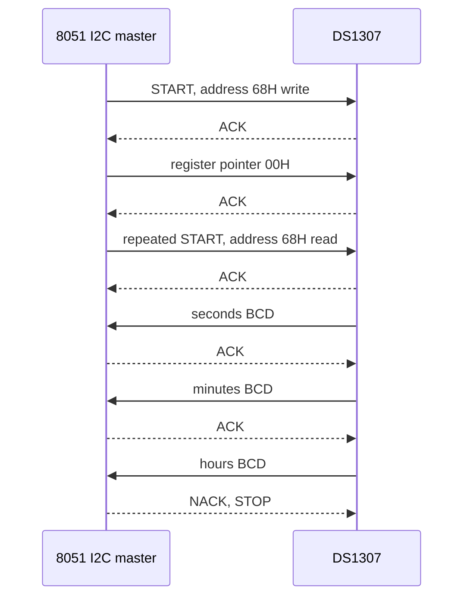

# Serial EEPROM and DS1307 RTC Interfacing

The source chapter on EEPROM and the DS1307 real-time clock is a practical continuation of the serial-bus chapter. Instead of discussing I2C in the abstract, it shows the kind of small serial devices commonly attached to a microcontroller: nonvolatile memory chips such as 93C46/56/66 and 24C16/32/64, and an RTC that keeps calendar time while the main system is off.

These devices are small, but they teach important embedded habits: read the device address format, respect write-cycle time, distinguish RAM variables from nonvolatile storage, use BCD correctly, and handle multi-byte register updates in a safe order. A system that logs data, stores settings, or keeps time needs these habits.

## Definitions

**EEPROM** is electrically erasable programmable read-only memory. It is nonvolatile, so it retains data without power, but writes are slower and wear-limited compared with RAM.

**Serial EEPROM** stores data behind a serial interface. The chapter lists families such as 93C46/56/66 and 24C16/32/64. The exact command format depends on the device family.

The **24Cxx** style EEPROMs are commonly I2C devices. They use a slave address, one or more internal address bytes, data bytes, acknowledge polling, and page write rules.

The **93Cxx** style EEPROMs commonly use a Microwire-like serial interface with chip select, serial clock, data input, and data output signals. They use command opcodes for read, write, erase, and enable/disable write operations.

The **DS1307** is a real-time clock using an I2C-compatible serial interface. It stores seconds, minutes, hours, day, date, month, and year registers, plus control and RAM bytes.

**BCD** means binary-coded decimal. Each decimal digit is stored in four bits. For example, decimal 45 is stored as `45H`, not as binary `2DH`.

The **clock halt bit** in the DS1307 seconds register controls oscillator operation. The **control register** configures square-wave output behavior.

**Acknowledge polling** is repeatedly addressing an EEPROM after a write until it acknowledges, indicating the internal write cycle has completed.

## Key results

The first key result is that nonvolatile memory writes are not like RAM writes. After a byte or page write command, an EEPROM may need milliseconds to complete internal programming. During this time it may not acknowledge new commands.

The second key result is that page boundaries matter. Many serial EEPROMs allow several bytes to be written in one page-write operation, but if the write crosses a page boundary the address may wrap within the page. Code should split writes so that a page operation never unintentionally wraps.

The third key result is that the 24Cxx device address may include hardware address pins and high memory-address bits depending on capacity. A driver must be written for the exact EEPROM size, not only for the family name.

The fourth key result is that RTC values are commonly BCD. Arithmetic should either be performed in binary after conversion or performed digit-wise with BCD awareness. Treating `59H` as binary 89 is a classic bug.

The fifth key result is that multi-register time reads should be consistent. If seconds roll over while minutes are being read, software can see a mixed time. Many simple systems read the registers twice or read seconds before and after the block to detect rollover.

The sixth key result is that timekeeping depends on the oscillator and backup supply. The RTC chip, crystal, load capacitance, layout, and battery connection all affect accuracy and reliability.

The seventh key result is that serial memory protocols often include a write-enable discipline. Some EEPROM families require an explicit write-enable command before modifying nonvolatile cells and a write-disable command after the operation. This protects against accidental writes caused by noise, reset transients, or software bugs. A driver should make write enable a narrow operation around the intended write, not a permanent state.

The eighth key result is that I2C pull-ups affect both EEPROM and RTC reliability. If pull-ups are too weak for the bus capacitance, rising edges become slow and devices may sample the wrong value. If pull-ups are too strong, devices must sink excessive current when pulling the line low. Board-level bus design should include the number of devices, trace length, voltage, and selected speed.

The ninth key result is that RTC initialization should be separate from ordinary time reading. Setting the clock halt bit, selecting 12-hour or 24-hour mode, configuring square-wave output, and writing the initial calendar are setup actions. Reading current time should not rewrite configuration bits unless there is a deliberate reason, because careless writes can stop the oscillator or change output behavior.

The tenth key result is that nonvolatile data needs a format, not just an address. A logger or settings block should include a version byte, length, checksum, or validity marker so firmware can distinguish erased memory, old layouts, and interrupted writes. For small EEPROMs this bookkeeping costs only a few bytes and prevents a reset during programming from becoming an undetectable bad configuration.

## Visual



| Device class | Interface style | Typical contents | Main software rule |
|---|---|---|---|
| 93C46/56/66 EEPROM | Serial clock, chip select, data in/out | Small nonvolatile words | Send exact command opcode and enable writes |
| 24C16/32/64 EEPROM | I2C two-wire bus | Nonvolatile bytes/pages | Respect page size and write-cycle polling |
| DS1307 RTC | I2C two-wire bus | BCD time/calendar registers and RAM | Convert BCD and handle rollover |
| MCU internal RAM | CPU memory space | Temporary variables | Fast but volatile |
| MCU Flash/ROM | Program memory | Firmware constants | Usually not for frequent runtime writes |

## Worked example 1: Converting DS1307 BCD time fields

Problem: A DS1307 read returns seconds register `25H`, minutes register `59H`, and hours register `14H` in 24-hour mode. Convert to human time.

Method:

1. Interpret each field as BCD, not binary.

2. Seconds `25H` has tens digit 2 and ones digit 5:

$$
2 \cdot 10 + 5 = 25
$$

3. Minutes `59H` has tens digit 5 and ones digit 9:

$$
5 \cdot 10 + 9 = 59
$$

4. Hours `14H` in 24-hour mode has tens digit 1 and ones digit 4:

$$
1 \cdot 10 + 4 = 14
$$

5. Assemble the time:

```text
14:59:25
```

Answer: the RTC time is 14:59:25, or 2:59:25 PM in 12-hour notation.

Check: If `59H` were treated as binary, it would be decimal 89, which is impossible for minutes. That confirms BCD interpretation is required.

## Worked example 2: Splitting an EEPROM page write

Problem: A 24C-style EEPROM has 16-byte pages. A program wants to write 10 bytes starting at address `003CH`. How many bytes can be written before the next page boundary?

Method:

1. Page size is 16 bytes, so page boundaries occur at addresses whose low nibble is `0`.

2. Address `003CH` has low nibble `CH`, decimal 12.

3. Bytes remaining in this page:

$$
16 - 12 = 4
$$

4. The first write can safely include addresses:

```text
003CH, 003DH, 003EH, 003FH
```

5. Four bytes are written in the first page operation.

6. Remaining bytes:

$$
10 - 4 = 6
$$

7. The remaining six bytes begin at the next page boundary, `0040H`.

Answer: split the operation into a 4-byte write at `003CH` and a 6-byte write at `0040H`.

Check: If all 10 bytes were sent in one page write, many EEPROMs would wrap after `003FH` and overwrite `0030H` onward inside the same page.

## Code

```c
/* BCD helpers for RTC code. These are independent of the I2C driver. */

unsigned char bcd_to_bin(unsigned char bcd) {
    return (unsigned char)(((bcd >> 4) * 10u) + (bcd & 0x0Fu));
}

unsigned char bin_to_bcd(unsigned char value) {
    return (unsigned char)(((value / 10u) << 4) | (value % 10u));
}

void ds1307_decode_time(unsigned char sec_bcd,
                        unsigned char min_bcd,
                        unsigned char hour_bcd,
                        unsigned char *hour,
                        unsigned char *minute,
                        unsigned char *second) {
    sec_bcd &= 0x7F;          /* remove clock halt bit */
    hour_bcd &= 0x3F;         /* assume 24-hour mode */
    *second = bcd_to_bin(sec_bcd);
    *minute = bcd_to_bin(min_bcd);
    *hour = bcd_to_bin(hour_bcd);
}
```

## Common pitfalls

- Treating RTC registers as binary instead of BCD.
- Forgetting the DS1307 clock halt bit in the seconds register.
- Writing across EEPROM page boundaries without splitting the operation.
- Starting a new EEPROM command before the internal write cycle has completed.
- Assuming all 24Cxx EEPROMs use the same address-byte format.
- Ignoring EEPROM write endurance by storing frequently changing counters too often.
- Reading a time block while seconds roll over and accepting a mixed timestamp without verification.

## Connections

- [Serial buses and embedded protocols](/cs/embedded/serial-buses-embedded-protocols)
- [8051 external-world interfacing](/cs/embedded/8051-external-world-interfacing)
- [8051 timers, serial port, and interrupts](/cs/embedded/8051-timers-serial-interrupts)
- [Microcontroller derivatives, AVR, and PIC](/cs/embedded/microcontroller-derivatives-avr-pic)
