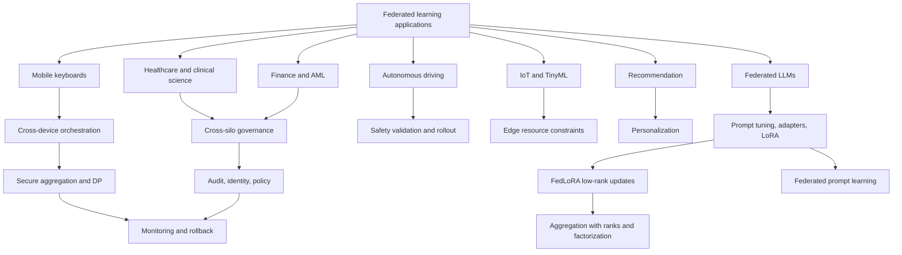

# Applications and Systems


*Figure: Federated learning naturally fits edge-computing deployments where sensors, gateways, and a coordinating cloud share an optimization workload but not raw data. Image: [Wikimedia Commons](https://commons.wikimedia.org/wiki/File:Edge_computing_infrastructure.png), Magnaweb, CC BY-SA 4.0.*

Federated learning becomes concrete when the data boundary matters. The original motivating examples were mobile keyboards and on-device language models, where typed text is abundant, sensitive, and naturally local [1], [4]. The same pattern appears in hospitals that cannot pool patient records, banks that cannot freely exchange transaction histories, vehicles that observe different roads, labs that hold private genomic data, and modern LLM deployments where full-model fine-tuning is too large to ship every round.

Systems work decides whether those ideas survive contact with production. An FL deployment needs client orchestration, eligibility rules, secure aggregation, privacy accounting, update compression, model validation, rollback, monitoring, and governance. The LLM era adds model-size pressure: Yao et al. survey federated LLM fine-tuning and prompt learning under heterogeneity, privacy, and communication constraints [2], while Yang et al. survey FedLoRA, where clients transmit low-rank adapter parameters instead of full foundation-model updates [3].

## Definitions

**Mobile keyboard FL** trains next-word prediction, emoji prediction, ranking, or personalization models on-device. The data are sensitive and self-labeled by user interaction. Clients are numerous, unreliable, and only briefly eligible [4].

**Healthcare FL** trains across hospitals, imaging centers, labs, or clinical networks. The data may be protected by regulation, consent, institutional review, and data-use agreements. Cross-silo FL is common because each hospital is a known party with governance obligations.

**Finance FL** includes cross-bank fraud detection, anti-money-laundering models, credit-risk features, and privacy-preserving analytics. It is often cross-silo and audit-heavy.

**Autonomous-driving FL** uses fleets or organizations that collect perception, mapping, driving-behavior, and rare-event data. Communication cost, safety validation, simulation, and data imbalance dominate.

**IoT and TinyML FL** trains or adapts models on sensors, microcontrollers, gateways, and edge devices. Constraints include memory, energy, intermittent networking, and nonstationary local environments.

**Federated recommendation** trains user or item representations without centralizing user histories. It may combine local personalization, negative sampling, secure aggregation, and differential privacy.

**Federated LLMs** apply FL to large language models through full fine-tuning, parameter-efficient tuning, prompt tuning, adapters, LoRA, black-box prompt optimization, or distillation [2]. The main challenges are model size, heterogeneous compute, heterogeneous tasks, privacy leakage from text, and evaluation.

**LoRA** represents a weight update for a matrix $W\in\mathbb{R}^{m\times n}$ as

$$
\Delta W=BA,\qquad B\in\mathbb{R}^{m\times r},\quad A\in\mathbb{R}^{r\times n},\quad r\ll \min(m,n).
$$

**FedLoRA** combines LoRA with FL: each client trains low-rank adapters $(A_k,B_k)$ and communicates adapter parameters or reconstructed low-rank updates. Yang et al. organize FedLoRA challenges into distributed learning, heterogeneity, and efficiency, including aggregation discordance, heterogeneous ranks, personalization, clustering, split learning, and compression [3].

## Key results

Mobile keyboards are the canonical cross-device success story. Hard et al. describe federated learning for mobile keyboard prediction, and McMahan et al. study recurrent language models with differential privacy [4], [5]. The setting aligns well with FL: labels arise from typed text, raw records are sensitive, clients are plentiful, and the product can benefit from population-level improvement plus local personalization.

Healthcare is a natural cross-silo application because institutional data cannot always move. FL has been used or proposed for radiology, pathology, ICU prediction, clinical NLP, and multi-site studies [8], [9]. NVIDIA FLARE, OpenFL, and other frameworks focus heavily on this domain because cross-silo deployments need secure provisioning, job orchestration, auditability, and researcher-facing workflows. Drug-discovery consortia such as MELLODDY showed how multiple pharmaceutical partners can collaborate on predictive modeling while protecting proprietary compound data [10].

Finance has similar incentives but different governance. Fraud and AML models benefit from patterns across institutions, yet raw transaction records and customer data are highly restricted. Cross-bank FL must handle regulatory audit trails, model-risk management, privacy controls, and adversarial behavior. A design that is acceptable for research may be unacceptable if a regulator cannot reconstruct who trained what, when, and under which policy.

Autonomous driving and robotics emphasize distribution shift. Vehicles see different weather, roads, signs, driver behaviors, and rare events. FL can reduce raw-data upload, but safety-critical models need validation gates before deployment. In many cases, the better production pattern is not fully autonomous on-vehicle training, but federated or distributed collection of updates, simulation, offline validation, and staged rollout.

IoT and TinyML push resource constraints further. Sensors may have kilobytes to megabytes of memory, small batteries, and unreliable links. Training may occur on gateways rather than microcontrollers. Compression, event-triggered communication, and small personalized heads are often more realistic than full-model training.

Recommendation systems are a bridge between personalization and privacy. A global item model may be shared, while user embeddings, histories, or ranking adapters remain local. Federated recommendation often needs negative sampling, privacy-preserving aggregation, and careful evaluation because user distributions are extremely skewed.

The LLM era changes scale. Full-model FL for a 7B-parameter model is usually infeasible for cross-device clients: even float16 model deltas are about $14$ GB per client per round before optimizer state or protocol overhead. Federated LLM work therefore emphasizes prompt tuning, parameter-efficient fine-tuning, zeroth-order or forward-only methods, distillation, and heterogeneous device support [2]. The FedLLM survey highlights fine-tuning and prompt learning as the central categories, with open directions in pre-training, federated agents, and LLMs assisting FL workflows [2].


*Figure: FedLoRA exchanges only the low-rank adapter parameters per client, slashing per-round communication relative to full-model federated fine-tuning. From [Yang et al., 2025](https://arxiv.org/abs/2505.13502) — embedded under educational fair use with attribution.*

FedLoRA is the most important adapter-based pattern. Instead of transmitting every parameter, clients send low-rank matrices. If $W$ is $4096\times4096$ and rank $r=8$, a full matrix update has $16{,}777{,}216$ parameters, while LoRA has $8(4096+4096)=65{,}536$ parameters, a $256$ times reduction before metadata. The challenge is aggregation: averaging $A$ and $B$ separately is not generally equivalent to averaging $BA$. Yang et al. describe approaches such as full-rank reconstruction then decomposition, stacking, selective aggregation, heterogeneous ranks, and personalized adapters [3].

| Deployment | Typical FL type | Main blocker | Common system choices |
|---|---|---|---|
| Mobile keyboard | Cross-device | Availability, privacy, uplink | Client sampling, secure aggregation, DP |
| Healthcare imaging | Cross-silo | Governance, feature shift | FLARE/OpenFL, FedBN, audit logs |
| Finance fraud/AML | Cross-silo | Regulation, adversaries | MPC/secure aggregation, strong audit |
| Autonomous driving | Fleet/cross-silo | Safety validation, rare events | Offline validation, staged rollout |
| IoT/TinyML | Edge/cross-device | Memory and energy | Compression, small heads, gateways |
| Recommendation | Cross-device/hybrid | Personalization and skew | Local embeddings, DP, secure aggregation |
| Federated LLMs | Cross-silo or edge | Model size | Prompt tuning, adapters, LoRA, distillation |

## Visual



## Worked example 1: Full-model FL versus LoRA transmission

**Problem.** A transformer layer has a dense projection matrix $W\in\mathbb{R}^{4096\times4096}$. Compare float16 communication for a full update $\Delta W$ with LoRA rank $r=8$, where each transmitted parameter uses $2$ bytes.

**Step 1: full update parameter count.**

$$
4096\times4096=16{,}777{,}216.
$$

**Step 2: full update bytes.**

$$
16{,}777{,}216\times2=33{,}554{,}432\text{ bytes}\approx 32.0\text{ MiB}.
$$

**Step 3: LoRA parameter count.**

LoRA sends $A\in\mathbb{R}^{8\times4096}$ and $B\in\mathbb{R}^{4096\times8}$:

$$
8(4096)+4096(8)=65{,}536.
$$

**Step 4: LoRA bytes.**

$$
65{,}536\times2=131{,}072\text{ bytes}=128\text{ KiB}.
$$

**Step 5: ratio.**

$$
\frac{33{,}554{,}432}{131{,}072}=256.
$$

**Checked answer.** For this matrix, LoRA rank $8$ reduces transmitted parameters by $256$ times. Across many layers the exact ratio depends on which matrices receive adapters, but the principle explains why FedLoRA is central for foundation models.

## Worked example 2: Cross-silo round time for full update versus adapter

**Problem.** A hospital consortium has $12$ hospitals. Each hospital uploads over a sustained $50$ Mbps link. A full model update is $200$ MB. A secure aggregation protocol adds $50\%$ communication overhead. An adapter update is $8$ MB with the same overhead. Estimate the upload time per hospital and the synchronous round upload bottleneck if all hospitals have the same bandwidth.

**Step 1: full update with overhead.**

$$
200\text{ MB}\times1.5=300\text{ MB}.
$$

Convert to megabits:

$$
300\text{ MB}\times8=2400\text{ Mb}.
$$

**Step 2: full update upload time.**

$$
\frac{2400\text{ Mb}}{50\text{ Mbps}}=48\text{ seconds}.
$$

**Step 3: adapter update with overhead.**

$$
8\text{ MB}\times1.5=12\text{ MB}.
$$

$$
12\text{ MB}\times8=96\text{ Mb}.
$$

**Step 4: adapter upload time.**

$$
\frac{96\text{ Mb}}{50\text{ Mbps}}=1.92\text{ seconds}.
$$

**Step 5: synchronous round bottleneck.**

If all hospitals have the same bandwidth and upload in parallel, the upload bottleneck is the per-hospital time: $48$ seconds for full updates and $1.92$ seconds for adapters. The number of hospitals affects server ingress capacity and aggregation work, but not this equal-link bottleneck assumption.

**Checked answer.** Adapter communication cuts this upload phase by $48/1.92=25$ times in the toy consortium.

## Code

```python
def lora_params(m, n, r):
    return r * (m + n)

def bytes_to_mib(num_bytes):
    return num_bytes / (1024 ** 2)

def upload_seconds(payload_mb, overhead_factor, bandwidth_mbps):
    megabits = payload_mb * overhead_factor * 8.0
    return megabits / bandwidth_mbps

m = n = 4096
r = 8
full_params = m * n
adapter_params = lora_params(m, n, r)

print("Full params:", full_params)
print("LoRA params:", adapter_params)
print("Ratio:", full_params / adapter_params)
print("Full MiB:", bytes_to_mib(full_params * 2))
print("LoRA KiB:", adapter_params * 2 / 1024)

print("Full upload seconds:", upload_seconds(200, 1.5, 50))
print("Adapter upload seconds:", upload_seconds(8, 1.5, 50))
```

## Common pitfalls

- Treating a research FL algorithm as a deployment architecture.
- Ignoring client eligibility, retries, and failed rounds in cross-device systems.
- Assuming healthcare FL removes the need for governance, consent, or audit.
- Using a public validation set that does not represent every silo or client population.
- Equating secure aggregation with regulatory compliance.
- Forgetting model rollback and staged rollout for safety-critical applications.
- Sending full foundation-model updates when adapters or prompts would match the system budget.
- Averaging LoRA factors $A$ and $B$ separately without checking aggregation discordance.
- Ignoring heterogeneous LoRA ranks, memory limits, and client-specific adapter choices.
- Evaluating federated LLMs only on global benchmarks and not on client-local tasks.
- Assuming prompt tuning is always cheaper; prompt length, rounds, and optimizer choice still matter.
- Choosing an FL framework before specifying cross-device versus cross-silo requirements.
- Underestimating logging, identity, certificate, and policy management in cross-silo deployments.
- Treating recommendation personalization as optional when user distributions are highly skewed.

## Connections

- [Foundations and FedAvg](/cs/federated-learning/foundations-and-fedavg)
- [Privacy: Differential Privacy and Secure Aggregation](/cs/federated-learning/privacy-differential-and-secure-aggregation)
- [Communication Efficiency and Robustness](/cs/federated-learning/communication-efficiency-and-robustness)
- [Recommender systems](/cs/deep-learning/recommender-systems)
- [Pretrained transformers for NLP](/cs/deep-learning/pretrained-transformers-nlp)
- [Efficient sequence modeling](/cs/deep-learning/efficient-sequence-modeling)
- [Security and privacy](/cs/embedded/security-and-privacy)
- [Distributed databases](/cs/databases/distributed-databases-replication-partitioning-2pc)

## References

[1] H. B. McMahan et al., "Communication-Efficient Learning of Deep Networks from Decentralized Data," AISTATS, 2017. https://arxiv.org/abs/1602.05629

[2] Y. Yao et al., "Federated Large Language Models: Current Progress and Future Directions," 2024. https://arxiv.org/abs/2409.15723

[3] Y. Yang et al., "Federated Low-Rank Adaptation for Foundation Models: A Survey," 2025. https://arxiv.org/abs/2505.13502

[4] A. Hard et al., "Federated Learning for Mobile Keyboard Prediction," 2018. https://arxiv.org/abs/1811.03604

[5] H. B. McMahan, D. Ramage, K. Talwar, and L. Zhang, "Learning Differentially Private Recurrent Language Models," ICLR, 2018. https://arxiv.org/abs/1710.06963

[6] K. Bonawitz et al., "Towards Federated Learning at Scale: System Design," MLSys, 2019. https://arxiv.org/abs/1902.01046

[7] K. Bonawitz et al., "Practical Secure Aggregation for Privacy-Preserving Machine Learning," CCS, 2017. https://dl.acm.org/doi/10.1145/3133956.3133982

[8] N. Rieke et al., "The Future of Digital Health with Federated Learning," NPJ Digital Medicine, 2020. https://www.nature.com/articles/s41746-020-00323-1

[9] M. J. Sheller et al., "Federated Learning in Medicine: Facilitating Multi-Institutional Collaborations Without Sharing Patient Data," Scientific Reports, 2020. https://www.nature.com/articles/s41598-020-69250-1

[10] J. V. S. C. V. V. et al., "MELLODDY: Cross-Pharma Federated Learning at Unprecedented Scale Unlocks Benefits in QSAR Without Compromising Proprietary Information," Journal of Chemical Information and Modeling, 2022. https://doi.org/10.1021/acs.jcim.1c00799

[11] H. R. Roth et al., "NVIDIA FLARE: Federated Learning from Simulation to Real-World," 2022. https://arxiv.org/abs/2210.13291

[12] M. Foley et al., "OpenFL: The Open Federated Learning Library," Physics in Medicine and Biology, 2022. https://doi.org/10.1088/1361-6560/ac97d9

[13] D. J. Beutel et al., "Flower: A Friendly Federated Learning Research Framework," 2020. https://arxiv.org/abs/2007.14390

[14] T. Ryffel et al., "A Generic Framework for Privacy Preserving Deep Learning," 2018. https://arxiv.org/abs/1811.04017

[15] Y. Liu et al., "FATE: An Industrial Grade Platform for Collaborative Learning With Data Protection," Journal of Machine Learning Research, 2021. https://www.jmlr.org/papers/v22/20-815.html

[16] E. J. Hu et al., "LoRA: Low-Rank Adaptation of Large Language Models," ICLR, 2022. https://arxiv.org/abs/2106.09685

[17] X. Li et al., "FedBN: Federated Learning on Non-IID Features via Local Batch Normalization," ICLR, 2021. https://openreview.net/forum?id=6YEQUn0QICG

[18] Q. Li, B. He, and D. Song, "Model-Contrastive Federated Learning," CVPR, 2021. https://arxiv.org/abs/2103.16257

[19] P. Kairouz et al., "Advances and Open Problems in Federated Learning," Foundations and Trends in Machine Learning, 2021. https://arxiv.org/abs/1912.04977

[20] L. Collins, H. Hassani, A. Mokhtari, and S. Shakkottai, "Exploiting Shared Representations for Personalized Federated Learning," ICML, 2021. https://arxiv.org/abs/2102.07078
