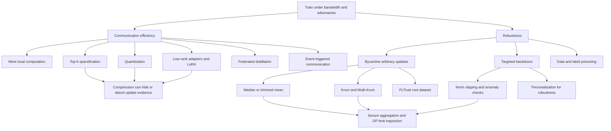

# Communication Efficiency and Robustness

Federated learning is constrained by communication before it is constrained by floating-point operations. A client may be able to run extra local SGD steps while idle and charging, but uploading a full neural-network update over consumer networking is expensive, slow, and energy-intensive. Communication efficiency therefore asks how to send fewer rounds, fewer parameters, fewer bits, or lower-dimensional signals without destroying convergence.

Robustness asks a different but connected question: what if some clients are malicious, compromised, or simply broken? Bagdasaryan et al. show that a malicious participant can use model replacement to inject backdoor behavior into a federated model, and that secure aggregation can make update-level anomaly detection difficult because individual updates are hidden [10]. Byzantine-robust aggregation methods such as coordinate-wise median, trimmed mean, Krum, Multi-Krum, Bulyan, FoolsGold, and FLTrust try to reduce the influence of bad updates, but their assumptions often conflict with non-IID federated data and privacy constraints [11], [12], [13], [14].

## Definitions

Let a model update be $\Delta_k\in\mathbb{R}^d$. The uplink cost of uncompressed float32 communication is approximately $32d$ bits per selected client per round. If $m$ clients participate for $T$ rounds, uncompressed uplink is $32d mT$ bits, before protocol overhead.

**Gradient compression** reduces the number of transmitted values or bits. **Top-$k$ sparsification** sends only the $k$ largest-magnitude coordinates. **Quantization** sends low-bit approximations such as signs, ternary values, or stochastic quantized levels. **Error feedback** stores compression residuals locally and adds them into future updates, reducing bias.

**Model compression** changes the trainable or communicated model. It includes structured pruning, unstructured pruning, low-rank updates, adapters, and LoRA-style fine-tuning. In foundation models, sending only adapter or LoRA parameters can reduce communication by orders of magnitude.

**Federated distillation** communicates predictions, logits, prototypes, or teacher signals instead of full weights. FedMD and related methods exchange knowledge through public or proxy data distributions rather than raw private examples [7].

**Lazy or event-triggered communication** sends updates only when they are large or informative enough. This can save bandwidth but may bias training toward volatile clients.

**Byzantine client** means a client may send arbitrary updates, not just noisy gradients. A malicious client can poison labels, send random vectors, scale updates, or optimize for a backdoor.

**Coordinate-wise median** aggregates each coordinate by taking the median across clients. **Trimmed mean** removes the largest and smallest $f$ values per coordinate and averages the rest [12].

**Krum** selects the update closest to its neighbors. For $K$ submitted updates and assumed Byzantine bound $f$, Krum computes

$$
\mathrm{score}(i)=\sum_{j\in\mathcal{N}(i)}\|g_i-g_j\|^2,
$$

where $\mathcal{N}(i)$ contains the $K-f-2$ nearest other updates. The selected update has the smallest score [11].


*Figure: Bagdasaryan et al.'s model-replacement attack shows that a single malicious participant can implant backdoors that evade anomaly detection under secure aggregation. From [Bagdasaryan et al., 2020](https://arxiv.org/abs/1807.00459) — embedded under educational fair use with attribution.*

**Model replacement** is a backdoor attack where the attacker trains a malicious model $X$ and scales its submitted update so FedAvg moves the global model close to $X$ [10]. If $m$ clients are averaged uniformly in the round, an attacker can submit roughly

$$
L_{t+1}=\gamma(X-G_t)+G_t,
$$

with $\gamma$ near $m$, so the aggregate is dominated by the backdoored model.

## Key results

Communication efficiency has two levers: reduce the number of rounds or reduce bytes per round. FedAvg reduces rounds by using local computation [1]. Compression reduces bytes per round. These levers interact: aggressive local epochs may increase drift, and aggressive compression may add error that slows convergence. Good systems measure time-to-quality, not just bits or rounds.

Top-$k$ sparsification can be effective when gradients are heavy-tailed. A client sends indices and values for the largest $k$ coordinates. If $k/d=0.01$, the values are $1\%$ of the dense update, but index cost matters. For large $d$, each index may require $\lceil \log_2 d\rceil$ bits. Error feedback is usually necessary because dropping coordinates forever biases the update.

Quantization reduces bits per coordinate. signSGD sends one bit per coordinate plus scale information, but the sign discards magnitude and can be vulnerable under heterogeneous gradients [4]. QSGD uses stochastic quantization with variance control [5]. TernGrad sends ternary gradients and scaling factors [6]. One-bit SGD and related approaches have a long distributed-training history, but FL adds partial participation, non-IID data, and secure aggregation constraints.

Model compression changes what is trainable. Pruning can reduce payload if the sparsity pattern is shared or cheaply encoded. Low-rank updates represent $\Delta W$ as $BA$ with rank $r$, reducing parameters from $mn$ to $r(m+n)$. LoRA and adapters are especially attractive when the base model is large and fixed, as in federated fine-tuning of foundation models [16], [17]. However, low-rank aggregation is not always equivalent to averaging full updates, especially when clients use different ranks or factor orientations.

Federated distillation can avoid sending full model weights. Clients exchange logits on a public dataset, prototypes, or teacher predictions. This helps when clients use heterogeneous architectures or when model weights are too large. The cost is that the public/proxy data or shared representation must be meaningful for all clients.

Robustness methods face the non-IID problem. Coordinate-wise median and trimmed mean assume that benign updates cluster coordinate-wise. Krum assumes benign updates are closer to one another than to Byzantine updates. In federated learning, benign updates may naturally point in different directions because client data differ. A rare but legitimate hospital, language group, or device distribution can look like an outlier. This is why robust aggregation can harm fairness and personalization, and why Ditto studies fairness and robustness together [15].

Backdoor attacks are particularly dangerous because they preserve main-task accuracy. Bagdasaryan et al. show semantic backdoors in image classification and word prediction, including a constrain-and-scale technique that incorporates evasion into the attacker's training objective [10]. The attacker does not need to make the global model fail overall; it only needs the model to behave maliciously on trigger inputs.

Secure aggregation changes the defense surface. It is useful for privacy because the server should not see individual updates [9]. But many robust aggregators require individual vectors. If secure aggregation reveals only a sum, coordinate-wise median, Krum, anomaly detection, and norm filtering cannot be directly applied unless the secure protocol is redesigned to compute robust statistics privately. This is an open systems and cryptography problem, not a parameter-tuning issue.

| Technique | Saves | Main cost | Robustness interaction |
|---|---|---|---|
| More local epochs | Rounds | Client drift | Can amplify poisoned local training |
| Top-$k$ sparsification | Values sent | Index overhead, bias | Sparse malicious updates can hide in selected coordinates |
| Quantization | Bits per value | Variance, lost magnitude | Sign methods can be brittle under Byzantine signs |
| LoRA/adapters | Trainable parameters | Adapter aggregation complexity | Smaller attack surface but backdoored adapters still matter |
| Distillation | Weight traffic | Need shared proxy data | Logit poisoning possible |
| Median/trimmed mean | Byzantine influence | Coordinate-wise assumptions | Can reject rare benign clients |
| Krum/Multi-Krum | Arbitrary bad vectors | Distance assumptions | Non-IID benign updates may look malicious |
| FLTrust | Untrusted clients | Requires trusted server data | Trust anchor may be biased |

## Visual



## Worked example 1: Bandwidth under top-k compression

**Problem.** A model update has $d=10{,}000{,}000$ coordinates. Dense float32 upload sends $32d$ bits. A top-$k$ method sends $k=100{,}000$ coordinates, each with a float32 value and a coordinate index. Assume each index uses $24$ bits because $2^{24}\gt 10{,}000{,}000$. There are $m=1{,}000$ clients per round and $T=500$ rounds. Compare total uplink.

**Step 1: dense bits per client.**

$$
32d=32(10{,}000{,}000)=320{,}000{,}000\text{ bits}.
$$

This is

$$
\frac{320{,}000{,}000}{8}=40{,}000{,}000\text{ bytes}=40\text{ MB}.
$$

**Step 2: top-$k$ bits per selected coordinate.**

Each coordinate sends $32$ value bits and $24$ index bits:

$$
56\text{ bits per coordinate}.
$$

**Step 3: top-$k$ bits per client.**

$$
56(100{,}000)=5{,}600{,}000\text{ bits}=700{,}000\text{ bytes}=0.7\text{ MB}.
$$

**Step 4: dense total uplink.**

$$
40\text{ MB}\cdot 1{,}000\cdot 500
=20{,}000{,}000\text{ MB}
=20{,}000\text{ GB}
=20\text{ TB}.
$$

**Step 5: top-$k$ total uplink.**

$$
0.7\text{ MB}\cdot 1{,}000\cdot 500
=350{,}000\text{ MB}
=350\text{ GB}.
$$

**Step 6: compression ratio.**

$$
\frac{20{,}000\text{ GB}}{350\text{ GB}}\approx 57.1.
$$

**Checked answer.** Top-$k$ reduces the uplink by about $57$ times in this setup, not $100$ times, because indices are not free.

## Worked example 2: Applying Krum to five client updates

**Problem.** Five clients send scalar updates

$$
g_1=1.0,\quad g_2=1.2,\quad g_3=0.9,\quad g_4=1.1,\quad g_5=8.0.
$$

Assume at most $f=1$ Byzantine client. Krum uses $K-f-2=5-1-2=2$ nearest neighbors for each score. Compute the selected update.

**Step 1: squared distances from $g_1=1.0$.**

To $1.2$: $0.2^2=0.04$; to $0.9$: $0.1^2=0.01$; to $1.1$: $0.1^2=0.01$; to $8.0$: $7^2=49$. Two nearest are $0.01$ and $0.01$.

$$
\mathrm{score}(1)=0.02.
$$

**Step 2: score for $g_2=1.2$.**

Distances: to $1.0$ is $0.04$, to $0.9$ is $0.09$, to $1.1$ is $0.01$, to $8.0$ is $46.24$. Two nearest: $0.01$ and $0.04$.

$$
\mathrm{score}(2)=0.05.
$$

**Step 3: score for $g_3=0.9$.**

Distances: to $1.0$ is $0.01$, to $1.2$ is $0.09$, to $1.1$ is $0.04$, to $8.0$ is $50.41$. Two nearest: $0.01$ and $0.04$.

$$
\mathrm{score}(3)=0.05.
$$

**Step 4: score for $g_4=1.1$.**

Distances: to $1.0$ is $0.01$, to $1.2$ is $0.01$, to $0.9$ is $0.04$, to $8.0$ is $47.61$. Two nearest: $0.01$ and $0.01$.

$$
\mathrm{score}(4)=0.02.
$$

**Step 5: score for $g_5=8.0$.**

Distances to benign-looking updates are $49$, $46.24$, $50.41$, and $47.61$. Two nearest: $46.24$ and $47.61$.

$$
\mathrm{score}(5)=93.85.
$$

**Checked answer.** Krum selects either $g_1=1.0$ or $g_4=1.1$ depending on tie-breaking. It rejects the obvious malicious update $8.0$. In high-dimensional non-IID FL, the benign cluster may be less clean than this toy example.

## Code

```python
import numpy as np

def topk_compress(update, k):
    idx = np.argpartition(np.abs(update), -k)[-k:]
    return idx, update[idx]

def krum(updates, f):
    updates = np.asarray(updates, dtype=float)
    n = len(updates)
    neighbor_count = n - f - 2
    scores = []
    for i in range(n):
        dists = []
        for j in range(n):
            if i == j:
                continue
            diff = updates[i] - updates[j]
            dists.append(float(np.dot(diff, diff)))
        scores.append(sum(sorted(dists)[:neighbor_count]))
    return int(np.argmin(scores)), scores

updates = np.array([[1.0], [1.2], [0.9], [1.1], [8.0]])
winner, scores = krum(updates, f=1)
print("Krum scores:", np.round(scores, 3))
print("Selected update:", updates[winner, 0])
```

## Common pitfalls

- Reporting compression ratio without including index, scale, mask, or protocol overhead.
- Dropping coordinates without error feedback and then blaming FedAvg for biased convergence.
- Assuming quantization errors average out under non-IID client sampling.
- Measuring bytes per round but ignoring that compression may require more rounds.
- Using top-$k$ with secure aggregation without a protocol for sparse index privacy and union handling.
- Treating LoRA communication as solved; aggregation of low-rank factors can be mathematically subtle.
- Assuming distillation works without representative public or proxy data.
- Applying Krum or median under severe non-IID data without checking false rejection of benign clients.
- Setting the Byzantine bound $f$ optimistically; too small misses attacks, too large discards signal.
- Forgetting that robust aggregation can conflict with fairness for rare client populations.
- Relying on anomaly detection while also requiring secure aggregation that hides individual updates.
- Evaluating only main-task accuracy and missing targeted backdoor success.
- Assuming norm clipping alone prevents model replacement; attackers can train within constraints.
- Ignoring adaptive attackers who know the defense and optimize around it.

## Connections

- [Privacy: Differential Privacy and Secure Aggregation](/cs/federated-learning/privacy-differential-and-secure-aggregation)
- [Heterogeneity and Federated Optimization](/cs/federated-learning/heterogeneity-and-optimization)
- [Personalization in Federated Learning](/cs/federated-learning/personalization-in-federated-learning)
- [Data poisoning and backdoors](/cs/adversarial-attacks/data-poisoning-and-backdoors)
- [Certified defenses and randomized smoothing](/cs/adversarial-attacks/certified-defenses-and-randomized-smoothing)
- [Gradient masking and obfuscation](/cs/adversarial-attacks/gradient-masking-and-obfuscation)
- [Computational performance](/cs/deep-learning/computational-performance)
- [Pretrained transformers for NLP](/cs/deep-learning/pretrained-transformers-nlp)

## References

[1] H. B. McMahan et al., "Communication-Efficient Learning of Deep Networks from Decentralized Data," AISTATS, 2017. https://arxiv.org/abs/1602.05629

[2] J. Konecny et al., "Federated Learning: Strategies for Improving Communication Efficiency," 2016. https://arxiv.org/abs/1610.05492

[3] A. Reisizadeh, A. Mokhtari, H. Hassani, A. Jadbabaie, and R. Pedarsani, "FedPAQ: A Communication-Efficient Federated Learning Method with Periodic Averaging and Quantization," AISTATS, 2020. https://arxiv.org/abs/1909.13014

[4] J. Bernstein, Y.-X. Wang, K. Azizzadenesheli, and A. Anandkumar, "signSGD: Compressed Optimisation for Non-Convex Problems," ICML, 2018. https://arxiv.org/abs/1802.04434

[5] D. Alistarh et al., "QSGD: Communication-Efficient SGD via Gradient Quantization and Encoding," NeurIPS, 2017. https://arxiv.org/abs/1610.02132

[6] W. Wen et al., "TernGrad: Ternary Gradients to Reduce Communication in Distributed Deep Learning," NeurIPS, 2017. https://arxiv.org/abs/1705.07878

[7] D. Li and J. Wang, "FedMD: Heterogenous Federated Learning via Model Distillation," 2019. https://arxiv.org/abs/1910.03581

[8] I. Itahara, T. Nishio, Y. Koda, M. Morikura, and K. Yamamoto, "Distillation-Based Semi-Supervised Federated Learning for Communication-Efficient Collaborative Training," 2020. https://arxiv.org/abs/2008.06180

[9] K. Bonawitz et al., "Practical Secure Aggregation for Privacy-Preserving Machine Learning," CCS, 2017. https://dl.acm.org/doi/10.1145/3133956.3133982

[10] E. Bagdasaryan, A. Veit, Y. Hua, D. Estrin, and V. Shmatikov, "How To Backdoor Federated Learning," AISTATS, 2020. https://arxiv.org/abs/1807.00459

[11] P. Blanchard, E. M. El Mhamdi, R. Guerraoui, and J. Stainer, "Machine Learning with Adversaries: Byzantine Tolerant Gradient Descent," NeurIPS, 2017. https://arxiv.org/abs/1703.02757

[12] D. Yin, Y. Chen, R. Kannan, and P. Bartlett, "Byzantine-Robust Distributed Learning: Towards Optimal Statistical Rates," ICML, 2018. https://arxiv.org/abs/1803.01498

[13] E. M. El Mhamdi, R. Guerraoui, and S. Rouault, "The Hidden Vulnerability of Distributed Learning in Byzantium," ICML, 2018. https://arxiv.org/abs/1802.07927

[14] X. Cao, M. Fang, J. Liu, and N. Z. Gong, "FLTrust: Byzantine-Robust Federated Learning via Trust Bootstrapping," NDSS, 2021. https://arxiv.org/abs/2012.13995

[15] T. Li, S. Hu, A. Beirami, and V. Smith, "Ditto: Fair and Robust Federated Learning Through Personalization," ICML, 2021. https://arxiv.org/abs/2012.04221

[16] E. J. Hu et al., "LoRA: Low-Rank Adaptation of Large Language Models," ICLR, 2022. https://arxiv.org/abs/2106.09685

[17] Y. Yang et al., "Federated Low-Rank Adaptation for Foundation Models: A Survey," 2025. https://arxiv.org/abs/2505.13502

[18] P. Kairouz et al., "Advances and Open Problems in Federated Learning," Foundations and Trends in Machine Learning, 2021. https://arxiv.org/abs/1912.04977

[19] C. Xie, K. Huang, P.-Y. Chen, and B. Li, "DBA: Distributed Backdoor Attacks Against Federated Learning," ICLR, 2020. https://arxiv.org/abs/1905.10447
