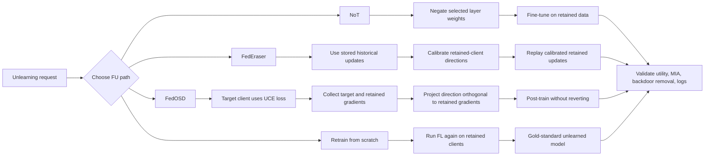

# Federated Unlearning

Federated unlearning asks how a federated model can remove the influence of a client, sample, class, or poisoned data source without rerunning the entire federated training process. The motivation is partly legal: GDPR Article 17 and California deletion rights give data subjects ways to request deletion of personal data, subject to exceptions [1], [2]. It is also operational: if one hospital uploaded poisoned gradients, one mobile cohort was mislabeled, or one silo's consent expires, a production FL system needs a way to repair the model while preserving utility for retained clients.

The difficulty is that federated learning does not merely append independent client records to a model. Every round broadcasts a model already influenced by earlier clients, then asks later clients to train from that coupled state. This chapter therefore treats federated unlearning as its own systems and optimization problem, linking the FedAvg loop, privacy controls, poisoning recovery, and audit requirements from the rest of the Federated Learning section.


*Figure: FedOSD's three-client gradient-conflict geometry. A naive unlearning direction for the target client can conflict with retained clients, while the projected FedOSD direction is non-conflicting. From [Pan et al., 2025](https://arxiv.org/abs/2412.20200) - embedded under educational fair use with attribution.*

## Definitions

**Machine unlearning** is the task of producing a model that behaves as if some training data had never been used. The gold standard is exact retraining: delete the requested data, rerun the original training algorithm on the retained data with the same protocol, and deploy the retrained model. Exact retraining is conceptually clean but can be unaffordable in FL because it repeats communication rounds, client scheduling, local training, secure aggregation, validation, and rollout.

**Federated unlearning (FU)** is machine unlearning under federated constraints. Clients keep raw data locally; the server may only see model updates, aggregates, metrics, or audit logs. A federated unlearning method receives an unlearning request and returns an unlearned model $\theta^{-u}$ that should approximate the model obtained by training only on retained data $D_{-u}$:

$$
\theta^{-u}\approx \mathcal{A}_{FL}(D_{-u}),
$$

where $\mathcal{A}_{FL}$ includes the FL optimizer, client sampling, aggregation weights, hyperparameters, and randomness.

Unlearning requests appear at several granularities. **Sample-level unlearning** removes one or more examples from a client's local dataset. It is natural for privacy requests, but hard because the server usually never saw the sample and may not know which future sample will be deleted. **Client-level unlearning** removes an entire participant's contribution; this is the most common FU research setting because client updates are the unit already visible to the server. **Class-level unlearning** removes a category, label, or concept, for example all images of one class in a federated vision model. Related variants include feature-level unlearning in vertical FL and adapter-level unlearning in federated foundation-model tuning.

Centralized unlearning gives important baselines but does not transfer directly. Cao and Yang transform some learning algorithms into summation forms so deleted records update sufficient statistics rather than trigger full retraining [8]. Ginart et al. study deletion-efficient algorithms for $k$-means [11]. Guo et al. define certified removal for linear models [10]. Bourtoule et al.'s SISA approach shards, isolates, slices, and aggregates training so only affected shards need retraining [9]. Influence-function methods estimate how deleting one example perturbs parameters by using inverse-Hessian approximations [22].

These baselines assume central access to retained data or algorithmic state that FL deliberately avoids. FU must handle forward coupling across rounds, non-IID client distributions, limited availability, secure aggregation, differential privacy noise, and audit requirements. A server that stored no individual updates may be unable to identify the target client's contribution; a server that stored every update may have created a new privacy liability.

## Key results

FedAvg trains by broadcasting a global model $\theta_t$, collecting local updates $\Delta_{k,t}$ from selected clients $S_t$, and aggregating with data-size or policy weights:

$$
\theta_{t+1}=\theta_t+\sum_{k\in S_t}p_{k,t}\Delta_{k,t},\qquad \sum_{k\in S_t}p_{k,t}=1.
$$

If client $u$ later requests erasure, exact retraining reruns the whole process with $u$ excluded. This is the baseline for evaluation because it defines the clearest target, but it is usually prohibitive. A realistic deployment may need hundreds or thousands of rounds, and old cross-device clients may be gone.

**Historical update reconstruction.** FedEraser, introduced by Liu et al., is the first federated unlearning method and is centered on a storage-time tradeoff [5]. During original FL training, the server retains historical updates at selected rounds. During unlearning, it discards the target client's updates and reconstructs the model from the retained clients' stored updates. Because those stored updates were computed from models already influenced by the target client, FedEraser performs short calibration training on retained clients and uses the new update direction with the old update magnitude:

$$
\widehat{\Delta}_{k,t_j}
=\|\Delta_{k,t_j}\|_2\frac{\widetilde{\Delta}_{k,t_j}}
{\|\widetilde{\Delta}_{k,t_j}\|_2+\epsilon},
\qquad k\ne u.
$$

The calibrated updates are aggregated over retained clients:

$$
\bar{\Delta}_{t_j}^{-u}
=\frac{\sum_{k\ne u}n_k\widehat{\Delta}_{k,t_j}}
{\sum_{k\ne u}n_k},
\qquad
\theta_{t_{j+1}}^{-u}=\theta_{t_j}^{-u}+\bar{\Delta}_{t_j}^{-u}.
$$

The paper reports about a $4\times$ expected speed-up over retraining under its calibration-ratio and retaining-interval settings [5]. The cost is server storage and a privacy concern: retained individual updates may leak information unless protected.

**Reverse optimization.** A simple idea is to reverse the target client's learning by applying gradient ascent on its ordinary training loss, or equivalently by pushing the model away from the target data. If $L_u(\theta)$ is the target client's loss, the update $\theta_{t+1}=\theta_t+\eta\nabla L_u(\theta_t)$ degrades target performance. The problem is that cross-entropy is unbounded as the correct-class probability goes to zero, so gradients can explode. It also harms retained clients when the unlearning direction conflicts with their gradients.

**Gradient projection.** FedOSD addresses these issues with two changes [6]. First, it replaces ascent on cross-entropy with descent on an unlearning cross-entropy loss:

$$
L_{\mathrm{UCE}}=-\sum_c y_c\log(1-p_c/2).
$$

Minimizing this loss lowers the correct-class probability for the target client without the same unbounded-gradient behavior. Second, FedOSD chooses a steepest unlearning direction that is orthogonal to retained clients' gradients. Let $g_u=\nabla L_{\mathrm{UCE}}$ and let $G$ contain retained gradients as rows. The closest vector to $-g_u$ that is non-conflicting with retained clients is the projection onto the nullspace of $G$:

$$
d_0=-\left(I-G^\top(GG^\top)^+G\right)g_u,
\qquad
d=\|g_u\|_2\frac{d_0}{\|d_0\|_2+\epsilon}.
$$

Then $Gd=0$, so the first-order change for retained losses is neutral, while $g_u^\top d\lt 0$ when the projected target component is nonzero. FedOSD also projects post-training gradients away from the original model direction to reduce model reverting, where recovery training accidentally relearns the removed influence [6].

**Weight negation.** NoT, proposed by Khalil et al. at CVPR 2025, uses a different perturb-then-recover view [7]. The server negates selected layer parameters, for example

$$
\theta'_\ell=
\begin{cases}
-\theta_\ell, & \ell\in\mathcal{L}_{neg},\\
\theta_\ell, & \ell\notin\mathcal{L}_{neg},
\end{cases}
$$

then fine-tunes on retained data. The method needs no target data and no historical update storage. Its claim is that layer-wise negation strongly disrupts inter-layer co-adaptation, inducing forgetting, while still leaving the model in a state that can recover quickly on retained data. It is attractive for client-, class-, and instance-wise requests, but it still depends on careful layer choice, fine-tuning access, and empirical validation.

Other FU families fill the space between these anchors. Knowledge-distillation methods subtract or perturb the target contribution, then train a student from retained-client outputs or public/proxy data [14]. Pruning and sparsity-based methods identify channels or parameters that are discriminative for a target class, remove them, and fine-tune [17]. Certified and provable methods attempt to bound the distance from retraining under linearized or restricted settings [10], [18]. Secure systems add verifiability, logs, and proof artifacts, but proofs of erasure for deep FL remain open [21].

Evaluation should report at least five quantities. **Residual knowledge** is often measured with membership inference attack accuracy, precision, recall, or AUC: after unlearning, an attacker should not distinguish target data from nonmembers better than it can against retraining [23]. **Backdoor removal** checks whether poisoned triggers from the target client stop working [24]. **Retained utility** measures accuracy or loss on retained clients, including worst-client accuracy under heterogeneity. **Speed** compares unlearning rounds, wall-clock time, communication, and storage with full retraining. **Auditability** records who requested unlearning, which checkpoints and updates were used, what validation passed, and whether secure aggregation or DP prevented the server from seeing the needed evidence.

Open challenges follow directly from these tradeoffs. Secure aggregation hides individual updates that many FU methods need. Differential privacy can reduce memorization but also complicates accounting after post-hoc deletion. Cross-device FU must handle unavailable clients and missing historical records. Class- and feature-level unlearning require finer granularity than client removal. Federated LLM and FedLoRA settings shift the target from full weights to adapters, prompts, or low-rank deltas [25], [26]. Adversarial clients may issue requests to learn about others or to damage the model. Regulators and users may demand a verifiable proof of erasure rather than a similarity score.

## Visual



| Method family | Needs target data during unlearning? | Needs stored individual updates? | Main strength | Main risk |
|---|---:|---:|---|---|
| Exact retraining | No, after deletion | No | Clearest deletion semantics | Very expensive |
| FedEraser | No | Yes | Fast reconstruction from history | Storage and update leakage |
| Reverse SGD / ascent | Often yes | No | Simple and cheap | Utility collapse |
| FedOSD | Yes for target gradients | No | Mitigates gradient conflict | Requires client participation |
| NoT | No | No | Minimal server-side perturbation | Layer choice and empirical trust |
| Distillation | No target data, but needs retained/proxy signal | Sometimes | Recovers utility | Teacher leakage or proxy bias |
| Pruning / sparsity | Usually class statistics | No | Natural for class unlearning | Hard for arbitrary clients |

## Worked example 1: FedEraser calibration on three clients

**Problem.** Three clients trained a two-parameter model. Client 2 requests unlearning. At one retained round, the server has historical updates

$$
\Delta_1=(2,1),\qquad \Delta_2=(5,-1),\qquad \Delta_3=(-1,2),
$$

and retained-client data sizes $n_1=40$, $n_3=60$. During calibration from the current unlearned checkpoint, clients 1 and 3 return

$$
\widetilde{\Delta}_1=(3,4),\qquad \widetilde{\Delta}_3=(0,6).
$$

Compute the calibrated retained update and apply it to $\theta=(10,-2)$.

**Step 1: ignore the target client.** Client 2's historical update is not used. The reconstruction uses only clients 1 and 3.

**Step 2: keep historical magnitudes.**

$$
\|\Delta_1\|_2=\sqrt{2^2+1^2}=\sqrt{5},\qquad
\|\Delta_3\|_2=\sqrt{(-1)^2+2^2}=\sqrt{5}.
$$

**Step 3: use retained-only calibration directions.**

$$
\frac{\widetilde{\Delta}_1}{\|\widetilde{\Delta}_1\|_2}
=\frac{(3,4)}{5}=(0.6,0.8),
\qquad
\frac{\widetilde{\Delta}_3}{\|\widetilde{\Delta}_3\|_2}
=\frac{(0,6)}{6}=(0,1).
$$

**Step 4: form calibrated updates.**

$$
\widehat{\Delta}_1=\sqrt{5}(0.6,0.8)=(1.3416,1.7889),
$$

$$
\widehat{\Delta}_3=\sqrt{5}(0,1)=(0,2.2361).
$$

**Step 5: aggregate by retained data size.**

$$
\bar{\Delta}^{-2}
=\frac{40(1.3416,1.7889)+60(0,2.2361)}{100}
=(0.5366,2.0572).
$$

**Checked answer.** The reconstructed model after this retained round is

$$
\theta^+=(10,-2)+(0.5366,2.0572)=(10.5366,0.0572).
$$

The target client's update never appears in the aggregation, and the retained clients' directions are recomputed from a target-free calibration state.

## Worked example 2: FedOSD orthogonal projection

**Problem.** A target client computes the UCE gradient

$$
g_u=(3,1,2),
$$

and two retained clients return gradients

$$
g_1=(1,0,0),\qquad g_2=(0,1,1).
$$

Find a FedOSD update direction $d$ closest to $-g_u$ while satisfying $g_1^\top d=0$ and $g_2^\top d=0$. Rescale it to have norm $\|g_u\|_2$.

**Step 1: describe the feasible subspace.** Let $d=(a,b,c)$. The retained-client constraints are

$$
g_1^\top d=a=0,\qquad g_2^\top d=b+c=0.
$$

Therefore $d=(0,b,-b)$, so the nullspace is spanned by $v=(0,1,-1)$.

**Step 2: project the naive direction.** The naive target descent direction is $-g_u=(-3,-1,-2)$. Its projection onto $v$ is

$$
d_0=\frac{(-g_u)^\top v}{v^\top v}v
=\frac{(-3,-1,-2)\cdot(0,1,-1)}{2}(0,1,-1).
$$

The dot product is $-1+2=1$, hence

$$
d_0=(0,0.5,-0.5).
$$

**Step 3: rescale.** The target-gradient norm is

$$
\|g_u\|_2=\sqrt{3^2+1^2+2^2}=\sqrt{14}.
$$

The projected norm is

$$
\|d_0\|_2=\sqrt{0.5^2+(-0.5)^2}=\sqrt{0.5}.
$$

Thus

$$
d=\sqrt{14}\frac{d_0}{\sqrt{0.5}}
=(0,2.6458,-2.6458).
$$

**Step 4: check non-conflict and unlearning.**

$$
g_1^\top d=0,\qquad g_2^\top d=2.6458-2.6458=0.
$$

The direction still descends the target UCE loss:

$$
g_u^\top d=3(0)+1(2.6458)+2(-2.6458)=-2.6458<0.
$$

**Checked answer.** With step size $\eta=0.1$ and $\theta=(1,1,1)$, the updated model is

$$
\theta^+=\theta+\eta d=(1,1.2646,0.7354).
$$

The first-order retained-client loss change is neutral, while the target-client UCE loss decreases.

## Code

```python
import numpy as np

def federaser_calibrate(historical, calibration, sizes, eps=1e-12):
    calibrated = []
    for old_delta, new_delta in zip(historical, calibration):
        old_delta = np.asarray(old_delta, dtype=float)
        new_delta = np.asarray(new_delta, dtype=float)
        direction = new_delta / (np.linalg.norm(new_delta) + eps)
        calibrated.append(np.linalg.norm(old_delta) * direction)
    weights = np.asarray(sizes, dtype=float)
    return np.average(np.vstack(calibrated), axis=0, weights=weights)

def fedosd_direction(target_grad, retained_grads, eps=1e-12):
    g = np.asarray(target_grad, dtype=float)
    G = np.asarray(retained_grads, dtype=float)
    projector_row = G.T @ np.linalg.pinv(G @ G.T) @ G
    d0 = -(np.eye(g.size) - projector_row) @ g
    return np.linalg.norm(g) * d0 / (np.linalg.norm(d0) + eps)

hist = [np.array([2, 1]), np.array([-1, 2])]
cal = [np.array([3, 4]), np.array([0, 6])]
print("FedEraser update:", federaser_calibrate(hist, cal, [40, 60]))

target = np.array([3, 1, 2])
retained = np.array([[1, 0, 0], [0, 1, 1]])
d = fedosd_direction(target, retained)
print("FedOSD direction:", d)
print("Retained dot products:", retained @ d)
print("Target dot product:", target @ d)
```

## Common pitfalls

- Treating deletion of raw client data as deletion of its learned influence.
- Comparing against FedAvg instead of exact retraining on retained data.
- Reporting only retained accuracy while ignoring MIA or backdoor-trigger success.
- Forgetting that historical individual updates can themselves be sensitive.
- Assuming secure aggregation is compatible with methods that need per-client updates.
- Using reverse SGD without bounding or replacing cross-entropy, causing gradient explosion.
- Calling a direction "non-conflicting" without checking retained-client dot products.
- Recovering utility with post-training that moves the model back toward the pre-unlearning optimum.
- Measuring speed only in rounds, not wall-clock time, client availability, communication, and storage.
- Ignoring worst-client retained accuracy under non-IID data.
- Treating class-level and client-level unlearning as interchangeable.
- Assuming differential privacy automatically satisfies deletion requests after training.
- Omitting audit logs, request identity, model lineage, and validation artifacts.
- Using public proxy data for distillation without checking distribution and privacy bias.

## Connections

- [Federated Learning](/cs/federated-learning/intro)
- [Foundations and FedAvg](/cs/federated-learning/foundations-and-fedavg)
- [Privacy: Differential Privacy and Secure Aggregation](/cs/federated-learning/privacy-differential-and-secure-aggregation)
- [Communication Efficiency and Robustness](/cs/federated-learning/communication-efficiency-and-robustness)
- [Applications and Systems](/cs/federated-learning/applications-and-systems)
- [Adversarial Attacks](/cs/adversarial-attacks/intro)
- [Cryptography](/cs/cryptography/intro)
- [Optimization algorithms](/cs/deep-learning/optimization-algorithms)

## References

[1] European Parliament and Council, "Regulation (EU) 2016/679, General Data Protection Regulation," 2016. https://eur-lex.europa.eu/eli/reg/2016/679/oj

[2] California Legislature, "California Consumer Privacy Act of 2018, consumer deletion rights," 2018. https://oag.ca.gov/privacy/ccpa

[3] H. B. McMahan et al., "Communication-Efficient Learning of Deep Networks from Decentralized Data," AISTATS, 2017. https://arxiv.org/abs/1602.05629

[4] P. Kairouz et al., "Advances and Open Problems in Federated Learning," Foundations and Trends in Machine Learning, 2021. https://arxiv.org/abs/1912.04977

[5] G. Liu, X. Ma, Y. Yang, C. Wang, and J. Liu, "Federated Unlearning," arXiv:2012.13891, 2021. https://arxiv.org/abs/2012.13891

[6] Z. Pan et al., "Federated Unlearning with Gradient Descent and Conflict Mitigation," Proc. AAAI Conf. Artificial Intelligence, vol. 39, no. 19, pp. 19804-19812, 2025. https://doi.org/10.1609/aaai.v39i19.34181

[7] Y. H. Khalil, L. Brunswic, S. Lamghari, X. Li, M. Beitollahi, and X. Chen, "NoT: Federated Unlearning via Weight Negation," CVPR, pp. 25759-25769, 2025. https://openaccess.thecvf.com/content/CVPR2025/html/Khalil_NoT_Federated_Unlearning_via_Weight_Negation_CVPR_2025_paper.html

[8] Y. Cao and J. Yang, "Towards Making Systems Forget with Machine Unlearning," IEEE Symposium on Security and Privacy, pp. 463-480, 2015. https://doi.org/10.1109/SP.2015.35

[9] L. Bourtoule et al., "Machine Unlearning," IEEE Symposium on Security and Privacy, 2021. https://arxiv.org/abs/1912.03817

[10] C. Guo, T. Goldstein, A. Hannun, and L. van der Maaten, "Certified Data Removal from Machine Learning Models," ICML, pp. 3832-3842, 2020. https://proceedings.mlr.press/v119/guo20c.html

[11] A. Ginart, M. Guan, G. Valiant, and J. Zou, "Making AI Forget You: Data Deletion in Machine Learning," NeurIPS, 2019. https://arxiv.org/abs/1907.05012

[12] Y. Liu, L. Xu, X. Yuan, C. Wang, and B. Li, "The Right to be Forgotten in Federated Learning: An Efficient Realization with Rapid Retraining," INFOCOM, 2022. https://arxiv.org/abs/2203.07320

[13] L. Wu, S. Guo, J. Wang, Z. Hong, J. Zhang, and Y. Ding, "Federated Unlearning: Guarantee the Right of Clients to Forget," IEEE Network, vol. 36, no. 5, pp. 129-135, 2022. https://doi.org/10.1109/MNET.001.2200198

[14] C. Wu, S. Zhu, and P. Mitra, "Federated Unlearning with Knowledge Distillation," arXiv:2201.09441, 2022. https://arxiv.org/abs/2201.09441

[15] X. Cao, J. Jia, Z. Zhang, and N. Z. Gong, "FedRecover: Recovering from Poisoning Attacks in Federated Learning using Historical Information," IEEE Symposium on Security and Privacy, pp. 1366-1383, 2023. https://doi.org/10.1109/SP46215.2023.10179336

[16] L. Zhang, T. Zhu, H. Zhang, P. Xiong, and W. Zhou, "FedRecovery: Differentially Private Machine Unlearning for Federated Learning Frameworks," IEEE Trans. Information Forensics and Security, vol. 18, pp. 4732-4746, 2023. https://doi.org/10.1109/TIFS.2023.3297905

[17] J. Wang, S. Guo, X. Xie, and H. Qi, "Federated Unlearning via Class-Discriminative Pruning," WWW, pp. 622-632, 2022. https://doi.org/10.1145/3485447.3512222

[18] R. Jin, M. Chen, Q. Zhang, and X. Li, "Forgettable Federated Linear Learning with Certified Data Unlearning," arXiv:2306.02216, 2023. https://arxiv.org/abs/2306.02216

[19] T. Che et al., "Fast Federated Machine Unlearning with Nonlinear Functional Theory," ICML, pp. 4241-4268, 2023. https://proceedings.mlr.press/v202/che23b.html

[20] G. Li et al., "Subspace Based Federated Unlearning," arXiv:2302.12448, 2023. https://arxiv.org/abs/2302.12448

[21] X. Gao et al., "VeriFi: Towards Verifiable Federated Unlearning," arXiv:2205.12709, 2022. https://arxiv.org/abs/2205.12709

[22] P. W. Koh and P. Liang, "Understanding Black-box Predictions via Influence Functions," ICML, 2017. https://arxiv.org/abs/1703.04730

[23] R. Shokri, M. Stronati, C. Song, and V. Shmatikov, "Membership Inference Attacks Against Machine Learning Models," IEEE Symposium on Security and Privacy, 2017. https://doi.org/10.1109/SP.2017.41

[24] E. Bagdasaryan, A. Veit, Y. Hua, D. Estrin, and V. Shmatikov, "How To Backdoor Federated Learning," AISTATS, 2020. https://arxiv.org/abs/1807.00459

[25] E. J. Hu et al., "LoRA: Low-Rank Adaptation of Large Language Models," ICLR, 2022. https://arxiv.org/abs/2106.09685

[26] Y. Yang et al., "Federated Low-Rank Adaptation for Foundation Models: A Survey," arXiv:2505.13502, 2025. https://arxiv.org/abs/2505.13502
