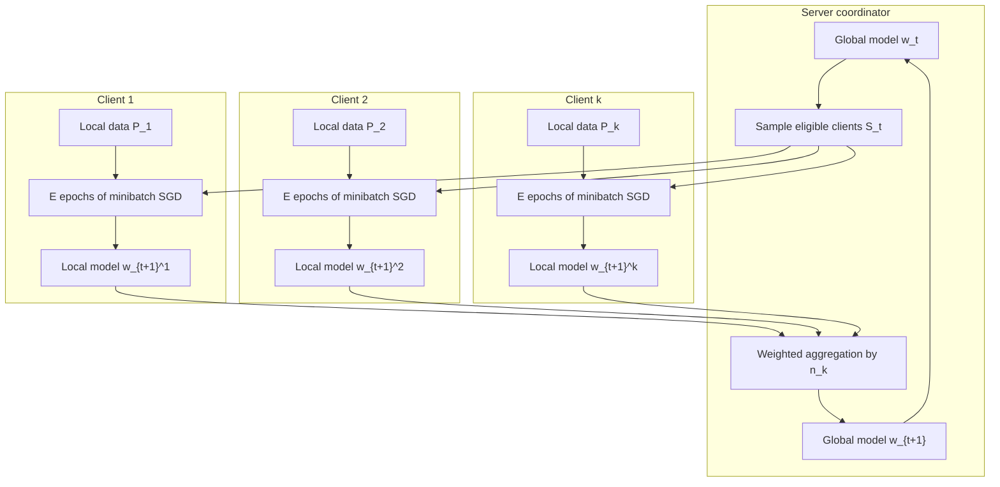

# Foundations and FedAvg


*Figure: The original FedAvg paper showed that local SGD averaging can reach target accuracy in many fewer rounds than synchronized FedSGD across MNIST/CIFAR/Shakespeare. From [McMahan et al., 2017](https://arxiv.org/abs/1602.05629) — embedded under educational fair use with attribution.*

Federated learning is the training pattern where data remains on clients while models or model updates move. The usual mental picture is a server coordinating many clients: it broadcasts a current model, selected clients run local optimization, and the server aggregates the returned updates. McMahan et al. introduced this as a practical deep-learning method for decentralized mobile data and showed that local computation can reduce communication rounds by large factors compared with synchronized FedSGD [1].

The foundation matters because nearly every later federated-learning idea modifies one of four design choices: which clients participate, how much local computation they do, what they send, and how the server aggregates it. Cross-device systems emphasize massive scale, intermittent availability, and privacy-preserving aggregation. Cross-silo systems emphasize governance, auditability, higher client reliability, and institutional data sovereignty. In both cases, FedAvg is the baseline to understand before studying heterogeneity, personalization, privacy, compression, or robustness.

## Definitions

Let there be $K$ clients. Client $k$ owns a local dataset $P_k$ with $n_k=\vert P_k\vert $ examples, and $n=\sum_{k=1}^{K} n_k$. For a model parameter vector $w\in\mathbb{R}^d$, define the local objective

$$
F_k(w)=\frac{1}{n_k}\sum_{i\in P_k}\ell_i(w),
$$

and the population-weighted federated objective

$$
f(w)=\sum_{k=1}^{K}\frac{n_k}{n}F_k(w).
$$

Here $\ell_i(w)$ is the loss on example $i$, such as cross-entropy for classification or next-token prediction. A global optimum for $f$ may not be good for every client, but it is the canonical single-model objective.

**Cross-device federated learning** uses very many clients, often phones, tablets, wearables, vehicles, or sensors. A client may be available only when plugged in, idle, and on unmetered networking. The server samples a small fraction of eligible clients per round, and the system expects dropouts.

**Cross-silo federated learning** uses fewer clients, such as hospitals, banks, labs, manufacturers, or agencies. Clients are usually more reliable, each may hold substantial data, and governance can include contracts, audit logs, certificates, and manually approved infrastructure.

**FedSGD** is the direct federated version of synchronous SGD. In each round, selected clients compute gradients on local data or minibatches, and the server averages those gradients before taking a global step.

**FedAvg** replaces one client gradient with several local SGD steps. At communication round $t$, the server has $w_t$. It samples $S_t$, usually with $m=\max(CK,1)$ clients for client fraction $C$. Each selected client initializes $w_{t,0}^{k}=w_t$ and runs $E$ local epochs over minibatches of size $B$:

$$
w_{t,e+1}^{k}=w_{t,e}^{k}-\eta\nabla \ell_{\mathcal{B}_{t,e}^{k}}(w_{t,e}^{k}).
$$

After local training, the client sends $w_{t+1}^{k}$ or $\Delta_t^k=w_{t+1}^k-w_t$. The server computes

$$
w_{t+1}=\sum_{k\in S_t}\frac{n_k}{\sum_{j\in S_t}n_j}w_{t+1}^{k}.
$$

When all clients participate, this is the common formula

$$
w_{t+1}=\sum_{k=1}^{K}\frac{n_k}{n}w_{t+1}^{k}.
$$

The basic hyperparameters are $T$ communication rounds, client fraction $C$, local epochs $E$, minibatch size $B$, learning rate $\eta$, and model dimension $d$. McMahan et al. used $C$, $E$, and $B$ to expose the communication-computation tradeoff: more local work can dramatically reduce rounds, but too much local work can make clients drift toward incompatible local optima [1].

| Setting | Cross-device FL | Cross-silo FL |
|---|---:|---:|
| Typical clients | Phones, IoT, vehicles | Hospitals, banks, firms |
| Number of clients | Thousands to millions | 2 to hundreds |
| Availability | Intermittent and biased | Scheduled and reliable |
| Local data | Small per client, highly personal | Larger per silo, governed |
| Main system risk | Dropout, bandwidth, privacy | Governance, audit, trust |
| Common aggregation | Sampled synchronous rounds | Full or partial participation |
| Security emphasis | Secure aggregation, DP, abuse resistance | Access control, MPC, legal audit |

## Key results

FedAvg can be read as a practical compromise between minibatch SGD and local training. With $E=1$ and one minibatch per selected client, it resembles FedSGD. As $E$ grows, clients spend more computation between communications, and the server receives a model that has moved along the client's local objective. If client data are IID samples from the same distribution, then local objectives $F_k$ are noisy approximations of $f$, so averaging local SGD trajectories can approximate centralized SGD while requiring fewer synchronizations.

The communication win comes from doing more local work per round. McMahan et al. reported that FedAvg reduced communication rounds by roughly $10$ to $100$ times over synchronized SGD in their experimental settings, including MNIST/CIFAR-style image tasks and a Shakespeare next-character prediction task [1]. The precise speedup depends on model, data partition, learning rate, and target accuracy, but the mechanism is simple: one upload can carry the effect of many local minibatch updates.

FedAvg is not just averaging independently trained final models. All clients start a round from the same $w_t$, so local models remain in a shared coordinate system. The original paper illustrates that averaging neural-network weights is much more sensible when models share initialization and training history than when independently initialized networks are averaged [1]. This point still matters in modern FL: aggregation is meaningful because local optimization is coordinated around a common global iterate.

The same design creates client drift. Under non-IID data, $F_k$ may point toward a local optimum that differs substantially from the optimum of $f$. Multiple local steps compound the mismatch, so the update returned by client $k$ may no longer be an unbiased or low-variance estimate of a global descent direction. Later methods such as FedProx, SCAFFOLD, FedNova, FedBN, and MOON can all be interpreted as attempts to constrain, correct, normalize, or representationally align this drift [5], [6], [7], [11], [12].

Synchronous rounds are the cleanest baseline. In a synchronous protocol, the server waits for enough selected clients and then aggregates. This simplifies analysis and makes the round count easy to measure. Real systems add eligibility filters, deadlines, retries, secure aggregation setup, server-side optimizers, and sometimes asynchronous buffering. Bonawitz et al.'s production-system discussion emphasizes that practical FL also requires device scheduling, compression, privacy accounting, telemetry, and robust orchestration beyond the textbook algorithm [4].

FedAvg pseudocode:

```text
initialize w_0
for t = 0, 1, ..., T-1:
    m = max(floor(CK), 1)
    S_t = sample m eligible clients
    for each client k in S_t in parallel:
        w = w_t
        repeat E local epochs:
            for minibatch b of size B from P_k:
                w = w - eta * grad loss_b(w)
        send w_{t+1}^k = w to server
    w_{t+1} = sum_{k in S_t} (n_k / sum_{j in S_t} n_j) w_{t+1}^k
```

The important proof intuition is not that FedAvg always has a clean unbiased-gradient interpretation. Rather, in the IID limit with small local learning rates, the average of local SGD trajectories behaves like a larger minibatch stochastic update. As data become heterogeneous, higher-order terms accumulate because each client evaluates gradients at different locally moved points. This is the bridge to the heterogeneity chapter.

## Visual



## Worked example 1: One scalar FedAvg round

**Problem.** Three clients participate in one full FedAvg round. The current scalar model is $w_t=2.0$. Client sizes are $n_1=10$, $n_2=30$, and $n_3=60$. Each client performs local training and returns:

$$
w_{t+1}^1=1.6,\qquad w_{t+1}^2=2.2,\qquad w_{t+1}^3=2.5.
$$

Compute the next global model.

**Step 1: compute total selected examples.**

$$
n=10+30+60=100.
$$

**Step 2: compute aggregation weights.**

$$
\alpha_1=\frac{10}{100}=0.10,\quad
\alpha_2=\frac{30}{100}=0.30,\quad
\alpha_3=\frac{60}{100}=0.60.
$$

**Step 3: take the weighted model average.**

$$
\begin{aligned}
w_{t+1}
&=0.10(1.6)+0.30(2.2)+0.60(2.5)\\
&=0.16+0.66+1.50\\
&=2.32.
\end{aligned}
$$

**Checked answer.** The large third client pulls the model upward. A simple unweighted average would be $(1.6+2.2+2.5)/3=2.1$, but FedAvg uses data-weighted averaging, giving $w_{t+1}=2.32$.

## Worked example 2: Communication cost versus local computation

**Problem.** A model has $d=5{,}000{,}000$ float32 parameters. Each upload sends one model update, so each parameter costs $4$ bytes before compression. Training uses $T=400$ rounds, $K=1{,}000{,}000$ total clients, and client fraction $C=0.01$. Compare total uplink traffic with a hypothetical FedSGD run that needs $T_{\mathrm{SGD}}=8{,}000$ rounds using the same client fraction.

**Step 1: selected clients per round.**

$$
m=CK=0.01(1{,}000{,}000)=10{,}000.
$$

**Step 2: bytes per client upload.**

$$
4d=4(5{,}000{,}000)=20{,}000{,}000\text{ bytes}=20\text{ MB}.
$$

**Step 3: FedAvg uplink traffic.**

$$
\begin{aligned}
\text{FedAvg uplink}
&=T\cdot m\cdot 20\text{ MB}\\
&=400\cdot 10{,}000\cdot 20\text{ MB}\\
&=80{,}000{,}000\text{ MB}\\
&=80{,}000\text{ GB}\\
&=80\text{ TB}.
\end{aligned}
$$

**Step 4: FedSGD uplink traffic.**

$$
\begin{aligned}
\text{FedSGD uplink}
&=8{,}000\cdot 10{,}000\cdot 20\text{ MB}\\
&=1{,}600{,}000{,}000\text{ MB}\\
&=1{,}600{,}000\text{ GB}\\
&=1{,}600\text{ TB}.
\end{aligned}
$$

**Step 5: ratio.**

$$
\frac{1{,}600\text{ TB}}{80\text{ TB}}=20.
$$

**Checked answer.** If local computation lets FedAvg use $400$ rounds instead of $8{,}000$, the uplink traffic is $20$ times smaller before considering compression or secure-aggregation overhead.

## Code

```python
import numpy as np

def fedavg_round(global_w, client_weights, client_sizes):
    """Aggregate client model vectors using FedAvg data weights."""
    total = float(sum(client_sizes))
    new_w = np.zeros_like(global_w, dtype=np.float64)
    for w_k, n_k in zip(client_weights, client_sizes):
        new_w += (n_k / total) * w_k
    return new_w

def local_sgd_quadratic(w0, a, eta=0.1, steps=5):
    # Minimize F_k(w) = 0.5 * (w - a)^2 on one scalar client.
    w = float(w0)
    for _ in range(steps):
        grad = w - a
        w -= eta * grad
    return np.array([w])

global_w = np.array([2.0])
targets = [1.0, 2.5, 3.0]
sizes = [10, 30, 60]
local_models = [local_sgd_quadratic(global_w[0], a) for a in targets]

print([float(w[0]) for w in local_models])
print(float(fedavg_round(global_w, local_models, sizes)[0]))
```

## Common pitfalls

- Treating federated learning as a privacy guarantee by itself; updates can still leak information.
- Averaging clients uniformly when the objective is defined with $n_k/n$ weights.
- Comparing methods by local epochs alone instead of by round count, wall-clock time, and communication.
- Forgetting that the selected-client denominator is $\sum_{j\in S_t}n_j$, not always the full $n$.
- Assuming IID convergence intuition applies under label skew, feature shift, or client-specific tasks.
- Letting $E$ grow without retuning $\eta$; local trajectories can overshoot or drift.
- Confusing cross-device and cross-silo assumptions about trust, availability, and audit requirements.
- Reporting only mean accuracy when the per-client distribution may be highly unequal.
- Ignoring downlink cost; the server also broadcasts models or compressed deltas.
- Ignoring client eligibility bias; available clients may not represent the whole population.
- Treating secure aggregation as compatible with every anomaly detector; individual updates may be hidden.
- Forgetting that real FL systems need retries, deadlines, telemetry, privacy accounting, and rollout controls.

## Connections

- [Optimization algorithms](/cs/deep-learning/optimization-algorithms)
- [Computational performance](/cs/deep-learning/computational-performance)
- [Recommender systems](/cs/deep-learning/recommender-systems)
- [Privacy-preserving data mining](/cs/data-mining/chapter-20-privacy-preserving-data-mining)
- [Symmetric encryption modes](/cs/cryptography/symmetric-encryption-modes)
- [Threat models and attack taxonomy](/cs/adversarial-attacks/threat-models-and-attack-taxonomy)
- [Heterogeneity and Federated Optimization](/cs/federated-learning/heterogeneity-and-optimization)
- [Privacy: Differential Privacy and Secure Aggregation](/cs/federated-learning/privacy-differential-and-secure-aggregation)

## References

[1] H. B. McMahan, E. Moore, D. Ramage, S. Hampson, and B. A. y Arcas, "Communication-Efficient Learning of Deep Networks from Decentralized Data," AISTATS, 2017. https://arxiv.org/abs/1602.05629

[2] P. Kairouz et al., "Advances and Open Problems in Federated Learning," Foundations and Trends in Machine Learning, 2021. https://arxiv.org/abs/1912.04977

[3] J. Konecny, H. B. McMahan, F. X. Yu, P. Richtarik, A. T. Suresh, and D. Bacon, "Federated Learning: Strategies for Improving Communication Efficiency," 2016. https://arxiv.org/abs/1610.05492

[4] K. Bonawitz et al., "Towards Federated Learning at Scale: System Design," MLSys, 2019. https://arxiv.org/abs/1902.01046

[5] T. Li, A. K. Sahu, M. Zaheer, M. Sanjabi, A. Talwalkar, and V. Smith, "Federated Optimization in Heterogeneous Networks," MLSys, 2020. https://arxiv.org/abs/1812.06127

[6] S. P. Karimireddy, S. Kale, M. Mohri, S. J. Reddi, S. U. Stich, and A. T. Suresh, "SCAFFOLD: Stochastic Controlled Averaging for Federated Learning," ICML, 2020. https://arxiv.org/abs/1910.06378

[7] J. Wang et al., "Tackling the Objective Inconsistency Problem in Heterogeneous Federated Optimization," NeurIPS, 2020. https://arxiv.org/abs/2007.07481

[8] K. Bonawitz et al., "Practical Secure Aggregation for Privacy-Preserving Machine Learning," CCS, 2017. https://dl.acm.org/doi/10.1145/3133956.3133982

[9] M. Abadi et al., "Deep Learning with Differential Privacy," CCS, 2016. https://arxiv.org/abs/1607.00133

[10] H. B. McMahan, D. Ramage, K. Talwar, and L. Zhang, "Learning Differentially Private Recurrent Language Models," ICLR, 2018. https://arxiv.org/abs/1710.06963

[11] X. Li et al., "FedBN: Federated Learning on Non-IID Features via Local Batch Normalization," ICLR, 2021. https://openreview.net/forum?id=6YEQUn0QICG

[12] Q. Li, B. He, and D. Song, "Model-Contrastive Federated Learning," CVPR, 2021. https://arxiv.org/abs/2103.16257

[13] R. Geyer, T. Klein, and M. Nabi, "Differentially Private Federated Learning: A Client Level Perspective," 2017. https://arxiv.org/abs/1712.07557

[14] European Union, "Regulation (EU) 2016/679: General Data Protection Regulation," 2016. https://eur-lex.europa.eu/eli/reg/2016/679/oj

[15] U.S. Department of Health and Human Services, "Health Insurance Portability and Accountability Act of 1996." https://www.hhs.gov/hipaa/
