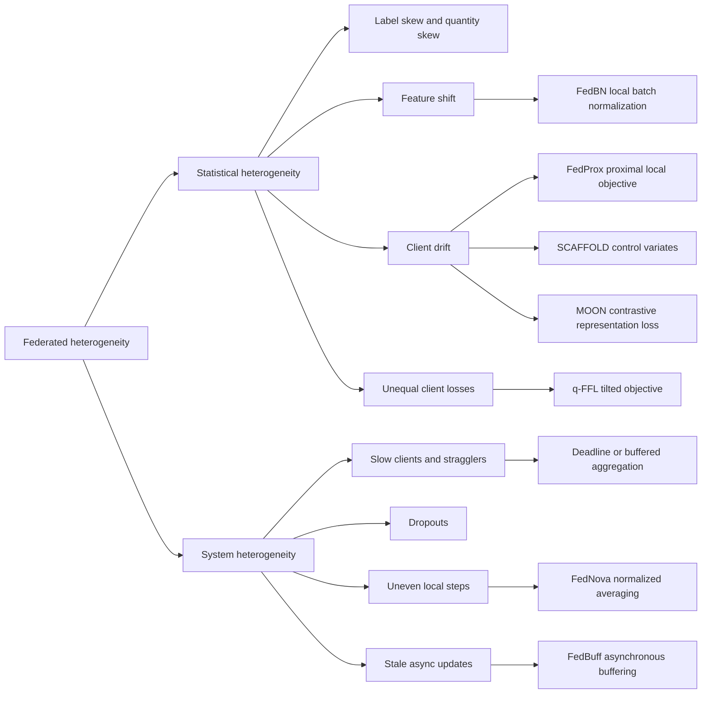

# Heterogeneity and Federated Optimization

FedAvg works surprisingly well when local objectives point in compatible directions, but federated systems are almost defined by incompatibility. Some clients have different labels, vocabularies, sensors, languages, disease prevalence, or user habits. Others have slow CPUs, unreliable networks, low battery, or short participation windows. This chapter studies how statistical and system heterogeneity distort the FedAvg update and why later methods add proximal terms, control variates, normalization, local batch-normalization rules, contrastive representation losses, fairness objectives, and asynchronous aggregation.

The supplied papers emphasize different failure modes. FedProx frames heterogeneity as both non-IID data and variable local work [2]. SCAFFOLD proves that FedAvg suffers from client drift and uses control variates to correct it [3]. FedNova shows that uneven local steps can make naive averaging converge to a mismatched objective, even when local updates are otherwise reasonable [4]. FedBN isolates feature shift and keeps batch-normalization statistics local [5]. MOON uses model-level contrastive learning to align local representations with the global model [6]. Together, they form the core optimization vocabulary for modern FL.

## Definitions

**Statistical heterogeneity** means client data distributions differ. Formally, client $k$ samples from distribution $\mathcal{D}_k$, so

$$
F_k(w)=\mathbb{E}_{(x,y)\sim \mathcal{D}_k}\ell(w;x,y)
$$

may have a different minimizer, curvature, gradient scale, or class support than $F_j(w)$. Common forms are label skew, quantity skew, feature shift, concept shift, temporal drift, and client-specific tasks.

**System heterogeneity** means clients differ in compute speed, memory, network, availability, and dropout probability. A slow client may complete fewer local steps $\tau_k$ in a deadline-limited round. A low-memory client may use a smaller model or batch size. A mobile client may vanish before secure aggregation finishes.

**Client drift** is the bias introduced when local training follows $\nabla F_k$ for several steps rather than repeatedly re-centering on $\nabla f$. After one step, the drift may be small. After $E$ epochs, the local model may move toward a client-specific optimum.

**Objective inconsistency** is the stronger FedNova failure mode: if clients perform unequal numbers of local steps and the server averages cumulative model deltas naively, the limiting point may minimize a surrogate objective whose weights depend on local update counts, not the intended $n_k/n$ weights [4].


*Figure: FedProx demonstrated that adding a proximal regularizer at each client tames divergence on non-IID benchmarks where unmodified FedAvg becomes unstable. From [Li et al., 2020](https://arxiv.org/abs/1812.06127) — embedded under educational fair use with attribution.*

**FedProx** modifies client $k$'s local objective at round $t$:

$$
\min_w F_k(w)+\frac{\mu}{2}\|w-w_t\|^2.
$$

The proximal term discourages local models from moving too far from the broadcast model. FedAvg is the special case $\mu=0$ with uniform local work and SGD local solvers [2].


*Figure: SCAFFOLD identifies client drift as the root cause of slow FedAvg convergence under non-IID data and corrects it with paired control variates. From [Karimireddy et al., 2020](https://arxiv.org/abs/1910.06378) — embedded under educational fair use with attribution.*

**SCAFFOLD** maintains a server control variate $c$ and client control variates $c_k$. A local update uses

$$
w \leftarrow w-\eta\bigl(g_k(w)-c_k+c\bigr),
$$

where $g_k(w)$ is a stochastic local gradient. The correction $-c_k+c$ estimates the gap between the local gradient field and the global gradient field [3].

**FedNova** normalizes each client's accumulated update by its effective local steps before aggregation. For local gradient accumulator $G_k a_k$ and local step count related to $\|a_k\|_1$, the client sends a normalized direction rather than letting larger $\tau_k$ automatically receive larger influence [4].

**FedBN** keeps batch-normalization parameters and running statistics local while averaging non-BN parameters. It is designed for feature-shift non-IID data, such as imaging clients with different scanners or sensors [5].


*Figure: MOON aligns local representations with the global model through a contrastive auxiliary loss, mitigating drift on heterogeneous clients. From [Li et al., 2021](https://arxiv.org/abs/2103.16257) — embedded under educational fair use with attribution.*

**MOON** adds a model-contrastive loss. For an input $x$, the current local model representation is encouraged to stay close to the global model representation and away from the previous local model representation when the previous local model reflects drift [6].

## Key results

FedAvg's weakness under non-IID data is not just empirical inconvenience; it is a structural mismatch. In a centralized minibatch update, each minibatch gradient estimates $\nabla f(w_t)$ at the same point. In FedAvg, client $k$ computes gradients at $w_{t,0}^k,w_{t,1}^k,\ldots$, points that are increasingly shaped by $F_k$. If $F_k$ and $f$ have different curvature or minimizers, later local steps are biased toward client-specific directions.

FedProx addresses this with a minimal local-objective change. The gradient of the FedProx local objective is

$$
\nabla F_k(w)+\mu(w-w_t).
$$

The extra force is zero at the broadcast point and grows linearly with distance. It does not solve all heterogeneity, but it allows variable local work and can stabilize convergence when large local epochs would otherwise diverge [2]. Its practical appeal is that it is easy to integrate into FedAvg-style code.

SCAFFOLD instead tries to correct the direction. If $c_k\approx \nabla F_k$ and $c\approx \nabla f$, then $g_k(w)-c_k+c$ behaves more like a global gradient estimate. Karimireddy et al. prove that FedAvg can be slowed by client drift even with full-batch gradients and all clients participating, and that SCAFFOLD is relatively unaffected by client sampling and arbitrary data heterogeneity under their assumptions [3]. The cost is state: the server and clients must maintain control variates.

FedNova focuses on unequal local progress. Suppose client $1$ takes $2$ local steps and client $2$ takes $20$. FedAvg averages final model deltas, so client $2$'s direction may dominate simply because it did more optimization. Wang et al. show that this can lead to convergence to an inconsistent objective, not merely slow convergence [4]. FedNova removes this bias by aggregating normalized update directions and then applying an effective global step.

FedBN reveals that not all non-IID data should be handled by the same optimizer. With feature shift, one client's activation statistics can differ from another's even if labels are shared. Averaging batch-normalization statistics can damage each client's representation. FedBN keeps BN local and averages the remaining layers, which is especially natural for medical imaging, camera, or sensor domains where marginal feature distributions differ [5].

MOON treats representation drift directly. It assumes the global model's representation is a useful anchor because it has absorbed information from many parties. During local training, the current local representation $z$ is pulled toward $z_{\mathrm{global}}$ and pushed away from $z_{\mathrm{prev}}$ through a contrastive loss. The paper reports strong image-classification results under Dirichlet non-IID partitions and frames MOON as a local-training modification orthogonal to aggregation improvements such as FedNova [6].

Fairness methods change the objective rather than only the optimizer. q-FedAvg and q-FFL use tilted objectives so high-loss clients receive more influence, improving worst-client or fairness metrics at a possible cost to mean accuracy [7]. This is related to heterogeneity because unfairness is often the user-visible symptom of non-IID data.

System heterogeneity creates algorithmic choices beyond the local objective. Partial participation samples a subset of clients per round. Deadline-based aggregation waits until enough clients report and drops stragglers. Asynchronous FL updates a server model as stale client updates arrive. FedBuff buffers asynchronous client updates and aggregates them in batches, reducing idle time while controlling the variance and privacy complications of purely one-at-a-time asynchronous updates [10]. These systems decisions interact with statistical heterogeneity: if a group is systematically slower or less available, the training objective becomes biased toward easier-to-schedule clients.

| Method | Main problem | Core mechanism | Extra state | Best-fit intuition |
|---|---|---|---|---|
| FedProx | Drift from local objectives and variable work | Proximal penalty $\frac{\mu}{2}\|w-w_t\|^2$ | No persistent client state | Keep local training near the broadcast model |
| SCAFFOLD | Client drift | Server and client control variates | Yes | Correct local gradients toward global direction |
| FedNova | Unequal local steps | Normalize local update directions | No large client state | Remove step-count-induced objective bias |
| FedBN | Feature shift | Keep BN statistics and parameters local | Local BN state | Do not average domain-specific normalization |
| MOON | Representation drift | Model-contrastive local loss | Previous local model | Align local features with global features |
| q-FFL | Fairness under heterogeneous losses | Tilted client objective | Usually no | Increase influence of high-loss clients |

## Visual



## Worked example 1: FedProx update step on one client

**Problem.** At round $t$, the server sends scalar $w_t=4$. Client $k$ has a local quadratic loss

$$
F_k(w)=\frac{1}{2}(w-1)^2.
$$

Use FedProx with $\mu=0.5$ and learning rate $\eta=0.2$. Starting from $w=4$, compute two local gradient steps.

**Step 1: write the FedProx gradient.**

$$
\nabla h_k(w)=\nabla F_k(w)+\mu(w-w_t)=(w-1)+0.5(w-4).
$$

Simplify:

$$
\nabla h_k(w)=1.5w-3.
$$

**Step 2: first update from $w^{(0)}=4$.**

$$
\nabla h_k(4)=1.5(4)-3=3.
$$

$$
w^{(1)}=4-0.2(3)=3.4.
$$

**Step 3: second update.**

$$
\nabla h_k(3.4)=1.5(3.4)-3=5.1-3=2.1.
$$

$$
w^{(2)}=3.4-0.2(2.1)=3.4-0.42=2.98.
$$

**Step 4: compare with plain local SGD.**

Without the proximal term, $\nabla F_k(w)=w-1$. The two steps would be:

$$
4-0.2(3)=3.4,\qquad 3.4-0.2(2.4)=2.92.
$$

**Checked answer.** FedProx returns $2.98$ after two steps, slightly closer to the server model than plain local SGD's $2.92$. The gap is small here because there are only two steps, but it grows with $E$, $\eta$, and $\mu$.

## Worked example 2: SCAFFOLD correction term

**Problem.** A client has scalar stochastic gradient $g_k(w)=6$ at the current local point. Its control variate is $c_k=4.5$, and the server control variate is $c=2.0$. The local learning rate is $\eta=0.1$, and the current local scalar model is $w=3.0$. Compute one SCAFFOLD step and compare with FedAvg's local SGD step.

**Step 1: compute the corrected gradient.**

$$
g_{\mathrm{corr}}=g_k(w)-c_k+c=6-4.5+2.0=3.5.
$$

**Step 2: update the local model.**

$$
w^+=w-\eta g_{\mathrm{corr}}=3.0-0.1(3.5)=2.65.
$$

**Step 3: compute the FedAvg local step.**

FedAvg would use $g_k(w)=6$:

$$
w_{\mathrm{FedAvg}}^+=3.0-0.1(6)=2.4.
$$

**Step 4: interpret the difference.**

The local client gradient is larger than the corrected global-like direction because $c_k\gt c$. SCAFFOLD subtracts part of the client-specific drift.

**Checked answer.** SCAFFOLD gives $w^+=2.65$, whereas plain FedAvg local SGD gives $2.4$. The correction can prevent the client from moving too far along its local objective.

## Code

```python
import numpy as np

def fedprox_client_step(w, w_server, grad_fk, lr, mu):
    prox_grad = grad_fk(w) + mu * (w - w_server)
    return w - lr * prox_grad

def scaffold_client_step(w, grad_estimate, c_client, c_server, lr):
    corrected = grad_estimate(w) - c_client + c_server
    return w - lr * corrected

w_server = np.array([4.0])
w = w_server.copy()
target = np.array([1.0])
grad_fk = lambda z: z - target

for _ in range(2):
    w = fedprox_client_step(w, w_server, grad_fk, lr=0.2, mu=0.5)
print("FedProx local model:", w)

g = lambda z: np.array([6.0])
next_w = scaffold_client_step(
    np.array([3.0]), g, c_client=np.array([4.5]), c_server=np.array([2.0]), lr=0.1
)
print("SCAFFOLD one step:", next_w)
```

## Common pitfalls

- Calling all non-IID data the same; label skew, feature shift, and concept shift need different fixes.
- Assuming larger local epochs always improve efficiency; under non-IID data they can worsen drift.
- Tuning FedProx $\mu$ once and expecting it to transfer across datasets and client fractions.
- Treating SCAFFOLD as stateless; its client variates matter and complicate partial participation.
- Forgetting that FedNova addresses unequal local progress, not every kind of non-IID data.
- Averaging batch-normalization statistics under feature shift when local BN would be more appropriate.
- Using fairness objectives without checking robustness to corrupted high-loss clients.
- Comparing asynchronous and synchronous methods only by rounds, not by wall-clock time and staleness.
- Letting availability bias decide the training distribution by repeatedly sampling only fast clients.
- Ignoring the interaction between secure aggregation and per-client diagnostics.
- Reporting only global validation accuracy when client-level variance is the main symptom.
- Confusing proximal regularization toward $w_t$ with personalization toward a permanent local model.
- Using MOON-style contrastive losses without checking representation dimension, temperature, and memory cost.
- Assuming system heterogeneity is harmless if the data are IID; straggler handling still changes who contributes.

## Connections

- [Foundations and FedAvg](/cs/federated-learning/foundations-and-fedavg)
- [Personalization in Federated Learning](/cs/federated-learning/personalization-in-federated-learning)
- [Communication Efficiency and Robustness](/cs/federated-learning/communication-efficiency-and-robustness)
- [Optimization algorithms](/cs/deep-learning/optimization-algorithms)
- [Convolutional neural networks](/cs/deep-learning/convolutional-neural-networks)
- [Computational performance](/cs/deep-learning/computational-performance)
- [Evaluating hypotheses](/cs/machine-learning/evaluating-hypotheses)
- [Data poisoning and backdoors](/cs/adversarial-attacks/data-poisoning-and-backdoors)

## References

[1] H. B. McMahan et al., "Communication-Efficient Learning of Deep Networks from Decentralized Data," AISTATS, 2017. https://arxiv.org/abs/1602.05629

[2] T. Li, A. K. Sahu, M. Zaheer, M. Sanjabi, A. Talwalkar, and V. Smith, "Federated Optimization in Heterogeneous Networks," MLSys, 2020. https://arxiv.org/abs/1812.06127

[3] S. P. Karimireddy, S. Kale, M. Mohri, S. J. Reddi, S. U. Stich, and A. T. Suresh, "SCAFFOLD: Stochastic Controlled Averaging for Federated Learning," ICML, 2020. https://arxiv.org/abs/1910.06378

[4] J. Wang et al., "Tackling the Objective Inconsistency Problem in Heterogeneous Federated Optimization," NeurIPS, 2020. https://arxiv.org/abs/2007.07481

[5] X. Li et al., "FedBN: Federated Learning on Non-IID Features via Local Batch Normalization," ICLR, 2021. https://openreview.net/forum?id=6YEQUn0QICG

[6] Q. Li, B. He, and D. Song, "Model-Contrastive Federated Learning," CVPR, 2021. https://arxiv.org/abs/2103.16257

[7] T. Li, M. Sanjabi, A. Beirami, and V. Smith, "Fair Resource Allocation in Federated Learning," ICLR, 2020. https://arxiv.org/abs/1905.10497

[8] S. J. Reddi et al., "Adaptive Federated Optimization," ICLR, 2021. https://arxiv.org/abs/2003.00295

[9] A. Khaled, K. Mishchenko, and P. Richtarik, "Tighter Theory for Local SGD on Identical and Heterogeneous Data," AISTATS, 2020. https://arxiv.org/abs/1909.04715

[10] J. Nguyen et al., "Federated Learning with Buffered Asynchronous Aggregation," AISTATS, 2022. https://arxiv.org/abs/2106.06639

[11] A. Reisizadeh, A. Mokhtari, H. Hassani, A. Jadbabaie, and R. Pedarsani, "FedPAQ: A Communication-Efficient Federated Learning Method with Periodic Averaging and Quantization," AISTATS, 2020. https://arxiv.org/abs/1909.13014

[12] Y. Zhao et al., "Federated Learning with Non-IID Data," 2018. https://arxiv.org/abs/1806.00582

[13] P. Kairouz et al., "Advances and Open Problems in Federated Learning," Foundations and Trends in Machine Learning, 2021. https://arxiv.org/abs/1912.04977

[14] A. Fallah, A. Mokhtari, and A. Ozdaglar, "Personalized Federated Learning with Theoretical Guarantees: A Model-Agnostic Meta-Learning Approach," NeurIPS, 2020. https://arxiv.org/abs/2002.07948

[15] V. Smith, C.-K. Chiang, M. Sanjabi, and A. Talwalkar, "Federated Multi-Task Learning," NeurIPS, 2017. https://arxiv.org/abs/1705.10467

[16] K. Bonawitz et al., "Towards Federated Learning at Scale: System Design," MLSys, 2019. https://arxiv.org/abs/1902.01046
