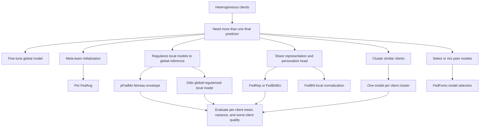

# Personalization in Federated Learning

The single global model is an attractive abstraction, but it is often the wrong product. A keyboard model should adapt to a user's language habits, a hospital model may need scanner- or population-specific calibration, and a bank fraud model may face institution-specific transaction patterns. Personalization asks whether federated learning should produce one global model, many local models, or a structured family of models sharing some information but not all parameters.

Personalized FL is not merely overfitting on each client after global training. It is a design space of objectives and systems: local fine-tuning, meta-learning, Moreau-envelope regularization, shared representation learning, clustering, multi-task learning, model selection, and robustness-aware personalization. pFedMe uses Moreau envelopes to decouple local personalized models from the global reference [3]. Ditto learns a personalized model regularized toward a global model and shows that this simple structure can improve accuracy, fairness, and robustness under attacks [4]. FedBN also has a personalization flavor because local batch-normalization state acts as client-specific representation calibration under feature shift [5].

## Definitions

Let client $k$ have local objective $F_k(w)$. Standard FL seeks one model

$$
\min_w \sum_{k=1}^{K} p_k F_k(w),
\qquad p_k=\frac{n_k}{n}.
$$

Personalized FL instead produces client models $v_1,\ldots,v_K$, sometimes together with a global reference $w$ or shared representation $\phi$.

**Local fine-tuning** first trains a global model $w$ by FedAvg or another method, then each client initializes from $w$ and runs extra local updates. It is simple and stateless during global training, but it can overfit clients with little data and does not let personalization influence the shared model.

**Meta-learning personalization** learns an initialization that adapts quickly. Per-FedAvg uses a MAML-style objective where client $k$ evaluates performance after one or a few local adaptation steps [2]. The global model is not necessarily the best final predictor; it is a good starting point.

**Moreau-envelope personalization** defines a personalized model as a proximal solution near a reference:

$$
F_k^{\lambda}(\theta)=\min_{w_k}\left\{F_k(w_k)+\frac{\lambda}{2}\|w_k-\theta\|^2\right\}.
$$

pFedMe optimizes the global variable $\theta$ through these smoothed client objectives while each client maintains its own personalized $w_k$ [3].


*Figure: pFedMe decouples per-client personalized weights from the global reference using a Moreau envelope, enabling stronger personalization than vanilla FedAvg fine-tuning. From [Dinh et al., 2020](https://arxiv.org/abs/2006.08848) — embedded under educational fair use with attribution.*

**Ditto** solves a global FL objective for $w$ and, for each client, a regularized local objective

$$
\min_{v_k} F_k(v_k)+\frac{\lambda}{2}\|v_k-w\|^2.
$$

The global model gives shared information; the regularizer prevents the local model from drifting arbitrarily far [4].


*Figure: Ditto shows that the same regularized personalization mechanism that improves accuracy on heterogeneous clients also provides robustness against training-time attacks and fairer per-client performance. From [Li et al., 2021](https://arxiv.org/abs/2012.04221) — embedded under educational fair use with attribution.*

**Representation-head personalization** splits a neural network into shared representation $\phi$ and local head $h_k$. FedRep and FedPer-style methods share lower layers or representations while personalizing final layers [9], [10]. FedBABU trains the body globally and adapts heads after training [11].

**Clustered FL** groups clients with similar distributions and trains one model per cluster. Similarity may be estimated from gradients, update directions, validation losses, or learned embeddings [7], [8].

**Model-selection personalization** allows each client to choose or combine models from other clients. FedFomo, for example, uses validation performance to assign personalized weights to received models rather than assuming one global average is best [12].

**Multi-task FL** treats each client as a related task. MOCHA formulates a federated multi-task objective with a relationship matrix across tasks and solves it with distributed optimization [13].

## Key results

Personalization helps when client distributions differ enough that a single $w$ is a compromise. It can hurt when client data are small, noisy, adversarial, or too sparse to support local adaptation. A useful rule is to compare three baselines: global-only, local-only, and global-plus-fine-tuning. If local-only is terrible because clients lack data, personalization should borrow strongly from the global model. If global-only is terrible because client tasks are incompatible, personalization should allow more local freedom.

Fine-tuning is the simplest method. Train $w$ normally, then let client $k$ compute

$$
v_k = w-\alpha \nabla F_k(w)
$$

or several local steps. It is easy to deploy because the training protocol does not change. Its weakness is that the global training objective never sees the adapted model, so the learned $w$ may not be an ideal initialization.

Per-FedAvg addresses that by optimizing for post-adaptation loss. It follows the model-agnostic meta-learning idea: choose $w$ such that one or a few gradient steps on $F_k$ produce good $v_k$ [2]. This can be powerful but may require Hessian-vector products or first-order approximations, and it is sensitive to inner and outer learning rates.

pFedMe's Moreau envelope gives a different interpretation. The client model $w_k^*(\theta)$ is the proximal operator of $F_k$ around $\theta$. The envelope is smoother than $F_k$ under standard conditions, making it easier to analyze while preserving the idea that each client has a personalized optimum [3]. Dinh et al. report that pFedMe outperforms FedAvg and Per-FedAvg on their heterogeneous benchmarks, and their theory tracks client sampling and client drift errors.

Ditto is especially important because it links personalization to fairness and robustness. Li et al. argue that fairness, measured as uniformity of performance across benign devices, and robustness to data/model poisoning can compete when training a single global model [4]. A fair global method can over-weight rare high-loss clients, including corrupted ones. A robust global method can filter rare but legitimate updates, increasing disparity. Ditto sidesteps part of the conflict by keeping a global model while letting each benign client use a regularized personalized model.

Representation approaches are natural for neural networks. In vision or language tasks, lower layers may learn common features while heads or adapters specialize. FedRep alternates between global representation learning and local head training [9]. FedBN keeps batch-normalization layers local, which is a particularly lightweight representation-personalization method for feature shift [5]. The key question is where to split: too early, and clients share little; too late, and personalization cannot correct domain mismatch.

Clustered FL is useful when clients fall into a small number of latent populations. If gradients for clients $a$ and $b$ have high cosine similarity, they may benefit from a shared cluster model. If two groups' updates consistently point in opposite directions, averaging them can damage both. Clustered FL introduces governance and stability questions: clients may move between clusters as data changes, and small clusters may lose the statistical strength of federation.

Evaluation must be client-aware. Mean accuracy can improve while worst-client accuracy degrades. Recommended reporting includes mean per-client metric, standard deviation, worst-client or bottom-decile metric, macro average across clients, and calibration or fairness metrics when the application cares about service quality. Ditto's paper explicitly evaluates both average performance and variance across clients [4].

| Approach | Personalized object | Server complexity | Client storage | When it helps |
|---|---|---:|---:|---|
| Fine-tuning | Local model after global training | Low | One adapted model | Easy deployment, moderate heterogeneity |
| Per-FedAvg | Fast-adapting initialization | Medium | Usually one adapted model | Few local steps should work well |
| pFedMe | Proximal personalized model | Medium | Personalized state | Smooth regularized personalization |
| FedRep/FedBABU | Shared body plus local head | Medium | Local head | Shared representation, client-specific labels |
| Clustered FL | One model per cluster | High | Cluster assignment | Multiple latent populations |
| Ditto | Local model regularized to global | Low-medium | Global plus personalized model | Accuracy, fairness, and robustness tradeoffs |
| FedFomo | Weighted model mixture | Medium-high | Model weights or candidates | Clients benefit from selected peers |

## Visual



## Worked example 1: pFedMe inner-loop update

**Problem.** A client has scalar local loss

$$
F_k(w)=\frac{1}{2}(w-5)^2.
$$

The current global reference is $\theta=2$, and pFedMe uses $\lambda=3$. Starting from $w^{(0)}=\theta=2$, take two inner gradient steps with step size $\alpha=0.1$ on

$$
h_k(w;\theta)=F_k(w)+\frac{\lambda}{2}(w-\theta)^2.
$$

**Step 1: compute the gradient.**

$$
\nabla h_k(w;\theta)=(w-5)+3(w-2)=4w-11.
$$

**Step 2: first inner step.**

At $w^{(0)}=2$:

$$
\nabla h_k(2;2)=4(2)-11=-3.
$$

$$
w^{(1)}=2-0.1(-3)=2.3.
$$

**Step 3: second inner step.**

$$
\nabla h_k(2.3;2)=4(2.3)-11=9.2-11=-1.8.
$$

$$
w^{(2)}=2.3-0.1(-1.8)=2.48.
$$

**Step 4: compute the exact proximal personalized model for checking.**

Set gradient to zero:

$$
4w-11=0\quad\Rightarrow\quad w^*=\frac{11}{4}=2.75.
$$

**Checked answer.** Two inner steps give $w^{(2)}=2.48$, moving from the global reference $2$ toward the exact personalized proximal solution $2.75$, not all the way to the local-only optimum $5$.

## Worked example 2: Clustered FL from gradient similarity

**Problem.** Four clients send normalized gradient directions in two dimensions:

$$
g_1=(1,0),\quad g_2=(0.8,0.2),\quad g_3=(-1,0),\quad g_4=(-0.9,-0.1).
$$

Use cosine similarity to form two clusters.

**Step 1: recall cosine similarity.**

$$
\cos(g_i,g_j)=\frac{g_i^\top g_j}{\|g_i\|\|g_j\|}.
$$

**Step 2: compare client 1 with others.**

$$
\cos(g_1,g_2)=\frac{0.8}{1\sqrt{0.8^2+0.2^2}}
=\frac{0.8}{\sqrt{0.68}}
\approx \frac{0.8}{0.8246}=0.970.
$$

$$
\cos(g_1,g_3)=\frac{-1}{1\cdot 1}=-1.
$$

$$
\cos(g_1,g_4)=\frac{-0.9}{1\sqrt{0.9^2+0.1^2}}
=\frac{-0.9}{0.9055}\approx -0.994.
$$

**Step 3: compare client 3 and 4.**

$$
\cos(g_3,g_4)=\frac{0.9}{1\sqrt{0.9^2+0.1^2}}
\approx 0.994.
$$

**Step 4: assign clusters.**

Clients $1$ and $2$ have high positive similarity, and clients $3$ and $4$ have high positive similarity. Cross-pair similarities are negative.

**Checked answer.** A two-cluster assignment is $\{1,2\}$ and $\{3,4\}$. Averaging all four gradients would nearly cancel; clustered FL preserves two meaningful update directions.

## Code

```python
import numpy as np

def personalized_proximal_step(w, theta, target, lam, lr):
    # Minimize 0.5*(w-target)^2 + lam/2*(w-theta)^2.
    grad = (w - target) + lam * (w - theta)
    return w - lr * grad

theta = 2.0
w = theta
for _ in range(2):
    w = personalized_proximal_step(w, theta, target=5.0, lam=3.0, lr=0.1)
print("pFedMe-style personalized iterate:", w)

grads = np.array([[1.0, 0.0], [0.8, 0.2], [-1.0, 0.0], [-0.9, -0.1]])
normed = grads / np.linalg.norm(grads, axis=1, keepdims=True)
similarity = normed @ normed.T
print(np.round(similarity, 3))
```

## Common pitfalls

- Assuming personalization always improves every client; small local datasets can overfit quickly.
- Comparing personalized methods only by global accuracy instead of personalized per-client metrics.
- Forgetting to keep a local validation split for selecting fine-tuning steps or regularization strength.
- Using local fine-tuning as a baseline but not tuning its learning rate and number of steps.
- Treating Per-FedAvg, pFedMe, and Ditto as identical because all use a global reference.
- Ignoring client storage: Ditto and stateful methods may require persistent local personalized models.
- Splitting a neural network at an arbitrary layer without checking whether features or labels differ.
- Moving clients between clusters too often, causing unstable training targets.
- Reporting only mean accuracy and hiding high variance across clients.
- Choosing $\lambda$ too large, which collapses personalization back toward the global model.
- Choosing $\lambda$ too small, which can become local-only training with weak sharing.
- Personalizing on adversarial or corrupted client data without robust validation.
- Confusing local batch-normalization state with a complete personalized model.
- Forgetting that privacy constraints may limit server-side inspection of personalized updates.

## Connections

- [Heterogeneity and Federated Optimization](/cs/federated-learning/heterogeneity-and-optimization)
- [Communication Efficiency and Robustness](/cs/federated-learning/communication-efficiency-and-robustness)
- [Recommender systems](/cs/deep-learning/recommender-systems)
- [Softmax classification and generalization](/cs/deep-learning/softmax-classification-generalization)
- [Evaluating hypotheses](/cs/machine-learning/evaluating-hypotheses)
- [Data poisoning and backdoors](/cs/adversarial-attacks/data-poisoning-and-backdoors)
- [Robustness accuracy tradeoff](/cs/adversarial-attacks/robustness-accuracy-tradeoff)
- [Applications and Systems](/cs/federated-learning/applications-and-systems)

## References

[1] H. B. McMahan et al., "Communication-Efficient Learning of Deep Networks from Decentralized Data," AISTATS, 2017. https://arxiv.org/abs/1602.05629

[2] A. Fallah, A. Mokhtari, and A. Ozdaglar, "Personalized Federated Learning with Theoretical Guarantees: A Model-Agnostic Meta-Learning Approach," NeurIPS, 2020. https://arxiv.org/abs/2002.07948

[3] C. T. Dinh, N. H. Tran, and T. D. Nguyen, "Personalized Federated Learning with Moreau Envelopes," NeurIPS, 2020. https://arxiv.org/abs/2006.08848

[4] T. Li, S. Hu, A. Beirami, and V. Smith, "Ditto: Fair and Robust Federated Learning Through Personalization," ICML, 2021. https://arxiv.org/abs/2012.04221

[5] X. Li et al., "FedBN: Federated Learning on Non-IID Features via Local Batch Normalization," ICLR, 2021. https://openreview.net/forum?id=6YEQUn0QICG

[6] T. Li, M. Sanjabi, A. Beirami, and V. Smith, "Fair Resource Allocation in Federated Learning," ICLR, 2020. https://arxiv.org/abs/1905.10497

[7] F. Sattler, K.-R. Muller, and W. Samek, "Clustered Federated Learning: Model-Agnostic Distributed Multitask Optimization Under Privacy Constraints," IEEE Transactions on Neural Networks and Learning Systems, 2021. https://arxiv.org/abs/1910.01991

[8] A. Ghosh, J. Chung, D. Yin, and K. Ramchandran, "An Efficient Framework for Clustered Federated Learning," NeurIPS, 2020. https://arxiv.org/abs/2006.04088

[9] L. Collins, H. Hassani, A. Mokhtari, and S. Shakkottai, "Exploiting Shared Representations for Personalized Federated Learning," ICML, 2021. https://arxiv.org/abs/2102.07078

[10] M. G. Arivazhagan et al., "Federated Learning with Personalization Layers," 2019. https://arxiv.org/abs/1912.00818

[11] J. Oh, S. Kim, and S.-Y. Yun, "FedBABU: Toward Enhanced Representation for Federated Image Classification," ICLR, 2022. https://arxiv.org/abs/2106.06042

[12] M. Zhang et al., "Personalized Federated Learning with First Order Model Optimization," ICLR, 2021. https://arxiv.org/abs/2012.08565

[13] V. Smith, C.-K. Chiang, M. Sanjabi, and A. Talwalkar, "Federated Multi-Task Learning," NeurIPS, 2017. https://arxiv.org/abs/1705.10467

[14] Y. Mansour, M. Mohri, J. Ro, and A. T. Suresh, "Three Approaches for Personalization with Applications to Federated Learning," 2020. https://arxiv.org/abs/2002.10619

[15] Y. Deng, M. M. Kamani, and M. Mahdavi, "Adaptive Personalized Federated Learning," 2020. https://arxiv.org/abs/2003.13461

[16] Q. Li, B. He, and D. Song, "Model-Contrastive Federated Learning," CVPR, 2021. https://arxiv.org/abs/2103.16257

[17] P. Kairouz et al., "Advances and Open Problems in Federated Learning," Foundations and Trends in Machine Learning, 2021. https://arxiv.org/abs/1912.04977
