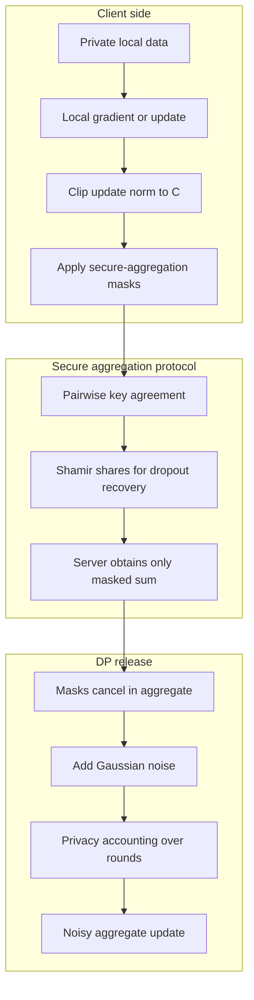

# Privacy: Differential Privacy and Secure Aggregation

Federated learning reduces raw-data collection, but it does not automatically solve privacy. Model updates can reveal sensitive information, a curious server may inspect gradients, malicious clients may infer membership, and a malicious server may choose models or protocols that amplify leakage. Privacy engineering for FL therefore stacks multiple tools: data minimization, update clipping, differential privacy, secure aggregation, encrypted or multiparty computation, access control, auditing, and sometimes trusted execution environments.

The two anchor papers in this chapter expose the tension. Bonawitz et al. build a practical secure-aggregation protocol so the server learns only an aggregate update, not individual client vectors [1]. Zhu et al.'s Deep Leakage from Gradients shows that shared gradients can reconstruct private inputs and labels in vision and language settings, overturning the naive belief that gradients are safe to reveal [2]. Differential privacy limits the influence of any record or client, while secure aggregation hides individual updates; neither alone is a complete privacy story.

## Definitions

**Threat models** specify who may deviate or observe. An **honest-but-curious server** follows the protocol but inspects whatever messages it receives. A **malicious server** may choose model states, select clients adaptively, or lie about dropouts. **Malicious clients** may send poisoned updates, infer information from the global model, or collude with the server. A **network adversary** can observe or tamper unless transport encryption and authentication are used. **Membership inference** asks whether a particular record or client participated in training.

**Differential privacy** bounds how much an algorithm's output changes when one protected unit changes. An algorithm $\mathcal{M}$ is $(\varepsilon,\delta)$-DP if for neighboring datasets $D,D'$ and every event $S$,

$$
\Pr[\mathcal{M}(D)\in S]\le e^{\varepsilon}\Pr[\mathcal{M}(D')\in S]+\delta.
$$

Small $\varepsilon$ means stronger privacy, and $\delta$ is a small failure probability. In FL, the protected unit may be an example, a user, or an entire client contribution. **User-level DP** is usually stronger and noisier than record-level DP.

**Local DP** means each client perturbs its message before sending it. The server never sees an unnoised update. Utility can be poor because every client adds independent noise.

**Central DP** means a trusted aggregation process clips individual contributions and adds calibrated noise to the aggregate. In DP-FedAvg, clients or the server clip updates to norm $C$, average them, and add Gaussian noise. The standard one-shot Gaussian mechanism scale is often introduced as

$$
\sigma=\frac{C\sqrt{2\log(1.25/\delta)}}{\varepsilon}.
$$

Practical training over many rounds uses composition, moments accountant, or Renyi differential privacy rather than applying this formula naively once [3], [4], [5].


*Figure: Bonawitz et al.'s secure aggregation lets a server compute the sum of client updates without learning any individual update, with dropout robustness from threshold secret sharing. From [Bonawitz et al., 2017](https://arxiv.org/abs/1611.04482) — embedded under educational fair use with attribution.*

**Secure aggregation** computes $\sum_k x_k$ without revealing individual $x_k$ to the server. Bonawitz et al. use pairwise masks from key agreement, pseudorandom generators, and secret sharing to handle dropouts [1].

For an ordered set of clients, a simple pairwise-mask expression is

$$
z_k=x_k+\sum_{u<k}s_{k,u}-\sum_{u>k}s_{u,k}.
$$

When the server sums all $z_k$, every pairwise mask cancels.

**Homomorphic encryption** lets computation occur on ciphertexts. CKKS supports approximate arithmetic over real-like values, and BFV supports exact modular arithmetic. HE can protect aggregation but is often expensive for deep-learning-scale vectors.

**Multi-party computation** computes functions jointly without revealing private inputs. It is attractive in cross-silo FL where the number of institutions is small enough for heavier protocols.

**Trusted execution environments** run aggregation inside hardware-backed enclaves. TEEs can simplify engineering, but they shift trust to hardware vendors, side-channel mitigations, attestation, and enclave operations.

## Key results

Secure aggregation protects individual updates from the server, but only at aggregation time. The Bonawitz protocol is designed for high-dimensional vectors, mobile dropouts, and a server-mediated network where clients do not naturally communicate directly [1]. The key idea is pairwise cancellation: client $u$ and client $v$ agree on a pseudorandom mask. One adds it, the other subtracts it. If both survive, the masks cancel in the aggregate. If one drops out, secret shares allow the server to remove the missing client's mask without revealing surviving clients' inputs. The full protocol uses Diffie-Hellman key agreement, authenticated encryption, signatures, Shamir secret sharing, and a consistency check for stronger adversary models.

Secure aggregation is not the same as differential privacy. It hides the individual update from the server, but the aggregate itself can still reveal information if the cohort is small, the model is maliciously chosen, or repeated rounds isolate a user. DP adds a statistical privacy bound to the released aggregate, often after clipping each contribution. In practice, secure aggregation and DP are complementary: secure aggregation hides who sent what, while DP limits what the sum can reveal.


*Figure: DLG recovers private training images directly from shared gradients, refuting the assumption that exchanging gradients alone is privacy-preserving and motivating clipping plus noise. From [Zhu et al., 2019](https://arxiv.org/abs/1906.08935) — embedded under educational fair use with attribution.*

Gradient inversion makes this complementarity concrete. Deep Leakage from Gradients sets up a dummy input $x^*$ and label $y^*$, computes dummy gradients, and optimizes the dummy data to match the observed real gradients [2]:

$$
\min_{x^*,y^*}\left\|\nabla_\theta\mathcal{L}(x^*,y^*;\theta)-\nabla_\theta\mathcal{L}(x,y;\theta)\right\|^2.
$$

If matching succeeds, the dummy input becomes a reconstruction of the private training input. The DLG paper demonstrated pixel-wise image recovery and token-level language leakage under several settings [2]. The later iDLG observation is that final-layer gradients can directly reveal labels under common cross-entropy setups, reducing the search space for inversion [6].

Batch size, model architecture, and update form matter. Single-example gradients are much easier to invert than large aggregated batches. Larger batches introduce permutations and mixed signals. Secure aggregation increases the effective batch by hiding individual updates inside a sum. DP noise and clipping degrade the attack objective. But none of these defenses should be described as absolute; stronger attackers can use priors, generative models, malicious model choices, or repeated observations.

Privacy accounting is the discipline that prevents hand-waving. If a training run has $T$ rounds, sampling rate $q$, clipping norm $C$, noise multiplier $z$, and target $\delta$, the final $\varepsilon$ is not just the per-round $\varepsilon$ multiplied in a casual way. Basic composition is simple but pessimistic. Advanced composition improves the bound. Moments accountant and RDP track privacy loss more tightly for Gaussian mechanisms and subsampled training [3], [4], [5].

Membership inference remains relevant even when raw gradients are hidden. A model can behave differently on records it trained on than on records it did not. In FL, membership can mean example-level membership in a client's dataset or client-level participation in a round. Defenses include regularization, DP, limiting overfitting, larger aggregation cohorts, secure aggregation, and careful evaluation against privacy attacks [7].

The privacy stack is therefore layered:

| Layer | Protects against | Does not solve |
|---|---|---|
| Data minimization | Central raw-data collection | Update leakage |
| Transport security | Network observers | Curious server |
| Secure aggregation | Server seeing individual updates | Aggregate leakage |
| Clipping | Outlier influence and DP sensitivity | Bias from clipping |
| DP noise | Statistical inference from outputs | Utility loss, bad accounting |
| TEE | Server software exposure | Hardware and side-channel trust |
| HE/MPC | Plaintext computation exposure | Heavy computation and deployment complexity |
| Auditing | Governance and accountability | Mathematical privacy alone |

## Visual



## Worked example 1: DP-FedAvg noise scale

**Problem.** A simplified DP-FedAvg deployment clips each client's update to norm $C=1.5$. It wants total privacy budget $\varepsilon_{\mathrm{total}}=2.0$ and $\delta_{\mathrm{total}}=10^{-5}$ over $T=100$ rounds. Use very conservative basic composition by assigning $\varepsilon_r=2.0/100=0.02$ and $\delta_r=10^{-5}/100=10^{-7}$ to each round. Compute the Gaussian noise scale using

$$
\sigma=\frac{C\sqrt{2\log(1.25/\delta_r)}}{\varepsilon_r}.
$$

**Step 1: plug in $\delta_r$.**

$$
\frac{1.25}{\delta_r}=\frac{1.25}{10^{-7}}=12{,}500{,}000.
$$

**Step 2: compute the log term.**

$$
\log(12{,}500{,}000)\approx 16.341.
$$

**Step 3: compute the square-root factor.**

$$
\sqrt{2(16.341)}=\sqrt{32.682}\approx 5.717.
$$

**Step 4: compute $\sigma$.**

$$
\sigma=\frac{1.5(5.717)}{0.02}=\frac{8.5755}{0.02}=428.775.
$$

**Checked answer.** The per-coordinate Gaussian standard deviation would be about $428.8$ in the same units as the clipped update. This is intentionally pessimistic because basic composition spends privacy evenly per round. Real DP-FedAvg analyses use subsampling and RDP or moments accounting to obtain a more useful noise-privacy tradeoff.

## Worked example 2: Secure aggregation masks with three clients

**Problem.** Three clients have scalar updates $x_1=8$, $x_2=5$, and $x_3=11$. Pairwise masks are $s_{2,1}=4$, $s_{3,1}=7$, and $s_{3,2}=2$, following

$$
z_k=x_k+\sum_{u<k}s_{k,u}-\sum_{u>k}s_{u,k}.
$$

Compute each masked value and show that the server recovers only the sum.

**Step 1: client 1 has no lower-index masks and subtracts masks from clients 2 and 3.**

$$
z_1=x_1-s_{2,1}-s_{3,1}=8-4-7=-3.
$$

**Step 2: client 2 adds its mask with client 1 and subtracts its mask with client 3.**

$$
z_2=x_2+s_{2,1}-s_{3,2}=5+4-2=7.
$$

**Step 3: client 3 adds both lower-index masks.**

$$
z_3=x_3+s_{3,1}+s_{3,2}=11+7+2=20.
$$

**Step 4: server sums masked values.**

$$
z_1+z_2+z_3=-3+7+20=24.
$$

**Step 5: compare with true sum.**

$$
x_1+x_2+x_3=8+5+11=24.
$$

**Checked answer.** The masks cancel exactly in the aggregate. The server sees $-3$, $7$, and $20$ in this toy version, but in a secure protocol it should not be able to remove masks for any surviving individual client.

## Code

```python
import math

def gaussian_sigma(clip_norm, epsilon, delta):
    return clip_norm * math.sqrt(2.0 * math.log(1.25 / delta)) / epsilon

def secure_agg_masked_values(xs, masks):
    # masks[(k, u)] is s_{k,u} for k > u, using zero-based indices.
    z = []
    n = len(xs)
    for k in range(n):
        value = xs[k]
        for u in range(k):
            value += masks[(k, u)]
        for u in range(k + 1, n):
            value -= masks[(u, k)]
        z.append(value)
    return z

sigma = gaussian_sigma(clip_norm=1.5, epsilon=0.02, delta=1e-7)
print(round(sigma, 3))

xs = [8, 5, 11]
masks = {(1, 0): 4, (2, 0): 7, (2, 1): 2}
masked = secure_agg_masked_values(xs, masks)
print(masked, sum(masked), sum(xs))
```

## Common pitfalls

- Saying FL is private because raw data is not uploaded; gradients and model deltas can leak.
- Treating secure aggregation and differential privacy as interchangeable.
- Adding DP noise without clipping, which leaves sensitivity unbounded.
- Clipping too aggressively and biasing the aggregate toward small-client updates.
- Reporting a noise multiplier without an accountant, sampling rate, number of rounds, and target $\delta$.
- Confusing example-level DP with user-level or client-level DP.
- Assuming large batches always prevent gradient inversion; they reduce risk but do not prove privacy.
- Ignoring malicious-server attacks that choose model parameters to amplify leakage.
- Using local DP when central or distributed DP would meet the threat model with better utility.
- Forgetting that secure aggregation makes individual-update anomaly detection harder.
- Treating TEEs as cryptographic proofs; they require hardware and operational trust.
- Proposing homomorphic encryption without estimating vector dimension, ciphertext expansion, and latency.
- Publishing per-client metrics or logs that bypass the privacy guarantees of the training protocol.
- Reusing privacy budgets across experiments without tracking cumulative releases.

## Connections

- [Foundations and FedAvg](/cs/federated-learning/foundations-and-fedavg)
- [Communication Efficiency and Robustness](/cs/federated-learning/communication-efficiency-and-robustness)
- [Perfect secrecy and one-time pad](/cs/cryptography/perfect-secrecy-one-time-pad)
- [Discrete log and Diffie-Hellman](/cs/cryptography/discrete-log-diffie-hellman)
- [Authenticated encryption GCM](/cs/cryptography/authenticated-encryption-gcm)
- [Privacy-preserving data mining](/cs/data-mining/chapter-20-privacy-preserving-data-mining)
- [Threat models and attack taxonomy](/cs/adversarial-attacks/threat-models-and-attack-taxonomy)
- [White-box attacks](/cs/adversarial-attacks/white-box-attacks)

## References

[1] K. Bonawitz et al., "Practical Secure Aggregation for Privacy-Preserving Machine Learning," CCS, 2017. https://dl.acm.org/doi/10.1145/3133956.3133982

[2] L. Zhu, Z. Liu, and S. Han, "Deep Leakage from Gradients," NeurIPS, 2019. https://arxiv.org/abs/1906.08935

[3] M. Abadi et al., "Deep Learning with Differential Privacy," CCS, 2016. https://arxiv.org/abs/1607.00133

[4] I. Mironov, "Renyi Differential Privacy," CSF, 2017. https://arxiv.org/abs/1702.07476

[5] H. B. McMahan, D. Ramage, K. Talwar, and L. Zhang, "Learning Differentially Private Recurrent Language Models," ICLR, 2018. https://arxiv.org/abs/1710.06963

[6] B. Zhao, K. R. Mopuri, and H. Bilen, "iDLG: Improved Deep Leakage from Gradients," 2020. https://arxiv.org/abs/2001.02610

[7] R. Shokri, M. Stronati, C. Song, and V. Shmatikov, "Membership Inference Attacks Against Machine Learning Models," IEEE S&P, 2017. https://arxiv.org/abs/1610.05820

[8] R. Geyer, T. Klein, and M. Nabi, "Differentially Private Federated Learning: A Client Level Perspective," 2017. https://arxiv.org/abs/1712.07557

[9] P. Kairouz et al., "Advances and Open Problems in Federated Learning," Foundations and Trends in Machine Learning, 2021. https://arxiv.org/abs/1912.04977

[10] H. B. McMahan et al., "Communication-Efficient Learning of Deep Networks from Decentralized Data," AISTATS, 2017. https://arxiv.org/abs/1602.05629

[11] C. Dwork and A. Roth, "The Algorithmic Foundations of Differential Privacy," Foundations and Trends in Theoretical Computer Science, 2014. https://www.cis.upenn.edu/~aaroth/Papers/privacybook.pdf

[12] A. C. Yao, "Protocols for Secure Computations," FOCS, 1982. https://doi.org/10.1109/SFCS.1982.38

[13] A. Shamir, "How to Share a Secret," Communications of the ACM, 1979. https://doi.org/10.1145/359168.359176

[14] J. H. Cheon, A. Kim, M. Kim, and Y. Song, "Homomorphic Encryption for Arithmetic of Approximate Numbers," ASIACRYPT, 2017. https://eprint.iacr.org/2016/421

[15] J. Fan and F. Vercauteren, "Somewhat Practical Fully Homomorphic Encryption," IACR Cryptology ePrint Archive, 2012. https://eprint.iacr.org/2012/144

[16] O. Ohrimenko et al., "Oblivious Multi-Party Machine Learning on Trusted Processors," USENIX Security, 2016. https://www.usenix.org/conference/usenixsecurity16/technical-sessions/presentation/ohrimenko

[17] B. Hitaj, G. Ateniese, and F. Perez-Cruz, "Deep Models Under the GAN: Information Leakage from Collaborative Deep Learning," CCS, 2017. https://arxiv.org/abs/1702.07464
