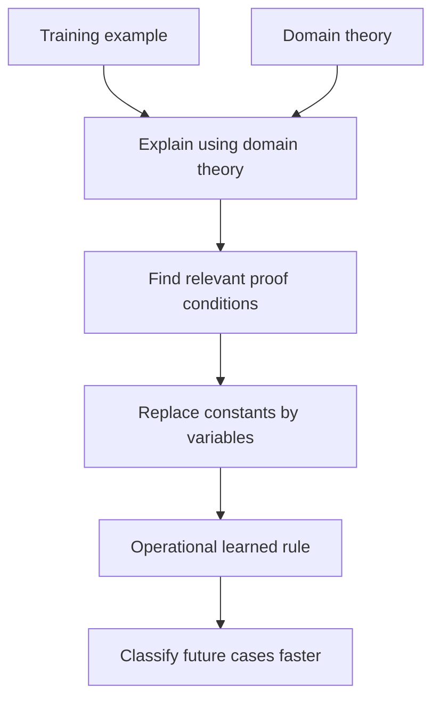

# Analytical Learning

Analytical learning uses prior knowledge and deduction to generalize from examples. Mitchell contrasts it with purely inductive learning: an inductive learner generalizes from many observed cases, while an analytical learner can generalize from one example if it has a domain theory that explains why the example satisfies the target concept. Explanation-based learning is the main method in the chapter.


*Figure: The Iris scatterplot makes feature spaces and class separation visible. Image: [Wikimedia Commons](https://commons.wikimedia.org/wiki/File:Iris_dataset_scatterplot.svg), Nicoguaro, CC BY 4.0.*

The historical setting matters. Before massive datasets became common, a central question was how to use hand-built domain theories to reduce data requirements. Analytical learning is strongest when the theory is correct and operationally useful; it is weakest when the theory is wrong, incomplete, or too expensive to apply.

## Definitions

An analytical learning problem includes:

| Component | Meaning |
|---|---|
| Training example | A specific instance of the target concept |
| Target concept | The predicate or function to learn |
| Domain theory | Rules that explain why examples satisfy the target |
| Operationality criterion | A requirement for learned rules to be usable efficiently |
| Hypothesis space | Rules the learner may output |

Explanation-based learning (EBL) explains a training example using the domain theory, analyzes the explanation to identify the relevant conditions, and produces a generalized rule.

A domain theory is a set of background rules. A perfect domain theory is correct and complete for the target concept.

An explanation is a proof that the training example satisfies the target concept.

Operationality describes whether a learned rule is expressed in terms that the performance system can evaluate directly. A proof may mention abstract or expensive predicates; an operational rule should use available, efficient predicates.

Regression in EBL means tracing backward from the target proof through rules to identify the weakest conditions on the example that would still allow the proof to succeed.

## Key results

In purely inductive learning, the main evidence is empirical regularity. In analytical learning, the main evidence is the domain theory. A single positive example can be enough if the theory proves why the example is positive and the proof can be generalized.

The typical EBL procedure is:

1. Explain the training example by constructing a proof from the domain theory.
2. Analyze the proof to identify which example facts were necessary.
3. Generalize constants to variables while preserving the proof structure.
4. Produce an operational rule that can classify future instances quickly.

EBL can be understood as changing the representation of knowledge rather than discovering an entirely new empirical regularity. The learned rule is often a compiled form of the domain theory, specialized for efficient future use.

The inductive bias of EBL is the domain theory itself plus the operationality criterion. If the theory is wrong, the learned rule can be wrong even if it perfectly explains the training example. If the theory is correct but not operational, the learner may produce rules that are true but not useful.

Analytical learning can also discover useful intermediate features. If a proof repeatedly relies on a substructure, the learner may compile that substructure into a new predicate or rule used by later problem solving.

The operationality criterion is what keeps EBL from merely restating the original theory. Suppose the domain theory proves that an action is good by a long chain of abstract reasoning. If future decisions require running the same long proof again, little has been gained. A useful learned rule should mention predicates that are cheap and available at decision time. In this sense, EBL often improves efficiency by compiling expensive reasoning into a direct test.

EBL also explains why a single example can be enough without violating the need for bias. The single example does not identify the concept by itself. The domain theory supplies the missing information. If two different generalizations are both consistent with the example, the proof chooses the one supported by the theory. This makes the learner's assumptions explicit, unlike a purely inductive learner whose bias may be hidden in a search heuristic.

There is a practical tension between explanation completeness and robustness. A complete proof may include details that are logically necessary under the current theory but brittle in the real world. If the theory contains irrelevant intermediate predicates or overly strict preconditions, the learned rule can become too narrow. This motivates the combined methods in the next chapter, where examples are allowed to revise or soften analytical conclusions.

Mitchell also discusses analytical learning for search control. In many problem solvers, the available operators are known, but choosing among them is expensive. Explanation-based methods can analyze successful problem-solving traces and learn rules that recommend useful operators in similar future states. The learned knowledge does not define the domain itself; it controls the search process through the domain.

Knowledge-level learning is a related perspective. Instead of viewing learning as changing low-level data structures, it views the learner as acquiring knowledge that changes what it can prove or decide efficiently. This is a natural fit for symbolic AI systems, where performance often depends on which rules are available and when they are applied.

The chapter therefore broadens the meaning of "learning." A system can improve not only by estimating a statistical boundary, but also by compiling a proof, adding a derived predicate, or learning when to apply a rule. This is one reason Mitchell's book places analytical learning beside neural and Bayesian methods rather than treating it as a separate AI topic.

A good EBL result should be checked in two ways. It should be sound relative to the domain theory, meaning the generalized rule follows from the explanation. It should also be useful for the performance task, meaning the rule is cheaper, more direct, or better organized than the original reasoning process. Sound but unusable compiled knowledge is not much of a learning improvement.

| Learning style | Source of generalization | Data requirement | Main risk |
|---|---|---:|---|
| Inductive | Patterns across examples | Often many examples | Overfitting or weak bias |
| Analytical | Domain theory and proof | Sometimes one example | Incorrect or incomplete theory |
| Explanation-based | Proof of one example | One explained example | Nonoperational or overspecific rule |

## Visual



The learned rule is justified by the proof, not merely by statistical repetition.

## Worked example 1: Generalize a safe-stacking rule

Problem: Suppose the target concept is `SafeToStack(x,y)`, meaning object $x$ can safely be stacked on object $y$. The domain theory says:

$$
SafeToStack(x,y) \leftarrow Lighter(x,y).
$$

$$
Lighter(x,y) \leftarrow Weight(x,w_x) \land Weight(y,w_y) \land w_x < w_y.
$$

Training facts include `Weight(Box1,2)` and `Weight(Box2,5)`. Explain and generalize `SafeToStack(Box1,Box2)`.

Method:

1. State the target proof goal.

$$
SafeToStack(Box1,Box2).
$$

2. Use the first domain rule. It is enough to prove:

$$
Lighter(Box1,Box2).
$$

3. Use the second domain rule. It is enough to prove:

$$
Weight(Box1,w_x) \land Weight(Box2,w_y) \land w_x<w_y.
$$

4. Substitute known weights.

$$
Weight(Box1,2) \land Weight(Box2,5) \land 2<5.
$$

   All are true.

5. Identify relevant conditions. The proof needed only that the first object has weight $w_x$, the second has weight $w_y$, and $w_x\lt w_y$.

6. Generalize constants to variables.

$$
SafeToStack(x,y) \leftarrow Weight(x,w_x) \land Weight(y,w_y) \land w_x<w_y.
$$

Answer: The learned operational rule says an object can be stacked on another if its weight is smaller. The proof checks out because the original example satisfies $2\lt 5$.

## Worked example 2: Distinguish relevant from irrelevant facts

Problem: In the same safe-stacking domain, the example also contains `Color(Box1,Red)` and `Shape(Box2,Cube)`. Should these appear in the learned rule?

Method:

1. Reconstruct the explanation for `SafeToStack(Box1,Box2)`.

   The proof uses:

$$
Weight(Box1,2), \quad Weight(Box2,5), \quad 2<5.
$$

2. Check whether color appears in any rule used by the proof.

   The domain rules mention only `SafeToStack`, `Lighter`, `Weight`, and `<`. They do not mention `Color`.

3. Check whether shape appears in any rule used by the proof.

   Shape also does not appear.

4. Apply the EBL relevance criterion.

   Facts not used in the explanation are not necessary for this proof. Including them would make the learned rule more specific without justification.

5. Compare two possible learned rules.

   Overspecific rule:

$$
SafeToStack(x,y) \leftarrow Weight(x,w_x)\land Weight(y,w_y)\land w_x<w_y\land Color(x,Red).
$$

   Explanation-based rule:

$$
SafeToStack(x,y) \leftarrow Weight(x,w_x)\land Weight(y,w_y)\land w_x<w_y.
$$

Answer: Color and shape should not appear in the learned rule because they are absent from the explanation. The checked proof still succeeds without them.

## Code

```python
def safe_to_stack(x, y, weights):
    wx = weights[x]
    wy = weights[y]
    return wx < wy

weights = {
    "Box1": 2,
    "Box2": 5,
    "Box3": 8,
}

for pair in [("Box1", "Box2"), ("Box3", "Box2"), ("Box2", "Box3")]:
    print(pair, safe_to_stack(*pair, weights=weights))
```

## Common pitfalls

- Treating EBL as statistical induction. The generalization comes from the explanation and domain theory.
- Including every observed feature of the example in the learned rule. EBL keeps proof-relevant conditions, not incidental facts.
- Assuming one-example learning is magic. It works only because the domain theory supplies strong prior knowledge.
- Ignoring operationality. A correct learned rule may still be useless if it requires expensive predicates unavailable to the performance system.
- Trusting an imperfect domain theory too much. If the theory proves the wrong thing, EBL can confidently learn a wrong rule.
- Forgetting that EBL can improve speed rather than accuracy. It often compiles knowledge into a form easier to use.

## Connections

- [Rule learning and ILP](/cs/machine-learning/rule-learning-and-ilp)
- [Combining inductive and analytical learning](/cs/machine-learning/combining-inductive-and-analytical-learning)
- [Concept learning](/cs/machine-learning/concept-learning-and-version-spaces)
- [Reinforcement learning](/cs/machine-learning/reinforcement-learning)
- [Modern deep learning](/cs/deep-learning/)
