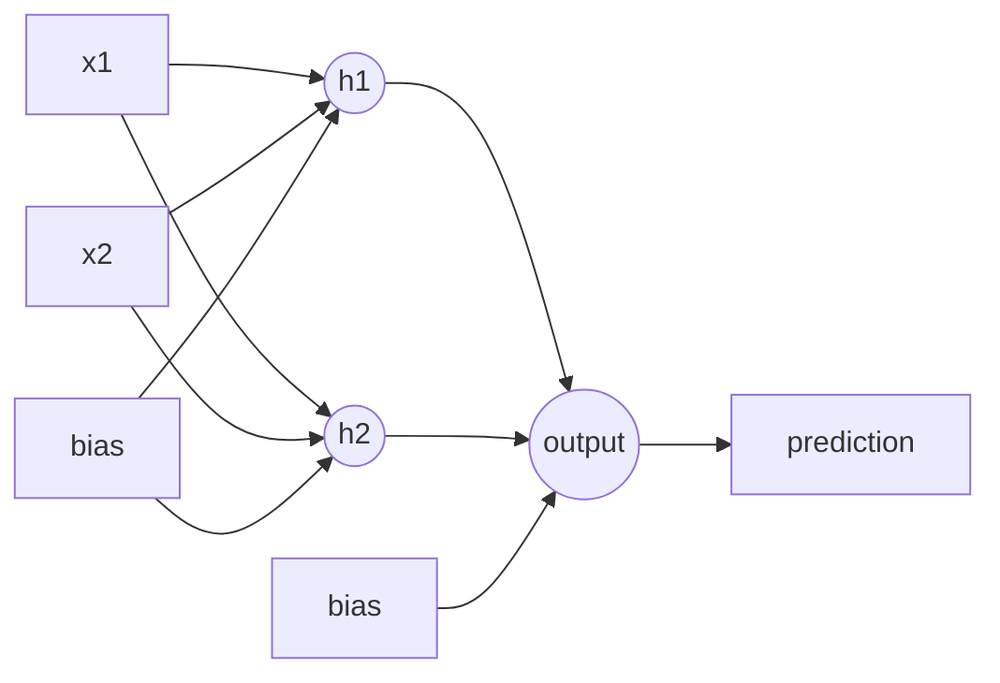

# Artificial Neural Networks

Mitchell's neural-network chapter predates the modern deep learning era, but many core ideas are the same: differentiable units, gradient descent, backpropagation, hidden representations, overfitting, and validation-based stopping. The networks are smaller, the examples are era-appropriate, and GPU-scale training is outside the scope, but the mathematical mechanism remains recognizable.

The chapter connects neural networks to the earlier checkers learner. Both use parameterized functions and error gradients. A perceptron is a linear threshold hypothesis; a multilayer network composes many differentiable units to represent nonlinear decision surfaces.


*Figure: Perceptron unit with weighted inputs and activation. Image: [Wikimedia Commons](https://commons.wikimedia.org/wiki/File:Perceptron.svg), Mat the w, CC BY-SA 3.0.*

## Definitions

A perceptron computes a weighted sum and passes it through a threshold:

$$
o(x)=
\begin{cases}
1 & \text{if } w_0 + w_1x_1+\cdots+w_nx_n > 0 \\
0 & \text{otherwise.}
\end{cases}
$$

A linear unit omits the hard threshold and outputs:

$$
o(x)=w_0+\sum_{i=1}^n w_ix_i.
$$

A sigmoid unit uses a differentiable squashing function:

$$
o = \sigma(net)=\frac{1}{1+e^{-net}},
\qquad
net=w_0+\sum_i w_ix_i.
$$

The squared error over training examples is:

$$
E(w)=\frac{1}{2}\sum_{d \in D}(t_d-o_d)^2.
$$

The perceptron training rule updates weights using:

$$
w_i \leftarrow w_i + \eta(t-o)x_i.
$$

For linear units, the delta rule performs gradient descent on squared error:

$$
w_i \leftarrow w_i + \eta(t-o)x_i.
$$

The formula looks the same, but the convergence guarantees differ because the output function differs.

Backpropagation computes gradients for multilayer networks by propagating error terms from output units backward to hidden units.

## Key results

Perceptrons can represent linearly separable boolean functions such as AND and OR, but not XOR. This representational limit is historically important because it shows why hidden units matter. A two-layer network with nonlinear hidden units can represent decision regions that a single linear threshold cannot.

For a sigmoid output unit with squared error, the output-layer error term is:

$$
\delta_k = o_k(1-o_k)(t_k-o_k).
$$

For a hidden unit $h$, the error term is:

$$
\delta_h = o_h(1-o_h)\sum_{k \in outputs} w_{h,k}\delta_k.
$$

The weight update is:

$$
w_{j,i} \leftarrow w_{j,i} + \eta\delta_j x_{j,i},
$$

where $x_{j,i}$ is the input arriving on that weight.

Backpropagation is a gradient descent procedure over a nonconvex error surface. Therefore it can converge to local minima or plateaus. Mitchell emphasizes practical issues such as stochastic updates, learning rate, momentum, number of hidden units, and stopping criteria.

Hidden units learn internal representations. In the small autoencoder examples common in this era, an 8-input, 3-hidden, 8-output network can learn compact encodings for one-hot patterns. In face recognition and related tasks, hidden layers learn features useful for discriminating classes even when those features were not specified by the programmer.

The differentiability requirement explains the move from perceptrons to sigmoid units. A hard threshold is natural for classification, but its derivative is zero almost everywhere and undefined at the threshold. Gradient descent needs a smooth path showing how a small weight change affects error. The sigmoid provides that path. Modern networks often use other nonlinearities, but the reason for using differentiable or subdifferentiable units is the same: backpropagation is an efficient application of the chain rule.

Momentum is one of the practical refinements Mitchell discusses. Instead of updating weights only from the current gradient, momentum adds a fraction of the previous update. This can smooth oscillations in narrow valleys of the error surface and accelerate movement through shallow regions. It does not change the objective function; it changes the dynamics of the search.

The chapter's treatment of overfitting is also important. A network with many hidden units may fit complex training patterns, including noise. Stopping when validation error begins to rise is a form of regularization. Weight decay, alternative error functions, and architectural choices are other ways to bias the search toward hypotheses expected to generalize. In modern terms, Mitchell is already presenting the core problem of capacity control, even though the networks are much smaller than contemporary deep models.

Stochastic gradient descent is another important practical choice. Batch gradient descent computes the gradient using the whole training set before making an update. Stochastic gradient descent updates after one example, or a small batch of examples in modern terminology. The stochastic update is noisier, but it can start improving weights immediately and sometimes escapes shallow local structure in the error surface. Mitchell presents stochastic approximation as closely related to the LMS rule from the opening chapter.

The hidden-representation discussion should not be read as mystical. A hidden unit is useful when its activation becomes a feature that simplifies the output task. For XOR, hidden units can create intermediate tests corresponding to regions of the input plane; the output unit can then combine those regions linearly. In the face-recognition example, hidden units can respond to recurring image patterns. Backpropagation does not receive labels for these hidden features; it shapes them indirectly through their contribution to output error.

The historical contrast with modern deep learning is mostly scale and architecture, not the disappearance of these ideas. Backpropagation, validation error, differentiable composition, local minima, and learned internal features are still central. What changed is the availability of larger datasets, accelerators, initialization schemes, normalization, convolutional and attention architectures, and software systems capable of training much deeper networks.

It is also useful to separate representational power from learnability. A network architecture may be capable of representing a target function, but gradient descent may still fail to find the right weights from a particular initialization and dataset. Mitchell repeatedly treats learning as search, and neural networks are no exception: the hypothesis space is continuous, the search operator is gradient descent, and the inductive bias comes from architecture, initialization, learning dynamics, and stopping rules.

This search view prevents a common misconception: adding hidden units is not automatically an improvement. Extra units increase representational capacity, but they can also make optimization harder and generalization weaker. The right architecture is the one whose capacity matches the data and task.

| Model | Decision surface | Training signal | Limitation |
|---|---|---|---|
| Perceptron | Linear threshold | Classification error | Cannot solve nonlinearly separable tasks |
| Linear unit | Linear regression surface | Squared error | No nonlinear boundaries |
| Multilayer sigmoid net | Nonlinear composition | Backpropagated gradient | Nonconvex optimization |
| Modern deep net | Many-layer composition | Backprop plus large-scale engineering | Beyond Mitchell's main scope |

## Visual



The forward pass computes activations from left to right. Backpropagation computes error derivatives from right to left.

## Worked example 1: Design a perceptron for AND

Problem: Find weights for a two-input perceptron that computes $x_1 \land x_2$, where inputs are 0 or 1 and the output is 1 only when both inputs are 1.

Method:

1. Use the perceptron rule:

$$
o=1 \text{ if } w_0+w_1x_1+w_2x_2>0.
$$

2. Choose positive weights for both inputs. Let:

$$
w_1=1,\qquad w_2=1.
$$

3. Choose a negative bias so one active input is insufficient but two active inputs succeed. Let:

$$
w_0=-1.5.
$$

4. Check all four input cases.

   | $x_1$ | $x_2$ | Net | Output |
   |---:|---:|---:|---:|
   | 0 | 0 | $-1.5$ | 0 |
   | 0 | 1 | $-0.5$ | 0 |
   | 1 | 0 | $-0.5$ | 0 |
   | 1 | 1 | $0.5$ | 1 |

Answer: $w_0=-1.5$, $w_1=1$, and $w_2=1$ implement AND. The truth table check confirms that only $(1,1)$ crosses the threshold.

## Worked example 2: One backpropagation update

Problem: A sigmoid output unit receives two inputs $x_1=1$ and $x_2=0.5$. Its weights are $w_0=0$, $w_1=0.4$, and $w_2=-0.2$. The target is $t=1$ and $\eta=0.5$. Compute one output-layer update using squared error.

Method:

1. Compute net input.

$$
net = 0 + 0.4(1) + (-0.2)(0.5)=0.4-0.1=0.3.
$$

2. Compute sigmoid output.

$$
o=\frac{1}{1+e^{-0.3}}\approx 0.5744.
$$

3. Compute output error term.

$$
\delta=o(1-o)(t-o).
$$

$$
\delta \approx 0.5744(0.4256)(1-0.5744)
\approx 0.5744(0.4256)(0.4256)
\approx 0.1040.
$$

4. Update the bias weight using input $x_0=1$.

$$
w_0' = 0 + 0.5(0.1040)(1)=0.0520.
$$

5. Update $w_1$.

$$
w_1'=0.4+0.5(0.1040)(1)=0.4520.
$$

6. Update $w_2$.

$$
w_2'=-0.2+0.5(0.1040)(0.5)=-0.2+0.0260=-0.1740.
$$

Answer: The updated weights are approximately $(0.0520,0.4520,-0.1740)$. Because the target is larger than the output, the update increases the net input for this example.

## Code

```python
import numpy as np

def sigmoid(z):
    return 1.0 / (1.0 + np.exp(-z))

def one_sigmoid_update(w, x, target, eta):
    x_aug = np.r_[1.0, x]
    net = float(w @ x_aug)
    out = sigmoid(net)
    delta = out * (1.0 - out) * (target - out)
    w_new = w + eta * delta * x_aug
    return w_new, out, delta

w = np.array([0.0, 0.4, -0.2])
x = np.array([1.0, 0.5])
w_new, out, delta = one_sigmoid_update(w, x, target=1.0, eta=0.5)

print(out)
print(delta)
print(w_new)
```

## Common pitfalls

- Assuming a perceptron can learn any boolean function. It cannot represent XOR without additional features or hidden units.
- Confusing the perceptron training rule with backpropagation. Backpropagation requires differentiable units and propagates gradients through layers.
- Omitting the derivative of the sigmoid in the delta term. The factor $o(1-o)$ is essential for squared-error sigmoid training.
- Using too large a learning rate and mistaking oscillation for model incapacity.
- Judging neural networks only by final training error. Validation error and stopping criteria are needed to detect overfitting.
- Reading Mitchell's small networks as a statement about modern scale. The core algorithm survives, but modern deep learning adds depth, GPUs, regularization, normalization, large datasets, and many architectural ideas outside this chapter.

## Connections

- [Learning problems and system design](/cs/machine-learning/learning-problems-and-system-design)
- [Evaluating hypotheses](/cs/machine-learning/evaluating-hypotheses)
- [Bayesian learning](/cs/machine-learning/bayesian-learning)
- [Computational learning theory](/cs/machine-learning/computational-learning-theory)
- [Modern deep learning](/cs/deep-learning/)
