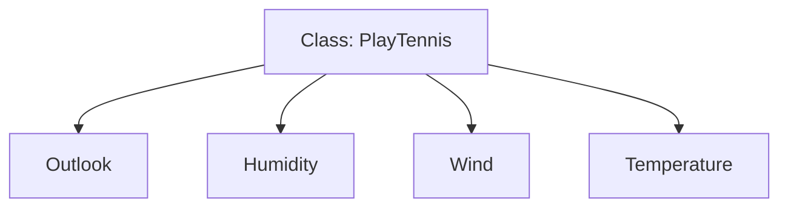
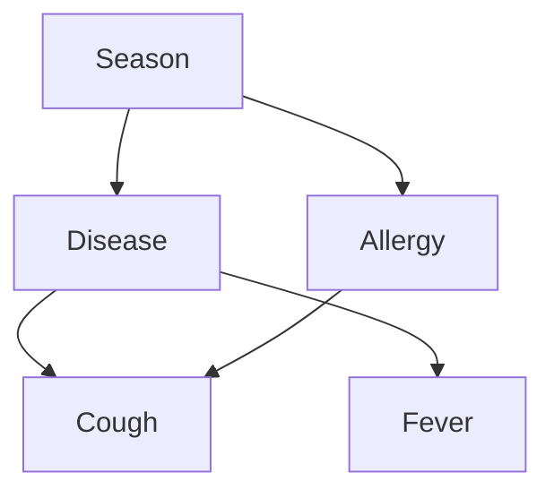

# Bayesian Classifiers, Networks, and EM

Mitchell's Bayesian chapter ranges from Bayes' theorem to practical probabilistic models. Three ideas are especially important: Naive Bayes classification, Bayesian belief networks, and expectation-maximization. Naive Bayes shows how a strong conditional-independence assumption can produce a simple, effective classifier. Bayesian networks represent structured conditional independencies among variables. EM handles hidden or missing variables by alternating between estimating unobserved quantities and improving parameters.

These methods are historically central. Naive Bayes became a baseline for text classification, Bayesian networks shaped probabilistic AI, and EM remains a standard algorithm for mixture models and latent-variable estimation.

## Definitions

The Naive Bayes classifier predicts the target class $v_j$ that maximizes:

$$
P(v_j)\prod_i P(a_i \mid v_j),
$$

where $a_i$ are observed attribute values. It is "naive" because it assumes the attributes are conditionally independent given the class.

For text classification, the attributes are often word counts or word occurrences. A common multinomial form estimates:

$$
P(w_k \mid v_j)=
\frac{n_k + 1}{n + |Vocabulary|},
$$

where $n_k$ is the count of word $w_k$ in documents of class $v_j$, $n$ is the total word count in that class, and plus-one smoothing avoids zero probabilities.

A Bayesian belief network is a directed acyclic graph whose nodes are random variables. Each node has a conditional probability table conditioned on its parents. The joint distribution factorizes as:

$$
P(Y_1,\ldots,Y_n)=\prod_{i=1}^n P(Y_i \mid Parents(Y_i)).
$$

Expectation-maximization (EM) is an iterative method for maximum likelihood estimation with hidden variables. The E-step estimates expected values of hidden variables under current parameters. The M-step updates parameters to maximize expected complete-data likelihood.

## Key results

Naive Bayes often works well even when the independence assumption is false. The reason is that classification only needs the largest posterior score, not perfectly calibrated probabilities. Correlated features can distort probability estimates, but the ranking of classes may remain useful.

Smoothing is not a cosmetic detail. Without smoothing, a single unseen word can make $P(document \mid class)=0$, eliminating a class regardless of all other evidence. Laplace smoothing gives every vocabulary term a small nonzero probability.

Bayesian networks generalize Naive Bayes. In Naive Bayes, the class node is a parent of every attribute node and attributes have no other dependencies. A richer network can represent dependencies among attributes, causes, symptoms, and hidden variables.

Inference in Bayesian networks can be computationally expensive in general. Exact inference depends heavily on graph structure; approximate inference is often needed for large networks. Mitchell's discussion focuses on representation, inference, and learning at an introductory level.

EM monotonically increases the data likelihood under standard assumptions, though it may converge to a local optimum. For mixtures of Gaussians, EM alternates between computing fractional cluster responsibilities and re-estimating means, variances, and mixture weights.

Naive Bayes is especially important in text classification because documents are naturally high-dimensional and sparse. A discriminative learner may need many examples to estimate interactions among words, while Naive Bayes collapses the problem into estimating word frequencies per class. This is a strong bias, but it is also a strong variance reduction. In Mitchell's era, this made Bayesian text classifiers attractive for practical document filtering.

Bayesian networks make independence assumptions visible. Instead of assuming every attribute is independent given the class, the graph states which variables directly depend on which others. The absence of an edge is a modeling claim. For example, if fever and cough are independent given disease, their connection can be omitted; if allergy also causes cough, the graph should include that parent. This explicit structure is valuable for explanation and for incorporating expert knowledge.

EM can be understood as soft completion of missing data. If the hidden assignments were known, maximum likelihood estimation would often be easy. Since they are not known, the E-step computes expected assignments using the current model, and the M-step acts as though those fractional assignments were observed. The procedure repeats because better parameters change the expected hidden assignments, and better assignments change the parameter estimates.

Parameter counting explains why network structure matters. If a node has many parents, its conditional probability table can become large because it needs entries for combinations of parent values. Sparse graph structure is therefore not only an interpretability choice; it is a statistical and computational choice. Fewer parents usually mean fewer parameters to estimate and less data required for reliable estimates.

Learning Bayesian-network structure is harder than estimating parameters for a fixed structure. With a fixed graph and complete data, many conditional probability entries can be estimated by counting. When the graph is unknown, the learner searches over possible directed acyclic graphs, balancing fit to data against structural complexity. This connects Bayesian networks back to the book's recurring theme of hypothesis-space search.

The three methods in this page also show three levels of probabilistic structure. Naive Bayes uses one simple global structure. Bayesian networks allow the designer or learner to express richer dependency structure. EM adds hidden structure when important variables are not directly observed. In all three cases, probability is not an after-the-fact confidence score; it defines the model, the learning objective, and the prediction rule.

This is why probability estimates must be tied back to assumptions. A Naive Bayes posterior, a belief-network marginal, and an EM mixture responsibility are all conditional on the model structure and estimated parameters. They are not model-free facts about the world.

| Method | Hidden assumptions | Strength | Risk |
|---|---|---|---|
| Naive Bayes | Attributes independent given class | Simple, fast, strong baseline | Miscalibrated probabilities |
| Bayesian network | DAG captures dependencies | Interpretable probabilistic structure | Inference and structure learning can be hard |
| EM | Hidden variables explain incomplete data | Handles latent assignments | Local optima and initialization sensitivity |

## Visual



This is the Naive Bayes graph: all observed attributes depend on the class, and no direct dependencies among attributes are modeled.



This Bayesian network is richer: cough has two possible causes, and season influences both allergy and disease.

## Worked example 1: Naive Bayes classification with smoothing

Problem: Classify a short document containing the words `win money` as `spam` or `ham`. Training counts are:

| Class | Prior | Total words | `win` count | `money` count | Vocabulary size |
|---|---:|---:|---:|---:|---:|
| spam | 0.40 | 100 | 8 | 10 | 50 |
| ham | 0.60 | 200 | 1 | 2 | 50 |

Use plus-one smoothing and the multinomial Naive Bayes score.

Method:

1. Estimate word probabilities for spam.

$$
P(win \mid spam)=\frac{8+1}{100+50}=\frac{9}{150}=0.060.
$$

$$
P(money \mid spam)=\frac{10+1}{150}=\frac{11}{150}\approx 0.0733.
$$

2. Estimate word probabilities for ham.

$$
P(win \mid ham)=\frac{1+1}{200+50}=\frac{2}{250}=0.008.
$$

$$
P(money \mid ham)=\frac{2+1}{250}=\frac{3}{250}=0.012.
$$

3. Compute unnormalized spam score.

$$
score(spam)=0.40(0.060)(0.0733)\approx 0.001759.
$$

4. Compute unnormalized ham score.

$$
score(ham)=0.60(0.008)(0.012)=0.0000576.
$$

5. Compare scores.

$$
0.001759 > 0.0000576.
$$

Answer: The document is classified as `spam`. The checked calculation shows that despite the lower spam prior, the two words are much more likely under the spam word model.

## Worked example 2: One EM step for a two-coin mixture

Problem: A hidden coin is selected for each toss sequence. Coin A has current head probability $\theta_A=0.8$, coin B has $\theta_B=0.4$, and each coin is chosen with prior 0.5. One observed sequence has 3 heads and 1 tail. Compute the E-step responsibility that coin A generated it.

Method:

1. Compute likelihood under coin A.

$$
P(D \mid A)=0.8^3(0.2)^1=0.512(0.2)=0.1024.
$$

2. Include prior for A.

$$
score(A)=0.5(0.1024)=0.0512.
$$

3. Compute likelihood under coin B.

$$
P(D \mid B)=0.4^3(0.6)^1=0.064(0.6)=0.0384.
$$

4. Include prior for B.

$$
score(B)=0.5(0.0384)=0.0192.
$$

5. Normalize to get responsibility.

$$
\gamma_A=
\frac{0.0512}{0.0512+0.0192}
=
\frac{0.0512}{0.0704}
\approx 0.7273.
$$

6. Interpret for the M-step.

   This sequence contributes about $0.7273(3)$ expected heads and $0.7273(1)$ expected tails to coin A's parameter update.

Answer: The E-step responsibility for coin A is approximately $0.7273$. The sequence is more likely to have come from A because it has a high fraction of heads.

## Code

```python
import numpy as np

def naive_bayes_score(prior, counts, total_words, vocab_size, document):
    score = prior
    for word in document:
        score *= (counts.get(word, 0) + 1) / (total_words + vocab_size)
    return score

spam_counts = {"win": 8, "money": 10}
ham_counts = {"win": 1, "money": 2}
doc = ["win", "money"]

scores = {
    "spam": naive_bayes_score(0.40, spam_counts, 100, 50, doc),
    "ham": naive_bayes_score(0.60, ham_counts, 200, 50, doc),
}

print(scores)
print(max(scores, key=scores.get))

theta_a, theta_b = 0.8, 0.4
heads, tails = 3, 1
score_a = 0.5 * theta_a**heads * (1 - theta_a)**tails
score_b = 0.5 * theta_b**heads * (1 - theta_b)**tails
print(score_a / (score_a + score_b))
```

## Common pitfalls

- Multiplying many probabilities directly for long documents. Use log probabilities to avoid underflow.
- Forgetting smoothing. A zero conditional probability can dominate the entire Naive Bayes product.
- Assuming Naive Bayes requires true independence to be useful. The assumption is often false, but the classifier can still rank classes well.
- Drawing cycles in a Bayesian network. The standard belief-network representation is a directed acyclic graph.
- Treating missing values and hidden variables as the same thing in every context. EM handles both through latent quantities, but the modeling assumptions must be explicit.
- Expecting EM to find the global optimum. It improves likelihood locally and is sensitive to initialization.

## Connections

- [Bayesian learning](/cs/machine-learning/bayesian-learning)
- [Evaluating hypotheses](/cs/machine-learning/evaluating-hypotheses)
- [Artificial neural networks](/cs/machine-learning/artificial-neural-networks)
- [Probability](/math/probability/)
- [Probability and random variables](/math/probability-and-random-variables/)
