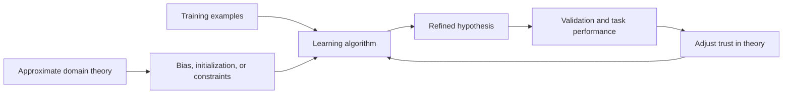

# Combining Inductive and Analytical Learning

Mitchell's chapter on combining inductive and analytical learning addresses a realistic middle ground: prior knowledge is helpful but imperfect. Pure induction can require many examples. Pure analytical learning can fail when the domain theory is incomplete or wrong. Combined methods try to exploit prior knowledge while still allowing data to correct it.

The chapter presents several strategies: initialize the hypothesis with prior knowledge, alter the search objective using prior knowledge, and augment search with prior-knowledge-derived features or candidate rules. The examples include KBANN, TANGENTPROP, EBNN, and FOCL. These systems are historically specific, but the design pattern is modern: use prior knowledge as a bias, initialization, regularizer, feature generator, or constraint.

## Definitions

An inductive-analytical learning problem includes ordinary labeled examples plus an approximate domain theory.

Approximate prior knowledge may be:

| Type | Meaning |
|---|---|
| Correct but incomplete | Some useful rules are missing |
| Incorrect in places | Some rules make wrong predictions |
| Too abstract | The theory uses predicates not directly observed |
| Noisy in strength | Some rules are usually but not always reliable |

KBANN converts propositional rules into an initial neural network. The network is then trained with backpropagation, allowing data to refine weights.

TANGENTPROP uses prior knowledge about transformations that should not change the target value. It modifies the error function so the learned network is insensitive along specified transformation directions.

EBNN, explanation-based neural networks, uses explanations to derive training derivatives or constraints that guide neural-network learning.

FOCL extends FOIL-style rule learning by using prior knowledge to suggest useful rule refinements.

## Key results

There are three broad ways to combine prior knowledge with data.

First, prior knowledge can initialize the hypothesis. KBANN maps rules into a neural network whose initial weights approximately implement the domain theory. Backpropagation then adjusts the network to fit data. This can improve learning when the theory is mostly right, because the search begins near a useful solution.

Second, prior knowledge can alter the search objective. TANGENTPROP adds a penalty that discourages the output from changing under transformations known to preserve class. For example, if a vision system should classify an object the same after a small translation, the learner can be penalized for sensitivity to that transformation.

Third, prior knowledge can augment the search space. FOCL uses domain theory to propose candidate literals that a purely inductive rule learner might not consider early. The learner is not forced to accept them; empirical performance still matters.

The Bayesian view unifies these methods. Prior knowledge should influence the learner like a prior probability or constraint, while data contribute likelihood. The practical challenge is deciding how strongly to trust the theory.

The strength of prior knowledge should depend on its reliability. If a rule was derived from physics or a verified program invariant, it may deserve strong influence. If it came from a domain expert's rough heuristic, it should probably be easy for data to override. Combined systems differ largely in how they tune this trust. KBANN starts near the theory but allows gradient descent to move away. TANGENTPROP penalizes violations of invariance but does not necessarily make them impossible. FOCL lets prior rules suggest search steps without forcing them to be chosen.

These methods also show that "prior knowledge" can have different mathematical forms. It may be a rule, an invariance, a derivative constraint, a network architecture, a feature definition, or a preferred region of hypothesis space. Treating all of these as ordinary extra examples would lose structure. The point of inductive-analytical learning is to inject the knowledge where it has the right effect on search.

The risk is negative transfer from bad knowledge. A misleading initialization can slow training or guide the learner toward a poor local optimum. A false invariance can prevent the model from representing real distinctions. A bad rule can cause a symbolic learner to spend search effort in the wrong region. For that reason, empirical validation remains necessary even when the prior theory is intellectually appealing.

The chapter is also a reminder that prior knowledge can reduce sample complexity without guaranteeing correctness. If the prior theory narrows the search to a good region, fewer examples may be needed to find an accurate hypothesis. If it narrows the search to the wrong region, more data may be required to escape, or escape may be impossible if the constraint is hard. Soft use of prior knowledge is often safer than hard enforcement when the theory is uncertain.

Modern practice contains many analogues. Pretraining initializes a model before task-specific data. Data augmentation encodes invariances. Physics-informed networks add penalties based on differential equations. Feature engineering and programmatic labeling inject domain knowledge. These are not the same systems Mitchell describes, but they follow the same pattern: combine experience with assumptions that came from outside the labeled dataset.

The evaluation standard remains predictive performance on the target task. A combined method should be judged not by how elegantly it uses prior knowledge, but by whether the prior knowledge improves accuracy, data efficiency, robustness, or interpretability under honest evaluation.

Mitchell's examples also show that hybrid learning systems are engineering designs, not one algorithm. The designer chooses where knowledge enters, how strongly it is trusted, and how empirical errors are allowed to revise it. That choice should reflect the domain: approximate scientific laws, expert rules, invariances, and symbolic explanations each call for different mechanisms.

A useful test is counterfactual: if the prior theory is removed, does the learner need more examples, lose accuracy, or become less stable? If not, the added complexity may not be justified. If yes, the prior is contributing measurable bias in the intended direction.

That counterfactual framing keeps the focus on learning value rather than on architectural novelty.

| Strategy | Example system | How prior knowledge enters | How data can correct it |
|---|---|---|---|
| Initialize hypothesis | KBANN | Rules become initial network structure and weights | Backprop changes weights |
| Modify objective | TANGENTPROP | Invariance penalty added to error | Data error remains part of objective |
| Add search operators | FOCL | Theory suggests candidate literals | Rule scoring accepts or rejects them |
| Explain examples | EBNN | Explanations supply derivative guidance | Network still trained on examples |

## Visual



Combined learning treats prior knowledge as useful evidence, not as an untouchable truth.

## Worked example 1: Prior rule as neural initialization

Problem: A domain theory says:

$$
Safe(x) \leftarrow Light(x) \land Stable(x).
$$

Represent this rule as an initial neural unit that approximates logical AND. Inputs are binary: `Light` and `Stable`. Choose weights and threshold-style sigmoid bias so the output is high only when both inputs are 1.

Method:

1. Use a sigmoid unit:

$$
o=\sigma(w_0+w_1Light+w_2Stable).
$$

2. Choose positive weights for both rule antecedents.

$$
w_1=5,\qquad w_2=5.
$$

3. Choose a negative bias so one true antecedent is insufficient.

   Let:

$$
w_0=-7.5.
$$

4. Check all input cases.

   | Light | Stable | Net | Sigmoid output |
   |---:|---:|---:|---:|
   | 0 | 0 | -7.5 | 0.0006 |
   | 1 | 0 | -2.5 | 0.0759 |
   | 0 | 1 | -2.5 | 0.0759 |
   | 1 | 1 | 2.5 | 0.9241 |

5. Interpret the initialization.

   The unit behaves like the rule but remains differentiable. If data show exceptions, backpropagation can adjust the weights.

Answer: Weights $w_0=-7.5$, $w_1=5$, and $w_2=5$ encode a soft AND suitable for KBANN-style initialization.

## Worked example 2: Tangent-style invariance penalty

Problem: A model $f(x)$ should be insensitive to a small transformation direction $v$. At a training point, the ordinary squared error is $0.04$. The derivative of the output along $v$ is $0.30$. Use a penalty weight $\lambda=2$ and compute the combined error:

$$
E = E_{\text{data}} + \lambda\left(\frac{\partial f}{\partial v}\right)^2.
$$

Method:

1. Record the data error.

$$
E_{\text{data}}=0.04.
$$

2. Square the directional derivative.

$$
\left(\frac{\partial f}{\partial v}\right)^2 = 0.30^2 = 0.09.
$$

3. Multiply by the penalty weight.

$$
\lambda(0.09)=2(0.09)=0.18.
$$

4. Add to the data error.

$$
E=0.04+0.18=0.22.
$$

5. Interpret the result.

   Even though the prediction error is small, the model is too sensitive in a direction that prior knowledge says should not matter. The combined objective pushes training to reduce that sensitivity.

Answer: The combined error is $0.22$. Most of the penalty comes from violating the invariance prior.

## Code

```python
import math

def sigmoid(z):
    return 1.0 / (1.0 + math.exp(-z))

weights = {"bias": -7.5, "Light": 5.0, "Stable": 5.0}

for light in [0, 1]:
    for stable in [0, 1]:
        net = weights["bias"] + weights["Light"] * light + weights["Stable"] * stable
        print(light, stable, round(sigmoid(net), 4))

data_error = 0.04
directional_derivative = 0.30
lam = 2.0
combined = data_error + lam * directional_derivative**2
print(combined)
```

## Common pitfalls

- Treating prior knowledge as certainly correct when the chapter's premise is that it may be approximate.
- Letting the data completely erase useful prior structure too quickly. Initialization helps only if training does not immediately destroy it through poor hyperparameters.
- Encoding rules into a network and then assuming the resulting model is still interpretable as the original rule set after training.
- Adding invariance penalties without checking whether the invariance is actually valid for the task.
- Comparing combined methods only to weak baselines. The value of prior knowledge should be tested against strong purely inductive alternatives.
- Forgetting that prior knowledge affects bias. It can reduce sample needs when correct, but it can also introduce systematic error.

## Connections

- [Analytical learning](/cs/machine-learning/analytical-learning)
- [Artificial neural networks](/cs/machine-learning/artificial-neural-networks)
- [Rule learning and ILP](/cs/machine-learning/rule-learning-and-ilp)
- [Bayesian learning](/cs/machine-learning/bayesian-learning)
- [Modern deep learning](/cs/deep-learning/)
