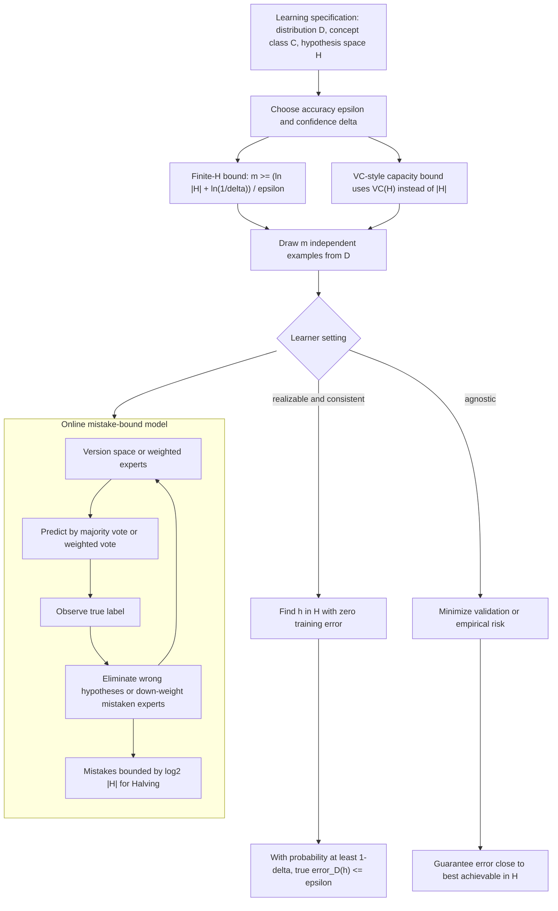

# Computational Learning Theory

Computational learning theory asks what can be learned in principle, how much data is sufficient, and how computation constrains learning. Mitchell's treatment centers on PAC learning, sample complexity, VC dimension, and mistake bounds. The chapter is less about building a classifier for a given dataset and more about proving guarantees under explicit assumptions.

This material remains foundational because it gives formal language for generalization. Modern models are often too large for the simplest finite-hypothesis bounds to be tight, but the discipline of stating a distribution, an error tolerance, a confidence level, and a hypothesis class is still essential.

## Definitions

A concept class $C$ is a set of target concepts. A hypothesis space $H$ is the set of hypotheses available to the learner. In many analyses $C \subseteq H$, but agnostic settings allow the target to fall outside $H$.

A hypothesis $h$ has true error:

$$
error_{\mathcal{D}}(h)=Pr_{x \sim \mathcal{D}}[h(x)\neq c(x)].
$$

A concept class is PAC-learnable if there exists an algorithm that, for any distribution over instances, any target concept in the class, any $0\lt \epsilon\lt 1/2$, and any $0\lt \delta\lt 1/2$, outputs with probability at least $1-\delta$ a hypothesis whose error is at most $\epsilon$, using time and examples polynomial in the relevant quantities.

The parameters are:

| Symbol | Meaning |
|---|---|
| $\epsilon$ | Accuracy tolerance; acceptable true error |
| $\delta$ | Confidence failure probability |
| $1-\delta$ | Required probability of success |
| $H$ | Hypothesis space searched by the learner |

A set of instances is shattered by $H$ if for every possible labeling of that set, some hypothesis in $H$ realizes that labeling.

The VC dimension of $H$, written $VC(H)$, is the size of the largest finite set shattered by $H$. If arbitrarily large finite sets can be shattered, the VC dimension is infinite.

The mistake-bound model studies online learning. It asks how many mistakes a learner can make before converging, under some sequence of examples.

## Key results

For a finite hypothesis space $H$, a sufficient number of training examples for a consistent learner is:

$$
m \geq \frac{1}{\epsilon}\left(\ln |H| + \ln \frac{1}{\delta}\right).
$$

This says sample complexity grows logarithmically with the number of hypotheses but inversely with the desired error tolerance. The result assumes the learner finds a hypothesis consistent with all training examples and that examples are drawn independently from the same distribution used to measure error.

For agnostic learning, where no hypothesis may be perfectly correct, the goal becomes finding a hypothesis with error close to the best available in $H$. The bounds are weaker because the learner must estimate and compare nonzero errors rather than eliminate inconsistent hypotheses.

VC dimension extends sample-complexity reasoning to infinite hypothesis spaces. A class can be infinite but still have limited capacity if it cannot shatter large sets. Linear separators in two dimensions, for example, have finite VC dimension.

In the mistake-bound model, the Halving algorithm keeps a version space of candidate hypotheses and predicts by majority vote. Each mistake eliminates at least half the remaining hypotheses, so the number of mistakes is bounded by:

$$
\log_2 |H|.
$$

Weighted Majority softens this idea by reducing weights of mistaken experts rather than eliminating them completely. It is more robust when no expert is perfect.

The finite hypothesis bound shows why hypothesis-space size matters only logarithmically in one idealized setting. Doubling the number of hypotheses does not double the required sample size; it adds only $\ln 2 / \epsilon$ examples to the sufficient bound. However, this should not be read as permission to make $H$ arbitrarily wild. If $H$ is so expressive that it contains many bad hypotheses that fit small samples by chance, the logarithmic term still grows, and computation may become impossible.

VC dimension answers a different question: not "how many hypotheses are there?" but "how many arbitrary labelings can the class realize?" Infinite classes can have finite VC dimension when their geometry constrains them. Linear separators in a fixed-dimensional space are infinite because their weights are real-valued, but they cannot shatter every large finite point set. This is why capacity is not the same thing as parameter count in a naive sense, although related bounds often depend on parameters.

The mistake-bound model changes the rhythm of learning. PAC analysis draws a sample and asks about the final hypothesis. Online analysis sees examples one at a time and charges the learner for wrong predictions. This is useful for algorithms that must act while learning, and it foreshadows reinforcement-learning concerns where behavior during learning matters, not only final accuracy.

PAC learnability also requires computational feasibility, not just enough examples. A theorem that says a small sample contains enough information is incomplete if finding the consistent hypothesis requires exponential search. This is why Mitchell states learnability in terms of polynomial time and polynomial sample size. Some concept classes are statistically learnable but computationally difficult under certain representations.

The conjunction example illustrates a positive result. Boolean conjunctions can be learned by beginning with the most specific or most inclusive conjunction and deleting literals contradicted by positive examples, depending on the setup. The number of possible conjunctions is large, but the structure of the representation allows an efficient learner. This contrasts with arbitrary boolean functions, where an unbiased hypothesis space is too expressive to support useful generalization from modest samples.

VC dimension should also be interpreted as worst-case capacity. A hypothesis class with high VC dimension may generalize well on a benign distribution with appropriate regularization, while a low-VC class can perform poorly if it cannot represent the target. The theory gives sufficient and sometimes necessary conditions under broad assumptions; it does not remove the need for modeling judgment.

The theory also explains why "more data" is not a single universal requirement. The number of examples needed depends on the target accuracy, desired confidence, and capacity of the hypothesis class. Asking whether 1,000 examples is enough has no answer until $\epsilon$, $\delta$, the data distribution, and $H$ are specified. Mitchell's notation forces those hidden conditions into the open.

Finally, the chapter distinguishes information from computation. A sample may contain enough evidence to identify a good hypothesis, yet the learner may not be able to find it efficiently. This distinction is one reason computational learning theory belongs in computer science rather than only statistics.

This perspective also keeps negative results useful. Showing that a broad class is not learnable under certain assumptions does not mean learning is hopeless; it means some assumption must change. The learner may need a smaller hypothesis space, a stronger bias, a different representation, a helpful membership query, a margin assumption, or a weaker performance guarantee.

## Visual



The PAC side of the diagram labels the statistical contract: once `D`, `H`, `epsilon`, and `delta` are fixed, a sufficient sample size supports a high-probability true-error guarantee. The online branch shows a different architecture where examples arrive sequentially and the learner updates a version space or expert weights after each mistake.

## Worked example 1: Finite hypothesis sample bound

Problem: A consistent learner searches a finite hypothesis space of size $\vert H\vert =1024$. How many examples suffice to guarantee error at most $\epsilon=0.05$ with confidence $1-\delta=0.95$?

Method:

1. Identify parameters.

$$
|H|=1024,\qquad \epsilon=0.05,\qquad \delta=0.05.
$$

2. Use the finite-space sufficient bound.

$$
m \geq \frac{1}{\epsilon}\left(\ln |H|+\ln\frac{1}{\delta}\right).
$$

3. Compute $\ln \vert H\vert $.

   Since $1024=2^{10}$:

$$
\ln(1024)=10\ln 2 \approx 10(0.6931)=6.931.
$$

4. Compute $\ln(1/\delta)$.

$$
\ln(1/0.05)=\ln(20)\approx 2.996.
$$

5. Add and divide by $\epsilon$.

$$
m \geq \frac{1}{0.05}(6.931+2.996)
=20(9.927)=198.54.
$$

6. Round up to an integer.

$$
m=199.
$$

Answer: 199 examples suffice under the finite-hypothesis consistent-learning bound. This is sufficient, not necessarily necessary.

## Worked example 2: Mistake bound for Halving

Problem: The Halving algorithm begins with $\vert H\vert =64$ hypotheses and the true target is in $H$. What is the maximum number of mistakes?

Method:

1. Each mistake means the majority vote was wrong.

2. Therefore at least half of the current hypotheses predicted incorrectly.

3. The algorithm removes all hypotheses that made the wrong prediction.

4. After one mistake, at most $64/2=32$ hypotheses remain.

5. After two mistakes, at most $16$ remain. Continue:

   | Mistakes | Max hypotheses remaining |
   |---:|---:|
   | 0 | 64 |
   | 1 | 32 |
   | 2 | 16 |
   | 3 | 8 |
   | 4 | 4 |
   | 5 | 2 |
   | 6 | 1 |

6. Once one hypothesis remains and the target is in $H$, no further mistakes are possible.

Answer: The mistake bound is $\log_2 64=6$. The checked table shows the version space halves with each mistake.

## Code

```python
import math

def finite_h_sample_bound(num_hypotheses, epsilon, delta):
    return math.ceil((math.log(num_hypotheses) + math.log(1 / delta)) / epsilon)

def halving_mistake_bound(num_hypotheses):
    return math.ceil(math.log2(num_hypotheses))

print(finite_h_sample_bound(1024, epsilon=0.05, delta=0.05))
print(halving_mistake_bound(64))
```

## Common pitfalls

- Reading PAC bounds as exact predictions of test accuracy. They are worst-case sufficient guarantees under assumptions.
- Forgetting the distribution assumption. Training and future examples are assumed to come from the same distribution.
- Confusing $\epsilon$ and $\delta$. $\epsilon$ controls error tolerance; $\delta$ controls probability of failing to meet that tolerance.
- Assuming finite $H$ bounds apply unchanged to infinite hypothesis spaces. VC dimension or other capacity measures are needed.
- Believing low VC dimension is always better. Too little capacity can underfit if the target concept is complex.
- Applying the Halving mistake bound when the true concept is not in $H$ or when labels are noisy. The classic guarantee assumes realizability.

## Connections

- [Concept learning](/cs/machine-learning/concept-learning-and-version-spaces)
- [Evaluating hypotheses](/cs/machine-learning/evaluating-hypotheses)
- [Artificial neural networks](/cs/machine-learning/artificial-neural-networks)
- [Statistics](/math/statistics/)
- [Probability](/math/probability/)
