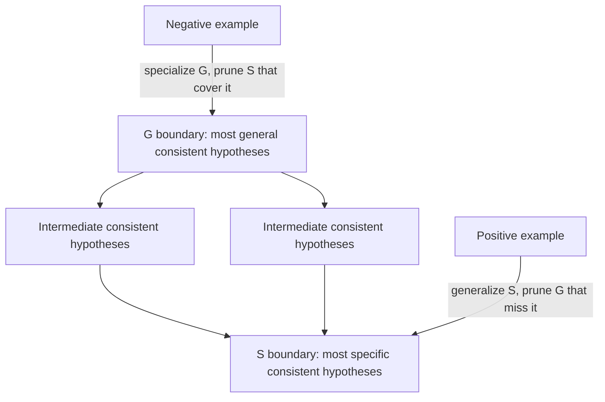

# Concept Learning and Version Spaces

Concept learning is Mitchell's cleanest introduction to machine learning as search. The learner sees labeled examples and tries to infer a boolean-valued concept, such as whether a day is suitable for enjoying a sport. The chapter is intentionally symbolic: hypotheses are logical descriptions, examples are attribute vectors, and learning is movement through a partially ordered hypothesis space.

This treatment feels different from modern large-scale statistical learning, but it remains useful because it exposes assumptions that are often hidden. Every learner has a bias. Every hypothesis language excludes some possible target concepts. Every generalization from observed examples to unseen examples requires an assumption beyond the data itself.

## Definitions

An instance $x$ is an object described by attributes. In the classic EnjoySport example, attributes include sky, air temperature, humidity, wind, water, and forecast.

A concept $c$ is a boolean-valued function:

$$
c : X \to \{0,1\}.
$$

A positive example has $c(x)=1$; a negative example has $c(x)=0$.

A hypothesis $h$ is the learner's candidate description of the concept. A hypothesis is consistent with a training set $D$ if it classifies every training example correctly.

In the conjunctive representation used by Mitchell, each hypothesis is a tuple of constraints. A constraint may be:

| Symbol | Meaning |
|---|---|
| specific value, such as `Sunny` | Attribute must equal that value |
| `?` | Any value is allowed |
| `0` or empty constraint | No value is allowed, so no instance matches |

The more-general-than relation orders hypotheses. A hypothesis $h_j$ is more general than or equal to $h_k$ if every instance classified positive by $h_k$ is also classified positive by $h_j$:

$$
h_j \geq_g h_k
\quad \text{iff} \quad
\{x : h_k(x)=1\} \subseteq \{x : h_j(x)=1\}.
$$

The version space $VS_{H,D}$ is the subset of hypotheses in $H$ that remain consistent with all observed training examples $D$:

$$
VS_{H,D} = \{h \in H : h \text{ is consistent with } D\}.
$$

The specific boundary $S$ contains the maximally specific hypotheses in the version space. The general boundary $G$ contains the maximally general hypotheses in the version space. Together, $S$ and $G$ compactly represent all consistent hypotheses between them.

## Key results

Concept learning can be formulated as search through $H$. The training examples do not merely score hypotheses; in the noiseless formulation they eliminate inconsistent hypotheses. Positive examples remove hypotheses that are too specific to cover them. Negative examples remove hypotheses that are too general because they cover an instance they should reject.

The FIND-S algorithm searches from the most specific hypothesis upward. It begins with the hypothesis that matches nothing. Each positive example forces the current hypothesis to become just general enough to include that example. Negative examples are ignored because FIND-S assumes the target concept is in $H$ and examples are noise-free. Under those assumptions, the result is a maximally specific consistent hypothesis.

Candidate-elimination maintains both $S$ and $G$. The update rules are symmetric:

| Training example | Update to $S$ | Update to $G$ |
|---|---|---|
| Positive | Remove hypotheses that do not cover it; minimally generalize $S$ | Remove hypotheses that do not cover it |
| Negative | Remove hypotheses that cover it | Minimally specialize $G$ to exclude it |

The version space representation theorem says that the version space is exactly the set of hypotheses more general than some member of $S$ and more specific than some member of $G$:

$$
VS_{H,D} =
\{h \in H : \exists s \in S, \exists g \in G, \; g \geq_g h \geq_g s\}.
$$

This theorem matters because $H$ can be large, but the boundary sets can be much smaller. The cost is that the representation works cleanly only when the hypothesis language, labels, and ordering behave as assumed.

Inductive bias is unavoidable. Mitchell defines the inductive bias of a learner as the set of assumptions that, together with the training data, deductively justify the learner's classifications of unseen instances. A bias-free learner over the full power set of $X$ cannot classify any unseen point with confidence, because both labels remain consistent with the observed data.

The version-space view also separates two questions that are easy to mix together. The first question is consistency: which hypotheses have not yet been contradicted by the observed examples? The second question is preference: among those hypotheses, which one should be used when the system must act now? Candidate-elimination answers the first question by maintaining all consistent hypotheses. It does not, by itself, always answer the second question with a single classifier. Mitchell discusses voting among version-space members as one possible use of a partially learned concept, but that requires an additional rule for aggregating disagreement.

FIND-S illustrates the danger of returning one boundary point as though it were the whole state of knowledge. Its final hypothesis is maximally specific among consistent hypotheses, so it tends to say "negative" for unseen instances unless forced to generalize. This can be appropriate when false positives are costly, but it is not a neutral conclusion from the data. A maximally general consistent hypothesis would behave differently on the same unseen instance. The training examples alone do not decide between them.

Noise is the main practical fracture in the clean theory. A single mislabeled positive example can force $S$ to generalize incorrectly. A single mislabeled negative example can force $G$ to specialize incorrectly or even collapse the version space to empty. Later chapters handle this by replacing exact consistency with statistical preference, likelihood, pruning, margins, or validation error. That progression is one of the book's important arcs: exact logical consistency is elegant, but real learning systems usually need controlled tolerance for imperfect data.

The chapter is therefore best read as a conceptual laboratory. The EnjoySport hypothesis language is small, the labels are clean, and the ordering is easy to inspect. Those simplifications make it possible to see the deeper structure of supervised learning: examples rule out hypotheses, representation controls what can be ruled in, and bias is what permits any prediction beyond the observed sample.

## Visual



The diagram shows the version space as a band in the hypothesis lattice. The boundaries move inward as evidence accumulates.

## Worked example 1: Run FIND-S on simple weather data

Problem: Learn the concept `PlayTennis` from attributes `(Sky, Wind)`. Hypotheses use specific values, `?`, and the empty hypothesis `0`. Use the following examples:

| Example | Instance | Label |
|---|---|---|
| 1 | `(Sunny, Weak)` | positive |
| 2 | `(Sunny, Strong)` | positive |
| 3 | `(Rainy, Weak)` | negative |

Method:

1. Initialize with the most specific hypothesis.

$$
h_0 = (0,0)
$$

   It matches no instance.

2. Process example 1, `(Sunny, Weak)`, positive.

   The hypothesis must cover this instance. Replace each empty constraint by the observed value:

$$
h_1 = (\text{Sunny}, \text{Weak}).
$$

3. Process example 2, `(Sunny, Strong)`, positive.

   Compare attribute by attribute.

   - Sky: current constraint `Sunny`, observed `Sunny`; keep `Sunny`.
   - Wind: current constraint `Weak`, observed `Strong`; generalize to `?`.

$$
h_2 = (\text{Sunny}, ?).
$$

4. Process example 3, `(Rainy, Weak)`, negative.

   FIND-S ignores negative examples. Check whether the current hypothesis covers it:

$$
h_2(\text{Rainy},\text{Weak}) = 0
$$

   because `Rainy` does not satisfy `Sunny`.

Answer: FIND-S returns $(\text{Sunny}, ?)$. The checked answer is consistent with all examples: both positive sunny instances are covered, and the rainy negative instance is rejected.

## Worked example 2: One candidate-elimination update

Problem: Same attributes `(Sky, Wind)` with domains `Sky={Sunny,Rainy}` and `Wind={Weak,Strong}`. Start after one positive example `(Sunny, Weak)`. Then process a negative example `(Sunny, Strong)`. What happens to $S$ and $G$?

Method:

1. After the positive example, the specific boundary is:

$$
S = \{(\text{Sunny}, \text{Weak})\}.
$$

2. The general boundary initially contains the most general hypothesis, and it covers the positive example:

$$
G = \{(?, ?)\}.
$$

3. Process the negative example `(Sunny, Strong)`.

   Any member of $S$ that covers the negative example must be removed. The current $S$ hypothesis requires weak wind, so it does not cover `(Sunny, Strong)`. Thus:

$$
S' = \{(\text{Sunny}, \text{Weak})\}.
$$

4. Any member of $G$ that covers the negative example is too general. `(?, ?)` covers it, so specialize it minimally.

   Candidate specializations of `(?, ?)` that exclude `(Sunny, Strong)` include:

   - `(Rainy, ?)` excludes the negative by sky.
   - `(?, Weak)` excludes the negative by wind.

5. Keep only specializations that are more general than some member of $S$. Check each:

   - `(Rainy, ?)` does not cover `(Sunny, Weak)`, so it is not more general than $S$.
   - `(?, Weak)` covers `(Sunny, Weak)`, so it remains.

Answer:

$$
S'=\{(\text{Sunny},\text{Weak})\}, \qquad
G'=\{(?,\text{Weak})\}.
$$

The version space now contains only hypotheses that require weak wind and still cover the positive example.

## Code

```python
def covers(h, x):
    return all(hv == "?" or hv == xv for hv, xv in zip(h, x))

def find_s(examples, n_attrs):
    h = [None] * n_attrs
    for x, label in examples:
        if not label:
            continue
        for i, value in enumerate(x):
            if h[i] is None:
                h[i] = value
            elif h[i] != value:
                h[i] = "?"
    return tuple(h)

examples = [
    (("Sunny", "Weak"), True),
    (("Sunny", "Strong"), True),
    (("Rainy", "Weak"), False),
]

h = find_s(examples, n_attrs=2)
print(h)
print(covers(h, ("Sunny", "Weak")))
print(covers(h, ("Rainy", "Weak")))
```

## Common pitfalls

- Treating FIND-S as a general-purpose classifier. It is fragile when there is noise, when the target concept is not in $H$, or when negative examples are essential.
- Forgetting that `?` means "any value", not "unknown value". It is a constraint in the hypothesis language.
- Confusing a maximally specific consistent hypothesis with the true concept. It is only one boundary point of the remaining version space.
- Assuming candidate-elimination always converges to one hypothesis. It can end with many hypotheses, or an empty version space if data are noisy or the target is outside $H$.
- Ignoring inductive bias. Without restrictions on $H$ or preferences among hypotheses, no learner can justify predictions on unseen cases.
- Applying the version-space theorem after changing the representation to one without a clean general-to-specific partial order.

## Connections

- [Learning problems and system design](/cs/machine-learning/learning-problems-and-system-design)
- [Decision tree learning](/cs/machine-learning/decision-tree-learning)
- [Bayesian learning](/cs/machine-learning/bayesian-learning)
- [Computational learning theory](/cs/machine-learning/computational-learning-theory)
- [Rule learning and ILP](/cs/machine-learning/rule-learning-and-ilp)
